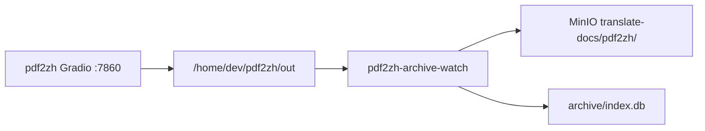

# PLAN-002e：pdf2zh 旁路归档（MinIO）

## 目标

在 **不切流、不改 pdf2zh 源码** 的前提下，把 `/home/dev/pdf2zh/out` 的翻译产物自动上传 **MinIO `translate-docs`**，并用 SQLite 建索引（DT-YYYY-NNNN）。

**不做：** HPD、Vault 入库、Qyunslation 多格式管线。

## 架构



## Task E1 — MinIO 桶

- 桶名：`translate-docs`（qyunsgen compose `minio-init` 幂等创建）
- 宿主机 endpoint：`127.0.0.1:9002`
- prefix：`pdf2zh`

## Task E2 — 旁路 watcher

- 脚本：`scripts/pdf2zh-archive-watch.py`
- 配置：`/home/dev/pdf2zh/archive.env`（由 `deploy-pdf2zh-archive.sh` 从 qyunsgen `.env.docker` 生成）
- systemd user：`pdf2zh-archive-watch.service`
- 分组规则：`*.{mono,dual,glossary}.{pdf,csv}` 共享前缀为一组
- 稳定窗口：8s 无写入后再上传

## Task E3 — pdf2zh 输出目录

`config.toml` 固定：

```toml
[translation]
output = "/home/dev/pdf2zh/out"
```

## 验收

```bash
bash scripts/deploy-pdf2zh-archive.sh
bash scripts/verify-plan-002e.sh
```

| # | 项 | 期望 |
|---|---|---|
| E-V1 | watcher active | systemctl --user |
| E-V2 | MinIO 有对象 | `mc ls` 或索引 workflow_type=pdf2zh |
| E-V3 | 烟测组已归档 | page1 烟测 3 文件 |

## 回滚

```bash
systemctl --user disable --now pdf2zh-archive-watch.service
```

MinIO 桶与已上传对象保留，不影响 translate 切流。
