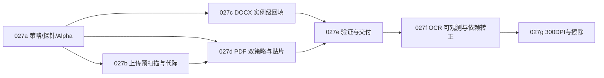

# PLAN-027 文档内嵌图片翻译：工业级双向嵌字与原位回嵌总纲

## 一、背景与目标

目前本系统（`qyunslation` + `pdf2zh-next`）具备独立的单图嵌字（PLAN-021~026）和文档全文翻译能力。但在医学临床方案、试验摘要或技术白皮书中，普遍包含大量嵌在 DOCX 和 PDF 内的试验设计流程图、机制图或数据图。

本纲领目标：**在用户上传 DOCX 或 PDF 时，自动完成类型判别与内嵌图片预扫描，并在执行翻译时对文档内需要翻译的插图实施高质量中英双向嵌字，按原文档排版几何位置无损遮盖回嵌。**

---

## 二、子计划矩阵与依赖编排

| 编号 | 子计划名称 | 核心职责 | 关键产物 | 前置依赖 |
|---|---|---|---|---|
| **027a** | 判定策略、探针 API 与 Alpha 保真 | 物理尺寸计算、语种识别、纯数字过滤、RGBA保真、`/service/image-probe` 探针 | `doc_image_policy.py` `custom_api.py` 改造 | 无 |
| **027b** | 上传两段预扫描与代际防线 | 左栏 `qy_prescan_status` 组件、Tier-1瞬时扫描、Tier-2精确探针、`task_run_id` 代际防线 | `apply-pdf2zh-prescan.py` | 027a |
| **027c** | DOCX 实例级嵌字与回填 | DrawingML XML 树尺寸/裁剪解析、共享 ImagePart 克隆解耦、进度上报、Manifest 生成 | `docx_translator.py` 重构 | 027a |
| **027d** | PDF 双策略与安全原位贴片 | 页面实例表构建、共享 XObject 解耦、去整页回退的矢量安全聚类、透明贴片覆盖 | `pdf_figure_crop.py` `pdf_image_translate.py` `apply-pdf2zh-docimg.py` | 027a, 027b |
| **027e** | 自动化验证、Skill 沉淀与发布 | 多文件并发、透明度、共享引用、双向语言门控与 026 视觉回归测试、WT-027 报告 | `verify-plan-027.sh` `SKILL.md` (SK-Q002) | 027a~027d |
| **027f** | OCR 引擎可观测与依赖转正 | RapidOCR 依赖转正、引擎注册表、探针/启动暴露 `ocr_engine`、合成图基线块数断言；归档预览 nowrap 与跨 venv 门控热修 | `image_translate.py` `pyproject.toml` `verify-plan-027.sh` | 027e |
| **027g** | 300 DPI 回嵌与擦除残留 | 按显示尺寸升采样、矢量 300 DPI、扩框擦除、带外回贴避文字 mask、二次 OCR 清残留 | `doc_image_policy.ensure_display_dpi` `image_translate.py` `pdf_figure_crop.py` | 027f |

---

## 三、系统级质量不变量（Quality Invariants）

1. **原文档版式绝对保真（Zero Layout Regression）**：
   - DOCX：正文流、表格、段落缩进、分栏与页眉页脚结构不受图片翻译影响；替换图在页面中的可见尺寸（EMU）、环绕方式（inline/anchor）与原始图完全一致。
   - PDF：正文文字层在非插图区域 100% 保持可选、可搜；页面旋转（90°/180°/270°）、CropBox 裁剪边界及非图片图元绝对不被意外擦除。

2. **色彩与透明度通道保真（Alpha & SMask Fidelity）**：
   - 彻底解决 BGR 丢透明度问题。透明 PNG、带 Alpha 蒙版或 PDF `/SMask` 的图像，在嵌字后背景保持透明，禁止出现黑底死斑或不透明白框。

3. **共享资源隔离安全（Shared Resource Isolation）**：
   - 禁止在 PDF 级别直接调用针对共享 xref 的全文档 `replace_image()`；
   - 禁止在 DOCX 级别无差别替换被正文与页眉多处引用的同一 ImagePart blob。多引用时必须执行实例克隆并重定向局部关系。

4. **预扫描与执行结论幂等对齐（Prescan-Execution Parity）**：
   - 预扫描阶段判为“无需翻译”的图片，执行阶段严格跳过；预扫描识别的待译文本块，执行阶段必须消费同一份结构化特征，禁止两阶段规则漂移。

5. **单图熔断与全文档交付保障（Graceful Degradation）**：
   - 任何单张图片的 OCR 异常、LLM 超时或 QC C10 违规，触发单图熔断并原样保留原图，严禁导致整个文档翻译任务中断失败。
   - 每份处理过的文档必须伴随一份清晰的 `<filename>.imgtr.json` 决策与审计清单。

---

## 四、明确不做（Out of Scope）

1. **Word 内部原生 DrawingML 几何矢量图/组合图表**：
   - 包含复杂 XML 节点（如 `<w:drawing><wp:inline><a:graphic><a:graphicData>` 下的 `<c:chart>` 或 `<wps:wsp>` 自选图形组合），由于非外链 media 图像，本期仅统计上报，不破坏性解析其 XML 结构。
2. **服务器无 LibreOffice 环境下的 EMF/WMF 强制矢量渲染**：
   - Linux 环境缺少 Windows GDI 渲染器，在预扫描中识别并计数提示，不进行有损破损转码。
3. **全图无字照片的超分辨率修复或风格重绘**：
   - 仅对含文本的设计图、流程图、试验图进行文字层翻译与覆盖，不改变原图非文字区域的画质。
