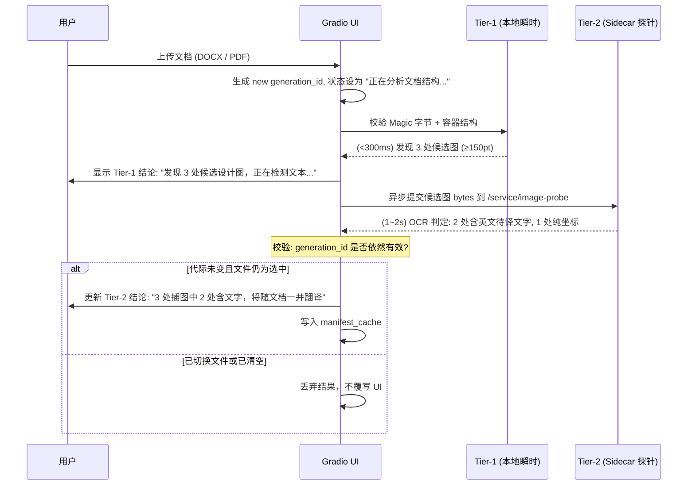

# PLAN-027b 子计划：上传两段预扫描与代际防线

## 一、目标与解决痛点

1. **解决痛点 1（用户上传无感知、黑盒翻译）**：
   - 用户上传包含复杂临床试验设计图的 Word 或 PDF 时，无法知道系统是否识别到了该图，往往担忧图内文字会被漏翻或损坏。
2. **解决痛点 2（多文件与异步回调竞态）**：
   - 审查指出的严重缺陷：在多文件上传、连续切换下拉列表或快速清空上传时，后台较慢返回的探测结果会覆盖当前选中的新文件，造成状态显示严重错乱。

---

## 二、详细技术规范与状态机设计

### 1. 代际状态机模型（Generation Guard & Per-File State）

在 Gradio `state` 中维护结构化预扫描仓库，禁止使用顶层非隔离布尔值：

```python
state["_prescan_meta"] = {
    "current_generation": 1042, # 递增代际编号，每次 upload/clear/change +1
    "files": {
        "<file_sha256>": {
            "file_name": "QX027N_Protocol.docx",
            "tier1_done": True,
            "tier2_done": True,
            "candidate_count": 3,
            "translatable_count": 2,
            "emf_count": 1,
            "summary_text": "检测到 3 处插图：2 处含待译文字，1 处为 EMF 矢量图（跳过）",
            "manifest_cache": [...] # 缓存供翻译阶段消费
        }
    }
}
```

### 2. UI 挂载点与补丁实现（`scripts/apply-pdf2zh-prescan.py`）

- **DOM 挂载点**：位于左侧栏 `uploaded_files_view`（文件列表）正下方、`result_file_selector` 正上方。
- **组件形态**：`qy_prescan_status = gr.Markdown("", visible=False, elem_classes=["qy-prescan-bar"])`。
- **样式规范**：轻量卡片样式，淡灰底色（`rgba(0,0,0,0.03)`），圆角 6px，内边距 8px 12px，带有状态圆点与微型骨架动画。

### 3. 两段式执行流水线（Two-Tier Pipeline）



#### Tier-1 快速结构检测（同步，<300ms）
- **DOCX 路径**：
  - 用 `zipfile.ZipFile` 打开内存/临时文件，遍历 `word/media/*`；
  - 提取图像前 32 字节读取 PNG/JPEG 像素头；
  - 统计长宽 ≥ 200px 的位图数量与 `.emf/.wmf` 数量。
- **PDF 路径**：
  - 用 `pymupdf.open()` 打开文档，遍历每页 `page.get_image_info(xrefs=True)`；
  - 过滤出显示 bbox 面积 ≥ 25000pt² 且未全页占满（`page_frac < 0.9`）的有效 xref。

#### Tier-2 异步精确探针（增量并发，1~3s）
- 对 Tier-1 筛选出的候选图，取出二进制字节并发发送至 `/service/image-probe`；
- 收到返回后，统计有效待译块数；
- 格式化输出最终文案：
  - *“检测到 2 处设计流程图，均含英文文字，将在翻译时原位嵌字替换。”*
  - *“检测到 1 处插图（纯数字图表，无需翻译，已原样保留）。”*

---

## 三、异常与竞态保护

1. **Stale Callback 丢弃**：
   - 探针返回时，若 `state["_prescan_meta"]["current_generation"] != my_gen_id`，直接 `return`，绝不触发 UI 渲染。
2. **损坏文档与密码防御**：
   - 加密 PDF（`doc.is_encrypted`）或损坏 DOCX，在 Tier-1 阶段立即捕获，提示 *“文档受密码保护或结构损坏，已禁用内嵌图翻译”*，防止后续后台持续抛错。
3. **单文档上限熔断**：
   - 若单文档内嵌图片超过 20 张，仅对前 10 张做 Tier-2 探针，文案提示 *“检测到较多插图（>20张），优先保障核心图表”*，防止上传卡顿。

---

## 四、验收标准

1. 上传一个含 2 张设计图的 DOCX，上传完成 0.5s 内显示 Tier-1 提示，2s 内平滑更新为 Tier-2 精确提示。
2. 上传文件 A 并在分析中迅速切换上传文件 B，文件 A 的异步返回绝对不能覆写文件 B 的状态条。
3. 点击 Clear 按钮，预扫描状态条立即隐藏，后续残留任务被安全中断或丢弃。
