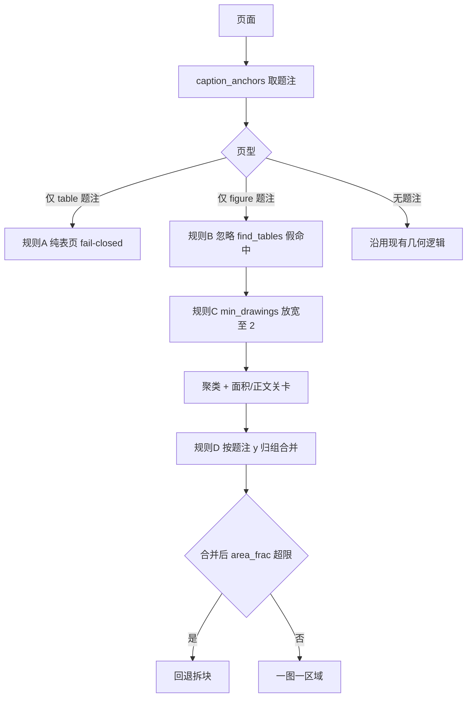

# PLAN-030c 子计划：统一语义扫描与题注驱动 Figure/Table 归并

> 状态：**已完成**
> 日期：2026-09-08
> 批准记录：用户于 2026-09-08 明确批准 PLAN-030c
> 完成记录：[WT-030c](../../walkthroughs/WT-030c-unified-semantic-scan.md)
> 父计划：[PLAN-030](./PLAN-030-semantic-layout-translation.md)（已批准）
> 前置阶段：[PLAN-030a](./PLAN-030a-cross-format-contract-baselines.md)（已完成）、[PLAN-030b](./PLAN-030b-input-adapters-normalized-canvases.md)（已完成）
> 阶段边界：交付 PDF 语义扫描、manifest 装配、预扫描/UI 计数口径对齐、纯表页 fail-closed 执行防护；不实现正文翻译回写、不接入 DocLayout、不迁移 DOCX/PPTX 语义对象（归属 030d–030g）。

## 一、目标

关闭 030a 红灯 `QY030-SEM-001`：用**题注锚点**替代物理位图/矢量区域相加，生成可缓存的 `DocumentStructureManifest`，并让预扫描 UI 与翻译执行消费同一套语义 Figure/Table 计数。

030c 要回答四个问题：

1. 如何把 `find_tables()` 几何框、`find_safe_vector_figures()` 聚类框与题注编号关联为语义对象？
2. 如何让 UI 显示「共 N 张插图，其中 M 张将 OCR 嵌字翻译；另有 K 处表格，按文字层翻译」而非「5 位图 + 2 矢量 = 7 插图」？
3. 如何阻止纯表页上的 Table 被 OCR 嵌字覆盖（Table 2 临床数据失真风险）？
4. 如何让预扫描与执行阶段读取同一 `schema_version + document_hash` 的 manifest？

### 完成定义

- `ljae439.pdf` 语义清单严格为 Figure 1–5、Table 1–3，每项带题注 bbox 证据。
- Nature Communications 样本语义清单严格为 Figure 1–7、Table 1–3；p4/p5/p9 纯表页零 OCR 区域。
- `QY030-SEM-001` 从 strict xfail 转为普通绿测；`QY030-PPT-001` 仍归属 030g。
- 新增 `scripts/verify-plan-030c.sh`；同步修正 028/029 验收脚本中的旧几何计数断言。
- 幻灯样本 PLAN-029b 回归：矢量区域仍为 12。

## 二、问题证据（Nature Communications 样本）

样本：`41467_2024_Article_53384.pdf`（19 页，CC BY 4.0，Figure 1–7，Table 1–3）。当前 PLAN-028 Tier-3 报「12 处矢量插图、26 处表格」，与用户感知的 7 图 3 表严重偏离。

| 页 | 真实内容 | 现状 vec | 问题 |
|---|---|---|---|
| p5 | Table 2 | 1 | `find_tables` 返回 0，表格避让失效；矢量区占页 43%，裁剪文字为 `Any TEAE 8 (80.0) 0 10 (62.5) 13 (76.5)…`，即完整安全性数据表，会被 OCR 整表重绘 |
| p8/p10/p11 | Figure 4/5/6 | 0/0/2 | 多面板图内线框被 `find_tables` 各误命中 7 个；p10 Figure 5 被假表避让，`vec=0`，整图不翻译 |
| p6/p7 | Figure 2/3 | 0/0 | 546/大量 drawings 但可用 rect 仅 7/2 个，低于 `MIN_DRAWINGS=8`，整页跳过 |
| p3/p12 | Figure 1/7 | 4/3 | 一图拆成多块分别 OCR，跨面板上下文断裂 |

26 = 3 真表 + 23 个图内线框误判；12 个矢量区既不是 7 张图，也没覆盖全部 7 张（Fig 2/3/5 漏检）。

`caption_anchors()` 判定准确：p5 返回 `('table', 2, y=48.35)`，p10 返回 `('figure', 5, y=631.3)`，可作为裁决几何命中的权威依据。

### 原型验证（只读，2026-09-07 Cursor 会话）

四条规则综合效果：

```text
真实图数=7 真实表数=3
旧矢量区=12 新可译区=7
覆盖到的 Figure [1,2,3,4,5,6,7] -> 7/7
```

合并后最大区域 1957×2335 px、`area_frac` 0.56，均在 `VECTOR_MAX_PX=4000` 与 `MAX_AREA_FRAC=0.80` 内。

## 三、四条题注驱动规则



| 规则 | 条件 | 行为 | 修复 |
|---|---|---|---|
| **A** | 页上有 table 题注且无 figure 题注 | 返回空区域（fail-closed） | p5 Table 2 误覆盖；保住 p4/p9 |
| **B** | 页上有 figure 题注且无 table 题注 | `tables=[]`，忽略假表 bbox | p10 Figure 5 漏译 |
| **C** | 页上有 figure 题注 | `min_drawings` 降至 2（仅该页） | p6/p7 Figure 2/3 漏检 |
| **D** | 页上有 figure 题注 | 题注下方 cluster 按编号归组合并；超 `MAX_AREA_FRAC` 回退拆块 | 一图多块 OCR 上下文断裂 |

**幻灯页约束**：规则 C 的放宽**只对有 figure 题注的页生效**。全局 `min_drawings=2` 会让 17 页 16:9 幻灯样本区域从 12 涨到 19，破坏 PLAN-029b 标定；幻灯页题注数为 0，走 legacy 分支 + 029b profile。

**执行侧扩权（用户已确认）**：规则 A 同时作为 [`scripts/pdf_image_translate.py`](../../../scripts/pdf_image_translate.py) 策略 B 的硬门——纯表页禁止 OCR 嵌字，宁可漏译插图也不覆盖表格。

## 四、非目标

- 不接入 BabelDOC DocLayout（留作题注缺失时的后备，030d 再评估）。
- 不实现 DOCX/PPTX/图片的语义对象扫描（030e–030g）。
- 不迁移 [`scripts/md_tables.py`](../../../scripts/md_tables.py) 的 Hermes 抽表依赖（PLAN-029a 仍跨仓）。
- 不把 manifest 缓存写入翻译阶段的全局状态机（030d 负责消费与对账）。
- 不做跨页续表合并、无编号对象的强制编号。
- 不在本子计划部署或重启 pdf2zh 服务（实现完成后单独 WT）。

## 五、与父纲领的有意偏离

| 父纲领要求 | 030c 处理 | 理由 |
|---|---|---|
| 030c 只做扫描 | 纳入纯表页 fail-closed **执行防护** | Table 2 临床数据 OCR 覆盖为线上活跃风险 |
| Checkpoint B 跨格式对账 | 推迟到 030g 之后 | 030c 只交付 PDF scanner + manifest 装配层 |
| 检测融合含 DocLayout 层 | 030c 仅用题注锚点 | 原型已达成 7/7 与 5/3；DocLayout 作后备 |

## 六、关键设计

### 6.1 题注检测内联（消除 Hermes 绝对路径）

新增 [`qyunslation/structure/captions.py`](../../../qyunslation/structure/captions.py)，从 Hermes [`lit_tables.py`](file:///home/dev/Hermes/scripts/lit_tables.py) 内联以下符号（不 import 跨仓）：

- `CAPTION_LINE`、`FIGURE_LINE`、`squeeze_caps`
- `table_caption_num`、`figure_caption_num`
- `is_toc_line`、`is_continued_caption`
- `caption_anchors(page) -> list[tuple[kind, num, y0, bbox]]`

父纲领风险表要求「结构契约与核心检测迁回本仓」。内联后 `pdf_figure_crop`、`doc_image_prescan`、`scan_pdf` 不再依赖 `/home/dev/Hermes/scripts`。

### 6.2 PDF 语义扫描器

新增 [`qyunslation/structure/scan_pdf.py`](../../../qyunslation/structure/scan_pdf.py)，实现 [`StructureScanner`](../../../qyunslation/structure/interfaces.py) 协议：

```text
PdfStructureScanner.scan(source, *, content_profile, processing_mode)
  → consume PreparedDocument from 030b (canvases + document_hash)
  → per-page caption_anchors + find_figure_regions
  → emit FigureObject / TableObject / CaptionObject with semantic_id
  → validate DocumentStructureManifest v1
  → return manifest + PrescanSummary adapter
```

语义主计数：`summary.figure_count`、`summary.table_count`、`summary.translatable_figure_count` 均按 `semantic_id` 去重，物理资源数只进 `detector_evidence` 诊断字段。

### 6.3 预扫描/UI 口径

[`scripts/doc_image_prescan.py`](../../../scripts/doc_image_prescan.py) 变更：

- `Tier3Result` 增加 `figure_caption_count`、`table_caption_count`、`translatable_count`。
- `scan_pdf_tier3`：表格数改用题注去重（`caption_anchors` block 级），不再累加 `table_rects` 几何数。
- `format_tier3_summary` 文案：

> 共 7 张插图，其中 7 张将 OCR 嵌字翻译；另有 3 处表格，按文字层翻译。

当 `translatable_count < figure_caption_count` 时分开报，不遮盖漏译。

### 6.4 矢量区域检测

[`scripts/pdf_figure_crop.py`](../../../scripts/pdf_figure_crop.py) 新增：

- `page_caption_profile(page) -> {figure_caps, table_caps, page_kind}`
- `find_figure_regions(page, exclude_rects=None) -> list[Rect]`

保留 `find_safe_vector_figures` 原签名与行为，供幻灯路径与无题注文档使用。

[`scripts/pdf_image_translate.py`](../../../scripts/pdf_image_translate.py)：策略 B 非幻灯页改调 `find_figure_regions`；幻灯页维持 PLAN-029b profile 分支。

## 七、金样与夹具

### 7.1 第一硬基线：ljae439（已物化）

| 字段 | 值 |
|---|---|
| 路径 | `tests/fixtures/structure/reference/ljae439.pdf` |
| SHA-256 | `8e9893b21e6aab4a057ba730eba40f6a9bd696f3538ed05ffc3fc5eb8470f10c` |
| 语义真值 | Figure 1–5、Table 1–3 |
| Truth 文件 | `tests/fixtures/structure/ljae439.truth.json` |

### 7.2 第二硬基线：Nature Communications（030c Task 1 物化）

| 字段 | 值 |
|---|---|
| 源路径（开发机） | `/home/dev/pdf2zh/pdf2zh_files/ef8f3e1f-fc80-4c84-bfca-bc2e9ac8d302/41467_2024_Article_53384.pdf` |
| 目标路径 | `tests/fixtures/structure/reference/nature_comm_53384.pdf` |
| SHA-256 | `566f97dd5c43e3a8c5729c25ad5004fe9e6995a6be4ad95fe64c9f18b5e37723` |
| 大小 | 1,019,847 bytes |
| 许可 | CC BY 4.0（Nature Communications） |
| 语义真值 | Figure 1–7、Table 1–3 |
| Truth 文件 | `tests/fixtures/structure/nature_comm_53384.truth.json`（新建） |

物化步骤（实现 Task 1）：

1. `cp` 源 PDF 到 `reference/nature_comm_53384.pdf`。
2. 新建 truth JSON，格式对齐 `ljae439.truth.json`（`usage_scope: TEST_FIXTURE_ONLY`）。
3. 更新 `catalog.v1.json` 登记第二 PDF 金样。
4. 生产代码不得引用该路径或知识库 locator；仅测试与 verify 脚本可读。

### 7.3 幻灯回归样本（不物化，沿用运行时路径）

| 字段 | 值 |
|---|---|
| 路径 | `/home/dev/pdf2zh/pdf2zh_files/57114032-8727-41f9-b826-b5ff40fcf733/QX027N QnA-2026.08.19-临床.pdf` |
| 断言 | 矢量区域仍为 12（PLAN-029b 零回归） |

## 八、任务与依赖

### Task 1：题注模块内联与 Nature 夹具物化

**文件：** `qyunslation/structure/captions.py`、`tests/fixtures/structure/nature_comm_53384.truth.json`、`tests/fixtures/structure/reference/nature_comm_53384.pdf`、`tests/fixtures/structure/catalog.v1.json`

**验收：**

- [x] `caption_anchors` 对 ljae439 p5 返回 table:2、对 nature p10 返回 figure:5。
- [x] Nature PDF 完整 SHA-256 与 truth JSON 一致。
- [x] 单元测试覆盖 TOC 行、续表题注、Springer `Table N | Title` 格式的 figure/table 编号解析。

**验证：** `pytest -q tests/structure/test_caption_anchors.py --no-cov`

### Task 2：题注驱动区域检测（规则 A–D）

**依赖：** Task 1

**文件：** `scripts/pdf_figure_crop.py`、`tests/structure/test_figure_regions.py`

**验收：**

- [x] `page_caption_profile` 正确区分 pure_table / figure_only / mixed / none。
- [x] nature 样本：7 可译区、Figure 1–7 全覆盖、p4/p5/p9 返回空。
- [x] ljae439 样本：5 可译区、Figure 1–5 全覆盖；表题注 `{1,2,3}`，纯表页零 OCR（Table 1+2 同页，Table 3 与 Figure 4 同页为 mixed）。
- [x] 幻灯样本：PLAN-029b profile 仍为 12 区域。
- [x] `find_safe_vector_figures` 行为不变（回归测试）。

**验证：** `pytest -q tests/structure/test_figure_regions.py --no-cov`

### Task 3：PDF 语义扫描器与 manifest 装配

**依赖：** Tasks 1–2

**文件：** `qyunslation/structure/scan_pdf.py`、`qyunslation/structure/__init__.py`、`tests/structure/test_scan_pdf.py`

**验收：**

- [x] `PdfStructureScanner.scan` 产出通过 manifest 契约校验的 v1 文档。
- [x] ljae439：`summary.figure_count==5`、`summary.table_count==3`。
- [x] nature：`summary.figure_count==7`、`summary.table_count==3`。
- [x] 同一输入两次扫描 manifest 稳定（hash + object IDs 一致）。
- [x] 每个 Figure/Table 对象带 `caption_bbox` 与 `detector_evidence`。

**验证：** `pytest -q tests/structure/test_scan_pdf.py --no-cov`

### Task 4：预扫描/UI 计数口径

**依赖：** Task 3

**文件：** `scripts/doc_image_prescan.py`、`tests/structure/test_plan030_red_baselines.py`

**验收：**

- [x] `QY030-SEM-001` xfail 移除，测试转绿。
- [x] `format_tier3_summary` 不再出现「N 位图 + M 矢量 = 总插图」相加口径。
- [x] ljae439 Tier-3 摘要含「5 张插图」与「3 处表格」，不含「7 处插图」。

**验证：** `pytest -q tests/structure/test_plan030_red_baselines.py --no-cov`

### Task 5：执行侧纯表页 fail-closed

**依赖：** Task 2

**文件：** `scripts/pdf_image_translate.py`、`tests/structure/test_table_page_guard.py`

**验收：**

- [x] 非幻灯页策略 B 改调 `find_figure_regions`。
- [x] nature p5（Table 2）不产生 OCR 嵌字区域。
- [x] 幻灯页仍走 PLAN-029b profile，行为不变。

**验证：** `pytest -q tests/structure/test_table_page_guard.py --no-cov`

### Checkpoint：030c 阶段门

- [x] Tasks 1–5 聚焦测试全部绿。
- [x] `bash scripts/verify-plan-030c.sh` PASS。
- [x] 028/029 验收脚本更新后仍 PASS。
- [x] 全仓 `pytest -q tests/structure --no-cov -rxX`：`145 passed, 1 xfailed`（只剩 QY030-PPT-001）。
- [x] archive 3 个既有失败精确不变。

### Task 6：验收脚本与文档

**依赖：** Checkpoint

**文件：** `scripts/verify-plan-030c.sh`、`scripts/verify-plan-028.sh`、`scripts/verify-plan-029.sh`、`docs/walkthroughs/WT-030c-unified-semantic-scan.md`、更新父纲领阶段门

**验收：**

- [x] 单命令门区分 PASS / EXPECTED_RED / FAIL。
- [x] WT 记录 ljae439 与 nature 实测摘要、028/029 断言变更说明。
- [x] 父纲领「下一批准门」更新为 PLAN-030d。

## 九、阶段验收命令

```bash
.venv/bin/python -m pytest -q tests/structure/test_caption_anchors.py --no-cov
.venv/bin/python -m pytest -q tests/structure/test_figure_regions.py --no-cov
.venv/bin/python -m pytest -q tests/structure/test_scan_pdf.py --no-cov
.venv/bin/python -m pytest -q tests/structure/test_table_page_guard.py --no-cov
.venv/bin/python -m pytest -q tests/structure --no-cov -rxX
bash scripts/verify-plan-030c.sh
bash scripts/verify-plan-028.sh
bash scripts/verify-plan-029.sh
git diff --check
```

## 十、028/029 断言变更

| 脚本 | 旧断言 | 新断言 | 原因 |
|---|---|---|---|
| `verify-plan-028.sh` | `vector_count == 12` | `figure_caption_count == 7`（nature） | 口径从几何区域改为语义题注 |
| `verify-plan-028.sh` | `table_count >= 19` | `table_caption_count == 3` | 不再用 `find_tables` 几何数 |
| `verify-plan-029.sh` | `journal vector still 12` | `journal translatable == 7` | 同上 |

脚本注释须注明「PLAN-030c 口径变更」。

## 十一、质量红线

- 纯表页 fail-closed：宁可漏译插图，也不 OCR 覆盖表格。
- 幻灯 `min_drawings` 维持 `SLIDE_MIN_DRAWINGS=6`；规则 C 放宽不得泄漏到无题注页。
- 合并后 `area_frac` 硬上限保留；绝不整页覆盖。
- 题注检测 fail-safe：解析异常降级到 legacy 几何逻辑，不抛错阻断翻译。
- 物理资源数永远不作为 UI 主计数。

## 十二、回滚

- Task 5（执行侧）可独立回滚到 `find_safe_vector_figures`，保留扫描/manifest 改进。
- 预扫描摘要回滚须同时恢复 028/029 旧断言，或 verify 脚本会失败。
- 不得恢复「位图 + 矢量相加」的用户计数口径。

## 十三、完成条件

- 用户批准本子计划后才开始编码。
- `QY030-SEM-001` 转绿；`QY030-PPT-001` 仍为 strict xfail。
- ljae439 与 nature 两个硬基线全部通过 manifest 与 UI 摘要验收。
- 幻灯 PLAN-029b 零回归。
- WT-030c 与 verify-plan-030c.sh 入库。

本子计划已完成实现与验收；未部署、未重启 pdf2zh 服务。下一批准门为 PLAN-030d。
