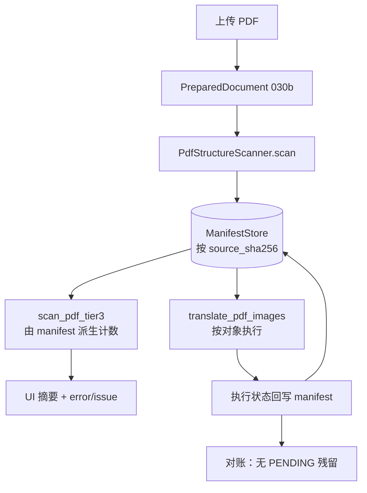

# PLAN-030d 子计划：manifest SSOT 贯通与 PDF 执行对账

> 状态：**待批准**
> 日期：2026-09-08
> 父计划：[PLAN-030](./PLAN-030-semantic-layout-translation.md)（已批准）
> 前置阶段：[PLAN-030a](./PLAN-030a-cross-format-contract-baselines.md)、[PLAN-030b](./PLAN-030b-input-adapters-normalized-canvases.md)、[PLAN-030c](./PLAN-030c-unified-semantic-scan.md)（均已完成）
> 阶段边界：交付 manifest 持久化、预扫描与执行共用同一份结构结果、无编号对象建模、执行状态回写与对账、Tier-3 错误如实上报；**不接入 DocLayout、不做正文 BODY 对象、不做多栏保真、不做 PDF 表格原位重建**（见 §五）。

批准前不修改业务代码、不部署、不重启 pdf2zh 服务。

## 一、目标

关闭 Checkpoint B 的未竟条款：**「UI 预扫与执行读取同一 `schema_version + document_hash`」**。

PLAN-030c 已经让预扫描与执行的**算法口径**一致（共用 `translatable_regions`），但两者仍是两次独立检测，`PdfStructureScanner` 产出的 manifest 在生产代码里零调用方。030d 把 manifest 从「孤岛 SSOT」变成真正贯通预扫描、执行与审计的单一事实源。

030d 要回答五个问题：

1. manifest 如何在预扫描与执行之间传递？（缓存键、失效、并发）
2. 幻灯等无题注页的可译区域如何进入 manifest 而不伪造 Figure 编号？
3. 执行结果如何回写到 manifest，使每个对象都有可解释的终态？
4. 预扫描 Tier-3 出错时如何如实上报，而不是伪装成「没有插图」？
5. 三条链路（scanner / prescan / execute）如何收敛为一次扫描？

### 完成定义

- `scan_pdf_tier3` 与 `translate_pdf_images` 消费同一份 manifest，不再各自重新检测。
- 幻灯样本三方一致：`manifest.summary.figure_count == Tier3Result.translatable_count == 执行区域数 == 12`。
- 每个 `FIGURE` 对象执行后终态为 `TRANSLATED`、`EXPLICITLY_SKIPPED` 或 `FAILED_SOFT` 之一，无 `PENDING` 残留。
- Tier-3 的 `error` 进入 UI 文案与 `ManifestIssue`，不再显示为「未检测到需要嵌字的插图」。
- 新增 `scripts/verify-plan-030d.sh`；030c 的三个门保持 PASS。

## 二、问题证据

### 2.1 manifest 零消费（Checkpoint B 未达成）

全仓 `PdfStructureScanner().scan()` 的调用方只有测试与验收脚本：

| 位置 | 性质 |
| --- | --- |
| [`tests/structure/test_scan_pdf.py:23`](../../../tests/structure/test_scan_pdf.py) | 测试 |
| [`scripts/verify-plan-030c.sh`](../../../scripts/verify-plan-030c.sh) 内联片段 | 验收 |
| [`qyunslation/structure/__init__.py:82`](../../../qyunslation/structure/__init__.py) | 仅导出 |

生产链路各自独立检测：

- [`scripts/doc_image_prescan.py:452`](../../../scripts/doc_image_prescan.py) 自行调用 `caption_anchors` / `labeled_figure_regions` / `translatable_regions`
- [`scripts/pdf_image_translate.py:334`](../../../scripts/pdf_image_translate.py) 自行调用 `translatable_regions`
- [`scripts/apply-pdf2zh-prescan.py:272`](../../../scripts/apply-pdf2zh-prescan.py) 只把标量计数写进 Gradio state，翻译阶段完全不读

`ManifestConsumer`（[`interfaces.py:23`](../../../qyunslation/structure/interfaces.py)）零实现；manifest 无任何持久化或缓存。同一份 PDF 在一次翻译中被打开检测**三次**。

### 2.2 scanner 与执行侧口径在幻灯页仍有分叉

PLAN-030c 收尾时把预扫描与执行统一到 `translatable_regions`，但 `PdfStructureScanner` 仍走 `labeled_figure_regions`（[`scan_pdf.py:99`](../../../qyunslation/structure/scan_pdf.py)）。幻灯页无题注，`labeled_figure_regions` 必然返回空：

| 链路 | 幻灯样本可译区 |
| --- | --- |
| `PdfStructureScanner` | 0 |
| `scan_pdf_tier3` | 12 |
| `translate_pdf_images` | 12 |

manifest 与实际执行差 12 个对象。因为 scanner 目前无生产调用方，这不构成线上风险；但 030d 一旦接入，它会立刻变成用户可见错误，因此必须在同一阶段修掉。

修复不是替换一个函数调用：幻灯区域没有 Figure 编号，父纲领 §4.3 第 5 条要求「无编号对象单独标注且不伪造编号」，需要先定义无编号对象的 `semantic_id` 规则。

### 2.3 Tier-3 错误伪装成「没有插图」

`format_tier3_summary` 只看计数，不看 `error`，实测：

```text
encrypted        -> '未检测到需要嵌字的插图。'
pymupdf_missing  -> '未检测到需要嵌字的插图。'
some crash       -> '未检测到需要嵌字的插图。'
```

截断状态处理正确（显示「仅扫描前 40 页」），错误状态则被静默吞掉。这正是父纲领审查结论第 8 条「错误与截断可能伪装成『未检测到』」。

### 2.4 scanner 对象类型覆盖 3/8

`ObjectType` 共 8 个成员，`PdfStructureScanner` 只产出 3 个：

| 类型 | 产出 | 归属 |
| --- | --- | --- |
| `CAPTION` / `FIGURE` / `TABLE` | 是 | 030c 已交付 |
| `IMAGE` | 否 | 030d（无编号可译区域） |
| `BODY` | 否 | 推迟，见 §五 |
| `TEXT_BOX` / `SHAPE` | 否 | 030e / 030g |
| `POSTER_SECTION` | 否 | 030f |

## 三、目标状态



关键约束：**扫描只发生一次**。`scan_pdf_tier3` 与 `translate_pdf_images` 都从 `ManifestStore` 取，命中即复用。

## 四、非目标

- 不接入 BabelDOC DocLayout；正文版面仍是 BabelDOC 黑盒。
- 不产出 `BODY` 对象、不做正文翻译回写。
- 不做单/双/多栏检测、阅读顺序断言或跨栏串接防护。
- 不做 PDF 表格原位重建；`TableObject` 仍为 `planned_action="text_layer"`。
- 不统一 GUI（BabelDOC 原位）与 API（mineru/docling → Markdown）两条 PDF 入口。
- 不改扫描件 HPD / `letter_pipeline` 路径。
- 不迁移 DOCX/PPTX/图片语义对象（030e–030g）。

## 五、与父纲领的有意偏离

父纲领把 030d 定义为「PDF 纵向闭环：原生/扫描/混合 PDF 的正文、Figure、Table、单/双/多栏检测—翻译—回写—审计」。本子计划**只取其中的 SSOT 与 Figure 执行对账部分**，理由：

| 父纲领要求 | 030d 处理 | 理由 |
| --- | --- | --- |
| 正文检测—翻译—回写 | 推迟 | 正文完全由 BabelDOC 承担，本仓只有 site-packages 补丁；接管前需先有 SSOT 记录执行状态，否则改动无法对账 |
| 单/双/多栏保真 | 推迟 | 需要 DocLayout 或自研列检测 + 金样标定 + 跨栏回归，工作量本身即一个完整子计划 |
| PDF 表格原位重建 | 推迟 | 需要单元格级重建器与数字保护验收，与 SSOT 正交 |
| 扫描件路径统一 | 推迟 | 涉及 HPD 与 `letter_pipeline` 两套实现的行为对齐 |

**拆分建议**：把推迟部分作为 `PLAN-030d2`（正文与多栏保真）与 `PLAN-030d3`（PDF 表格原位重建）后续审批，或并入 030h 跨格式版式保真。请在批准时确认取舍。

不先做 SSOT 就做正文/多栏的风险：执行状态无处记录，`FAILED_SOFT` 与 `EXPLICITLY_SKIPPED` 无法区分，一旦回归无法定位是检测问题还是执行问题。030c 已经用「先统一口径再改执行」的顺序验证过这个节奏。

## 六、关键设计

### 6.1 ManifestStore

新增 [`qyunslation/structure/manifest_store.py`](../../../qyunslation/structure/manifest_store.py)：

```text
ManifestStore(root: Path | None = None)
  .put(manifest) -> Path          # 写 <root>/<source_sha256>.manifest.json
  .get(source_sha256) -> Manifest | None
  .invalidate(source_sha256) -> None
```

- 默认根目录 `QYUNSLATION_MANIFEST_CACHE`，回退 `~/.cache/qyunslation/manifests`。
- 命中条件：`source_sha256` 相同**且** `schema_version` major 相同；major 不匹配视为未命中并覆盖，避免契约升级后读到旧结构。
- 写入用临时文件 + `os.replace` 原子落盘，防止并发翻译读到半截 JSON。
- 读取失败（JSON 损坏、校验不过）一律当未命中，重新扫描，不抛错阻断翻译。

### 6.2 无编号可译对象

无题注页（幻灯、纯图页）的可译区域产出 `ImageObject` 而非 `FigureObject`：

- `semantic_id`：`image:page:{page}:{index}`，不占用 `figure:N` 命名空间。
- `semantic_scope`：`unnumbered`。
- `detector_evidence.detector`：`translatable_regions`。
- 计入 `summary.object_counts["IMAGE"]`，**不计入** `summary.figure_count`。

UI 主计数用「可译区域总数」= `figure_count`（有编号，且有可译区域）+ `IMAGE` 对象数。这样幻灯显示 12，期刊显示 7，两者都不伪造编号。

`PdfStructureScanner` 改用 `translatable_regions`：有 figure 题注的页仍按编号归组，其余页产出无编号 `IMAGE` 对象。

### 6.3 Tier3Result 由 manifest 派生

[`scripts/doc_image_prescan.py`](../../../scripts/doc_image_prescan.py) 的 `scan_pdf_tier3` 改为：

1. 查 `ManifestStore`；未命中则 `PdfStructureScanner().scan()` 并写入。
2. 从 manifest 派生 `figure_caption_count` / `table_caption_count` / `translatable_count`。
3. manifest 的 `issues` 映射为 `Tier3Result.error`。

保留 `max_pages` / `deadline_s` / `should_abort` 语义：超时或中止时 manifest 标 `truncated`，**不写缓存**（避免把不完整结构固化）。

### 6.4 执行侧消费与回写

[`scripts/pdf_image_translate.py`](../../../scripts/pdf_image_translate.py) 的 `translate_pdf_images` 增加可选参数：

```python
def translate_pdf_images(src, *, to_lang="简体中文", progress_cb=None,
                         dest=None, manifest=None):
```

- `manifest` 为 `None` 时行为完全不变（现有调用方与回滚路径不受影响）。
- 传入时按 `FIGURE` / `IMAGE` 对象的 `bbox` 执行，不再逐页重新检测。
- 每个对象写回终态：`TRANSLATED`（已回嵌）、`EXPLICITLY_SKIPPED`（无可译文字，带 `reason_code`）、`FAILED_SOFT`（OCR 或回嵌失败，保留原图）。
- 执行后 manifest 回写 `ManifestStore`，供审计与二次翻译复用。

GUI 补丁 [`scripts/apply-pdf2zh-docimg.py`](../../../scripts/apply-pdf2zh-docimg.py) 从 `state["_prescan_meta"]` 取 `source_sha256`，经 `ManifestStore` 读取后传入；取不到则走 `manifest=None` 旧路径。

### 6.5 错误如实上报

`format_tier3_summary` 增加 `error: str | None` 参数：

| error | UI 文案 |
| --- | --- |
| `encrypted` | 文档已加密，无法扫描插图；翻译仍会尝试文字层。 |
| `pymupdf_missing` | 插图扫描组件不可用，本次不做插图嵌字。 |
| 其他 | 插图扫描失败（`<error>`），本次不做插图嵌字。 |

同时写 `ManifestIssue(code="PRESCAN_TIER3_FAILED", severity=ERROR, stage=SCAN, retryable=True)`。

## 七、金样与夹具

沿用 030c 三个样本，新增一条对账维度：

| 样本 | 路径 | 030d 硬验收 |
| --- | --- | --- |
| ljae439 | `tests/fixtures/structure/reference/ljae439.pdf` | Figure 1–5 / Table 1–3；`IMAGE` 对象 0 |
| Nature | `tests/fixtures/structure/reference/nature_comm_53384.pdf` | Figure 1–7 / Table 1–3；`IMAGE` 对象 0；p4/p5/p9 零可译区 |
| 幻灯（不入仓） | `/home/dev/pdf2zh/pdf2zh_files/57114032-8727-41f9-b826-b5ff40fcf733/QX027N QnA-2026.08.19-临床.pdf` | `figure_count` 0、`IMAGE` 12；三方一致为 12 |

SHA-256 与 030c 一致，不重新物化。

## 八、任务与依赖

### Task 1：ManifestStore 与 ManifestConsumer

**文件：** `qyunslation/structure/manifest_store.py`、`qyunslation/structure/__init__.py`、`tests/structure/test_manifest_store.py`

**验收：**

- [ ] `put` / `get` 往返后 manifest 逐字段相等。
- [ ] `schema_version` major 不匹配时视为未命中并覆盖。
- [ ] JSON 损坏、目录不可写、并发写入均降级为未命中，不抛错。
- [ ] 原子落盘：写入过程中读取不会得到半截 JSON。

**验证：** `pytest -q tests/structure/test_manifest_store.py --no-cov`

### Task 2：无编号可译对象建模

**依赖：** Task 1

**文件：** `qyunslation/structure/scan_pdf.py`、`tests/structure/test_scan_pdf.py`

**验收：**

- [ ] scanner 改用 `translatable_regions`，幻灯样本产出 12 个 `IMAGE` 对象。
- [ ] `semantic_id` 为 `image:page:{page}:{index}`，不占用 `figure:N`。
- [ ] 幻灯 `summary.figure_count == 0`，`object_counts["IMAGE"] == 12`。
- [ ] ljae439 与 Nature 的 Figure/Table 计数不变，`IMAGE` 为 0。
- [ ] manifest 两次扫描仍稳定。

**验证：** `pytest -q tests/structure/test_scan_pdf.py --no-cov`

### Task 3：预扫描消费 manifest

**依赖：** Tasks 1–2

**文件：** `scripts/doc_image_prescan.py`、`tests/structure/test_prescan_manifest.py`

**验收：**

- [ ] `scan_pdf_tier3` 命中缓存时不重新打开 PDF（用调用计数断言）。
- [ ] 三个样本的 Tier-3 计数与 manifest 完全一致。
- [ ] 超时/中止时标 `truncated` 且不写缓存。
- [ ] 030c 的 UI 文案维持不变（期刊 7/3、ljae439 5/3、幻灯 12）。

**验证：** `pytest -q tests/structure/test_prescan_manifest.py --no-cov`

### Task 4：执行侧消费与状态回写

**依赖：** Tasks 1–3

**文件：** `scripts/pdf_image_translate.py`、`scripts/apply-pdf2zh-docimg.py`、`tests/structure/test_execution_parity.py`

**验收：**

- [ ] `manifest=None` 时行为与 030c 完全一致（回归测试）。
- [ ] 传入 manifest 时按对象 bbox 执行，不再逐页检测。
- [ ] 执行后无 `PENDING` 残留；每个对象为 `TRANSLATED` / `EXPLICITLY_SKIPPED` / `FAILED_SOFT`。
- [ ] `FAILED_SOFT` 保留原图，不产生空白或半截覆盖。
- [ ] GUI 补丁取不到 manifest 时回落旧路径且幂等。

**验证：** `pytest -q tests/structure/test_execution_parity.py --no-cov`

### Task 5：Tier-3 错误如实上报

**依赖：** Task 3

**文件：** `scripts/doc_image_prescan.py`、`scripts/apply-pdf2zh-prescan.py`、`tests/structure/test_prescan_error_surface.py`

**验收：**

- [ ] `encrypted` / `pymupdf_missing` / 未知异常各有明确文案。
- [ ] 任何 error 都不再产生「未检测到需要嵌字的插图。」。
- [ ] 对应 `ManifestIssue` 进入 manifest 且 `retryable` 正确。

**验证：** `pytest -q tests/structure/test_prescan_error_surface.py --no-cov`

### Checkpoint：030d 阶段门

- [ ] Tasks 1–5 聚焦测试全绿。
- [ ] 三方对账：幻灯 12/12/12，Nature 7/7/7，ljae439 5/5/5。
- [ ] `bash scripts/verify-plan-030d.sh` PASS。
- [ ] 030c 的三个门（028/029/030c）仍 PASS。
- [ ] `pytest -q tests/structure --no-cov -rxX`：只剩 `QY030-PPT-001` 一个 xfail。
- [ ] archive 3 个既有失败精确不变。

### Task 6：验收脚本与文档

**依赖：** Checkpoint

**文件：** `scripts/verify-plan-030d.sh`、`docs/walkthroughs/WT-030d-manifest-ssot-execution-parity.md`、父纲领阶段门

**验收：**

- [ ] 单命令门区分 PASS / EXPECTED_RED / FAIL。
- [ ] WT 记录三方对账实测、缓存命中率与部署步骤。
- [ ] 父纲领 Checkpoint B 标为达成，下一批准门更新。

## 九、阶段验收命令

```bash
.venv/bin/python -m pytest -q tests/structure/test_manifest_store.py --no-cov
.venv/bin/python -m pytest -q tests/structure/test_scan_pdf.py --no-cov
.venv/bin/python -m pytest -q tests/structure/test_prescan_manifest.py --no-cov
.venv/bin/python -m pytest -q tests/structure/test_execution_parity.py --no-cov
.venv/bin/python -m pytest -q tests/structure/test_prescan_error_surface.py --no-cov
.venv/bin/python -m pytest -q tests/structure --no-cov -rxX
bash scripts/verify-plan-030d.sh
bash scripts/verify-plan-030c.sh
bash scripts/verify-plan-028.sh
bash scripts/verify-plan-029.sh
git diff --check
```

## 十、质量红线

- 缓存只是加速，不是真值：任何读取失败都回落重新扫描，绝不因缓存问题阻断翻译。
- `manifest=None` 路径必须保留，作为执行侧一键回滚。
- 无编号对象不得伪造 `figure:N` 编号，也不得计入 `figure_count`。
- 纯表页 fail-closed（030c 规则 A）不得因 manifest 接入而失效。
- 幻灯 PLAN-029b profile 区域数维持 12。
- 错误不得伪装成零结果。
- 执行终态不得为 `PENDING`；失败一律 `FAILED_SOFT` 并保留原图。

## 十一、回滚

- Task 4（执行侧）独立回滚：GUI 补丁改回不传 manifest，其余改进保留。
- Task 3（预扫描）回滚需同时恢复 030c 的直接检测逻辑。
- 缓存目录可整体删除，系统自动退化为每次重新扫描。
- 不得恢复「Tier-3 错误显示为零插图」的旧行为。

## 十二、完成条件

- 用户批准本子计划（含 §五 拆分取舍）后才开始编码。
- Checkpoint B 全部条款达成并在父纲领标注。
- 三个样本三方对账一致。
- WT-030d 与 `verify-plan-030d.sh` 入库。
