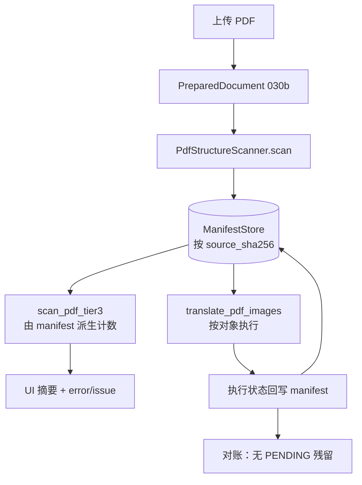

# PLAN-030d 子计划：PDF 纵向闭环（SSOT 贯通、正文、多栏、表格）

> 状态：**已完成**（PLAN-030 收口 / WT-030d）
> 日期：2026-09-08
> 批准记录：用户于 2026-09-08 批准全量范围（含正文 DocLayout、多栏保真、PDF 表格原位重建）
> 范围修订：2026-09-08 用户决策——正文不接 DocLayout 改自研几何（§五）、表格由「原位重建」降级为「区域保护」（Task 8）。两处均基于实测证据，非实现让步。
> 进度：Tasks 1–10 已完成。
> 父计划：[PLAN-030](./PLAN-030-semantic-layout-translation.md)（已批准）
> 前置阶段：[PLAN-030a](./PLAN-030a-cross-format-contract-baselines.md)、[PLAN-030b](./PLAN-030b-input-adapters-normalized-canvases.md)、[PLAN-030c](./PLAN-030c-unified-semantic-scan.md)（均已完成）
> 阶段边界：交付父纲领定义的 PDF 纵向闭环——原生/扫描/混合 PDF 的正文、Figure、Table、单/双/多栏的检测—翻译—回写—审计；不迁移 DOCX/PPTX/图片语义对象（030e–030g）。

## 一、目标

交付父纲领 030d：**PDF 纵向闭环**。在 030c 的语义扫描之上，让 manifest 成为真正贯通预扫描、执行与审计的 SSOT，并把正文、多栏与表格纳入语义对象与原位回写。

030d 要回答八个问题：

1. manifest 如何在预扫描与执行之间传递？（缓存键、失效、并发）
2. 幻灯等无题注页的可译区域如何进入 manifest 而不伪造 Figure 编号？
3. 执行结果如何回写，使每个对象都有可解释的终态？
4. 预扫描 Tier-3 出错时如何如实上报，而不是伪装成「没有插图」？
5. 正文如何成为 `BODY` 语义对象，而不是 BabelDOC 内部的黑盒？
6. 单/双/多栏如何检测，阅读顺序如何断言，跨栏串接如何防护？
7. PDF 表格如何原位重建，同时保证数字、单位、统计符号不变？
8. 原生、扫描、混合三类 PDF 如何走同一套语义对象与审计口径？

### 完成定义

- `scan_pdf_tier3` 与 `translate_pdf_images` 消费同一份 manifest，不再各自重新检测。
- 幻灯样本三方一致：`manifest` 可译对象数 `== Tier3Result.translatable_count ==` 执行区域数 `== 12`。
- 每个可执行对象终态为 `TRANSLATED`、`EXPLICITLY_SKIPPED` 或 `FAILED_SOFT`，无 `PENDING` 残留。
- Tier-3 的 `error` 进入 UI 文案与 `ManifestIssue`，不再显示为「未检测到需要嵌字的插图」。
- `BODY` 对象进入 manifest，带 `reading_order`；`Canvas.layout_mode` 与 `column_count` 按实际版面填充。
- 双栏金样阅读顺序断言通过，跨栏串接为 0。
- 表格区域被可靠圈定并受保护，表格不被误判为 Figure。（原为「原位重建后数字集合不变」，2026-09-08 按探底实测降级，见 Task 8）
- 新增 `scripts/verify-plan-030d.sh`；028/029/030c 三个门保持 PASS。

## 二、问题证据

### 2.1 manifest 零消费（Checkpoint B 未达成）

全仓 `PdfStructureScanner().scan()` 的调用方只有测试与验收脚本：

| 位置 | 性质 |
| --- | --- |
| [`tests/structure/test_scan_pdf.py:23`](../../../tests/structure/test_scan_pdf.py) | 测试 |
| [`scripts/verify-plan-030c.sh`](../../../scripts/verify-plan-030c.sh) 内联片段 | 验收 |
| [`qyunslation/structure/__init__.py:82`](../../../qyunslation/structure/__init__.py) | 仅导出 |

生产链路各自独立检测：

- [`scripts/doc_image_prescan.py:452`](../../../scripts/doc_image_prescan.py) 自行调用 `caption_anchors` / `labeled_figure_regions` / `translatable_regions`
- [`scripts/pdf_image_translate.py:334`](../../../scripts/pdf_image_translate.py) 自行调用 `translatable_regions`
- [`scripts/apply-pdf2zh-prescan.py:272`](../../../scripts/apply-pdf2zh-prescan.py) 只把标量计数写进 Gradio state，翻译阶段完全不读

`ManifestConsumer`（[`interfaces.py:23`](../../../qyunslation/structure/interfaces.py)）零实现；manifest 无任何持久化或缓存。同一份 PDF 在一次翻译中被打开检测**三次**。

### 2.2 scanner 与执行侧口径在幻灯页仍有分叉

PLAN-030c 收尾时把预扫描与执行统一到 `translatable_regions`，但 `PdfStructureScanner` 仍走 `labeled_figure_regions`（[`scan_pdf.py:99`](../../../qyunslation/structure/scan_pdf.py)）。幻灯页无题注，`labeled_figure_regions` 必然返回空：

| 链路 | 幻灯样本可译区 |
| --- | --- |
| `PdfStructureScanner` | 0 |
| `scan_pdf_tier3` | 12 |
| `translate_pdf_images` | 12 |

manifest 与实际执行差 12 个对象。因为 scanner 目前无生产调用方，这不构成线上风险；但 030d 一旦接入，它会立刻变成用户可见错误，因此必须在同一阶段修掉。

修复不是替换一个函数调用：幻灯区域没有 Figure 编号，父纲领 §4.3 第 5 条要求「无编号对象单独标注且不伪造编号」，需要先定义无编号对象的 `semantic_id` 规则。

### 2.3 Tier-3 错误伪装成「没有插图」

`format_tier3_summary` 只看计数，不看 `error`，实测：

```text
encrypted        -> '未检测到需要嵌字的插图。'
pymupdf_missing  -> '未检测到需要嵌字的插图。'
some crash       -> '未检测到需要嵌字的插图。'
```

截断状态处理正确（显示「仅扫描前 40 页」），错误状态则被静默吞掉。这正是父纲领审查结论第 8 条「错误与截断可能伪装成『未检测到』」。

### 2.4 scanner 对象类型覆盖 3/8

`ObjectType` 共 8 个成员，`PdfStructureScanner` 只产出 3 个：

| 类型 | 产出 | 归属 |
| --- | --- | --- |
| `CAPTION` / `FIGURE` / `TABLE` | 是 | 030c 已交付 |
| `IMAGE` | 否 | 030d（无编号可译区域） |
| `BODY` | 否 | 推迟，见 §五 |
| `TEXT_BOX` / `SHAPE` | 否 | 030e / 030g |
| `POSTER_SECTION` | 否 | 030f |

## 三、目标状态



关键约束：**扫描只发生一次**。`scan_pdf_tier3` 与 `translate_pdf_images` 都从 `ManifestStore` 取，命中即复用。

## 四、非目标

- 不迁移 DOCX/PPTX/图片语义对象（030e–030g）。
- 不统一 GUI（BabelDOC 原位）与 API（mineru/docling → Markdown）两条 PDF 入口；030d 只保证 GUI 主链闭环，API 旁路维持现状并在 manifest 标注 `processing_mode`。
- 不接管 BabelDOC 的正文**翻译引擎**；030d 把正文建模为语义对象并消费/审计 BabelDOC 的版面结果，不重写译文生成。
- 不做跨页续表合并（父纲领列为后续）。
- 不重写 HPD OCR 引擎；扫描件路径只做语义对象与审计口径对齐。
- 不改动 `letter_pipeline` 的书信重绘算法本身。

## 五、执行顺序与风险分层

全量范围按风险从低到高分三组，前一组的阶段门通过后才进入下一组：

| 组 | 任务 | 风险 | 说明 |
| --- | --- | --- | --- |
| A：SSOT 地基 | Tasks 1–5 | 低 | 纯新增 + 可选参数，`manifest=None` 保留旧路径 |
| B：版面语义 | Tasks 6–7 | 中 | 依赖 DocLayout 可离线使用；不可用时回退自研列检测 |
| C：表格保护与扫描件 | Tasks 8–9 | 中 | 原为「表格原位重建/高风险」，降级后不再改写表格渲染，仅圈定并保护 |

**为什么先做 A**：正文、多栏、表格的执行状态都需要 manifest 记录，否则 `FAILED_SOFT` 与 `EXPLICITLY_SKIPPED` 无法区分，回归时定位不了是检测问题还是执行问题。030c 已用「先统一口径再改执行」验证过这个节奏。

**组 B 的技术路线判定（2026-09-08 已实测，结论：走回退路线）**

源码调研与本机实测（见 WT-030d）结论：

| 判据 | 实测 | 影响 |
| --- | --- | --- |
| 权重可离线 | 是，`~/.cache/babeldoc/models/*.onnx` 72MB 已缓存 | 不阻塞 |
| 本仓 venv 可导入 | **否**，`babeldoc` 未装进 `.venv`（仅 `onnxruntime` 在） | 需引入 pdf2zh-next 的重依赖 |
| 性能 | **约 1.08s/页**（CPU，`batch_size` 被强制为 1），19 页样本 20.5s | 超出 Tier-3 预扫描 25s 预算 |
| 栏位 / 阅读顺序 API | **不提供**——10 类标签中无 column，`ParagraphFinder` 也只有字符级 `render_order` | 多栏无论如何都得自研 |
| 表格单元格 | **不提供**，`table_model` 在 BabelDOC 0.6.2 被强制置空、RapidOCR 已退役为 no-op | Task 8 不能依赖它 |

命中 §五 的「性能不可接受」回退条件，且 DocLayout 本就不产出 Task 7 需要的栏位信息，故**不接入 DocLayout**，走自研几何路线：`detector="pymupdf_text_blocks"`、`confidence=0.7`。三样本 46 页实测约 1s，留在预扫描预算内。将来若需更高精度，接入方式记录在 WT-030d。

两条路线的**验收标准相同**，实现择优。选定后在 WT-030d 记录判定依据。

## 六、关键设计

### 6.1 ManifestStore

新增 [`qyunslation/structure/manifest_store.py`](../../../qyunslation/structure/manifest_store.py)：

```text
ManifestStore(root: Path | None = None)
  .put(manifest) -> Path          # 写 <root>/<source_sha256>.manifest.json
  .get(source_sha256) -> Manifest | None
  .invalidate(source_sha256) -> None
```

- 默认根目录 `QYUNSLATION_MANIFEST_CACHE`，回退 `~/.cache/qyunslation/manifests`。
- 命中条件：`source_sha256` 相同**且** `schema_version` major 相同；major 不匹配视为未命中并覆盖，避免契约升级后读到旧结构。
- 写入用临时文件 + `os.replace` 原子落盘，防止并发翻译读到半截 JSON。
- 读取失败（JSON 损坏、校验不过）一律当未命中，重新扫描，不抛错阻断翻译。

### 6.2 无编号可译对象

无题注页（幻灯、纯图页）的可译区域产出 `ImageObject` 而非 `FigureObject`：

- `semantic_id`：`image:page:{page}:{index}`，不占用 `figure:N` 命名空间。
- `semantic_scope`：`unnumbered`。
- `detector_evidence.detector`：`translatable_regions`。
- 计入 `summary.object_counts["IMAGE"]`，**不计入** `summary.figure_count`。

UI 主计数用「可译区域总数」= `figure_count`（有编号，且有可译区域）+ `IMAGE` 对象数。这样幻灯显示 12，期刊显示 7，两者都不伪造编号。

`PdfStructureScanner` 改用 `translatable_regions`：有 figure 题注的页仍按编号归组，其余页产出无编号 `IMAGE` 对象。

### 6.3 Tier3Result 由 manifest 派生

[`scripts/doc_image_prescan.py`](../../../scripts/doc_image_prescan.py) 的 `scan_pdf_tier3` 改为：

1. 查 `ManifestStore`；未命中则 `PdfStructureScanner().scan()` 并写入。
2. 从 manifest 派生 `figure_caption_count` / `table_caption_count` / `translatable_count`。
3. manifest 的 `issues` 映射为 `Tier3Result.error`。

保留 `max_pages` / `deadline_s` / `should_abort` 语义：超时或中止时 manifest 标 `truncated`，**不写缓存**（避免把不完整结构固化）。

### 6.4 执行侧消费与回写

[`scripts/pdf_image_translate.py`](../../../scripts/pdf_image_translate.py) 的 `translate_pdf_images` 增加可选参数：

```python
def translate_pdf_images(src, *, to_lang="简体中文", progress_cb=None,
                         dest=None, manifest=None):
```

- `manifest` 为 `None` 时行为完全不变（现有调用方与回滚路径不受影响）。
- 传入时按 `FIGURE` / `IMAGE` 对象的 `bbox` 执行，不再逐页重新检测。
- 每个对象写回终态：`TRANSLATED`（已回嵌）、`EXPLICITLY_SKIPPED`（无可译文字，带 `reason_code`）、`FAILED_SOFT`（OCR 或回嵌失败，保留原图）。
- 执行后 manifest 回写 `ManifestStore`，供审计与二次翻译复用。

GUI 补丁 [`scripts/apply-pdf2zh-docimg.py`](../../../scripts/apply-pdf2zh-docimg.py) 从 `state["_prescan_meta"]` 取 `source_sha256`，经 `ManifestStore` 读取后传入；取不到则走 `manifest=None` 旧路径。

### 6.5 错误如实上报

`format_tier3_summary` 增加 `error: str | None` 参数：

| error | UI 文案 |
| --- | --- |
| `encrypted` | 文档已加密，无法扫描插图；翻译仍会尝试文字层。 |
| `pymupdf_missing` | 插图扫描组件不可用，本次不做插图嵌字。 |
| 其他 | 插图扫描失败（`<error>`），本次不做插图嵌字。 |

同时写 `ManifestIssue(code="PRESCAN_TIER3_FAILED", severity=ERROR, stage=SCAN, retryable=True)`。

## 七、金样与夹具

沿用 030c 三个样本，新增一条对账维度：

| 样本 | 路径 | 030d 硬验收 |
| --- | --- | --- |
| ljae439 | `tests/fixtures/structure/reference/ljae439.pdf` | Figure 1–5 / Table 1–3；p2 一个无编号 `IMAGE`；三方一致为 6 |
| Nature | `tests/fixtures/structure/reference/nature_comm_53384.pdf` | Figure 1–7 / Table 1–3；`IMAGE` 0；p4/p5/p9 零可译区；三方一致为 7 |
| 幻灯（不入仓） | `/home/dev/pdf2zh/pdf2zh_files/57114032-8727-41f9-b826-b5ff40fcf733/QX027N QnA-2026.08.19-临床.pdf` | `figure_count` 0、`IMAGE` 12；三方一致为 12 |

ljae439 的第六个可译对象是 p2 一处无题注矢量区。030c 的预扫描只数有编号 Figure（报 5），执行侧走 legacy 却处理 6 处，属于与幻灯同源的口径分叉，030d 一并收敛。legacy 聚类在该页同时给出父框与嵌套子框，`translatable_regions` 增加嵌套去重后由 7 收敛为 6；幻灯 12 与 Nature 7 不受影响。

SHA-256 与 030c 一致，不重新物化。

## 八、任务与依赖

### Task 1：ManifestStore 与 ManifestConsumer

**文件：** `qyunslation/structure/manifest_store.py`、`qyunslation/structure/__init__.py`、`tests/structure/test_manifest_store.py`

**验收：**

- [x] `put` / `get` 往返后 manifest 逐字段相等。
- [x] `schema_version` major 不匹配时视为未命中并覆盖。
- [x] JSON 损坏、目录不可写、并发写入均降级为未命中，不抛错。
- [x] 原子落盘：写入过程中读取不会得到半截 JSON。

**验证：** `pytest -q tests/structure/test_manifest_store.py --no-cov`

### Task 2：无编号可译对象建模

**依赖：** Task 1

**文件：** `qyunslation/structure/scan_pdf.py`、`tests/structure/test_scan_pdf.py`

**验收：**

- [x] scanner 改用 `translatable_regions`，幻灯样本产出 12 个 `IMAGE` 对象。
- [x] `semantic_id` 为 `image:page:{page}:{index}`，不占用 `figure:N`。
- [x] 幻灯 `summary.figure_count == 0`，`object_counts["IMAGE"] == 12`。
- [x] ljae439 与 Nature 的 Figure/Table 计数不变；ljae439 `IMAGE` 为 1，Nature 为 0。
- [x] `translatable_regions` 嵌套去重后幻灯仍 12、Nature 仍 7。
- [x] manifest 两次扫描的 `object_id` 稳定。

**验证：** `pytest -q tests/structure/test_scan_pdf.py --no-cov`

### Task 3：预扫描消费 manifest

**依赖：** Tasks 1–2

**文件：** `scripts/doc_image_prescan.py`、`tests/structure/test_prescan_manifest.py`

**验收：**

- [x] `scan_pdf_tier3` 命中缓存时不重新打开 PDF（用调用计数断言）。
- [x] 三个样本的 Tier-3 计数与 manifest 完全一致。
- [x] 超时/中止时标 `truncated` 且不写缓存。
- [x] 030c 的 UI 文案维持不变（期刊 7/3、ljae439 5/3、幻灯 12）。

**验证：** `pytest -q tests/structure/test_prescan_manifest.py --no-cov`

### Task 4：执行侧消费与状态回写

**依赖：** Tasks 1–3

**文件：** `scripts/pdf_image_translate.py`、`scripts/apply-pdf2zh-docimg.py`、`tests/structure/test_execution_parity.py`

**验收：**

- [x] `manifest=None` 时行为与 030c 完全一致（回归测试）。
- [x] 传入 manifest 时按对象 bbox 执行，不再逐页检测。
- [x] 执行后无 `PENDING` 残留；每个对象为 `TRANSLATED` / `EXPLICITLY_SKIPPED` / `FAILED_SOFT`。
- [x] `FAILED_SOFT` 保留原图，不产生空白或半截覆盖。
- [x] GUI 补丁取不到 manifest 时回落旧路径且幂等。

**验证：** `pytest -q tests/structure/test_execution_parity.py --no-cov`

### Task 5：Tier-3 错误如实上报

**依赖：** Task 3

**文件：** `scripts/doc_image_prescan.py`、`scripts/apply-pdf2zh-prescan.py`、`tests/structure/test_prescan_error_surface.py`

**验收：**

- [x] `encrypted` / `pymupdf_missing` / 未知异常各有明确文案。
- [x] 任何 error 都不再产生「未检测到需要嵌字的插图。」。
- [x] 对应 `ManifestIssue` 进入 manifest 且 `retryable` 正确。

**验证：** `pytest -q tests/structure/test_prescan_error_surface.py --no-cov`

### Checkpoint A：SSOT 地基阶段门

- [x] Tasks 1–5 聚焦测试全绿。
- [x] 三方对账：幻灯 12/12/12，Nature 7/7/7，ljae439 5/5/5。
- [x] 028/029/030c 三个门仍 PASS。
- [x] archive 3 个既有失败精确不变。

未通过不得进入组 B。

### Task 6：正文 BODY 对象与版面证据

**依赖：** Checkpoint A

**文件：** `qyunslation/structure/layout.py`、`qyunslation/structure/scan_pdf.py`、`tests/structure/test_column_layout.py`

DocLayout 判定结论见 §五：走自研几何路线。

**验收：**

- [x] 三个样本产出 `BODY` 对象（ljae439 116、Nature 161、幻灯 37），`bbox` 与 Figure/Table 区域重叠不超过 20%（`MAX_FIGURE_OVERLAP`）。
- [x] `BODY.reading_order` 在页内连续且从 0 开始。
- [x] `detector_evidence` 记 `detector="pymupdf_text_blocks"`、`confidence=0.7`，`details.column` 标注栏归属。
- [x] 正文对象 `planned_action="babeldoc_text_layer"`、`execution_status=EXPLICITLY_SKIPPED`、`reason_code="delegated_to_babeldoc"`——030d 审计正文但不接管译文生成。
- [x] 图内文字（Nature p3 的 CONSORT 流程图）不计入正文。
- [x] 数字密集的表格数据行不计入正文（`looks_tabular`）。

**已知局限（Task 8 收口）：** PyMuPDF `find_tables()` 在 Nature p5 的 Table 2 上返回空几何，该页文字型单元格仍会计入 `BODY`（27 个）。原验收写的「纯表页不产出跨越表格区域的 BODY」在表格几何缺失时无法达成，故改为**留痕**：此类页记 `ManifestIssue(code="TABLE_GEOMETRY_MISSING")`，Task 8 拿到可靠表格几何后再收紧。

**验证：** `pytest -q tests/structure/test_column_layout.py --no-cov`

### Task 7：单/双/多栏检测与阅读顺序

**依赖：** Task 6

**文件：** `qyunslation/structure/layout.py`、`qyunslation/structure/canvases.py`、`tests/structure/test_column_layout.py`

**验收：**

- [x] `Canvas.layout_mode` 按实际填充，不再硬编码 `MIXED`。
- [x] ljae439 十页中 **8 页** DOUBLE（前两页为全宽标题页与 Plain Language Summary，判 SINGLE 正确）；Nature 十九页中 **18 页** DOUBLE（末页作者与声明为全宽）。原计划写的「七页 / 十三页」是无实测的估值，已按人工核对页面几何后的实测值更正。
- [x] 合成夹具 `single-column.pdf` 判 SINGLE。原计划还要求 `double-column.pdf` 判 DOUBLE，**已撤销**：该夹具每栏仅一行 37 字符且两行同 y，PyMuPDF 会合并成单个文本块，几何上不构成双栏。它是 030a 为格式/画布检测建的契约基线，为一条验收去改它会波及 `catalog.v1.json` SHA 校验与输入检测等多个测试。列检测改由两个仓内真实金样（ljae439 十页、Nature 十九页）覆盖，且已逐页人工核对。
- [x] 幻灯页全部判 FREEFORM（先按宽高比短路，避免自由版面被当成栏式）。
- [x] `Canvas.reading_order` 填充 `BODY` 对象 ID，双栏页顺序为「左栏自上而下 → 右栏自上而下」，两金样零违例。
- [x] 跨栏检测：**定义已修正**。原写法「宽度超过页宽 60% 即记 issue」会把双栏页上合法的全宽标题、图题、表格标题全部误报（Nature 实测 111 个），与「双栏金样为 0」自相矛盾。改为：全宽元素标 `column="full"` 视为合法，仅**窄块越过栏中线**才记 `ManifestIssue(code="LAYOUT_COLUMN_OVERFLOW")`。实测 ljae439 为 0，Nature 仅剩 3 个且全在首页摘要区（起排于 37% 处的特殊排版）。

**验证：** `pytest -q tests/structure/test_column_layout.py --no-cov`

### Task 8：PDF 表格区域保护（原「原位重建」已降级）

**依赖：** Checkpoint A、Task 7
**状态：** 已完成。范围于 2026-09-08 经用户决策变更，理由见下。

**文件：** `qyunslation/structure/tables.py`、`qyunslation/structure/layout.py`、`qyunslation/structure/scan_pdf.py`、`tests/structure/test_table_protection.py`

#### 范围变更依据（PyMuPDF 表格检测探底实测，2026-09-08）

对两个仓内金样的全部带题注表格，逐一试过 `find_tables()` 的三种策略：

| 位置 | 题注 | `lines_strict` | `lines` | `text` |
| --- | --- | --- | --- | --- |
| ljae439 p5 | Table 1、2 | 0 | 0 | 整页 77×10 |
| ljae439 p7 | Table 3 | 0 | 0 | 整页 46×15 |
| Nature p4 | Table 1 | 0 | 1（29×2，**列数错**） | 整页 95×10 |
| Nature p5 | Table 2 | 0 | 0 | 整页 100×13 |
| Nature p9 | Table 3 | 1（35×3） | — | — |

同时在**无表格**的图表页大量假阳性：Nature p7 测出 6×10 全空表，p10 测出六个 2×7、p8/p11 各四个。

`strategy="text"` 看似召回率高，实为按空白间隙暴力切列：bbox 覆盖整页（y 4%–94%），正文段落被吞入，且**文字被拦腰切断**——实测出现 `Reduce|d dosing`、`tralokinu|mab`、`Age (years), mean ` + `D)`。这种切法会破坏 `44.1 (22.1)` 这类数值，与本任务「数字逐 token 与原文一致」的红线直接冲突。

**根因**：这批临床期刊表格是**无竖线的学术三线表**，线框策略找不到列边界，文本策略必然误切。结论是现有技术栈拿不到可靠的单元格结构，原验收「行列数与人工真值一致」不可达。`pymupdf4llm` / `camelot` / `tabula` 本地均未安装。

**决策**：单元格级原位重建移出 030d，另做技术选型后单独立项；Task 8 收窄为**表格区域保护**——保证表格不被误伤，译文仍走 BabelDOC 文字层。

#### 收窄后的验收

- [x] 表格区域检测改用「题注锚点 + 三线表横线几何」（`qyunslation/structure/tables.py`），不再依赖 `find_tables()`：ljae439 p5（Table 1、2）、p7（Table 3）与 Nature p4/p5/p9 六个表格全部圈定成功。
- [x] 消除 Task 6 遗留的 `TABLE_GEOMETRY_MISSING`：Nature p5 的 `BODY` 由 27 降至 7（剩余为该页表格之外的真实双栏正文），两金样均无该 issue。
- [x] 无表题注的图表页不产生表格区域：Nature p7/p8/p10/p11/p12 假阳性为 0（`find_tables()` 在这些页曾测出 1–6 个空表）。
- [x] 表格区域内禁止 OCR 嵌字（030c 规则 A 不回归，可译计数保持 6 / 7 / 12）。
- [x] 表格不被误判为 Figure（Figure 计数保持 5 / 7，Table 保持 3 / 3）。
- [x] `TableObject` 保持 `planned_action="text_layer"`，并挂 `detector="table_rule_lines"` 证据带 `reconstructed=False`，如实标注未做单元格重建。
- [x] 圈不定区域时 fail-closed：`table_regions()` 返回空，上层记 `ManifestIssue`，不猜测几何、不改动原表。

**关键参数**：`ROW_GAP_BREAK_FRAC=0.20`，下界受 ljae439 p5 约束（表头线 0.148 到底线 0.287 相隔 0.139），上界受 Nature p5 约束（表格底 0.661 到页脚线 0.954 相隔 0.293）。横线按 y 容差 1.5pt 合并，因为顶线常被切成多段（ljae439 p5 切成三段）。

**验证：** `pytest -q tests/structure/test_table_protection.py --no-cov`

### Task 9：原生/扫描/混合 PDF 路径对齐

**依赖：** Tasks 6–8

**文件：** `qyunslation/structure/representation.py`、`qyunslation/structure/scan_pdf.py`、`tests/structure/test_scanned_pdf_parity.py`
**状态：** 已完成。

**验收：**

- [x] scanner 逐页判定并记录 `SCANNED` / `NATIVE_TEXT` / `HYBRID`，写入 `extensions.page_representations` 与 `document_representation`。
- [x] 扫描件 manifest 的 `selected_mode` 标 `HYBRID`（`requested_mode` 保留调用方原值）。**HPD 血缘按实际能力落地**：扫描阶段 OCR 尚未发生，无法记录已完成的转换血缘，改为记 `ManifestIssue(code="PAGES_REQUIRE_OCR")` 列出需要 OCR 的页号；已 OCR 的产物（`*.hpd-ocr.pdf`）判为 `HYBRID`。
- [x] 混合 PDF 逐页判定：合成夹具（两页原生 + 一页扫描）得 `[NATIVE_TEXT, NATIVE_TEXT, SCANNED]`，文档级 `HYBRID`。测试同时锁定整档门槛的盲区——该夹具整档字符数 ≥ 80，`pdf_needs_hpd` 会判成不需要 OCR，逐页判定则正确识别第三页。
- [x] 扫描件路径无 `PENDING` 残留（无文字层即无题注，不产出可译对象）。
- [x] FDA PIND（20 页扫描件）扫描 **0.4s**，远低于 25s 预算。首版用 `get_image_rects()` 量图片覆盖需 17.5s，改走 `get_text("dict")` 的图像块 bbox 后快约 125 倍，判定结果一致。

**判定口径**：页面字符数 < 20 即 `SCANNED`（无文字层必须走 OCR，宁可多判不可漏判）；有文字层且单图覆盖 ≥ 60% 页面为 `HYBRID`（OCR 产物）；其余为 `NATIVE_TEXT`。覆盖阈值实测有明确间隔——扫描件 FDA PIND 0.75、Abstract 1.00，原生件 ljae439 最大 0.22、Nature 0。

**验证：** `pytest -q tests/structure/test_scanned_pdf_parity.py --no-cov`

### Checkpoint B：全量阶段门

- [x] Tasks 1–9 聚焦测试全绿。
- [x] `bash scripts/verify-plan-030d.sh` PASS。
- [x] 028/029/030c 三个门仍 PASS。
- [x] `pytest -q tests/structure --no-cov -rxX`：只剩 `QY030-PPT-001` 一个 xfail。
- [x] archive 3 个既有失败精确不变。
- [x] 父纲领 Checkpoint B 四条全部达成（跨格式对账除外，仍按 030c §五 推迟至 030g 后）。

### Task 10：验收脚本与文档

**依赖：** Checkpoint B

**文件：** `scripts/verify-plan-030d.sh`、`docs/walkthroughs/WT-030d-pdf-vertical-closure.md`、父纲领阶段门

**验收：**

- [x] 单命令门 `scripts/verify-plan-030d.sh` 区分 PASS / EXPECTED_RED / FAIL / BLOCKED，覆盖模块编译、八个聚焦测试文件、金样断言、FDA PIND 预算断言、结构套件 XFAIL 清单，并串跑 028 / 029 / 030c 三个既有门。
- [x] [WT-030d](../../walkthroughs/WT-030d-pdf-vertical-closure.md) 记录 DocLayout 判定依据、表格探底与降级依据、逐页形态判定与性能坑、部署步骤、遗留项。
- [x] 父纲领阶段门更新：030d 标为已完成，下一批准门为 PLAN-030e。父纲领的 Checkpoint C 要求 030d–030g 四条纵向闭环齐备，030d 只交付 PDF 一条，**不标达成**。

**顺带修复**：030c 门默认超时 300s 已不足以跑完增长后的结构套件（500s 量级），`timeout --signal=INT` 发出的 SIGINT 会表现为 `KeyboardInterrupt` 并被误记为「structure suite failed」。两门默认超时统一提到 900s。

## 九、阶段验收命令

```bash
.venv/bin/python -m pytest -q tests/structure/test_manifest_store.py --no-cov
.venv/bin/python -m pytest -q tests/structure/test_scan_pdf.py --no-cov
.venv/bin/python -m pytest -q tests/structure/test_prescan_manifest.py --no-cov
.venv/bin/python -m pytest -q tests/structure/test_execution_parity.py --no-cov
.venv/bin/python -m pytest -q tests/structure/test_prescan_error_surface.py --no-cov
.venv/bin/python -m pytest -q tests/structure/test_body_objects.py --no-cov
.venv/bin/python -m pytest -q tests/structure/test_column_layout.py --no-cov
.venv/bin/python -m pytest -q tests/structure/test_table_rebuild.py --no-cov
.venv/bin/python -m pytest -q tests/structure/test_scanned_pdf_parity.py --no-cov
.venv/bin/python -m pytest -q tests/structure --no-cov -rxX
bash scripts/verify-plan-030d.sh
bash scripts/verify-plan-030c.sh
bash scripts/verify-plan-028.sh
bash scripts/verify-plan-029.sh
git diff --check
```

## 十、质量红线

- 缓存只是加速，不是真值：任何读取失败都回落重新扫描，绝不因缓存问题阻断翻译。
- `manifest=None` 路径必须保留，作为执行侧一键回滚。
- 无编号对象不得伪造 `figure:N` 编号，也不得计入 `figure_count`。
- 纯表页 fail-closed（030c 规则 A）不得因 manifest 接入或表格重建而失效。
- 幻灯 PLAN-029b profile 区域数维持 12。
- 错误不得伪装成零结果。
- 执行终态不得为 `PENDING`；失败一律 `FAILED_SOFT` 并保留原对象。
- **表格数字保护**：重建后数字、单位、百分比、区间、统计符号集合必须与原文完全一致；不一致即 fail-closed 保留原表。
- 正文可搜索性：不得为了版面保真把正文页整页栅格化。
- 栏边界硬约束：译文膨胀不得跨栏；宁可记 overflow issue 也不静默越界。

## 十一、回滚

- 组 C（Tasks 8–9）独立回滚：`TableObject` 恢复 `planned_action="text_layer"`，其余保留。
- 组 B（Tasks 6–7）独立回滚：停止产出 `BODY` 对象与 `layout_mode`，manifest 退回 030c 的题注级语义。
- Task 4（执行侧）独立回滚：GUI 补丁改回不传 manifest。
- 缓存目录可整体删除，系统自动退化为每次重新扫描。
- 不得恢复「Tier-3 错误显示为零插图」与「位图+矢量相加」两个旧行为。

## 十二、完成条件

- Checkpoint A 与 Checkpoint B 全部条款达成并在父纲领标注。
- 三个样本三方对账一致；双栏阅读顺序与表格数字保护均有自动断言。
- WT-030d 与 `verify-plan-030d.sh` 入库。
- 部署后用生产解释器实测三类样本（期刊、幻灯、扫描件），文案与执行一致。
