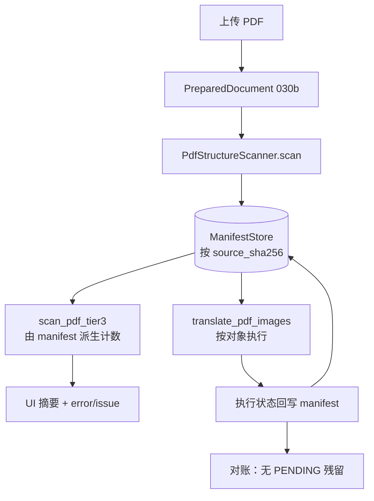

# PLAN-030d 子计划：PDF 纵向闭环（SSOT 贯通、正文、多栏、表格）

> 状态：**已批准，实施中**
> 日期：2026-09-08
> 批准记录：用户于 2026-09-08 批准全量范围（含正文 DocLayout、多栏保真、PDF 表格原位重建）
> 父计划：[PLAN-030](./PLAN-030-semantic-layout-translation.md)（已批准）
> 前置阶段：[PLAN-030a](./PLAN-030a-cross-format-contract-baselines.md)、[PLAN-030b](./PLAN-030b-input-adapters-normalized-canvases.md)、[PLAN-030c](./PLAN-030c-unified-semantic-scan.md)（均已完成）
> 阶段边界：交付父纲领定义的 PDF 纵向闭环——原生/扫描/混合 PDF 的正文、Figure、Table、单/双/多栏的检测—翻译—回写—审计；不迁移 DOCX/PPTX/图片语义对象（030e–030g）。

## 一、目标

交付父纲领 030d：**PDF 纵向闭环**。在 030c 的语义扫描之上，让 manifest 成为真正贯通预扫描、执行与审计的 SSOT，并把正文、多栏与表格纳入语义对象与原位回写。

030d 要回答八个问题：

1. manifest 如何在预扫描与执行之间传递？（缓存键、失效、并发）
2. 幻灯等无题注页的可译区域如何进入 manifest 而不伪造 Figure 编号？
3. 执行结果如何回写，使每个对象都有可解释的终态？
4. 预扫描 Tier-3 出错时如何如实上报，而不是伪装成「没有插图」？
5. 正文如何成为 `BODY` 语义对象，而不是 BabelDOC 内部的黑盒？
6. 单/双/多栏如何检测，阅读顺序如何断言，跨栏串接如何防护？
7. PDF 表格如何原位重建，同时保证数字、单位、统计符号不变？
8. 原生、扫描、混合三类 PDF 如何走同一套语义对象与审计口径？

### 完成定义

- `scan_pdf_tier3` 与 `translate_pdf_images` 消费同一份 manifest，不再各自重新检测。
- 幻灯样本三方一致：`manifest` 可译对象数 `== Tier3Result.translatable_count ==` 执行区域数 `== 12`。
- 每个可执行对象终态为 `TRANSLATED`、`EXPLICITLY_SKIPPED` 或 `FAILED_SOFT`，无 `PENDING` 残留。
- Tier-3 的 `error` 进入 UI 文案与 `ManifestIssue`，不再显示为「未检测到需要嵌字的插图」。
- `BODY` 对象进入 manifest，带 `reading_order`；`Canvas.layout_mode` 与 `column_count` 按实际版面填充。
- 双栏金样阅读顺序断言通过，跨栏串接为 0。
- 原生表格原位重建后数字集合不变，表格不被误判为 Figure。
- 新增 `scripts/verify-plan-030d.sh`；028/029/030c 三个门保持 PASS。

## 二、问题证据

### 2.1 manifest 零消费（Checkpoint B 未达成）

全仓 `PdfStructureScanner().scan()` 的调用方只有测试与验收脚本：

| 位置 | 性质 |
| --- | --- |
| [`tests/structure/test_scan_pdf.py:23`](../../../tests/structure/test_scan_pdf.py) | 测试 |
| [`scripts/verify-plan-030c.sh`](../../../scripts/verify-plan-030c.sh) 内联片段 | 验收 |
| [`qyunslation/structure/__init__.py:82`](../../../qyunslation/structure/__init__.py) | 仅导出 |

生产链路各自独立检测：

- [`scripts/doc_image_prescan.py:452`](../../../scripts/doc_image_prescan.py) 自行调用 `caption_anchors` / `labeled_figure_regions` / `translatable_regions`
- [`scripts/pdf_image_translate.py:334`](../../../scripts/pdf_image_translate.py) 自行调用 `translatable_regions`
- [`scripts/apply-pdf2zh-prescan.py:272`](../../../scripts/apply-pdf2zh-prescan.py) 只把标量计数写进 Gradio state，翻译阶段完全不读

`ManifestConsumer`（[`interfaces.py:23`](../../../qyunslation/structure/interfaces.py)）零实现；manifest 无任何持久化或缓存。同一份 PDF 在一次翻译中被打开检测**三次**。

### 2.2 scanner 与执行侧口径在幻灯页仍有分叉

PLAN-030c 收尾时把预扫描与执行统一到 `translatable_regions`，但 `PdfStructureScanner` 仍走 `labeled_figure_regions`（[`scan_pdf.py:99`](../../../qyunslation/structure/scan_pdf.py)）。幻灯页无题注，`labeled_figure_regions` 必然返回空：

| 链路 | 幻灯样本可译区 |
| --- | --- |
| `PdfStructureScanner` | 0 |
| `scan_pdf_tier3` | 12 |
| `translate_pdf_images` | 12 |

manifest 与实际执行差 12 个对象。因为 scanner 目前无生产调用方，这不构成线上风险；但 030d 一旦接入，它会立刻变成用户可见错误，因此必须在同一阶段修掉。

修复不是替换一个函数调用：幻灯区域没有 Figure 编号，父纲领 §4.3 第 5 条要求「无编号对象单独标注且不伪造编号」，需要先定义无编号对象的 `semantic_id` 规则。

### 2.3 Tier-3 错误伪装成「没有插图」

`format_tier3_summary` 只看计数，不看 `error`，实测：

```text
encrypted        -> '未检测到需要嵌字的插图。'
pymupdf_missing  -> '未检测到需要嵌字的插图。'
some crash       -> '未检测到需要嵌字的插图。'
```

截断状态处理正确（显示「仅扫描前 40 页」），错误状态则被静默吞掉。这正是父纲领审查结论第 8 条「错误与截断可能伪装成『未检测到』」。

### 2.4 scanner 对象类型覆盖 3/8

`ObjectType` 共 8 个成员，`PdfStructureScanner` 只产出 3 个：

| 类型 | 产出 | 归属 |
| --- | --- | --- |
| `CAPTION` / `FIGURE` / `TABLE` | 是 | 030c 已交付 |
| `IMAGE` | 否 | 030d（无编号可译区域） |
| `BODY` | 否 | 推迟，见 §五 |
| `TEXT_BOX` / `SHAPE` | 否 | 030e / 030g |
| `POSTER_SECTION` | 否 | 030f |

## 三、目标状态



关键约束：**扫描只发生一次**。`scan_pdf_tier3` 与 `translate_pdf_images` 都从 `ManifestStore` 取，命中即复用。

## 四、非目标

- 不迁移 DOCX/PPTX/图片语义对象（030e–030g）。
- 不统一 GUI（BabelDOC 原位）与 API（mineru/docling → Markdown）两条 PDF 入口；030d 只保证 GUI 主链闭环，API 旁路维持现状并在 manifest 标注 `processing_mode`。
- 不接管 BabelDOC 的正文**翻译引擎**；030d 把正文建模为语义对象并消费/审计 BabelDOC 的版面结果，不重写译文生成。
- 不做跨页续表合并（父纲领列为后续）。
- 不重写 HPD OCR 引擎；扫描件路径只做语义对象与审计口径对齐。
- 不改动 `letter_pipeline` 的书信重绘算法本身。

## 五、执行顺序与风险分层

全量范围按风险从低到高分三组，前一组的阶段门通过后才进入下一组：

| 组 | 任务 | 风险 | 说明 |
| --- | --- | --- | --- |
| A：SSOT 地基 | Tasks 1–5 | 低 | 纯新增 + 可选参数，`manifest=None` 保留旧路径 |
| B：版面语义 | Tasks 6–7 | 中 | 依赖 DocLayout 可离线使用；不可用时回退自研列检测 |
| C：表格原位 | Tasks 8–9 | 高 | 触碰临床数据渲染，fail-closed 优先 |

**为什么先做 A**：正文、多栏、表格的执行状态都需要 manifest 记录，否则 `FAILED_SOFT` 与 `EXPLICITLY_SKIPPED` 无法区分，回归时定位不了是检测问题还是执行问题。030c 已用「先统一口径再改执行」验证过这个节奏。

**组 B 的技术路线分支**：Task 6 启动时先判定 BabelDOC DocLayout 能否离线调用。

- 可用：消费其 `figure/table/text/title` 标签与坐标，作为栏位与阅读顺序的主证据。
- 不可用（缺权重、需联网、性能不可接受）：回退自研列检测——按文本块 x 中心聚类判定栏边界，用 PyMuPDF `get_text("blocks")` 的几何做阅读顺序。回退方案精度较低，须在 manifest 记 `detector="column_clustering"` 与较低 `confidence`。

两条路线的**验收标准相同**，实现择优。选定后在 WT-030d 记录判定依据。

## 六、关键设计

### 6.1 ManifestStore

新增 [`qyunslation/structure/manifest_store.py`](../../../qyunslation/structure/manifest_store.py)：

```text
ManifestStore(root: Path | None = None)
  .put(manifest) -> Path          # 写 <root>/<source_sha256>.manifest.json
  .get(source_sha256) -> Manifest | None
  .invalidate(source_sha256) -> None
```

- 默认根目录 `QYUNSLATION_MANIFEST_CACHE`，回退 `~/.cache/qyunslation/manifests`。
- 命中条件：`source_sha256` 相同**且** `schema_version` major 相同；major 不匹配视为未命中并覆盖，避免契约升级后读到旧结构。
- 写入用临时文件 + `os.replace` 原子落盘，防止并发翻译读到半截 JSON。
- 读取失败（JSON 损坏、校验不过）一律当未命中，重新扫描，不抛错阻断翻译。

### 6.2 无编号可译对象

无题注页（幻灯、纯图页）的可译区域产出 `ImageObject` 而非 `FigureObject`：

- `semantic_id`：`image:page:{page}:{index}`，不占用 `figure:N` 命名空间。
- `semantic_scope`：`unnumbered`。
- `detector_evidence.detector`：`translatable_regions`。
- 计入 `summary.object_counts["IMAGE"]`，**不计入** `summary.figure_count`。

UI 主计数用「可译区域总数」= `figure_count`（有编号，且有可译区域）+ `IMAGE` 对象数。这样幻灯显示 12，期刊显示 7，两者都不伪造编号。

`PdfStructureScanner` 改用 `translatable_regions`：有 figure 题注的页仍按编号归组，其余页产出无编号 `IMAGE` 对象。

### 6.3 Tier3Result 由 manifest 派生

[`scripts/doc_image_prescan.py`](../../../scripts/doc_image_prescan.py) 的 `scan_pdf_tier3` 改为：

1. 查 `ManifestStore`；未命中则 `PdfStructureScanner().scan()` 并写入。
2. 从 manifest 派生 `figure_caption_count` / `table_caption_count` / `translatable_count`。
3. manifest 的 `issues` 映射为 `Tier3Result.error`。

保留 `max_pages` / `deadline_s` / `should_abort` 语义：超时或中止时 manifest 标 `truncated`，**不写缓存**（避免把不完整结构固化）。

### 6.4 执行侧消费与回写

[`scripts/pdf_image_translate.py`](../../../scripts/pdf_image_translate.py) 的 `translate_pdf_images` 增加可选参数：

```python
def translate_pdf_images(src, *, to_lang="简体中文", progress_cb=None,
                         dest=None, manifest=None):
```

- `manifest` 为 `None` 时行为完全不变（现有调用方与回滚路径不受影响）。
- 传入时按 `FIGURE` / `IMAGE` 对象的 `bbox` 执行，不再逐页重新检测。
- 每个对象写回终态：`TRANSLATED`（已回嵌）、`EXPLICITLY_SKIPPED`（无可译文字，带 `reason_code`）、`FAILED_SOFT`（OCR 或回嵌失败，保留原图）。
- 执行后 manifest 回写 `ManifestStore`，供审计与二次翻译复用。

GUI 补丁 [`scripts/apply-pdf2zh-docimg.py`](../../../scripts/apply-pdf2zh-docimg.py) 从 `state["_prescan_meta"]` 取 `source_sha256`，经 `ManifestStore` 读取后传入；取不到则走 `manifest=None` 旧路径。

### 6.5 错误如实上报

`format_tier3_summary` 增加 `error: str | None` 参数：

| error | UI 文案 |
| --- | --- |
| `encrypted` | 文档已加密，无法扫描插图；翻译仍会尝试文字层。 |
| `pymupdf_missing` | 插图扫描组件不可用，本次不做插图嵌字。 |
| 其他 | 插图扫描失败（`<error>`），本次不做插图嵌字。 |

同时写 `ManifestIssue(code="PRESCAN_TIER3_FAILED", severity=ERROR, stage=SCAN, retryable=True)`。

## 七、金样与夹具

沿用 030c 三个样本，新增一条对账维度：

| 样本 | 路径 | 030d 硬验收 |
| --- | --- | --- |
| ljae439 | `tests/fixtures/structure/reference/ljae439.pdf` | Figure 1–5 / Table 1–3；`IMAGE` 对象 0 |
| Nature | `tests/fixtures/structure/reference/nature_comm_53384.pdf` | Figure 1–7 / Table 1–3；`IMAGE` 对象 0；p4/p5/p9 零可译区 |
| 幻灯（不入仓） | `/home/dev/pdf2zh/pdf2zh_files/57114032-8727-41f9-b826-b5ff40fcf733/QX027N QnA-2026.08.19-临床.pdf` | `figure_count` 0、`IMAGE` 12；三方一致为 12 |

SHA-256 与 030c 一致，不重新物化。

## 八、任务与依赖

### Task 1：ManifestStore 与 ManifestConsumer

**文件：** `qyunslation/structure/manifest_store.py`、`qyunslation/structure/__init__.py`、`tests/structure/test_manifest_store.py`

**验收：**

- [ ] `put` / `get` 往返后 manifest 逐字段相等。
- [ ] `schema_version` major 不匹配时视为未命中并覆盖。
- [ ] JSON 损坏、目录不可写、并发写入均降级为未命中，不抛错。
- [ ] 原子落盘：写入过程中读取不会得到半截 JSON。

**验证：** `pytest -q tests/structure/test_manifest_store.py --no-cov`

### Task 2：无编号可译对象建模

**依赖：** Task 1

**文件：** `qyunslation/structure/scan_pdf.py`、`tests/structure/test_scan_pdf.py`

**验收：**

- [ ] scanner 改用 `translatable_regions`，幻灯样本产出 12 个 `IMAGE` 对象。
- [ ] `semantic_id` 为 `image:page:{page}:{index}`，不占用 `figure:N`。
- [ ] 幻灯 `summary.figure_count == 0`，`object_counts["IMAGE"] == 12`。
- [ ] ljae439 与 Nature 的 Figure/Table 计数不变，`IMAGE` 为 0。
- [ ] manifest 两次扫描仍稳定。

**验证：** `pytest -q tests/structure/test_scan_pdf.py --no-cov`

### Task 3：预扫描消费 manifest

**依赖：** Tasks 1–2

**文件：** `scripts/doc_image_prescan.py`、`tests/structure/test_prescan_manifest.py`

**验收：**

- [ ] `scan_pdf_tier3` 命中缓存时不重新打开 PDF（用调用计数断言）。
- [ ] 三个样本的 Tier-3 计数与 manifest 完全一致。
- [ ] 超时/中止时标 `truncated` 且不写缓存。
- [ ] 030c 的 UI 文案维持不变（期刊 7/3、ljae439 5/3、幻灯 12）。

**验证：** `pytest -q tests/structure/test_prescan_manifest.py --no-cov`

### Task 4：执行侧消费与状态回写

**依赖：** Tasks 1–3

**文件：** `scripts/pdf_image_translate.py`、`scripts/apply-pdf2zh-docimg.py`、`tests/structure/test_execution_parity.py`

**验收：**

- [ ] `manifest=None` 时行为与 030c 完全一致（回归测试）。
- [ ] 传入 manifest 时按对象 bbox 执行，不再逐页检测。
- [ ] 执行后无 `PENDING` 残留；每个对象为 `TRANSLATED` / `EXPLICITLY_SKIPPED` / `FAILED_SOFT`。
- [ ] `FAILED_SOFT` 保留原图，不产生空白或半截覆盖。
- [ ] GUI 补丁取不到 manifest 时回落旧路径且幂等。

**验证：** `pytest -q tests/structure/test_execution_parity.py --no-cov`

### Task 5：Tier-3 错误如实上报

**依赖：** Task 3

**文件：** `scripts/doc_image_prescan.py`、`scripts/apply-pdf2zh-prescan.py`、`tests/structure/test_prescan_error_surface.py`

**验收：**

- [ ] `encrypted` / `pymupdf_missing` / 未知异常各有明确文案。
- [ ] 任何 error 都不再产生「未检测到需要嵌字的插图。」。
- [ ] 对应 `ManifestIssue` 进入 manifest 且 `retryable` 正确。

**验证：** `pytest -q tests/structure/test_prescan_error_surface.py --no-cov`

### Checkpoint A：SSOT 地基阶段门

- [ ] Tasks 1–5 聚焦测试全绿。
- [ ] 三方对账：幻灯 12/12/12，Nature 7/7/7，ljae439 5/5/5。
- [ ] 028/029/030c 三个门仍 PASS。
- [ ] archive 3 个既有失败精确不变。

未通过不得进入组 B。

### Task 6：正文 BODY 对象与版面证据

**依赖：** Checkpoint A

**文件：** `qyunslation/structure/layout.py`、`qyunslation/structure/scan_pdf.py`、`tests/structure/test_body_objects.py`

先判定 DocLayout 可用性（§五），再择路实现。

**验收：**

- [ ] 三个样本每页产出 `BODY` 对象，`bbox` 不与 Figure/Table 区域重叠超过 20%。
- [ ] `BODY.reading_order` 在页内连续且从 0 开始。
- [ ] `detector_evidence` 标明用的是 `doclayout` 还是 `column_clustering`，并带 `confidence`。
- [ ] 纯表页（Nature p4/p5/p9）不产出跨越表格区域的 `BODY` 对象。
- [ ] 正文对象 `planned_action="babeldoc_text_layer"`、`execution_status=EXPLICITLY_SKIPPED`、`reason_code="delegated_to_babeldoc"`——030d 审计正文但不接管译文生成。

**验证：** `pytest -q tests/structure/test_body_objects.py --no-cov`

### Task 7：单/双/多栏检测与阅读顺序

**依赖：** Task 6

**文件：** `qyunslation/structure/layout.py`、`qyunslation/structure/canvases.py`、`tests/structure/test_column_layout.py`

**验收：**

- [ ] `Canvas.layout_mode` 按实际填充，不再硬编码 `MIXED`（现状 [`canvases.py:88`](../../../qyunslation/structure/canvases.py)）。
- [ ] ljae439 判定为双栏为主（十页中七页 DOUBLE），Nature 十九页中十三页 DOUBLE。
- [ ] 合成夹具 `single-column.pdf` 判 SINGLE、`double-column.pdf` 判 DOUBLE。
- [ ] 幻灯页判 FREEFORM。
- [ ] `Canvas.reading_order` 填充 `BODY` 对象 ID，双栏页顺序为「左栏自上而下 → 右栏自上而下」。
- [ ] 跨栏串接检测：任一 `BODY` 对象横跨栏边界且宽度超过页宽 60% 时记 `ManifestIssue(code="LAYOUT_COLUMN_SPAN")`；双栏金样该 issue 为 0。

**验证：** `pytest -q tests/structure/test_column_layout.py --no-cov`

### Task 8：PDF 表格原位重建

**依赖：** Checkpoint A、Task 7

**文件：** `scripts/pdf_table_rebuild.py`、`qyunslation/structure/scan_pdf.py`、`tests/structure/test_table_rebuild.py`

`TableObject` 从 `planned_action="text_layer"` 升级为可执行对象，填充 `row_count` / `column_count` 与单元格 `translatable_blocks`。

**验收：**

- [ ] 三个金样的 Table 1–3 均产出结构化单元格，行列数与人工真值一致。
- [ ] **数字保护**：重建后表格内数字、百分比、区间、统计符号集合与原文完全一致（逐 token 比对）。
- [ ] 表头与文本单元格译文回写原位，列宽与线框不变。
- [ ] 结构置信度不足时 `FAILED_SOFT` + `reason_code="table_structure_low_confidence"`，保留原表不改动。
- [ ] 纯表页仍禁止 OCR 嵌字（030c 规则 A 不回归）。
- [ ] 表格不被误判为 Figure（Figure 计数不变）。

**验证：** `pytest -q tests/structure/test_table_rebuild.py --no-cov`

### Task 9：原生/扫描/混合 PDF 路径对齐

**依赖：** Tasks 6–8

**文件：** `qyunslation/structure/scan_pdf.py`、`scripts/doc_image_prescan.py`、`tests/structure/test_scanned_pdf_parity.py`

**验收：**

- [ ] scanner 判定并记录 `Representation.SCANNED` / `NATIVE_TEXT` / `HYBRID`。
- [ ] 扫描件（`pdf_needs_hpd` 为真）产出的 manifest 标 `processing_mode=HYBRID` 并记录 HPD 血缘。
- [ ] 混合 PDF（部分页扫描）逐页判定，不整档一刀切。
- [ ] 扫描件路径的对象也有终态，不出现 `PENDING` 残留。
- [ ] FDA PIND 样本（20 页扫描件）扫描不超时，`truncated` 语义正确。

**验证：** `pytest -q tests/structure/test_scanned_pdf_parity.py --no-cov`

### Checkpoint B：全量阶段门

- [ ] Tasks 1–9 聚焦测试全绿。
- [ ] `bash scripts/verify-plan-030d.sh` PASS。
- [ ] 028/029/030c 三个门仍 PASS。
- [ ] `pytest -q tests/structure --no-cov -rxX`：只剩 `QY030-PPT-001` 一个 xfail。
- [ ] archive 3 个既有失败精确不变。
- [ ] 父纲领 Checkpoint B 四条全部达成（跨格式对账除外，仍按 030c §五 推迟至 030g 后）。

### Task 10：验收脚本与文档

**依赖：** Checkpoint B

**文件：** `scripts/verify-plan-030d.sh`、`docs/walkthroughs/WT-030d-pdf-vertical-closure.md`、父纲领阶段门

**验收：**

- [ ] 单命令门区分 PASS / EXPECTED_RED / FAIL。
- [ ] WT 记录三方对账实测、DocLayout 路线判定依据、表格数字保护实测、部署步骤。
- [ ] 父纲领 Checkpoint B 标为达成，下一批准门更新为 PLAN-030e。

## 九、阶段验收命令

```bash
.venv/bin/python -m pytest -q tests/structure/test_manifest_store.py --no-cov
.venv/bin/python -m pytest -q tests/structure/test_scan_pdf.py --no-cov
.venv/bin/python -m pytest -q tests/structure/test_prescan_manifest.py --no-cov
.venv/bin/python -m pytest -q tests/structure/test_execution_parity.py --no-cov
.venv/bin/python -m pytest -q tests/structure/test_prescan_error_surface.py --no-cov
.venv/bin/python -m pytest -q tests/structure/test_body_objects.py --no-cov
.venv/bin/python -m pytest -q tests/structure/test_column_layout.py --no-cov
.venv/bin/python -m pytest -q tests/structure/test_table_rebuild.py --no-cov
.venv/bin/python -m pytest -q tests/structure/test_scanned_pdf_parity.py --no-cov
.venv/bin/python -m pytest -q tests/structure --no-cov -rxX
bash scripts/verify-plan-030d.sh
bash scripts/verify-plan-030c.sh
bash scripts/verify-plan-028.sh
bash scripts/verify-plan-029.sh
git diff --check
```

## 十、质量红线

- 缓存只是加速，不是真值：任何读取失败都回落重新扫描，绝不因缓存问题阻断翻译。
- `manifest=None` 路径必须保留，作为执行侧一键回滚。
- 无编号对象不得伪造 `figure:N` 编号，也不得计入 `figure_count`。
- 纯表页 fail-closed（030c 规则 A）不得因 manifest 接入或表格重建而失效。
- 幻灯 PLAN-029b profile 区域数维持 12。
- 错误不得伪装成零结果。
- 执行终态不得为 `PENDING`；失败一律 `FAILED_SOFT` 并保留原对象。
- **表格数字保护**：重建后数字、单位、百分比、区间、统计符号集合必须与原文完全一致；不一致即 fail-closed 保留原表。
- 正文可搜索性：不得为了版面保真把正文页整页栅格化。
- 栏边界硬约束：译文膨胀不得跨栏；宁可记 overflow issue 也不静默越界。

## 十一、回滚

- 组 C（Tasks 8–9）独立回滚：`TableObject` 恢复 `planned_action="text_layer"`，其余保留。
- 组 B（Tasks 6–7）独立回滚：停止产出 `BODY` 对象与 `layout_mode`，manifest 退回 030c 的题注级语义。
- Task 4（执行侧）独立回滚：GUI 补丁改回不传 manifest。
- 缓存目录可整体删除，系统自动退化为每次重新扫描。
- 不得恢复「Tier-3 错误显示为零插图」与「位图+矢量相加」两个旧行为。

## 十二、完成条件

- Checkpoint A 与 Checkpoint B 全部条款达成并在父纲领标注。
- 三个样本三方对账一致；双栏阅读顺序与表格数字保护均有自动断言。
- WT-030d 与 `verify-plan-030d.sh` 入库。
- 部署后用生产解释器实测三类样本（期刊、幻灯、扫描件），文案与执行一致。
