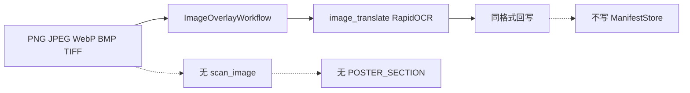

# PLAN-030f 子计划：图片与 Poster 纵向闭环

> 状态：**已完成**  
> 日期：2026-09-08  
> 完成记录：[WT-030f](../../walkthroughs/WT-030f-image-poster-closure.md)  
> 父计划：[PLAN-030](./PLAN-030-semantic-layout-translation.md)（已批准）  
> 前置：PLAN-030e + [PLAN-030e-fix-section-canvas](./PLAN-030e-fix-section-canvas.md)（已完成）  
> 验收门：`bash scripts/verify-plan-030f.sh`

## 一、目标

关闭图片/Poster 格式在 PLAN-030 架构中的纵向空白：从上传到 manifest 再到 `ImageOverlayWorkflow` 执行与 `output_evidence` 回写，与 PDF/DOCX 030d/030e 闭环同构。

### 现状



| 已有 | 空白 |
| --- | --- |
| [`image_overlay_workflow.py`](../../../qyunslation/workflow/image_overlay_workflow.py) + [`image_translate.py`](../../../qyunslation/extensions/image_translate.py)（OCR/擦除/嵌字/QC） | 无 `scan_image.py` |
| 030b 图片 Canvas（含 EXIF 旋转） | 从不产出 `POSTER_SECTION` |
| `ContentProfile.POSTER` 画像先验 | 执行不消费 manifest |
| PNG/JPEG/WebP/BMP/TIFF 探针 | 无超大画布分块与接缝断言 |
| | SVG/HEIF/AVIF/GIF 仍靠探针拒绝 |

### 完成定义

- 硬格式矩阵内图片扫描产出 `DocumentStructureManifest`（schema 1.1.x，不 bump major）。
- 海报比例或超大画布标 `POSTER`，分区产出 `POSTER_SECTION`（空间阅读顺序，不伪造 Figure 编号）。
- `ImageOverlayWorkflow` 在 `manifest!=None` 时消费 manifest 并回写 `execution_status` / `output_evidence`；`manifest=None` 走现有路径。
- `verify-plan-030f.sh` + WT-030f；结构套件仍只留 `QY030-PPT-001` xfail。

## 二、建议任务（供批准）

### Task 1：`ImageStructureScanner`

- 新建 [`qyunslation/structure/scan_image.py`](../../../qyunslation/structure/scan_image.py)。
- 一页/一帧一个 Canvas（`PAGE` 或 `POSTER`）；多页 TIFF 每帧独立 canvas 或 `source_index` 递增。
- OCR 块建模为 `IMAGE` + `translatable_blocks`（bbox 必填，像素坐标）。
- 复用 030b `prepare_document` 与 EXIF 归一。

### Task 2：Poster 画像路由

- 超大或接近海报长宽比（如 h/w > 1.8 或短边 > 4096px）标 `CanvasKind.POSTER`。
- 按垂直/网格分区产出 `POSTER_SECTION` 对象；`reading_order` 按空间顺序（上→下、左→右）。
- 不伪造 `Figure N` 编号；`semantic_id` 形如 `poster:section:{index}`。

### Task 3：`ImageOverlayWorkflow` manifest 消费

- 注入 `ManifestStore` / 预扫描 manifest（与 `DocxWorkflow` 同模式）。
- 按 `translatable_blocks` 驱动 OCR 嵌字；译后写 `execution_status` 与 `output_evidence`（尺寸、格式、块数、QC 摘要）。
- `manifest=None` 时行为与现网一致（回归必保）。

### Task 4：硬格式矩阵

| 格式 | 要求 |
| --- | --- |
| PNG / JPEG / WebP / BMP / TIFF | 保持方向、像素尺寸、长宽比、透明通道（若源有） |
| 多页 TIFF | 页序与帧 index 与 canvas `source_index` 一致 |
| QC | 非文字区损伤沿用现有 `image_translate` QC；fail-soft 写 issue |

### Task 5：超大画布分块

- 重叠 tile 切分 + OCR/嵌字 + 坐标回映。
- 接缝检测（相邻 tile 文本框 gap/重叠阈值）；内存预算超限 fail-soft 并记 `ManifestIssue`。
- 默认 tile 尺寸与 overlap 可配置；单测用合成 Poster 夹具。

### Task 6：扩展格式探针

- SVG / HEIF / AVIF / GIF：有能力探针检测到解码器则走同一 scanner；否则上传前拒绝（本阶段**不**新装系统解码器）。
- 拒绝路径与 030b `SourceFormat` 探针一致，HTTP/UI 显式原因。

### Task 7：验收门与文档

- `scripts/verify-plan-030f.sh`：compile + `test_scan_image.py` + 结构套件 xfail 清单 + 030c/030d/030e 回归。
- [WT-030f](../../walkthroughs/WT-030f-image-poster-closure.md) walkthrough。
- 合成夹具：`poster.png`（已有）、新增 `wide-poster.png` 或扩展现有 generator。

## 三、非目标

- PPT/PPTX 嵌图对象 → PLAN-030g（`QY030-PPT-001`）
- 跨格式 manifest 对账 → PLAN-030h
- PDF 三线表单元格重建 → [PLAN-030-table-pdf-cell-reconstruction](./PLAN-030-table-pdf-cell-reconstruction.md)
- 像素级金样人工门 → PLAN-030i
- DOCX 内嵌图 occurrence 按节归因（030g 前可接受现状）

## 四、风险与缓解

| 风险 | 缓解 |
| --- | --- |
| 分块接缝漏字/重字 | 重叠区 + 接缝断言；合成 Poster 回归 |
| 大图 OOM | tile + 内存预算 fail-soft |
| manifest 与直跑路径行为分叉 | 双路径测试；`manifest=None` 为默认回归 |
| POSTER 分区启发式误判 | `ContentProfile.POSTER` 与用户 override 双轨；issue 可解释 |

## 五、验收命令（实施后）

```bash
bash scripts/verify-plan-030f.sh
```

质量红线：030e/030d/030c/028/029 门不退化；结构套件仅 `QY030-PPT-001` xfail。

## 六、批准门

用户单独批准本计划后，按 Task 1→7 顺序实施；未批准前仅保留本文档与父纲领「下一门」登记。
