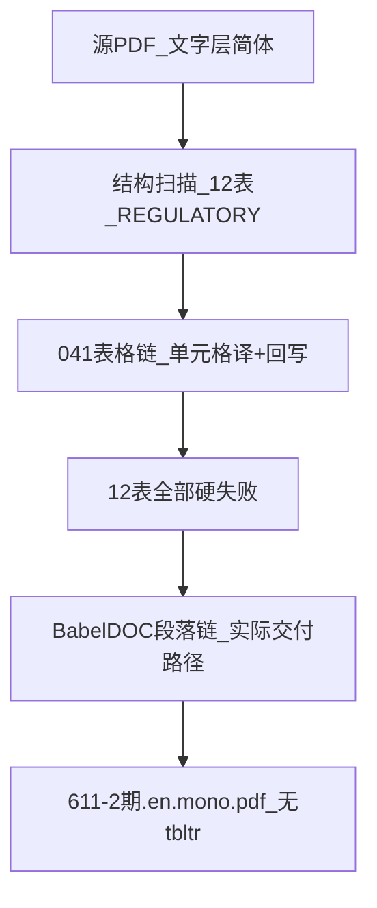

# PLAN-043：监管表单字段标签漏译闭环

> 状态：**已完成**（代码/门禁；实样 EN 重译待验收）
> 日期：2026-09-11
> 分支：`feat/PLAN-043-regulatory-form-label-leakage`
> 批准记录：用户确认「根据分析结果更新计划」后实施
> 验收门：`bash scripts/verify-plan-043.sh`；证据汇总写入 [WT-043](../../walkthroughs/WT-043-regulatory-form-label-leakage.md)
> 前置：[PLAN-041](../PLAN-041-pdf-regulatory-form-fidelity/PLAN-041-pdf-regulatory-form-fidelity.md)、[PLAN-042](../PLAN-042-regulatory-translation-quality/PLAN-042-regulatory-translation-quality.md)
> Skill：扩写 [SK-Q003](../../../.cursor/skills/pdf-regulatory-form-fidelity/SKILL.md)

## 一、问题结论（2026-09-11 复核）

### 1.1 用户观察 vs 系统事实

| 观察 | 系统事实 |
| --- | --- |
| 「知情/文字版没有大问题」 | **成立**：611-2期源 PDF 为**文字层简体**；长段落（试验专业题目、主要/次要目的、药物英文名长描述）已由 BabelDOC 段落链译出 |
| 截图大量字段标签仍是中文 | **成立**：第 1 页 EN mono 文本层 **177 汉字**（源 429）；**34/46** 个短中文标签来自结构扫描的**表格单元格**，在 EN 中仍为中文 |
| 是否「表格识别有问题」 | **否**：`REGULATORY` 画像、**12 表**（P1 `4/1/2/1/4`）、P1 **68** 个可译块；问题不是未检出，而是**表格链硬失败 + 段落回退** |

### 1.2 生产路径（实测 job `efcd18da`，2026-09-11 02:21）



- 产出 **无** `.tbltr.pdf`；GUI 交付的是 BabelDOC 段落译文。
- 漏译内容在**形态上**是表格单元格里的字段标签/短值，在**交付上**却由段落链绘制，两条链路未对齐。

### 1.3 042b 回归对照（同一源文件）

| 跑次 | 042b | P1 汉字 | 现象 |
| --- | --- | --- | --- |
| 00:06 旧跑 | 未生效 | **89** | 长标签（如 `首次公示信息日期`）由 LLM 译出 |
| 02:21 新跑 | 已部署有 bug | **177** | 词表命中后写回失败，且堵死 LLM，漏译**加重** |

### 1.4 缺陷分层

**L1 整格未译（P0）** — 表单字段标签与短值格

- 词表已有、042b 命中却未写入版式：`登记号` `试验状态` `进行中` …（见 [043d](./PLAN-043d-verify-gates.md) L1 清单）
- 词表缺失 + `min_text_length=5`：`药物名称` `药物类型` `适应症` `版本日期`
- 042e 人名保留：`周清红`
- 断行孤儿：`方案是否为联合用` + `药`；目的句尾 `疫原性。`

**L2 已译但不受控** — 长句 OK、专名/期次格不 OK

- 申办方 LLM 自由发挥（`3SBio Pharmaceutical…` vs org 词表 `3SBio Inc. (Shanghai)`）
- 短格 `II 期` 未译；长标题内 Phase II 已由 LLM 写对

**L3 版式/表格链（P1）** — 043c 主攻

- 表格链硬失败 QC（611-2期 probe）：`FONT_BELOW_TARGET`+`SOURCE_RESIDUE`（P1 表1）；`TABLE_DIGIT_DRIFT`（P1 表2–4 等）；P5 多表 `SOURCE_RESIDUE`
- 地址拆行、次要目的 `immun` 截断

## 二、根因（两层，已代码核对）

### 层 A：表格链未交付（结构性）

1. 12 表检出后 `translate_pdf_tables` 全表硬失败 → **不写** `.tbltr.pdf`。
2. 表单短标签的**正确专路**是单元格级回写；该路径未生效，全部退到段落链。

### 层 B：段落回退路径缺陷（042 后回归，P0 止血）

1. **042b 写回 API 错误**：调用不存在的 `set_paragraph_translated`；只改 `paragraph.unicode`，**不改** `pdf_paragraph_composition`（排版画字来源）；无条件 `translated_ids.add` 堵死 LLM。
2. **词表覆盖不全**：`regulatory-form-fields.csv` 缺 `药物名称` 等 11 项。
3. **`min_text_length=5`**：直替失败时 1–4 字格被跳过（禁止裸降阈值）。
4. **人名策略**：2–4 字 CJK 整格保留，EN 表单观感为漏译。


## 三、目标与非目标

### 目标

- **P0（043a+043b）**：段落回退路径上，P1 字段标签与短值格零漏译；042b 写回失败时回退 LLM；CJK 从 177 显著下降（标签层目标 0）。
- **P1（043c）**：611-2期生产路径写出 `.tbltr.pdf`；修 TABLE_DIGIT_DRIFT / SOURCE_RESIDUE 等误杀。
- **门禁（043d）**：verify-043 对 P1 L1 标签清单做硬断言；041/042 不回归。

### 非目标

- 不重写 BabelDOC 排版引擎；不裸降 `min_text_length`。
- 不引入 OpenCC（源已是简体文字层）。
- 不把「文字版 PDF 长段落翻译」纳入本计划（该路径已可用）。
- 不提交实样 PDF/截图/个人信息。

## 四、子计划

| 编号 | 文件 | 优先级 | 交付 |
| --- | --- | --- | --- |
| [043a](./PLAN-043a-writeback-fix.md) | 直替写回修复 | **P0** | `post_translate_paragraph` 写回；失败不 skip LLM |
| [043b](./PLAN-043b-glossary-fragments.md) | 词表/断行/人名 | **P0** | form 词表补洞；后缀拼回；`周清红`→`Zhou Qinghong` |
| [043c](./PLAN-043c-table-chain-delivery.md) | 表格链交付 | **P1** | 611-2期 `.tbltr.pdf`；QC 误杀修复 |
| [043d](./PLAN-043d-verify-gates.md) | 金标门禁 | **P0/P1** | verify-043；SK-Q003；WT-043 |

## 五、实施顺序

```
043a（止血：不修写回则补词表更糟）→ 043b → 043d 阶段性验收 → 043c 表格链闭环
```

**理由**：用户当前看到的是段落链产物；043a 可立即降低 P1 汉字。043c 是表单文档的结构性正解，但与「文字版长句已 OK」并行——两条路径都需收口。

## 六、完成定义

- [ ] 043a–043d 落地
- [ ] 再译 611-2期：P1 无 L1 标签清单中的源字符串；`周清红`→`Zhou Qinghong`
- [ ] P1 CJK < 177（目标：标签层 0）
- [ ] `verify-plan-043.sh` 有实样 PASS
- [ ] 043c：存在 `.tbltr.pdf` 或 WT 列明剩余 QC 与后续 PLAN
- [ ] no-ff merge main → 重启 `pdf2zh.service` → WT 记部署
