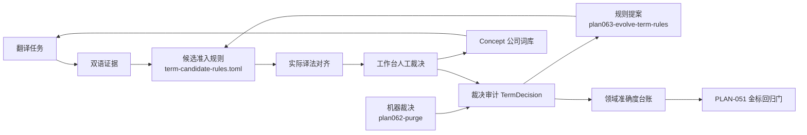

# PLAN-063：规则自动进化与全局质量总纲

> 状态：**已实现，verify BLOCKED（待 062 LIVE 真实文档）**
> 日期：2026-09-15
> 原编号：本计划原拟编号 PLAN-062，因 PLAN-062 已被「术语工作台准确度与自动进化」占用而重新编号为 063。
> 前置依赖：PLAN-062 已完成；其遗留缺口归 [PLAN-063e](./PLAN-063e-062-closeout.md)，是本计划第 0 步
> 验收门：`bash scripts/verify-plan-063.sh`

## 目标

把「人工裁决」与「生产 QA/QC 结果」变成可复用、可回滚、可度量的资产，建成闭环：

1. 被否决过的词不再重复进候选队列（裁决反哺排除规则）。
2. 用指标回答「是不是翻译得越多、同领域越准」（领域准确度台账）。
3. 用一份总纲 skill 固定每轮动作并按症状路由到分域 skill（全局自进化）。

## 目标闭环

PLAN-062 交付的是图中 `RULES` 与 `ALIGN` 两环；PLAN-063 交付 `EVOLVE`、`LEDGER`、`GOLD` 三环与总纲 skill。

## 子计划

| 子计划 | 交付 |
| --- | --- |
| [PLAN-063e](./PLAN-063e-062-closeout.md) | **第 0 步**：机器裁决补记 `TermDecision`、手改 denylist 回填 exclusions、`--screen-pending` 排空历史候选、PLAN-062 LIVE 三项补证 |
| [PLAN-063a](./PLAN-063a-decision-feedback-rules.md) | 裁决反哺规则（`term-exclusions.csv`、`excluded_stats` 迁移、四类提案、promote 脚本、版本漂移门禁） |
| [PLAN-063b](./PLAN-063b-domain-accuracy-ledger.md) | 领域准确度台账与趋势报告，含 screen 盲区指标 |
| [PLAN-063c](./PLAN-063c-quality-evolution-skill.md) | SK-Q011 全局自进化总纲、六条错误签名、registry 补登 |
| [PLAN-063d](./PLAN-063d-verification-delivery.md) | 测试、三项依赖门的 verify 门、ADR-032、WT-063 |

## 与 PLAN-062 的职责边界

两个计划都会写「裁决记录 CSV」，必须分清，否则会出现两套 promote 脚本：

- **PLAN-062 负责产生记录**：`glossaries/term-screen-decisions.csv` 记录领域名词裁定结果（`domain_term` / `generic` / `noise`），用途是**下次同词零成本复用**，属 062 自身运转所需的缓存。
- **PLAN-063 负责归纳成规则**：读 `TermDecision`（人工 `reject` / `do_not_translate`）与 062 产出的裁定记录，归纳出 `term-exclusions.csv` 条目与新 `exclude` 正则，经人工 promote 落入规则 SSOT。

一句话：062 记录事实，063 从事实提炼规则。

但 062 的**机器**裁决此前未入 `TermDecision`——`plan062-purge-stale-candidates.py` 绕过 `decide_candidate` 直接改状态，65 条拒绝没有裁决行。该回填归 063e，**不回改** PLAN-062 的验收结论。

## 执行顺序

PLAN-062 已交付（curated 393 条、历史噪声累计 `reject=65`、verify fail=0、翻译栈双进程部署指纹一致）。当初的三条依赖理由现已满足：

1. **数据依赖**：Concept 库从 2 条补到 393 条，候选队列从噪声为主降到 78 行 / 23 个不重复词，台账指标不再过拟合噪声。
2. **接口依赖**：原因码口径已定（`SCREEN_GENERIC` / `SCREEN_NOISE` 已在 `bridge._extract_candidates` 产出），`excluded_stats` 迁移可一次写对；`ScreenVerdict.origin` 需随迁移一并落库。
3. **验收依赖**：词库已 seed，PLAN-051 的 `hard_term_hit_min = 0.98` 不再必然不达标。

本计划节奏：**先 063e**（补 `TermDecision`、回填 exclusions、排空历史 pending、补 PLAN-062 LIVE 三项），其中 LIVE 补证与 063b 首个基线所需的 3 篇真实文档合并跑完；再 063a → 063b → 063c → 063d。

## 验收边界

- 规则进化**不自动落地**：`--report` / `--screen-pending` 只读不写，`--promote` 才改规则文件，全程走 git 可 review 可回滚（理由写入 ADR-032）。
- 任何规则提案必须过反向验证：误杀保留清单（`tralokinumab`、`IL-13`、`NHS`、`EASI`、`BSA`、`ABC-101`）的提案直接丢弃。
- 规则内容变更必须 bump `version`，否则台账指纹失真（PLAN-062 现场已踩过）。
- 候选变少不得默认为「这篇没有术语」：`SCREEN_GENERIC` 高或 `origin=error` 非零时按失明处理。
- 台账 JSONL 不进 git（与金标 out-root 同风格），DB 只存聚合。
- 不训练模型，不另造一套质量阈值（复用 PLAN-051 金标四键）。
