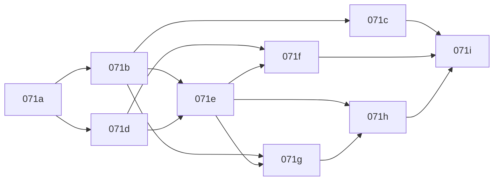

# PLAN-071：可审计翻译质量流水线与真实工作台

状态：**071a–071i 实现已落地；总验收见 WT-071（浏览器证据 BLOCKED）**

父计划：无（承接 PLAN-066–070 工作台基线）

依赖：PLAN-066、PLAN-068、PLAN-069、PLAN-070（均已合入 `main`）

## 接手摘要

截至 `16e65d4` / `948977b`，PLAN-066–070 的 Vue 工作台、SSO/BFF、预检、任务生命周期、扫描 PDF 产物恢复和实时进度改动均已提交到 `main`。本计划收拢下一阶段的质量修复，不回滚既有提交。

当前生产质量问题不是单纯 UI 问题：新 TranslationRun 走非 GUI `pdf2zh_next` CLI 后，旧版挂载在 Gradio `gui.py` 的图片/表格后处理、Logo/印章回填和部分版式链路没有迁入；runner 在 CLI 成功后直接标记 `succeeded/export/100%`，因此 UI 看不到真实 QA、人工复核和导出门禁。现有 FDA 扫描 PDF 已出现 Logo 丢失、版式漂移、邮箱断裂和 `^{th}` 等格式缺陷。

## 已确认根因（附路径证据）

1. **CLI 路径缺后处理**
   - `/next` 切换到非 GUI `pdf2zh_next` CLI 后，旧版挂载在 `gui.py` 的表格处理、图片翻译、Logo/印章回填和部分版式修复没有迁入新执行器。
   - 证据：`qyunslation/workbench/runner.py` `build_pdf2zh_command` / `Pdf2zhRunner.start`；成功路径 672–683、孤儿收尾 822–830 均无 imgtr/tbltr/graphic_reinsert/letter_pipeline。
   - 旧能力实际落在：`scripts/apply-pdf2zh-*.py` 注入到 site-packages `pdf2zh_next/gui.py`；业务逻辑在 `scripts/{letter_pipeline,graphic_reinsert,graphic_regions,doc_profile,hpd_ocr,pdf_image_translate,pdf_table_translate,kv_reinsert,letter_layout,proper_nouns}.py`。补丁顺序见 `docs/contracts/pdf2zh-patch-order.md`。
   - 金标路径 `qyunslation/gold/plan051_run.py` `_run_postprocess`（约 319–354）已演示 CLI 后独立跑 imgtr/tbltr，可作为迁移样板；workbench runner 未调用。

2. **成功即正式产物**
   - CLI 成功退出后，runner 直接将任务标记为 `succeeded/export/100%`，没有真正执行 Manifest 核对、术语检查、确定性 QA 和人工审核。
   - 证据：`runner.py` 672–683；`api/v1.py` `_refresh_translation_run` 624–629 → `_materialize_artifacts`。命令固定 `--watermark-output-mode no_watermark`（`runner.py` 215），无带水印审核稿。
   - 创建时 `manifest_version` 为空、`term_summary={"status":"snapshot_pending"}`（`api/v1.py` 约 881–882），产物仍被标为正式。

3. **前端阶段条是理想流**
   - 右侧流程条硬编码 5 步（validation/text/qa/review/export），不是服务端实际阶段记录。
   - 证据：`frontend/src/next/pages/WorkbenchPage.vue` 114–124、171–177、199–236；轮询仅 `listRuns`，无 events 接口。

4. **设置与权限半成品**
   - 「阅读与交互」「系统策略」只改 `activeSection`，三个分区始终全部渲染；无 URL sync；偏好不应用到 DOM。
   - 证据：`SettingsPage.vue` 5–9、27–62。`/settings/admin` 仅 `props.admin=true`，路由守卫只认 `workbench_v2`（`router.js` 22–33），无 `system_admin` 门禁。

5. **模型治理缺失**
   - 当前实际翻译模型是内网 Ollama `qwen3.6:35b-a3b`（`.env` / `gateway/profiles.yaml` / `config.py`），尚未配置 DeepSeek。
   - 无 `/api/v1/model-profiles`、`/settings/*`、`/admin/policies`；用户无法在翻译前选择受控模型配置或资料等级。

6. **格式分叉**
   - 新 runner **仅 PDF**（`runner.py` 437 拒绝非 PDF）。DOCX/PPTX/图片走 legacy `TranslationService`（`api/v1.py` 764–830 → `:8010` sidecar），能力仍在但游离于统一状态机之外。

7. **任务详情空壳**
   - `/workbench/:runId` 与列表共用 `WorkbenchPage`，页面未消费 `runId`（`router.js` 13–14）。无 pdf.js 双画布、无对象检查器。

## 冻结决策

- PDF、DOCX、PPTX、图片在同一发布批次接入统一流水线。
- 翻译前强制选择资料等级：`confidential | internal | public`，默认 `internal`。
- `confidential`：禁止任何外部模型调用。
- `internal`：全文只能使用内网 Qwen；经过服务端脱敏的未决术语片段可发送给批准的外部术语模型。
- `public`：允许选择内网 Qwen 或管理员批准的外部模型。
- 首批模型仅正式支持：
  - `internal-qwen-quality`：现有 `qwen3.6:35b-a3b`。
  - `public-deepseek-flash`：DeepSeek `deepseek-flash`（实施时探测并记录实际版本，不静默跟随别名升级）。
  - `term-deepseek-flash`：仅处理脱敏术语片段。
- 用户选择受控「模型配置」，不能填写 API 地址、密钥或任意模型 ID。
- 所有任务必须经过人工批准才能生成或开放正式产物。
- 历史任务不删除、不自动重跑，标记为 `legacy_unverified`，允许基于原文件创建新版重试。
- Gradio 中遗留的质量能力迁入应用服务；新流水线不得调用 Gradio UI、DOM 或事件队列。
- DeepSeek 密钥和选型由 Qyunslation 服务端治理；`pdf2zh_next` 可作为底层适配器，但不能绕过资料等级门禁。

## 公共契约与状态机

### 数据类型

| 类型 | 枚举 |
| --- | --- |
| `DocumentClassification` | `confidential` \| `internal` \| `public` |
| `QualityState` | `legacy_unverified` \| `draft` \| `qa_blocked` \| `review_ready` \| `approved` |
| `Stage` | `validation` \| `structure` \| `ocr` \| `text` \| `table_figure` \| `layout` \| `qa` \| `review` \| `export` |
| `StageState` | `pending` \| `running` \| `completed` \| `skipped` \| `blocked` \| `failed` |
| `ArtifactKind` | `source_preview` \| `translated_preview` \| `review_draft` \| `qa_report` \| `formal` |
| `ModelRole` | `translator` \| `term_suggester` \| `qa_reviewer` |

任务的模型快照必须记录：配置 ID、供应商、模型标识、模型报告版本、prompt 版本、术语库版本、资料等级、数据外发范围、BabelDOC/补丁指纹。

`quality_state` 与运行 `status` 分列存放，互不复用。

### 状态规则

```text
validation → structure → ocr(可跳过) → text → table_figure → layout → qa
  qa + blocker     → qa_blocked（禁止正式导出）
  qa + 无 blocker  → review_ready（进度不伪装 100%）
  review approve   → export（无水印最终渲染）→ succeeded/export/100%
  review changes   → 回到 text 或指定阶段（新 generation 可选）
```

- CLI 或格式执行器完成，只能进入 `layout` 或 `qa`，不能直接进入 `succeeded`。
- 不适用的阶段必须记录为 `skipped`，不得在 UI 中伪装为已执行。
- 无可靠分母时 `progress=null`，前端显示阶段型不确定进度。
- `generation` 不匹配的事件、预览和轮询结果不得覆盖当前任务。

### 接口变更

新增或完善：

| 方法 | 路径 | 用途 |
| --- | --- | --- |
| `PATCH` | `/api/v1/preflights/{preflightId}` | 资料等级、语言方向、模型配置、任务参数 |
| `GET` | `/api/v1/model-profiles?classification=...` | 当前用户与资料等级允许的模型配置 |
| `GET` | `/api/v1/translation-runs/{runId}/events` | 有序可恢复阶段事件（`after_sequence`） |
| `GET` | `/api/v1/translation-runs/{runId}/preview/source` | 授权 + Range + inline，不暴露路径 |
| `GET` | `/api/v1/translation-runs/{runId}/preview/translated` | 同上 |
| `GET` | `/api/v1/translation-runs/{runId}/qa-items` | QA 项列表 |
| `POST` | `/api/v1/translation-runs/{runId}/review-decision` | `approve` \| `request_changes` \| `reject` |
| `GET` | `/api/v1/settings/schema` | 设置 schema |
| `GET` | `/api/v1/settings/effective` | 生效设置（值/来源/锁定） |
| `GET/PUT` | `/api/v1/admin/policies` | 系统策略（`can_manage_policy`） |

`POST /translation-runs` 增加 `model_profile_id` 和 `document_classification`。服务端重新验证两者兼容性，不能信任前端过滤。

下载接口在现有 `formal_export` 校验之上，增加 `quality_state=approved` 与快照一致性校验。

## 子计划顺序与实施波次

| 子计划 | 目标 | 依赖 | 波次 |
| --- | --- | --- | --- |
| [071a](./PLAN-071a-baseline-inventory.md) | 质量基线、旧能力盘点、金标样本、验收矩阵 | 无 | 0（契约层完成） |
| [071b](./PLAN-071b-document-pipeline-manifest.md) | 统一 DocumentPipeline 与版本化 Manifest | 071a | 1（骨架完成） |
| [071c](./PLAN-071c-table-figure-logo-layout.md) | 表格、图片、Logo、印章、签名和版式保真 | 071b | 2 |
| [071d](./PLAN-071d-stage-events-progress.md) | 持久化阶段事件、真实进度、重启恢复 | 071b | 1（与 b 并行） |
| [071e](./PLAN-071e-qa-term-gate-formal.md) | 确定性 QA、术语门禁、人工审核、正式产物 | 071b–071d | 2 |
| [071f](./PLAN-071f-dual-canvas-preview.md) | 源译双画布、对象检查器、按页懒加载 | 071d–071e | 3 |
| [071g](./PLAN-071g-settings-classification-models.md) | 设置分区、资料等级、模型配置与外部模型治理 | 071b、071e | 2（与 c/e 并行） |
| [071h](./PLAN-071h-termbase-recommendation.md) | 术语推荐、脱敏、候选风险与审计 | 071e、071g | 3 |
| [071i](./PLAN-071i-migration-rollout.md) | 历史迁移、灰度、真实浏览器验收和回滚 | 071a–071h | 4 |



## 格式质量要求（纲领级）

- Logo、印章、签名和监管机构标识作为 `PRESERVE` 对象：不送模型、保留原图/矢量、按原边界框与层级回填、记录源对象哈希。
- 普通图片只翻译确认的文字区域；低置信度保留原图并生成 warning，不臆造内容。
- 表格先锁定行列、合并单元格、表头、阅读顺序和数字列，再按单元格翻译；数字、剂量、单位、百分比和统计符号作为保护 token。
- 邮箱、URL、PIND/IND 编号、法规引用、楼层序号等作为原子 span，禁止断裂或产生 `^{th}`。
- DOCX/PPTX 克隆原始 OOXML 包，仅替换可翻译文本，保持媒体关系、主题、页眉页脚和 Logo 二进制。

## 术语与模型规则（纲领级）

批准 exact/alias → 规则归一化 → 语义候选 → LLM 未决候选；高风险药名、靶点、剂量、适应症、终点、方案编号和禁用词不能自动批准。外部术语请求只携带最小脱敏上下文，脱敏失败时回退内网 Qwen。候选输出必须通过 JSON Schema，并记录模型版本、上下文摘要、风险和审计轨迹。

DeepSeek `deepseek-flash` 需在实施时做能力探测并记录具体版本；别名升级不能影响既有任务快照。模型配置以白名单形式提供。

## 测试基建

- 后端：`tests/pipeline/`、`tests/persist/test_plan071_*.py`、`tests/api/test_plan071_*.py`。
- 前端：071f/071g 前置引入 `vitest`、`@vue/test-utils`、`axe-core`（当前 `frontend/` 无测试套件）。
- 金标评分复用 `qyunslation/gold/plan051_score.py`。
- 汇总脚本：`scripts/verify-plan-071.sh`（071i）。
- 每个子计划遵循「失败测试 → 最小修复 → 聚焦回归 → 精确提交 → WT 证据」。禁止用静态截图代替真实翻译闭环证据。

## 全局发布门槛

1. FDA 20 页扫描样本：Logo 原样保留；PIND、Reference ID、邮箱、地址、日期、签名区完整；无明显重叠、截断、`^{th}` 或邮箱断裂；页数与主要对象数一致；QA 与人工审核记录完整。
2. 表格密集 PDF：行列、合并、数字、表头和图注保持；图片密集 PDF：底图不被重绘，图片文字可复核。
3. DOCX/PPTX：样式、页眉页脚、表格、文本框、母版、图片和媒体关系保持。
4. UI 阶段条、任务列表和详情页读取同一服务端事件；QA、review、export 不得被伪造为已完成。
5. 源文与译文可在同一任务页对照预览，刷新后恢复页码、缩放和对象选择。
6. 内部文件不能通过前端或直接 API 选择外部全文模型；脱敏术语请求不能包含原始身份信息。
7. 未批准任务只能下载带水印预览稿；直接调用下载接口也不能绕过门禁。
8. 自动化、Alembic 升级/降级、真实 Chrome DevTools 流程和真实样本证据全部通过；缺少真实浏览器证据时发布状态只能标为 **BLOCKED**。
9. Qwen 与 DeepSeek 使用同一金标集盲测；DeepSeek 未达质量门槛前只显示为试验配置。
10. 生产任务日志、阶段事件、QA 快照、审核记录和正式产物可以相互追溯。

## 风险与回滚

| 风险 | 缓解 |
| --- | --- |
| CLI 环境 BabelDOC monkey patch 未登记导致行为漂移 | 071a 补丁指纹；任务快照记录指纹 |
| Office/图片并入统一流水线回归 | 保留 `QYUNSLATION_PIPELINE=legacy`；灰度按租户 |
| DeepSeek 别名升级改变输出 | `model_profile_version` 钉死探测版本；旧任务引用旧快照 |
| 迁移破坏历史下载 | 只追加 `quality_state`/`kind`；不删产物；回滚只切执行器开关 |
| 前端无测试导致设置/预览回退 | 071f/071g 前置 vitest+axe |

回滚策略：切换 `QYUNSLATION_PIPELINE=legacy` / 入口开关；**不删除**阶段事件或新任务数据。Gradio `:7860` 退役不在本计划范围，071i 之后另立。

## Cursor 接手入口

建议从 `071a` 开始，先阅读：

- [PLAN-066](../PLAN-066-clinical-workbench/README.md)
- [PLAN-068](../PLAN-068-workbench-preflight-task-lifecycle/README.md)
- [WT-068](../../walkthroughs/WT-068-preflight-task-lifecycle.md)
- [WT-069](../../walkthroughs/WT-069-qa-artifact-gate-recovery.md)
- [WT-070](../../walkthroughs/WT-070-live-progress-and-stale-preflight.md)
- 本纲领与各子计划文件
- `docs/contracts/pdf2zh-patch-order.md`
- `docs/gold/plan034/catalog.json`（`C-fda-pind`）

## 本次提交明确排除

- `.cursor/mcp.json`：本机绝对路径的开发配置，不适合推送。
- `var/oidc/pilot-rsa.pem`：未加密私钥，禁止进入 Git。
- `slide-deck/`：与本计划无关的大型用户工作资产。
- 业务代码、Alembic 迁移执行、生产部署（本轮只完善计划文档）。
- Gradio `:7860` 正式退役。
