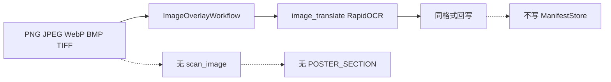

# 030e-fix 收束 + PLAN-030f 立项

## 现状结账（030e 落地后）

已闭环、不再作为缺口：
- LibreOffice nogui 已装（`/usr/bin/soffice` 26.2.5.2）；`OFFICE_CONVERTER` / `SLIDE_RENDERER` 探针绿；真实 `.doc` 转换测试已过。
- `QYUNSLATION_SAMPLE_ROOT` + verify 门 `BLOCKED`。
- schema 1.1.0、`translatable_blocks` / `output_evidence` 部分贯通、DOCX 单元格行列数。

仍须立项关闭（本计划只**实施**第一条，其余写入债表）：

| 缺口 | 处置 |
| --- | --- |
| 多节 DOCX 正文全部挂 `section:1` | **030e-fix 实施** |
| PDF 表格单元格级重建 | 另立项（不提前到 030f） |
| `QY030-PPT-001` | 030g |
| 跨格式对账 | 030g 之后 / 030h |
| `fast_fingerprint`、对象级 `source_geometry` | 预留，登记不实现 |
| 图片/Poster 无 scanner、无 `POSTER_SECTION` | **030f 子计划正文** |

## 第一部分：PLAN-030e-fix（批准后立即实施）

### 问题

[`canvases.py`](qyunslation/structure/canvases.py) 已按 `w:sectPr` 产出 `section:1`、`section:2`。[`scan_docx.py`](qyunslation/structure/scan_docx.py) 却固定 `canvas = prepared.canvases[0]`，所有 BODY/TABLE/TEXT_BOX 都挂第一节。

页眉页脚 walk 已带 `section:{n}/header.*`；**正文** walk 的 `container_ref` 一直是 `document.body`，没有节序号。

`review.docx` 夹具已有第二节（「Second section body in single flow.」），当前测试不断言 canvas 归属，所以绿。

### 做法

1. [`docx_walk.py`](qyunslation/structure/docx_walk.py)：`DocxWalkSegment` 增加 `section_index: int`（1-based）。遍历 `document.body` 子节点时，遇到含 `w:sectPr` 的段落视为当前节结束，后续升到下一节。页眉页脚继续用 `doc.sections` 下标。
2. [`scan_docx.py`](qyunslation/structure/scan_docx.py)：按 `section_index` 取 `prepared.canvases[i-1]`（越界记 `ManifestIssue`，不伪造 canvas）。`reading_order` 按画布分别填充。
3. 测试：`test_scan_docx.py` 断言第二节 BODY 的 `canvas_id == "section:2"`，且 `container_ref` 含节号；028/029/030c/030d/030e 门仍 PASS。
4. 文档：新增 [`PLAN-030e-fix-section-canvas.md`](docs/plans/PLAN-030-semantic-layout-translation/PLAN-030e-fix-section-canvas.md) + WT 短记；更新 [`WT-030e`](docs/walkthroughs/WT-030e-docx-vertical-closure.md) 遗留表（LibreOffice 标已关闭，多节标已关闭）。

非目标：不重做表格重建、不改 schema major、不改翻译写回逻辑。

## 第二部分：PLAN-030f 子计划起草（批准门，不实施）

父纲领下一门是 **图片与 Poster 纵向闭环**。现有能力与空白：

- **已有**：[`image_overlay_workflow.py`](qyunslation/workflow/image_overlay_workflow.py) + [`image_translate.py`](qyunslation/extensions/image_translate.py)（OCR/擦除/嵌字/QC）；030b 图片 Canvas（含 EXIF 旋转）；`ContentProfile.POSTER` 画像先验。
- **空白**：无 `scan_image.py`；从不产出 `POSTER_SECTION`；执行不消费 manifest；无超大画布分块与接缝断言；SVG/HEIF 仍靠探针拒绝。

030f 子计划文档将包含（写入 [`PLAN-030f-image-poster-closure.md`](docs/plans/PLAN-030-semantic-layout-translation/PLAN-030f-image-poster-closure.md)，**获批前不改代码**）：

### 建议任务（供批准）

- Task 1：`ImageStructureScanner` — 一页/一帧一个 Canvas（`PAGE`/`POSTER`），OCR 块建模为 `IMAGE` + `translatable_blocks`（bbox 必填）。
- Task 2：Poster 画像路由 — 超大或接近海报比例的画布标 `POSTER`，分区产出 `POSTER_SECTION`（空间阅读顺序，不伪造 Figure 编号）。
- Task 3：`ImageOverlayWorkflow` 消费 manifest 并回写 `execution_status` / `output_evidence`（`manifest=None` 走现有路径）。
- Task 4：硬格式矩阵 — PNG/JPEG/WebP/BMP/TIFF（含多页）保持方向、像素尺寸、长宽比、透明通道；非文字区损伤沿用现有 QC。
- Task 5：超大画布分块（重叠）+ 坐标回映 + 接缝检测；内存预算超限 fail-soft。
- Task 6：扩展格式 — SVG/HEIF/AVIF/GIF 探针：有解码器则走同一 scanner，否则上传前拒绝（不在本阶段新装解码器）。
- Task 7：`verify-plan-030f.sh` + WT-030f；结构套件仍只留 `QY030-PPT-001` xfail。

### 030f 非目标

PPT 嵌图（030g）、跨格式对账（030h）、PDF 单元格重建（另立项）、像素金样人工门（030i）。

## 实施顺序（本计划获批后）

1. 只实现 030e-fix（walk + scan + 测试 + 文档）。
2. 写出 030f 详细子计划并更新父纲领「下一批准门为 PLAN-030f」。
3. **停**：等用户单独批准 030f 后再实施图片/Poster 代码。
