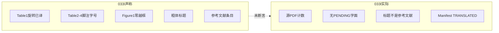

# PLAN-033m：终态证据与未关缺口收口

## 诊断（为什么 033 仍不能关）

033a–033f 只证明了**计数**和**BabelDOC 吃原稿**。033g–033l 补了 Manifest 契约、参考文献 PRESERVE 补丁、表格结构化/写出、图片 QC，并已合入 `origin/main`=`55ccbbb`。

真正的缺口不是「没写计划」，而是**用单元测试和子集总门代替了用户可感知的最终 PDF**：

- [plan033_final.py](qyunslation/structure/plan033_final.py) 的 `inspect_final()` 重扫**源 PDF** 的 Figure=2/Table=4，再看 execution Manifest 的 `TRANSLATED` 和标题是不是「参考文献」。它**不读** Table 1–4 单元格中文、脚注、旋转表、流程图越框、正文粗体、参考文献条目语言。
- 表格 `FONT_BELOW_TARGET` 完全不进 fail；Figure 硬失败码才 fail。
- 双语左侧 hash：左半页 vs **整页**原稿 pixmap，且第一页 mismatch 就 `break`，续页不查。
- GUI 后处理 [apply-pdf2zh-docimg.py](scripts/apply-pdf2zh-docimg.py) 把 `translate_pdf_tables` 包在 `except` 里打「表格写出跳过」，**任务仍成功**。
- `put_execution()` 不设 `extensions.terminal=true`，033g 的 PENDING 禁令只在测试里生效。
- `cap_body_gap` 在 [font_style.py](qyunslation/structure/font_style.py) 有函数、有单测，**没有 BabelDOC 补丁**。
- [scan_pdf.py](qyunslation/structure/scan_pdf.py) `in_references` 跨页 sticky，Appendix 后仍可能把正文标成条目。
- 11 页样本暂存在 `/tmp/plan033-staging/`，早于 `55ccbbb`（竖排字残影等后续提交），**不能当当前生产证据**。

锁定策略不变（参考文献整区 PRESERVE、表禁止整表栅格化、图禁止删末行、模型必须是泰州 `qwen3.6:35b-a3b`）。禁止改 `glossaries/auto-proper-nouns.csv`，禁止把 Elsevier PDF 入库。

## 工作方式

从 `origin/main` 开 `feat/PLAN-033m-final-evidence`。先取证再改算法。精确 `git add`。未要求不 push `main`。

## 033m-a：当前 HEAD 取证（先查，再决定改哪）

对锁定样本（`QYUNSLATION_PLAN033_SAMPLE`，SHA `c88ea9947…`）用 **当前 `55ccbbb` + 生产补丁** 重跑完整 GUI/CLI 管线（BabelDOC → imgtr → tbltr），产出新的 mono/dual + execution Manifest + `.imgtr.json`，目录与 HEAD 绑定（不要覆盖旧 `/tmp/plan033-staging` 当金样）。

逐页对照原始失败项，写成证据表（每条：页码、现象、责任层、是否仍复现）：

- Table 1 侧放整页：单元格是否中文可搜索、网格是否矢量、局部坐标是否错位
- Table 2–4：脚注是否入队/已译、角色字号、`FONT_BELOW` 是否可接受
- Figure 1 流程图：截断 / 越框 / 漏译 / DPI
- 正文：粗体标题 vs Regular；段距是否异常
- 参考文献：标题+条目是否仍英文；LLM spy 请求数
- `model_trace` 是否写入成功结果（GUI 与 CLI 各一条）
- 双语左侧是否真与原稿同内容（先核页面几何：并排是否 2× 宽）

没有这份表，禁止宣称「表格/图片已修好」。033l 在取证前允许继续 `BLOCKED`（缺当前 HEAD 产物），禁止用旧 staging 冒充 PASS。

## 033m-b：诚实总门 + 已知接线（与取证并行可做）

这些不依赖重跑就能修，修完后旧 staging 应立刻变红或 BLOCKED，这是预期。

1. **失败要失败**：`apply-pdf2zh-docimg.py` 的 tbltr `except` 改为写 `FAILED_HARD`、向 GUI 抛错或标任务失败；补测试：抛异常不得只 warning。
2. **终态契约落地**：`pdf_table_translate._persist` / `pdf_image_translate._persist` 写 `extensions.terminal=true`；`kind=execution` 时拒绝 PENDING（与 [PLAN-033g](docs/plans/PLAN-033-pdf-fidelity/PLAN-033g-execution-contract.md) 原文对齐）。
3. **GUI 任务级 model_trace**：在 pdf2zh 翻译入口 `bind_task_model_trace`，不要只靠后处理 env。
4. **扫描 Appendix 复位**：`scan_pdf` 页循环在 `is_section_break` 后把 `in_references=False`；与 [references.py](qyunslation/structure/references.py) 的 harvest 行为对齐。
5. **扩展 `inspect_final()`**（对**输出 PDF**，不是只扫源）：
   - Table 1–4：输出页可搜索中文表题/至少 N 个已译单元格；脚注块有中文或明确 PRESERVE
   - Table 1：旋转页局部框内有译文
   - Figure 1：从 `.imgtr.json` / output_evidence 断言无 `TRUNCATED`/`OVERFLOW`/`UNTRANSLATED`
   - 参考文献区：标题+条目无「参考文献」替换标题、抽检作者/DOI 仍在
   - 正文抽样：源粗体标题在译文侧 font flags/字体名仍粗
   - 双语：按实际 dual 几何比左半（或左页）与原稿，**每一页**都比，续页单独列
   - 产物必须带当前 HEAD 标记（env 或 sidecar）；缺则 `BLOCKED`
6. 表格 QC：`FONT_BELOW_TARGET` 仍按 033k 只警告，但 **OVERFLOW/UNTRANSLATED/TRUNCATED** 必须 fail（表和 图同一套 `HARD_FAIL`）。

改文件主路径：[plan033_final.py](qyunslation/structure/plan033_final.py)、[apply-pdf2zh-docimg.py](scripts/apply-pdf2zh-docimg.py)、[scan_pdf.py](qyunslation/structure/scan_pdf.py)、[model_trace.py](qyunslation/structure/model_trace.py)、[verify-plan-033l.sh](scripts/verify-plan-033l.sh)、新建 `tests/structure/test_plan033m_*.py`。

## 033m-c：按取证结果修残余缺陷

只修 033m-a 仍复现的项，禁止预写「可能要做」的大重构。预期候选（以取证为准）：

- **Table 1 旋转写出**：`table_writeback` / `TableLocalFrame` 与 dual `x_min_frac=0.5` 坐标系对齐；错位则先加合成旋转表+双语夹具再改写出。
- **表单元格字重**：`table_structure.py` 从 word 字体名/flags 填 `font_weight`，写出继承（033i 现默认 `regular`）。
- **Figure 1 越框**：role-aware fitter 安全扩展/整组缩小是否真走到；C3 流程图路径是否绕过 QC。
- **正文字重/段距**：若重跑仍掉粗或段距撑开，再把 `infer_bold`/`cap_body_gap` 补进 BabelDOC 排版（扩展 [apply-pdf2zh-fidelity-033h.py](scripts/apply-pdf2zh-fidelity-033h.py)），而不是再加一层扫描器字段。
- **参考文献条目**：若标题保住、条目仍被译，查 `process_page` 跨栏/续页漏网，补 LLM spy 到 033l（请求数=0）。

## 明确不做

- 重开 030h D1–D5、引入 Camelot、整表栅格化、改术语 CSV、样本入库
- 用合成夹具 PASS 代替 11 页终态
- 在取证完成前改 fitter/表格算法「碰运气」
- 双工作区漂移：以 `/home/dev/qyunslation` @ `origin/main` 为准；`033g` worktree 只读或弃用

## 验收（才能写 WT「033 关闭」）

- `verify-plan-033m.sh`：接线单测 + 诚实总门
- 当前 HEAD 的 11 页 mono/dual：`inspect_final()` 对上表内容探针 `fail=[]`，样本缺失则 `BLOCKED`（非零）
- `verify-plan-033.sh` 再跑一遍（会吃到更严的 033l/033m）
- 028 / 029 / 030e 回归（父计划已要求；030e 上次未收口）
- WT：记录新产物路径、HEAD、model_trace、逐条原始失败项复现/关闭、回滚命令

任一「单元绿、样本没重跑」不得标完成。
