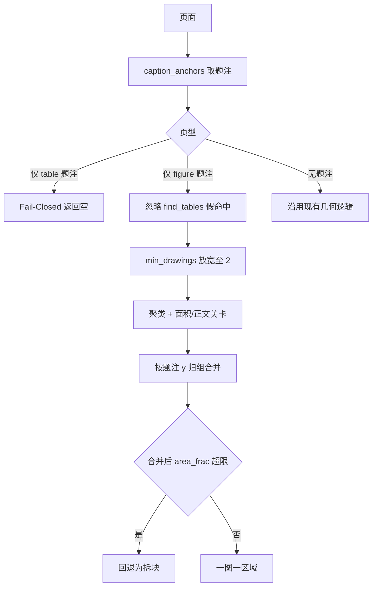

« # PLAN-030 题注驱动的图表检测口径

## 问题

UI 报「12 处矢量插图、26 处表格」，原文实际 7 图 3 表。计数偏差只是表象，底层是三类实质缺陷。

## 实测根因

样本 `41467_2024_Article_53384.pdf`（19 页，Figure 1-7，Table 1-3）：

- p3 Fig1 vec=4 / p4 Table1 vec=0 / p5 Table2 vec=1 / p6 Fig2 vec=0 / p7 Fig3 vec=0
- p8 Fig4 vec=2 / p9 Table3 vec=0 / p10 Fig5 vec=0 / p11 Fig6 vec=2 / p12 Fig7 vec=3

四类缺陷：

1. **表格被误 OCR 覆盖（最严重）**：p5 检出矢量区 `[37.7, 107.5, 563.3, 492.2]`，占页 43%，裁剪文字为 `Any TEAE 8 (80.0) 0 10 (62.5) 13 (76.5)...`，即 Table 2 完整安全性数据表。`find_tables` 在该页返回 0，表格避让失效，整表将被 OCR 重绘，数值失真风险直接落在临床数据上。
2. **多面板图漏译**：p8/p10/p11 上 `find_tables` 各误命中 7 个面板线框；p10 的 Figure 5 因此被完全避让，`vec=0`，整张图不翻译。26 = 3 真表 + 23 个图内线框。
3. **散点图整页跳过**：p6 有 546 个 drawings 但仅 7 个宽高≥8pt 的可用 rect，p7 仅 2 个，均低于 `MIN_DRAWINGS=8`，`find_safe_vector_figures` 直接 `return []`，Fig 2/3 漏检。
4. **一图多块**：Fig 1 拆 4 块、Fig 7 拆 3 块分别 OCR，跨面板图例与坐标轴上下文断裂。

`caption_anchors()` 判定完全准确（p5 返回 `('table', 2, y=48.35)`，p10 返回 `('figure', 5, y=631.3)`），可作为裁决几何命中的权威依据。

## 原型验证结果

已用内联原型验证四条规则的综合效果：

```
真实图数=7 真实表数=3
旧矢量区=12 新可译区=7
覆盖到的 Figure [1,2,3,4,5,6,7] -> 7/7
```

p4/p5/p9 全部 `table_page_blocked`（Table 2 误覆盖修复），Fig 2/3/5 从漏检转为可译。合并后区域最大 1957x2335px、`area_frac` 最大 0.56，均在 `VECTOR_MAX_PX=4000` 与 `MAX_AREA_FRAC=0.80` 内。

## 规则



- **规则 A 纯表页 Fail-Closed**：页上有 table 题注且无 figure 题注，直接返回空。修复 p5，同时保住 p4/p9。
- **规则 B 图页忽略假表**：页上有 figure 题注且无 table 题注，`tables=[]`。修复 p10。
- **规则 C 题注页放宽门槛**：仅当页上有 figure 题注时 `min_drawings` 降至 2。题注已证明该页有图。
- **规则 D 按题注归组**：期刊图注在图下方，对每个 figure 题注收集其上方 cluster 合并；超 `MAX_AREA_FRAC` 则回退拆块。

## 改动

### [pdf_figure_crop.py](/home/dev/qyunslation/scripts/pdf_figure_crop.py)

新增 `page_caption_profile(page)` 与 `find_figure_regions(page, exclude_rects=None)`，实现规则 A-D。

保留 `find_safe_vector_figures` 原签名与行为不变，供幻灯路径与无题注文档使用。

Hermes `caption_anchors` 的 import 必须 fail-safe：该模块由 pdf2zh GUI 直接调用，Hermes 不可用时降级到现有几何逻辑，不得抛错。

### [doc_image_prescan.py](/home/dev/qyunslation/scripts/doc_image_prescan.py)

`scan_pdf_tier3` 增加题注计数字段：`figure_caption_count`、`table_caption_count`、`translatable_count`。

表格数改用 `caption_anchors` 的 table 题注去重数（3），不再用 `table_rects` 几何数（26）。注意 `CAPTION_LINE` 直接扫全页文本会误命中出 `Table 12`，必须走 `caption_anchors` 的 block 级检测。

`format_tier3_summary` 文案改为分开报图数与可译数：

> 共 7 张插图，其中 7 张将 OCR 嵌字翻译；另有 3 处表格，按文字层翻译。

### [pdf_image_translate.py](/home/dev/qyunslation/scripts/pdf_image_translate.py)

策略 B 非幻灯页改调 `find_figure_regions`；幻灯页维持 PLAN-029b 的 profile 分支不变。

### 验收脚本

[verify-plan-028.sh](/home/dev/qyunslation/scripts/verify-plan-028.sh) 现有断言 `vector_count == 12` 与 `table_count >= 19` 会失败，需按新口径改为 7 与 3，并注明口径变更来源。

[verify-plan-029.sh](/home/dev/qyunslation/scripts/verify-plan-029.sh) 的 `journal vector still 12` 同理更新。

新增 [verify-plan-030.sh](/home/dev/qyunslation/scripts/verify-plan-030.sh) 断言：

- 图题注 7、表题注 3
- 可译区域 7，Figure 1-7 全覆盖
- p4/p5/p9 返回空（表格零覆盖回归，防 Table 2 再被 OCR）
- 幻灯样本仍为 12（PLAN-029b 零回归）
- Hermes 不可用时降级不抛错

## 质量红线

- 纯表页 Fail-Closed，宁可漏译插图也不覆盖表格
- 幻灯路径 `min_drawings` 维持 `SLIDE_MIN_DRAWINGS=6`；实测降到 2 会让幻灯区域从 12 涨到 19，破坏 029b 标定
- 合并后 `area_frac` 硬上限保留，绝不整页覆盖
- Hermes import 失败降级，不阻断插图翻译

## 不做

- 位图路径（策略 A）的题注归组
- 跨页图合并
- 无题注文档（幻灯、扫描件）的检测口径调整 »