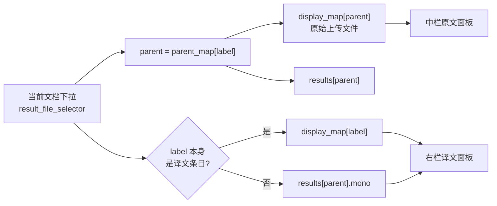

# PLAN-017 双预览 2:4:4 布局与进度槽位

## 设计要点

三栏等高锁一屏，中右两栏是一对**可对读的等高面板**（同基线、同 1px #e2e8f0 描边、10px 圆角），这是双语审阅界面的核心：原文与译文必须在同一水平线上，眼睛不需要重新定位。

- 左栏 scale=2：上传 + 语言 + 文档类型 + 高级选项 + 翻译/取消 + 下载区
- 中栏 scale=4：标题「原文」+「当前文档」下拉 + 原文预览面板
- 右栏 scale=4：标题「译文」+ 译文预览面板 + **进度槽位**
- 底部：横跨中+右两栏的居中细条（logo + `Qyunslation · 荃信生物 © 2026`）

进度不再覆盖预览。当前 `show_progress_on=[preview, preview_html]`（[gui.py:8167](/home/dev/.local/share/uv/tools/pdf2zh-next/lib/python3.12/site-packages/pdf2zh_next/gui.py)）会把进度盖在预览面板上，改为绑定到译文栏下方一个固定 40px 的 `qy_progress_slot`，翻译时进度条与阶段文案在预览下方稳定显示，预览内容不被遮挡。

## 单选择器驱动双栏

`state` 已有现成的映射关系，无需新数据结构（[gui.py:5521-5522](/home/dev/.local/share/uv/tools/pdf2zh-next/lib/python3.12/site-packages/pdf2zh_next/gui.py)、[gui.py:5455-5464](/home/dev/.local/share/uv/tools/pdf2zh-next/lib/python3.12/site-packages/pdf2zh_next/gui.py)）：



两栏都复用已有的 `_qy_preview_payload(path)`（[gui.py:5339](/home/dev/.local/share/uv/tools/pdf2zh-next/lib/python3.12/site-packages/pdf2zh_next/gui.py)），它已能处理 PDF 走 `PDF()`、DOCX 走 mammoth、Markdown 与图片走 HTML。原文侧 DOCX 预览可直接用本地 `_qy_docx_to_html`，无需等 sidecar。

## 实现

新增幂等补丁 `scripts/apply-pdf2zh-dual-preview.py`，追加为 `scripts/pdf2zh.service` 的**最后一个** `ExecStartPre`（在 `apply-pdf2zh-settings-inline.py` 之后）。

1. **三栏骨架**：左栏 `scale=1` → `scale=2`；在现有右栏（[gui.py:6847](/home/dev/.local/share/uv/tools/pdf2zh-next/lib/python3.12/site-packages/pdf2zh_next/gui.py)）之前插入中栏 `gr.Column(scale=4, elem_classes=["qy-col-mid"])`；右栏 `scale=2` → `scale=4`，`## Preview` 改为 `## 译文`。

2. **搬迁与新建组件**：`result_file_selector` 定义从右栏移到中栏顶部（label 改「当前文档」）；中栏新建 `preview_src = PDF(...)` 与 `preview_src_html = gr.HTML(...)`；右栏在 `preview_html` 之后新建 `qy_progress_slot = gr.HTML(elem_classes=["qy-progress-slot"])`。

3. **双栏联动处理函数**（新增，不改 `update_preview` 本体，避免与 office-preview 补丁冲突）：

```python
def _qy_dual_payload(selected_label, state):
    """返回 (src_pdf, src_html, dst_pdf, dst_html)。"""
    st = state or {}
    dm, pm = st.get("display_map", {}), st.get("parent_map", {})
    parent = pm.get(selected_label, selected_label)
    src = dm.get(parent)
    dst = dm.get(selected_label) if selected_label != parent else (
        (st.get("results", {}).get(parent) or {}).get("mono")
    )
    return (*_qy_preview_payload(src), *_qy_preview_payload(dst))
```

4. **重绑事件**：`result_file_selector.change`（[gui.py:8234](/home/dev/.local/share/uv/tools/pdf2zh-next/lib/python3.12/site-packages/pdf2zh_next/gui.py)）的 handler 包一层，额外输出 `preview_src` / `preview_src_html`；`_qy_refresh_office_preview`（[gui.py:8186](/home/dev/.local/share/uv/tools/pdf2zh-next/lib/python3.12/site-packages/pdf2zh_next/gui.py)）改用 `_qy_dual_payload` 并扩到四个输出；`file_input.upload` 追加一次中栏刷新，使上传后立即显示原文；`file_input.clear` 清空两栏。

5. **去掉截图 1 与 2**：删除 `gr.Markdown(_("## File(s)"), elem_classes=["tab-title"])`（[gui.py:6671](/home/dev/.local/share/uv/tools/pdf2zh-next/lib/python3.12/site-packages/pdf2zh_next/gui.py)），并给 `file_input` 加 `show_label=False`；侧栏两个按钮已 `visible=False` 且 CSS 隐藏，本次把 `.sidebar-nav` 的 `display:none` 提到新 CSS 块并浏览器复核确实不占位。

6. **页脚改行内**：主 Row 之后新增一行 `spacer(scale=2) + footer(scale=8)`，footer 内放 logo 与版权并居中；同时把品牌 HTML 里的固定通栏 `.qy-page-footer` 隐藏，`--qy-footer-h` 归零，避免双份。

7. **CSS**（独立 marker 块 `/* _qy_dual_preview_css */`，不动 office-preview 维护的块）：三栏等高与内部滚动、两个面板统一描边圆角、两栏各自的空态文案（中栏「上传文件后在此预览原文」、右栏「翻译完成后在此显示译文」）、`.qy-progress-slot` 固定高度与居中、行内页脚样式。

## 验收

- `scripts/verify-plan-017.sh`：断言三栏 `scale=2/4/4` 与 `qy-col-mid` 存在、`preview_src` 与 `qy_progress_slot` 各定义一次、`show_progress_on=[qy_progress_slot]`、`## File(s)` 标题已移除、`_qy_dual_payload` 存在、补丁幂等、`py_compile` 通过、服务 active。
- `docs/walkthroughs/WT-017-dual-preview.md`：上传 PDF 后中栏立即出原文；点翻译时进度在右栏预览下方走动且不遮挡；完成后右栏出译文、中栏仍是原文；切换「当前文档」两栏同步；DOCX 与图片同样可双栏预览；页面无外层滚动条，页脚居中于中+右区域。
- 交付：feat 分支 → verify → 精确 commit → no-ff merge main → 推 qyunslation 远程 → `systemctl --user restart pdf2zh` → 浏览器复核。
