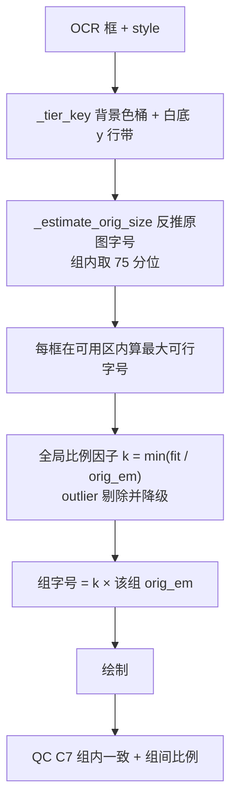

# PLAN-024 全屏预览裁切修复与字号层级统一

## 根因

**R1 全屏克隆嵌套导致图片被裁。** [apply-pdf2zh-viewer.py](scripts/apply-pdf2zh-viewer.py) 的 `openFullscreen` 把整个 `.qy-viewer-inner` 克隆后又塞进一个新的 `.qy-viewer-inner`：

```218:229:scripts/apply-pdf2zh-viewer.py
      var cloneRoot = sourcePanel.querySelector('.qy-viewer-inner') || sourcePanel;
      var clone = cloneRoot.cloneNode(true);
      ...
      inner.appendChild(clone);
```

CSS 里 `.qy-viewer-inner img { max-height: 100% }` 的百分比要求父级有**确定高度**，而中间这层 `.qy-viewer-inner` 只有 `max-height` 没有 `height`，高度是 auto，百分比退化为 `none`。图片只剩 `max-width: 100%` 生效，按宽度铺满后高度撑出视口，被 `overflow: hidden` 裁掉底部——即访视轴与分层因素消失。

**R2 字号逐框独立二分，没有层级归一。** `translate_image` 对每个框单独调 `_fit_font_and_lines`，同一个蓝色矩形里的两行、同一组脚注的标题与条目，各自算各自的字号，结果同级不同大。

**R3 层级不能用墨迹高度判定。** 实测底部脚注组原始墨迹高 43–54（26% 跨度），但这是字形差异：`·IGA 3 vs. IGA 4` 是拉丁无下缘只有 43，`·既往是否接受过AD生物制剂治疗` 是汉字满格 54，原图两者同大。蓝框内 `W2, W4, W12, 300mg`（有 `g` 下缘）63 对 `QX027N:W0,W2,W4,W8,`（无下缘且框裁得紧）42。直接按墨迹高分档会把字形差异误判成层级差异。

**R4 OCR 框裁切松紧不一，反推字号会系统性偏小。** 用同一段原文在候选字号下渲染、反推墨迹高相符的字号，可抵消字形差异（脚注组收敛到 54–56）。但框裁得紧的框仍偏低（`QX027N:W0,W2,W4,W8,` 框高仅 56px，反推 44 而同级其他框 59–63）。裁切只会让墨迹偏小，不会偏大。

## 流程



## 改动清单

### 1. [scripts/apply-pdf2zh-viewer.py](scripts/apply-pdf2zh-viewer.py)

- `openFullscreen`：克隆后若根节点自身带 `qy-viewer-inner`，把它的子节点搬进新 `inner`，不再嵌套。canvas 位图重绘仍在搬移前完成。
- CSS 给 `.qy-viewer-inner` 补 `height: 100%` 与 flex 居中，让媒体元素的 `max-height: 100%` 有确定父高可解析；媒体补 `width: auto; height: auto`。
- 全屏再加一道确定值兜底：`.qy-viewer-fs-viewport img, .qy-viewer-fs-viewport canvas { max-height: calc(100vh - 72px); }`，不依赖百分比链。
- HTML 类预览（`.prose` / `.markdown`）不套用上述 `max-height`，保持可滚动。

### 2. [qyunslation/extensions/image_translate.py](qyunslation/extensions/image_translate.py) — 层级划分

新增 `_tier_key(box, style, all_boxes)`：

- 背景色量化到 24 级作主键。非白色桶各自成组——蓝色矩形 8 个文本块归一组，两个 EASI-50 归一组，灰色安慰剂、绿色 1:1:1:1、浅灰 N=200 各自成组。
- 白底桶按框中心 y 排序，相邻间距超过 `max(1.5 × 框高中位数, 80px)` 处断开。实测切出三带：顶部期标题与周数 8 个、访视轴 W/V 标签 32 个、底部脚注 7 个。顶部两者按确认合并为一档。

### 3. `image_translate.py` — 原图字号与比例

- 新增 `_estimate_orig_size(text, ink_h, font_path, bold)`：二分候选字号，取渲染墨迹高不超过实测值的最大字号。
- 组的 `orig_em` = 组内成员估计值的**75 分位**（应对 R4 的单侧偏小）。
- 每框在其 `_available_box` 内算最大可行字号 `fit_i`（允许换行）。
- 全局比例因子 `k = min(fit_i / orig_em[tier_i])`，剔除 outlier：某框比值低于组内中位比值 0.6 倍时不参与 `k` 计算，该框单独用自己的 `fit_i` 并记 QC 警告，避免一条超长译文拖垮全图。
- 组字号 `= round(k × orig_em[tier])`，组内所有成员统一使用；组间比例因此严格等于原图比例。
- 粗细按组内多数决统一，修掉 `·IGA 3 vs. IGA 4` 是常规而同组 `·Prior treatment...` 是粗体的不一致。

### 4. `image_translate.py` — QC

`_qc_report` 增加：

- C7a 组内一致：每组非 outlier 成员字号必须完全相同
- C7b 组间比例：各组 `size / orig_em` 的比值偏差不超过 2%
- outlier 计入 `warnings`，并在 `.qc.json` 里输出每组的 `orig_em`、`size`、成员数

### 5. Skill SK-Q002

`SKILL.md` 补铁律：

- 层级按「背景色桶 + 白底 y 行带」判定，禁止用墨迹高度直接分档
- 原图标称字号用「同一原文反推渲染墨迹高」，不要用固定的 CJK/拉丁系数
- 组的原图字号取组内 75 分位，不取中位数（OCR 框裁切只会让墨迹单侧偏小）
- 组内字号必须统一，组间保持原图比例；outlier 单独降级并告警，不得拖垮全局 `k`
- 全屏克隆禁止嵌套 `.qy-viewer-inner`；百分比 `max-height` 需要父级确定高度

`pitfalls.md` 补两条现象（全屏裁掉底部、同级字号不一）与定位手法（逐框打印 `ink / est_size / tier`、原图与译图同区域裁剪对比）。

### 6. 验收与交付

- 新增 `scripts/verify-plan-024.sh`：断言 `_tier_key`、`_estimate_orig_size`、`_assign_tier_sizes`、viewer 无嵌套克隆与全屏 `max-height`；参考图端到端要求蓝框 8 个字号全等、底部脚注 7 个字号全等、各组 `size / orig_em` 偏差 ≤ 2%、QC 全绿；回归 017–023。
- 浏览器实测：点开大图能看到完整的访视轴与分层因素；蓝框内两行同字号；底部脚注同字号。
- `docs/plans/PLAN-024-font-tiers/PLAN-024-font-tiers.md` 与 `docs/walkthroughs/WT-024-font-tiers.md`，精确 commit，`--no-ff` 合入 main，推 `mirror` 与 `qyunslation`，重启 `pdf2zh.service` 与 `qyunslation-office.service`，`registry.md` 补审计行。

## 风险

保持组间比例意味着全图共用一个 `k`，任何一个框放不下都会拉低整体字号。outlier 剔除是主要防线，阈值（0.6 倍中位比值）走环境变量便于按图调。若某张图层级本身混乱、行带聚类切得过碎，会退化为接近现状的逐组独立行为，属于安全退化。