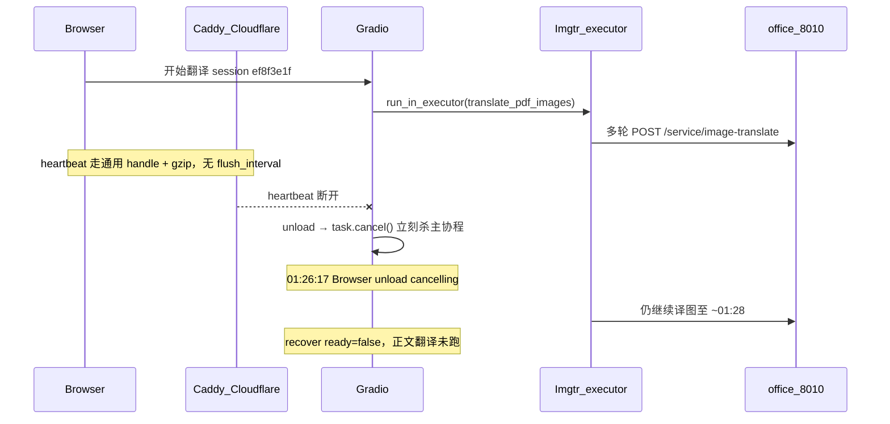

# 修复 heartbeat 误杀翻译任务

## 排查结论（本次不是空白页旧 bug）

服务本身活着：`pdf2zh` / office sidecar 均 active，本机与公网首页 HTTP 200，`/qy/recover-by-stem` 可用。

今晚 01:25–01:28 同一篇 `41467_2024_Article_53384.pdf` 的时间线：



**根因链（两环叠加）**

1. **Caddy 漏配 heartbeat**  
   [`Caddyfile-production-public`](/home/dev/qyunsgen/config/Caddyfile-production-public) 里 `@gradio_sse` 只有 `/gradio_api/queue/data` 与 `/queue/data`，**没有** `/gradio_api/heartbeat/*`。heartbeat 走 `encode gzip` 且无 `flush_interval -1`。实测：本机直连能立刻收到 `data: ALIVE`，经公网 12s 探针几乎收不到 body（缓冲/代理行为）。Gradio 5.35 在 heartbeat 断开时会跑 `demo.unload`（见 `gradio/routes.py` ~1163–1210）。

2. **unload 立刻 cancel**  
   PLAN-003c 补丁 [`apply-pdf2zh-throughput.py`](/home/dev/qyunslation/scripts/apply-pdf2zh-throughput.py) 注入的 `_cancel_active_translation_on_unload` 一断连就 `task.cancel()`。刷新、手机切后台、CF/代理抖一下都会误杀。取消后 `run_in_executor` 里的插图翻译**不会**跟着停（无 cancel 令牌），所以日志里仍有多轮 sidecar 200，但主任务已 cancelled，`.qy-recover.json` 停在 `ready: false`。

此前修的「空白页 JS `\n` 转义」与「插图 `run_in_executor`」仍有效；本次是**新的误杀路径**。

## 修复方案（按你的选择）

### A. unload 宽限期（主修）

改 [`scripts/apply-pdf2zh-throughput.py`](/home/dev/qyunslation/scripts/apply-pdf2zh-throughput.py)（及运行中 `gui.py` 对应块），把立刻 cancel 换成延迟取消：

- 全局增加 `_UNLOAD_CANCEL_HANDLE: asyncio.TimerHandle | None`（或 `asyncio.create_task` + sleep）。
- `_cancel_active_translation_on_unload`：只 schedule **90s** 后 cancel；若已有 pending handle 则重置；日志写 `scheduling cancel in 90s`。
- 翻译任务启动处（现有 `_ACTIVE_TRANSLATION_TASK = task`）：若同进程仍有 pending unload cancel，**先 cancel 该 timer**（视为重连/同页恢复）。
- 真正 cancel 时再打 `Browser unload grace expired: cancelling`。
- 用户点「取消」按钮的 `stop_translate_file` **保持立刻 cancel**（显式意图不变）。

可选加固（小改，建议顺手做）：[`apply-pdf2zh-docimg.py`](/home/dev/qyunslation/scripts/apply-pdf2zh-docimg.py) 的 wait 循环里，若 `asyncio.current_task().cancelled()` / `CancelledError`，对 executor future 调 `cancel()`（线程内 HTTP 可能仍跑完当前图，但不继续等/不进正文）。插图侧暂不强制加 abort 令牌，避免扩 scope。

### B. Caddy 把 heartbeat 纳入 SSE 直冲

改 [`/home/dev/qyunsgen/config/Caddyfile-production-public`](/home/dev/qyunsgen/config/Caddyfile-production-public)：

```caddy
@gradio_sse path /gradio_api/queue/data /queue/data /gradio_api/heartbeat/*
```

该 `handle` 已有 `flush_interval -1`、无 gzip。生效方式：`docker exec qyunsgen-caddy caddy reload --config /etc/caddy/Caddyfile`（挂载已指向该文件；**不用 restart**）。

### C. 验证

- 公网：`curl -N` 拉 `/gradio_api/heartbeat/<id>`，应在 ~15s 内看到 `data: ALIVE`（对比今日 12s 空 body）。
- 日志：人为断开后应先见 `scheduling cancel in 90s`，90s 内刷新/重连则不应出现 `grace expired`；显式取消仍立即停。
- 回归：跑/扩展 [`verify-plan-003.sh`](/home/dev/qyunslation/scripts/verify-plan-003.sh) 或小脚本断言 grace 文案与 Caddy path 含 heartbeat。
- 重跑补丁后 `systemctl --user restart pdf2zh`（仅 pdf2zh，不动 Caddy 容器）。

## 明确不改

- 不改 PLAN 文件本身以外的无关业务逻辑；recover API / stale-guard JS 保持现状。
- 不为插图流水线做完整协作式 abort（本轮只防误杀 + 代理直冲）。
- 不对 Cloudflare 做配置变更（先靠 Caddy + grace 兜住）。
