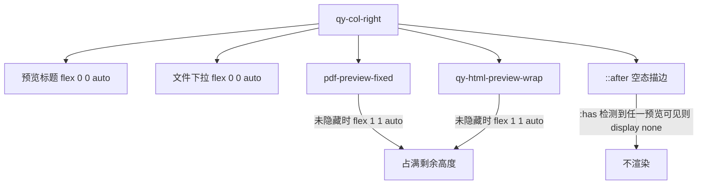

# PLAN-015b 布局收敛与空态、版权条

## 根因（已在浏览器实测）

PLAN-015 的一屏锁定用力过猛，三处副作用叠加成了满屏灰块：

- **灰底来源**：`gr.Group`（`tab_main`）的面板色 `rgb(228,228,231)`。它本来只包住内容，被 `height: 100%` 撑到 974px，于是整屏变灰。
- **左栏被撑开**：Gradio 给列内每个 block 的默认值是 `flex: 1 0 auto`。列一旦 `height: 100%`，这些 block 就全部按比例长高——Type 单选 169px、上传区 229px（内层 dropzone 其实只有 140px）、语言行 174px、按钮行 131px。
- **右栏最严重**：这条规则命中了所有直接子元素，连 Gradio 标了 `.hidden` 的组件都被强制成 flex 空盒：

```780:787:/home/dev/qyunslation/scripts/apply-pdf2zh-office-preview.py
    .qy-col-right > .styler,
    .qy-col-right > div {
        flex: 1 1 auto !important;
        min-height: 0 !important;
        display: flex !important;
        flex-direction: column !important;
        height: 100% !important;
    }
```

实测右栏子元素高度：标题 974px、隐藏的下拉表单 974px、`.pdf-preview-fixed.hidden` 595px、`.qy-html-preview-wrap.hidden` 379px——全是空的。

## 改动

仍然只改幂等补丁脚本 [scripts/apply-pdf2zh-office-preview.py](scripts/apply-pdf2zh-office-preview.py)，由 `pdf2zh.service` 的 `ExecStartPre` 重放。整块 PLAN-015 CSS 用现有的正则升级路径替换，判据换成 `--qy-footer-h`。

### 1. 去掉主页 Group 的灰面板

```
.tab-main-row .gr-group:not(.settings-container),
.tab-main-row .gr-group:not(.settings-container) > .styler {
    background: transparent !important;
    border: none !important;
    box-shadow: none !important;
}
```

设置页 `.settings-container` 保留原有面板样式，不受影响。

### 2. 左栏回归自然高度

- `.qy-col-left` 改 `display: flex; flex-direction: column; justify-content: flex-start; gap: 12px`
- `.qy-col-left > * { flex: 0 0 auto !important; }` — 这一条是关键，取消 Gradio 的 `flex: 1 0 auto` 撑高
- 上传区收到合理尺寸：`.input-file .wrap { min-height: 132px !important; }`，`.input-file button.center { height: auto !important; }`，整块落在约 170px

### 3. 右栏：只有预览面能长高，空态走细描边

删掉上面那条 `> div` 通配规则，换成精确目标：

```
.qy-col-right > * { flex: 0 0 auto !important; }
.qy-col-right > .pdf-preview-fixed:not(.hidden),
.qy-col-right > .qy-html-preview-wrap:not(.hidden) {
    flex: 1 1 auto !important;
    min-height: 0 !important;
}
```

空态用伪元素，不新增 Python 组件：

```
.qy-col-right::after {
    content: "上传文件后在此预览";
    flex: 1 1 auto;
    display: flex;
    align-items: center;
    justify-content: center;
    border: 1px solid #e2e8f0;
    border-radius: 10px;
    background: transparent;
    color: #94a3b8;
}
.qy-col-right:has(> .pdf-preview-fixed:not(.hidden))::after,
.qy-col-right:has(> .qy-html-preview-wrap:not(.hidden))::after {
    display: none !important;
}
```

取舍：伪元素文案写死中文，不走 `_()` 国际化。当前 UI 默认 `--ui-lang zh`，且改成真组件需要接进 `update_preview` 的输出元组（8 个返回值全线改），不成比例。



### 4. 底部版权通栏

复用顶部品牌那个 `gr.HTML`，在同一字符串里追加一个固定定位的页脚 div，避免去找 Row 的闭合锚点：

```5948:5948:/home/dev/.local/share/uv/tools/pdf2zh-next/lib/python3.12/site-packages/pdf2zh_next/gui.py
            '<div class="qy-brand"><div><strong>Qyunslation</strong><span>荃信翻译</span></div></div>'
```

追加：`<div class="qy-page-footer"><span>Qyunslation · 荃信生物 © 2026</span></div>`，幂等判据 `qy-page-footer`。

CSS：`position: fixed; left/right: 0; bottom: 0; height: 34px;` 居中、`border-top: 1px solid #eef2f7`、白底、`z-index: 40`，logo 高 16px。

同时把一屏高度预留出页脚：`:root { --qy-footer-h: 34px; }`，`.tab-main-row { height: calc(100vh - var(--qy-shell-top) - var(--qy-footer-h)) !important; }`。

### 5. 栏间距

`.qy-main-inner-row { gap: 20px; padding: 0 20px 8px 4px; }`（原先 `.tab-main-row > .gr-column:last-of-type` 那套 padding 用的是旧版 `.gr-column` 类名，在当前 Gradio 5.35 下已失效）。

## 验证

- [scripts/verify-plan-015.sh](scripts/verify-plan-015.sh) 追加断言：含 `qy-page-footer`、`--qy-footer-h`、`qy-col-right::after`；且**不再**含 `.qy-col-right > div {` 通配规则。
- 浏览器量测：右栏子元素高度不再出现 974/595/379 的空盒；左栏 Type 约 62px、上传区约 170px；`.qy-page-footer` 可见且 `.tab-main-row` 底边不压页脚；页面仍无外层滚动。
- 更新 [docs/walkthroughs/WT-015-progress-fullscreen.md](docs/walkthroughs/WT-015-progress-fullscreen.md)，新增子计划 `docs/plans/PLAN-015-progress-fullscreen/PLAN-015b-layout-polish.md`。
- 回归：设置页仍可内滚且保留面板底色；上传 docx 后预览填满且进度可见。
- 部署：精确 commit、no-ff merge main、推远程、`systemctl --user restart pdf2zh`。

## 不做

- 不改 Gradio 主题 token，不引入外部 CSS 框架。
- 不动 PLAN-015 已完成的进度双绑定逻辑。
- 空态文案不做国际化。