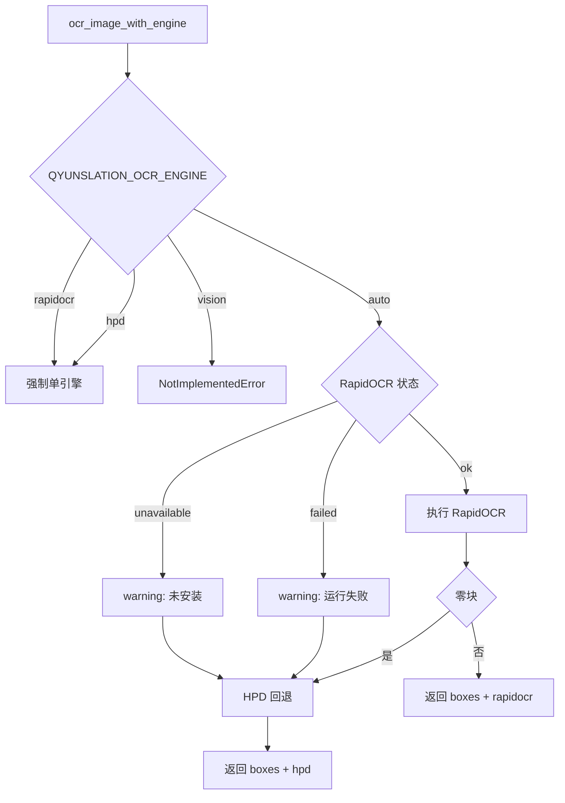

# PLAN-027f: OCR 引擎可观测性与依赖转正

## 背景

PLAN-027 上线后暴露的两个 bug 同源：**失败被静默吸收**。审计 [qyunslation/extensions/image_translate.py](qyunslation/extensions/image_translate.py) 后还发现一个更隐蔽的问题。

- 代码写的是 `from rapidocr import RapidOCR`（3.x API），但 [pyproject.toml](pyproject.toml) 第 28 行声明的是 `rapidocr-onnxruntime>=1.4.4`（1.x API，无人 import）
- 真正在跑的 `rapidocr 3.6.0` 是 **docling 2.75.0 的传递依赖**
- 一旦 docling 被移除或降级，`ocr_image` 会静默退到 HPD，实测同图从 43 块掉到 0 块，且不报任何错

HPD 边界也需要写清楚：它不是本地 OCR，而是远程 `/parse` 版面解析（`QYUNSLATION_HPD_BASE_URL`），对流程图会把整图标成一个 `<BLOCK>image`，适合扫描件整页而非设计图。

本机无 GPU、Ollama 仅有纯文本 `qwen3.8:27b`，因此 Vision 只留接口位，不接真实实现。

## 一、依赖转正

- [pyproject.toml](pyproject.toml)：`rapidocr-onnxruntime>=1.4.4` 改为 `rapidocr>=3.6.0`，让声明与 import 一致
- 重新 `uv lock`，校验 docling 未被降级、`rapidocr` 仍解析到 3.6.0
- 这是本计划唯一有依赖解析风险的步骤，落地后立刻用现有文档跑一次 `probe_image` 对比块数（应仍为 43/59）

## 二、引擎注册表与能力探测

改造 [qyunslation/extensions/image_translate.py](qyunslation/extensions/image_translate.py) 第 190-241 行：

- 新增 `ocr_engine_status() -> dict`，区分三种状态而非一律吞掉：
  - `unavailable`：`ImportError`，即根本没装
  - `failed`：装了但运行抛错
  - `ok`：正常
- 引擎注册表与显式开关 `QYUNSLATION_OCR_ENGINE`，取值 `auto`（默认）| `rapidocr` | `hpd` | `vision`

```python
_OCR_BACKENDS = {
    "rapidocr": ocr_image_rapid,
    "hpd": ocr_image_hpd,
    "vision": ocr_image_vision,  # 接口位
}

def ocr_image_with_engine(img_path) -> tuple[list, str]:
    """返回 (boxes, engine_actually_used)。"""
```

- `ocr_image()` 保留原签名做包装，不破坏 [docx_image_overlay.py](qyunslation/extensions/docx_image_overlay.py)、[pdf_image_translate.py](scripts/pdf_image_translate.py) 等 10 处调用方
- `ocr_image_vision` 只留 stub 与接入契约注释：DeepSeek grounding 返回 `<|det|>[[x1,y1,x2,y2]]` 是 0-999 归一化，需 `x * w / 999` 换算；未实现时直接抛 `NotImplementedError`，绝不静默返回空列表
- **默认回退行为不变**（RapidOCR 零块仍尝试 HPD），避免 PLAN-026 基线回归；改变的只是"降级这件事从此可见"

## 三、探针与启动自检暴露引擎

- `probe_image()`（第 1526 行）返回值增加 `ocr_engine` 字段
- [qyunslation/custom_api.py](qyunslation/custom_api.py) 的 `/service/image-probe` 透传该字段；错误分支也带上，便于定位是"没文字"还是"没引擎"
- [qyunslation/app.py](qyunslation/app.py) 第 113 行 lifespan 内，启动时打印一次能力矩阵：

```python
logger.info("OCR capability: %s", ocr_engine_status())
```

## 四、防回归断言

在 [scripts/verify-plan-027.sh](scripts/verify-plan-027.sh) 追加，其中基线块数断言是核心：

- 依赖一致性：`pyproject.toml` 声明的包名与代码 import 名一致，且不再含死依赖 `rapidocr-onnxruntime`
- `ocr_engine_status()` 能区分 unavailable / failed / ok
- `probe_image` 与 `/service/image-probe` 响应含 `ocr_engine`
- `ocr_image_vision` 未实现时抛 `NotImplementedError` 而非返回空
- **基线块数**：脚本内用 PIL 合成一张含约 12 个中文标签的确定性图（避免依赖 `/tmp/gradio` 这类易失路径），断言 `engine == "rapidocr"` 且检出块数达标。引擎一旦悄悄降级，这条会立刻红

## 五、文档与沉淀

- 新增 [docs/plans/PLAN-027-doc-image-translation/PLAN-027f-ocr-engine-observability.md](docs/plans/PLAN-027-doc-image-translation/PLAN-027f-ocr-engine-observability.md)，体例对齐 027a-e，并把已上线的预览 `flex-wrap` 与跨 venv OCR 门控两处修正归档进设计说明
- 纲领 [PLAN-027-doc-image-translation.md](docs/plans/PLAN-027-doc-image-translation/PLAN-027-doc-image-translation.md) 子计划索引补 027f
- SK-Q002 [.cursor/skills/image-overlay-translation/SKILL.md](.cursor/skills/image-overlay-translation/SKILL.md) 增铁律：依赖声明必须与 import 名一致；跨 venv 能力必须显式判定；HPD 仅限扫描件整页
- pitfalls 记录"docling 传递依赖撑着主链路"这一条
- [docs/walkthroughs/WT-027-doc-image-translation.md](docs/walkthroughs/WT-027-doc-image-translation.md) 补 027f 段

## 六、交付

按项目规范：`feat/plan-027f-*` 分支 → verify 全绿 → no-ff 合 main → 推 `qyunslation` 与 `mirror` → 重启两个服务 → 回填部署哈希 → 清理已合并分支。

## 引擎决策流

