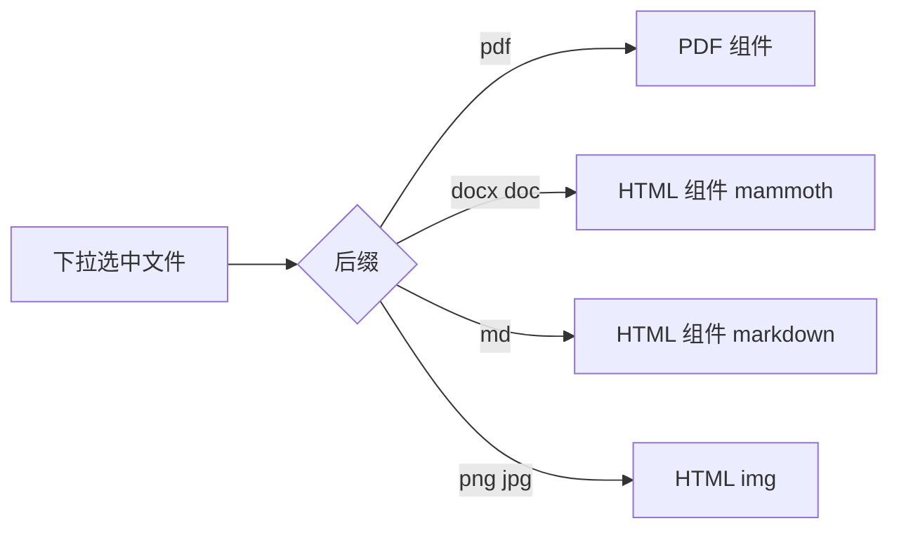

# PLAN-014 Office/DOCX 预览

## 原因

右侧预览是 Gradio `PDF()`（[gui.py](/home/dev/.local/share/uv/tools/pdf2zh-next/lib/python3.12/site-packages/pdf2zh_next/gui.py) 约 L4379），只能渲染 PDF。

Word 走 sidecar `:8010`（[apply-pdf2zh-office-route.py](/home/dev/qyunslation/scripts/apply-pdf2zh-office-route.py)），完成后把 `.docx` 当作 `mono` 写进 `display_map`。下拉选中 `Meeting questions_19May2026_mono.docx` 时，PDF 组件收到非 PDF，页面控件还在（`1 / 1`），内容区空白。上传未译的 docx 同样如此。

PDF 预览不受影响。

## 做法

不改 `translate_files` 的返回元组长度（事件绑定太多）。新增 `preview_html = gr.HTML`，与 `PDF()` 互斥显示：

1. 扩展 [scripts/apply-pdf2zh-office-route.py](/home/dev/qyunslation/scripts/apply-pdf2zh-office-route.py)（或新补丁 `apply-pdf2zh-office-preview.py`，挂到 `pdf2zh.service` ExecStartPre）：
   - `_qy_preview_payload(path)`：`.pdf` → `(pdf_path, "")`；`.docx/.doc` → mammoth HTML（sidecar 已有 [docx2html_exporter.py](/home/dev/qyunslation/qyunslation/exporter/docx/docx2html_exporter.py)）；`.md` → 轻量 HTML；图片 → ``
   - 在预览区 `preview = PDF(...)` 后插入 `preview_html = gr.HTML(...)`，加固定高度 CSS，避免再出现大块空白
   - 改 `update_preview`：非 PDF 时 `preview` 置 `None` 并 `visible=False`，把 HTML 交给 `preview_html`
   - 给 `result_file_selector.change` / `translate_btn` 的 outputs 各加一项 `preview_html`（`translate_files` 中间 yield 用 `gr.update()` 占位，译完再填）

2. sidecar 已导出 `html`（`core.py` `_build_export_map`），office-route 可顺带下载 `html` 作为预览源；没有则本地 mammoth。

3. 验收：[scripts/verify-plan-014.sh](/home/dev/qyunslation/scripts/verify-plan-014.sh) 断言补丁幂等、mammoth 能从样例 docx 出 HTML、gui 含 `preview_html`；[docs/walkthroughs/WT-014-office-preview.md](/home/dev/qyunslation/docs/walkthroughs/WT-014-office-preview.md) 写人工步骤：Word 译完右侧能看见正文，PDF 预览不回归。

## 不改

- 下载仍是 `.docx`（PLAN-013 的内容/格式选择不变）
- 不把 docx 转 PDF（避免 LibreOffice 依赖）
- Vue DocuTranslate 不在本 PLAN
