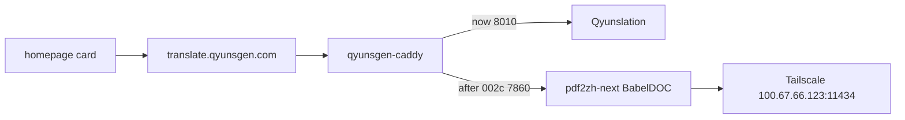

# PLAN-002 详细子计划（确认后写入仓库）

现有草稿在 [docs/plans/PLAN-002-babeldoc-replace-translate/](docs/plans/PLAN-002-babeldoc-replace-translate/)。确认后把下列细节回填进 `PLAN-002a`–`002d`，再按序实施。本回合只规划。

**相对旧草稿的一处修正（D5）：** pdf2zh-next 有原生 `Ollama` 引擎（`ollama_host` + `ollama_model`，走 Ollama 原生 API，**不要** `/v1`）。现网 Qyunslation 用的 OpenAI 兼容层 `http://100.67.66.123:11434/v1` 仅作失败回退，不作为主路径。依据：[translate_engine_model.py `OllamaSettings`](https://github.com/PDFMathTranslate-next/PDFMathTranslate-next/blob/a3efffec/pdf2zh_next/config/translate_engine_model.py)。



闸门：002a/002b **禁止**改 Caddy、禁止停 `:8010`。002c 必须等你看过 002b 样张。002d 必须等公网已是新 UI。

---

## 002a 旁路安装（不切流）

文件：[PLAN-002a-sidecar-install.md](docs/plans/PLAN-002-babeldoc-replace-translate/PLAN-002a-sidecar-install.md)

**Task A1 — 容量与端口（不足则中止）**
- `df -h / /home`：任一侧 `<5G` 可用则停（warmup 字体/模型包）
- `ss -lntp`：`7860` 必须空闲；`8010` 必须仍是 `qyunslation`
- `uv --version`；`echo $PATH` 含 `$HOME/.local/bin`
- 记录到 002a 附录

**Task A2 — 官方安装**
```bash
uv tool install --python 3.12 pdf2zh-next
export PATH="$HOME/.local/bin:$PATH"
pdf2zh_next --version
pdf2zh_next --help | tee /home/dev/pdf2zh/help.txt
```
验收：版本非空；`--gui` / `--server-port` / `--config-file` / `--ollama` 出现在 help。**禁止** clone BabelDOC 当生产入口。

**Task A3 — 目录与默认配置副本**
- 建 `/home/dev/pdf2zh/{out,sample}`
- 按官方：默认配置在 `~/.config/pdf2zh/`，**不改 `default/`**。首次 `--help` 或 `--warmup` 后，把生成的默认文件复制为 `/home/dev/pdf2zh/config.toml`（002b 再改引擎节）
- 在 help 里查有无 `--server-name`：有则 unit 绑 `127.0.0.1`；无则 002b 用防火墙/仅 Caddy 暴露

**Task A4 — systemd 草稿（不 enable、不常驻）**
写入 `/etc/systemd/system/pdf2zh.service`（`User=dev`）：
- `WorkingDirectory=/home/dev/pdf2zh`
- `ExecStart=/home/dev/.local/bin/pdf2zh_next --gui --server-port 7860 --ui-lang zh --config-file /home/dev/pdf2zh/config.toml --disable-config-auto-save --disable-gui-sensitive-input --enabled-services Ollama`
- `Restart=on-failure`
然后 `systemd-analyze verify` + `daemon-reload`。`is-enabled` 必须仍是 `disabled`。

**A 验收**
- `bash scripts/verify-plan-002.sh after-a`
- 公网标题仍是 `荃信翻译 · Qyunslation`
- `ss` 无长期 `7860` 监听

**A 回滚：** `uv tool uninstall pdf2zh-next`；删 unit 与 `/home/dev/pdf2zh`；不碰 Caddy。

---

## 002b 原生 Ollama + warmup + 样张（不切流）

文件：[PLAN-002b-ollama-smoke.md](docs/plans/PLAN-002-babeldoc-replace-translate/PLAN-002b-ollama-smoke.md)

依赖：A-V1–A-V3 全过；附录写明 `pdf2zh_next` 版本。

**Task B1 — 探活泰州**
```bash
curl -sS --max-time 8 http://100.67.66.123:11434/api/tags
```
模型名必须含 `qwen3.6:35b-a3b`。不通则停，不改 Caddy、不换外网 API。

**Task B2 — 写 `/home/dev/pdf2zh/config.toml`（以安装后默认文件为底，只改这些）**
- `[basic] gui = true`
- `[gui_settings] enabled_services = "Ollama"`；`disable_gui_sensitive_input = true`；`disable_config_auto_save = true`（官方公网部署要求，且只开 Ollama，禁止 Bing）
- `[translate_engine_settings] translate_engine_type = "Ollama"`；`ollama_host = "http://100.67.66.123:11434"`（无 `/v1`）；`ollama_model = "qwen3.6:35b-a3b"`
- `[translation]`：`lang_in`/`lang_out` 英→简中；`qps = 2`；`custom_system_prompt` 含 `/no_think`（官方 Qwen3 建议）
- `[pdf] watermark_output_mode = "no_watermark"`
- 字段名以本机 `~/.config/pdf2zh/default` 为准，禁止凭记忆发明键名
- 回退（仅 B3 失败时）：`translate_engine_type = "OpenAI"` + `openai_base_url = "http://100.67.66.123:11434/v1"` + 占位 key。写入 002b 附录，不默默切外网

**Task B3 — warmup**
```bash
pdf2zh_next --warmup --config-file /home/dev/pdf2zh/config.toml
```
退出 0。失败先查磁盘/出网（HuggingFace/ModelScope），再考虑 `--restore-offline-assets`。

**Task B4 — 短启 WebUI**
`sudo systemctl start pdf2zh.service`（仍不 enable）。`curl` `http://127.0.0.1:7860/` → 200。日志无连 `127.0.0.1:11434`。

**Task B5 — 1 页 CLI 烟测**
样张优先：归档里最短英文学术/方案 PDF 的第 1 页；没有则做 1 页纯英文 PDF 放到 `/home/dev/pdf2zh/sample/`。
```bash
pdf2zh_next /home/dev/pdf2zh/sample/page1.pdf \
  --config-file /home/dev/pdf2zh/config.toml \
  --pages 1 --ollama --output /home/dev/pdf2zh/out
```
验收：`*-mono.pdf` 与 `*-dual.pdf` 非空；目视中文叠在原版式上（不是 Qyunslation 的 markdown 丢排版）；公网仍是 Qyunslation。

**Checkpoint：** 把样张路径发给你，口头「可以切流」后才开 002c。

**B 验收：** `verify-plan-002.sh after-b`

**B 回滚：** `systemctl stop pdf2zh`；保留安装与 config。

---

## 002c Caddy 切 `translate.qyunsgen.com`

文件：[PLAN-002c-caddy-cutover.md](docs/plans/PLAN-002-babeldoc-replace-translate/PLAN-002c-caddy-cutover.md)

只改 [Caddyfile-production-public](/home/dev/qyunsgen/config/Caddyfile-production-public) 里 `https://translate.qyunsgen.com` 这一块：`reverse_proxy 127.0.0.1:8010` → `127.0.0.1:7860`。超时 600s、证书、header 不动。注释改为 PDFMathTranslate-next / BabelDOC。

顺序（不可对调）：
1. `sudo systemctl enable --now pdf2zh.service`，本机 7860=200
2. 改 Caddyfile
3. `docker exec qyunsgen-caddy caddy validate --config /etc/caddy/Caddyfile`
4. `docker restart qyunsgen-caddy`（单文件 bind-mount 禁止只 reload）
5. 容器内 `grep 7860 /etc/caddy/Caddyfile` 必须命中（防旧 inode）
6. `curl https://translate.qyunsgen.com/` 不再出现 `<title>荃信翻译 · Qyunslation</title>`
7. homepage 点「翻译」进 Gradio；抽查 table/knowledge 仍 200

**切流后先不杀 :8010**（回滚窗口）。

**C 验收：** `verify-plan-002.sh after-c`

**C 回滚：** 上游改回 `8010` + `docker restart qyunsgen-caddy`。

---

## 002d 清理 + WT

文件：[PLAN-002d-cleanup-wt.md](docs/plans/PLAN-002-babeldoc-replace-translate/PLAN-002d-cleanup-wt.md)

1. 停孤儿 `qyunslation -i --port 8010`；`ss` 无 8010
2. `sudo systemctl disable --now docutranslate.service`（路径已不存在）
3. [homepage/config/services.yaml](/home/dev/homepage/config/services.yaml)：`href`/`siteMonitor` 仍是 `https://translate.qyunsgen.com`；标题改「翻译 BabelDOC」，description 写「PDF 保留排版 · translate.qyunsgen.com」
4. `verify-plan-002.sh after-d`；写 [docs/walkthroughs/WT-002-babeldoc-replace-translate.md](docs/walkthroughs/WT-002-babeldoc-replace-translate.md)，回填纲领 V1–V7
5. 可选：只改 Hermes `local-document-translation` 的现网拓扑与触发词，不复制长文

不删 `/home/dev/qyunslation`，不迁 `DT-2026-*`。

---

## 实施时还会动的文件

- 回填本目录四份子计划 + 纲领 D5
- [scripts/verify-plan-002.sh](scripts/verify-plan-002.sh)（已有 baseline 6/6）
- 仓库外：`/home/dev/pdf2zh/config.toml`、`/etc/systemd/system/pdf2zh.service`
- 002c 才改 Caddy；002d 才改 homepage 文案

**明确不做：** 嵌进 Qyunslation 源码（AGPL）、同一 URL 继续接 Word/图嵌字、荃信白牌 Gradio、改 homepage href、外发 Immersive 在线版。
