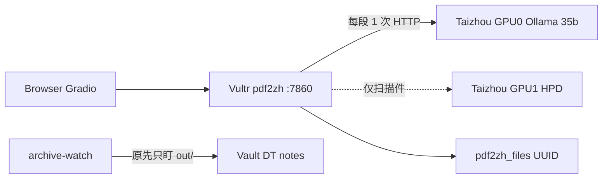

# PLAN-003：翻译吞吐加速（保质量）

## 目标

用户已确认：**译文质量很好，不要换模型、不要换排版引擎。** 本期只把「831 段问两轮 LLM、刷新即丢、旧任务堵新任务」变成可预期的单轮翻译，并按泰州双 5090 实测把并发调到刚好。

基线（2026-08-23 今晚）：`QX027N QnA-2026.08.19-临床.pdf` 自动抽术语 831 + 翻译 831，约 26 分钟（12:46–13:12 UTC）。`qps=2`，引擎 `qwen3.6:35b-a3b` @ `100.67.66.123:11434`。

## 现网瓶颈（已核实）

- **双倍 LLM**：Automatic Term Extraction 与 Translate Paragraphs 各打一遍 35B。配置里 [`/home/dev/pdf2zh/config.toml`](/home/dev/pdf2zh/config.toml) 已是 `no_auto_extract_glossary = true`，但 **pdf2zh 进程未重启，现网 GUI 仍默认开着抽术语**。
- **并发被 PLAN-002 D8 / AUDIT-001 钉死在 2**：AUDIT 测的是 **27b 短 prompt**，不是现在的 **35b-a3b MoE 翻译段**。`OLLAMA_NUM_PARALLEL` / `KEEP_ALIVE` 仍未设。
- **任务模型像交互玩具**：刷新断 websocket（`Connection errored out`）；服务端旧任务继续占 GPU，新任务 `queue: 1/1` 空转。
- **归档看错目录**：GUI 把产物写到 `pdf2zh_files/<session>/`，watcher 只扫 `out/`。QnA 译完检索 0 条即因此。今晚已补扫会话目录并入库 `DT-2026-0002`（撞车多了一条 `0003`）。

BabelDOC 内部 `pool_max_workers` 默认等于 `qps`（[`il_translator_llm_only.py`](/home/dev/.local/share/uv/tools/pdf2zh-next/lib/python3.12/site-packages/babeldoc/format/pdf/document_il/midend/il_translator_llm_only.py)）。提速杠杆是 **少一轮 + 让 5090 吃饱**，不是换引擎。

## 开源项目只借机制，不换栈

| 项目 | 可借 | 明确不采用 |
| --- | --- | --- |
| LibreTranslate / CTranslate2 | 服务端批处理、专用推理进程常驻 | 不换 NLLB/opus-mt 当主译（质量风险） |
| Immersive Translate | 句级缓存、跳过重复术语轮 | 不做浏览器插件路径 |
| MinerU / Docling / Marker | — | 先解析再机翻会丢掉已认可的 BabelDOC 版式 |
| vLLM / SGLang | 连续批处理（同模型） | **仅当 003b 证明 Ollama 是墙** 再开子计划，默认不做 |
| 云 DeepL / 在线 Immersive | — | 临床 PDF 不外发 |

PLAN-002 Out of Scope「不改泰州 Ollama / GPU 调度」**本期废止（仅限调度参数）**；模型名仍锁定 `qwen3.6:35b-a3b`，GPU1 仍留给 HPD。

## Out of Scope

- 换模型、双模式「快速/精译」、把 BabelDOC 链进 Qyunslation（AGPL）
- 改 `translate.qyunsgen.com` / homepage href
- 动 GPU1 HPD 或把扫描 OCR 搬到 GPU0
- 荃信白牌重做 Gradio（PLAN-002 缺口，另开）
- 用 vLLM 替换 Ollama（003b 未证伪前不开）

## 关键决策

- **D1** 质量锚：BabelDOC 排版 + `qwen3.6:35b-a3b` + `/no_think`。加速只动管线与服务参数。
- **D2** 默认关掉自动抽术语。需要术语表时走手动 `--glossaries`（WT-002 遗留），不在热路径自动抽。
- **D3** 并发以 **35b-a3b 翻译段** 重测为准，禁止直接套用 AUDIT-001 的 27b 曲线；预计落在 2–4，不冲 8。
- **D4** 不改 pdf2zh 上游大面积 fork。能改 [`config.toml`](/home/dev/pdf2zh/config.toml) / 泰州 Ollama unit / 旁路脚本就不要补丁 `site-packages/gui.py`（升级会丢）。
- **D5** 归档以会话目录为准（已部分落地），并加单飞锁，避免再写出 `DT-0002`+`DT-0003` 双份。

## 子计划

确认本纲领后，先落盘到 [`docs/plans/PLAN-003-translate-throughput/`](docs/plans/PLAN-003-translate-throughput/)（qyunslation 无 `ensure-plan-dir.sh`，照 PLAN-002 目录惯例），**再编码**。

### 003a — 管线快赢（Vultr，不改泰州）

- 重启 `pdf2zh.service` 使 `no_auto_extract_glossary=true` 生效；核对 GUI「Enable auto term extraction」默认关。
- 文档/UI 文案：进度停在 Term Extraction 不是卡死；中途禁止刷新。
- 归档：固化 [`scripts/pdf2zh-archive-watch.py`](/home/dev/qyunslation/scripts/pdf2zh-archive-watch.py) 的 `pdf2zh_files` 扫描；`run_once` 加 flock，防止 daemon 与手工 `--once` 双写。
- 验收：同一 QnA 类文档（或 1 份 10+ 页文字 PDF）**不再出现 Term Extraction 阶段**；译完 ≤1 分钟内 Vault 出现新 `DT-*`（关键词能搜到 `QX027N` 这类文件名，不依赖三位数字 `027`）。

### 003b — 泰州 Ollama 调度（GPU0 only）

- SSH `genscend@100.67.66.123`，对 **现网 35b-a3b** 重跑 concurrent=1/2/4 墙钟与 VRAM（短译句，仿 BabelDOC 段长，不是 AUDIT 短 prompt）。
- 设置 `OLLAMA_KEEP_ALIVE=-1`（避免每单冷加载）；`OLLAMA_NUM_PARALLEL` 取曲线最优点。
- 仅当 4 并行均摊明显优于 2 且 VRAM 不挤爆时，把 [`config.toml`](/home/dev/pdf2zh/config.toml) `qps` 从 2 调到该值。
- 验收：写 `docs/perf/baseline-003b.json`；SLO 草案——QnA 量级（~800 段、无术语轮）墙钟 **≤15 min**（qps=2）或 **≤10 min**（若 qps=4 成立）。

### 003c — 任务不丢、互不堵车

- 明确策略（最小够用）：**客户端断开则取消服务端翻译**（避免 Abstract 僵尸占满 GPU），产物已写出的仍走归档；**不要**上完整作业平台。
- 实现优先：pdf2zh 外面包一层或 Gradio `concurrency`/`cancel` 钩子；禁止再靠人工 `kill` + `systemctl restart`。
- 验收：刷新当前页后，新上传的第二份 PDF 在 30s 内开始 Parse（不被旧任务挡住）；已完成的 PDF 仍能在检索页搜到。

## SLO（相对今晚 QnA 基线）

- 关掉术语轮后，同等段数墙钟至少降 **~40%**（少一轮 35B）。
- 003b 若能把 qps 提到 4 且质量抽检通过，再降一截；提不上就停在 2，不硬冲。
- 刷新/取消不再造成「检索 0 条」或「新任务空转 1 分钟」。

## 验证

- `scripts/verify-plan-003.sh`：config 默认关术语、watcher 含 session_dir、pdf2zh/Ollama 探活、archive flock 存在。
- 手测：1 份文字 PDF 无 Term Extraction；译完检索文件名声命中。
- 003b：perf JSON + 不回归 HPD `:8120/health`。

## 回滚

- Vultr：`qps` 改回 2；`no_auto_extract_glossary` 可再打开（不推荐）。
- 泰州：去掉 `OLLAMA_NUM_PARALLEL` / `KEEP_ALIVE` 后重启 Ollama。
- 不回滚 Caddy、不换回 :8010。

## 实现顺序

1. 写入 PLAN-003 纲领 + 003a/b/c + README + verify 骨架（文档，不改生产）。
2. 用户确认正文后：先 003a（立刻有体感），再 003b（要上泰州），最后 003c（消灭堵车）。
3. 每子计划独立 WT；禁止 003b 未测就改 `qps`。
