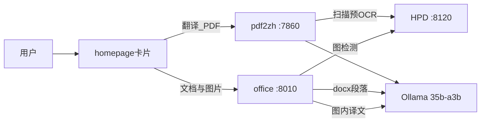

# PLAN-005：Word / 扫描 PDF / 图片嵌字（详细子计划）

## 目标

现网 `translate.qyunsgen.com` 只收 PDF（BabelDOC）。本期补齐：**可编辑 .docx**、**图片型 PDF 可选中译文**、**图内嵌字覆盖**。不换模型、不把 Word 塞进 BabelDOC、不重排文字 PDF。

## 父纲领进度

| 编号 | 名称 | 状态 | 依赖 |
| --- | --- | --- | --- |
| 005a | 扫描 PDF 正规化（HPD） | 待做 | PLAN-003/004 已回滚质量口径 |
| 005b | Word sidecar | 待做 | 与 005a 可并行 |
| 005c | 图片嵌字 | 待做 | 005b + HPD 探活 |
| 005d | 归档/检索 | 待做 | 005b（005c 产物一并收） |
| 005e | 统一入口（门禁） | 默认不做 | 005a+b 可用且双入口不可接受 |

确认本文件后：先落盘 [`docs/plans/PLAN-005-office-image/`](/home/dev/qyunslation/docs/plans/PLAN-005-office-image/)，**再编码**。禁止 005a 未测就改文字 PDF 主链；禁止未验收 005b 就切 Caddy 默认站。

## 质量不变量（每个 Task 结束都要过）

- 模型 `qwen3.6:35b-a3b` @ `http://100.67.66.123:11434`，**禁止 27b**
- `temperature=0`，系统提示含 `/no_think`
- `no_auto_extract_glossary` / `GLOSSARY_GENERATE_ENABLE=false`；QX027 静态 [`/home/dev/pdf2zh/glossaries/qx027n.csv`](/home/dev/pdf2zh/glossaries/qx027n.csv)
- 文字 PDF：BabelDOC；`num_predict=2000`；批阈值 **200/5**；JSON fallback 保留
- 抽检允许措辞微调；禁止漏段、公式 `{vN}` 丢失、dual 大片空白（CBP-201 事故）
- GPU1 只用现成 HPD `:8120`；Caddy **只 reload**

## Out of Scope

- 文字 PDF 改回 Qyunslation / MinerU 重排版
- xlsx / pptx / epub / srt
- 扫描 PDF 内插图再做一层嵌字（交给 005a 文字层）
- 再封 `num_predict=512` / 无门禁把批阈值调到 400/8
- 外发 DeepL、vLLM、GPU1 扩容
- BabelDOC 链进 Qyunslation（AGPL）
- 未触发 005e 门禁就改 `translate.qyunsgen.com` 默认反代

---

## 架构



现网证据：

- GUI 仅 `.pdf`：site-packages `pdf2zh_next/gui.py` `file_types=[".pdf", ".PDF"]`
- 扫描补丁已在运行时、**未入库**：[`/home/dev/pdf2zh/hpd_ocr.py`](/home/dev/pdf2zh/hpd_ocr.py)；`gui.py` L1080–1141 `pdf_needs_hpd` / `Scanned PDF` 重试
- Word 代码已在仓库：[`docx_workflow.py`](/home/dev/qyunslation/qyunslation/workflow/docx_workflow.py)、[`docx_translator.py`](/home/dev/qyunslation/qyunslation/translator/ai_translator/docx_translator.py)（`is_image_run` **跳过**图片，未嵌字）
- 嵌字草稿：[`image_translate.py`](/home/dev/qyunslation/qyunslation/extensions/image_translate.py) 仍写 **RapidOCR + 27b**，未接导出
- Qyunslation 默认危险：[`config.py`](/home/dev/qyunslation/qyunslation/config.py) `CONCURRENT=30`、`TEMPERATURE=0.7`，必须用 env 压到 4 / 0
- Caddy SSOT：[`Caddyfile-production-public`](/home/dev/qyunsgen/config/Caddyfile-production-public) L86–107 → `:7860`

---

## PLAN-005a：扫描 / 纯图 PDF（泰州 HPD + Vultr pdf2zh）

### 背景

BabelDOC `DetectScannedFile`：扫描页 >80% 抛 `ScannedPDFError`；`ocr_workaround` 是白底遮罩，**不是 OCR**。现网已有 HPD 铺 invisible text（`render_mode=3`），但脚本在仓库外、补丁不在 [`apply-pdf2zh-throughput.py`](/home/dev/qyunslation/scripts/apply-pdf2zh-throughput.py)，uv 升级会丢。

### Task A1 — 入库 HPD 模块

- 将 `/home/dev/pdf2zh/hpd_ocr.py` 拷入 [`scripts/hpd_ocr.py`](/home/dev/qyunslation/scripts/hpd_ocr.py)（或 `qyunslation/archive/` 旁 `hpd_ocr.py`，供 pdf2zh `PYTHONPATH`）。
- `/home/dev/pdf2zh/hpd_ocr.py` 改为薄 re-export，避免双份逻辑。
- 端点、超时、`min_chars=80`、HPD 失败 `written==0` 抛错 **保持现行为**。
- 加 `scripts/test_hpd_ocr_smoke.py`（只 mock `_parse`，测 `pdf_needs_hpd` / 坐标缩放）。

**Acceptance：** 仓库内可 `rg ocr_pdf_with_hpd`；生产仍能 `from hpd_ocr import ocr_pdf_with_hpd`。

### Task A2 — apply 补丁可回滚

新 [`scripts/apply-pdf2zh-hpd.py`](/home/dev/qyunslation/scripts/apply-pdf2zh-hpd.py)：把 `gui.py` 的 `_hpd_retried` / `pdf_needs_hpd` / `Scanned PDF` 重试打成幂等补丁（锚点 `_run_translation_task`）。

[`scripts/pdf2zh.service`](/home/dev/qyunslation/scripts/pdf2zh.service) `ExecStartPre` 增加该脚本（排在 throughput / brand 之后）。

HPD 失败必须 `gr.Error` 可见，**禁止**回落 `ocr_workaround=true`。

**Acceptance：** `rg _hpd_retried` 在 site-packages；重启 pdf2zh 后补丁仍在。

### Task A3 — 扫描件验收

同一份 ≥4 页临床扫描 PDF：

1. 记 HPD 页均墙钟、`HPD 第 N 页 K 块`
2. 再 BabelDOC；journal `Successful` / `Fallback`（**禁止 Successful:0**）
3. dual 第 1/中/末页：右侧有完整中文、可选中

写入 [`docs/perf/baseline-005a.json`](/home/dev/qyunslation/docs/perf/baseline-005a.json)。

| # | 项 | 期望 |
| --- | --- | --- |
| A-V1 | 10 页扫描墙钟 | ≤ 同段数文字 PDF + 1.5× HPD（HPD 基线 ~0.54s/页） |
| A-V2 | HPD | `:8120/health` ok；失败有明确错误 |
| A-V3 | 质量 | dual 无大片空白；抽检无漏段 |
| A-V4 | 回归 | 文字层 PDF（如 page1 / CBP-201 文字版）**不**走 HPD（`pdf_needs_hpd` false） |

### 005a 变更文件

- `scripts/hpd_ocr.py`、`scripts/apply-pdf2zh-hpd.py`、`scripts/pdf2zh.service`
- `/home/dev/pdf2zh/hpd_ocr.py`（薄包装，仓库外）
- `docs/perf/baseline-005a.json`、`docs/walkthroughs/WT-005a-scanned-pdf-hpd.md`

### 005a 回滚

去掉 ExecStartPre HPD 行；site-packages 不再打 HPD 分支；文字 PDF 不受影响。

---

## PLAN-005b：可编辑 Word sidecar

### 背景

PLAN-002 停掉 `:8010`。`DocxWorkflow` 仍在，走 OpenAI 兼容口（[`AiTranslatorConfig.base_url`](/home/dev/qyunslation/qyunslation/translator/ai_translator/base.py)）。默认 `TEMPERATURE=0.7`、`CONCURRENT=30` 会打爆 GPU0 并破坏质量。

### Task B1 — 环境口径（强制覆盖）

新建 `/home/dev/pdf2zh/office.env`（不入库密钥）+ 仓库 [`scripts/office.env.example`](/home/dev/qyunslation/scripts/office.env.example)：

```
DOCUTRANSLATE_BASE_URL=http://100.67.66.123:11434/v1
DOCUTRANSLATE_API_KEY=ollama
DOCUTRANSLATE_MODEL_ID=qwen3.6:35b-a3b
DOCUTRANSLATE_TEMPERATURE=0
DOCUTRANSLATE_CONCURRENT=4
DOCUTRANSLATE_THINKING=disable
DOCUTRANSLATE_CUSTOM_PROMPT=/no_think You are a professional, authentic machine translation engine.
DOCUTRANSLATE_GLOSSARY_GENERATE_ENABLE=false
DOCUTRANSLATE_ENV_FORCE_OVERRIDE=true
DOCUTRANSLATE_WEB_SKIP_VALIDATION=true
```

静态术语：进程启动时加载 `qx027n.csv` → `glossary_dict`（禁止 reopen 自动抽术语）。

**Acceptance：** `rg GLOSSARY_GENERATE` 为 false；UI 无法改模型/温度（force override）。

### Task B2 — user systemd

新 [`scripts/qyunslation-office.service`](/home/dev/qyunslation/scripts/qyunslation-office.service)：

- `ExecStart`：现有 `.venv` `qyunslation -i --port 8010 --host 127.0.0.1`
- `EnvironmentFile=/home/dev/pdf2zh/office.env`
- **不**抢 7860；`enable --now` 仅 user unit

烟测：上传 1 页临床 `.docx`，下载可在 Word 打开的译稿。

`.doc`：检测后缀后 `soffice --headless --convert-to docx`；无 LibreOffice 则拒收并提示另存 docx。

**Acceptance：** `systemctl --user is-active qyunslation-office`；`curl 127.0.0.1:8010` 200；产物 `.docx` 非 PDF。

### Task B3 — 入口（不改 PDF 默认站）

- Caddy：在 [`Caddyfile-production-public`](/home/dev/qyunsgen/config/Caddyfile-production-public) **新增** `https://office.qyunsgen.com` → `127.0.0.1:8010`（timeout 与 translate 同 600s）。**禁止**改 `translate.qyunsgen.com` 的 7860 块。
- DNS / Cloudflare：`office` CNAME 与其它 `*.qyunsgen.com` 相同（需人工点）。
- homepage：第二卡片「文档/图片翻译」→ `https://office.qyunsgen.com`（homepage 仓库，不改 translate 卡片）。

**Acceptance：** 两域名并存；PDF 站仍 BabelDOC。

### Task B4 — Word SLO

约 200 段临床 docx（可用 Vault 已有 DT docx 或立项说明书）：

| # | 项 | 期望 |
| --- | --- | --- |
| B-V1 | 墙钟 | ≤8 min |
| B-V2 | 样式 | 标题/加粗/表格单元格仍在 |
| B-V3 | 完整 | 无漏段；抽 1/中/末节对照原文 |
| B-V4 | 回归 | 译 PDF 期间 office 空闲不占满 GPU0（qps/concurrent=4） |

### 005b 变更文件

- `scripts/qyunslation-office.service`、`scripts/office.env.example`
- 可选：`.doc` 转换小函数（`qyunslation/converter/` 最小增量）
- qyunsgen Caddyfile + homepage 卡片
- `docs/walkthroughs/WT-005b-word-sidecar.md`

### 005b 回滚

`systemctl --user disable --now qyunslation-office`；Caddy 删 office 块后 reload。

---

## PLAN-005c：图片嵌字（独立图 + Word 内嵌图）

### 背景

[`image_translate.py`](/home/dev/qyunslation/qyunslation/extensions/image_translate.py) 阶段 1 验证过 RapidOCR 嵌字，**未接 Docx 导出**；模型写死 27b。`docx_translator.py` L231 对 `is_image_run` **continue**。

扫描 PDF 内插图：**不做**（005a 文字层）。

### Task C1 — 检测改 HPD

- 复用 005a 的 `_parse` / `_blocks`（坐标 + 文本），**删除对 RapidOCR 的生产依赖**（可留 optional extra）。
- 独立 CLI：`scripts/hpd-overlay-image.py in.png out.png`
- 翻译：35b、`temp=0`、`/no_think`、按行编号批译；`num_predict=2000`；术语表与 005b 同一 CSV。

**Acceptance：** 单张含英文的临床图，输出图有中文覆盖；journal 无 27b。

### Task C2 — standalone 工作流

office UI 已路由 `.png/.jpg` → `markdown_based`（[`server/core.py`](/home/dev/qyunslation/qyunslation/server/core.py) `get_workflow_type_from_filename`）。改为 **image overlay 工作流**（或 identity 后只跑嵌字），产物 `*.zh.png`，可选附 OCR 纯文本 `.txt`。

**Acceptance：** office 上传 png 得到嵌字图，不是 MinerU markdown。

### Task C3 — Word 内嵌图

在 `DocxTranslator`：对 `is_image_run` 抽 blob → C1 嵌字 → 写回同一 run（PLAN-001c2）。正文段翻译与嵌字并行，总并发仍 ≤4。

失败策略：单图失败 **保留原图** + 任务级 warning，不整篇失败。

**Acceptance：** 含 1 张英文图的 docx，译后图内中文、周围段落样式仍在。

### Task C4 — 速度门

| # | 项 | 期望 |
| --- | --- | --- |
| C-V1 | 单张 A4 | OCR+嵌字 ≤90s |
| C-V2 | 术语 | QX027N / IL-17 与 CSV 一致或原文保留 |
| C-V3 | 非文字区 | 无明显涂抹（目视；不强制 97.5%） |

未达 C-V1：记录实测，不阻塞 005d；禁止换小模型冲速度。

### 005c 回滚

office.env `QYUNSLATION_IMAGE_OVERLAY=0`；docx 恢复跳过图片。

---

## PLAN-005d：归档（复用 002e/f）

### Task D1 — office 输出目录

- 约定 office 译完写 `/home/dev/pdf2zh/office_out/`（docx/png + 源文件副本）。
- 扩展 [`pdf2zh-archive-watch.py`](/home/dev/qyunslation/scripts/pdf2zh-archive-watch.py) 或新 `office-archive-watch.py`：**同一** `index.db` / MinIO bucket / Vault 前缀 `10-Source-Documents/Translations`，编号继续 `DT-2026-*`。
- 分组键：`*.zh.docx` / `*.zh.png`，不要误吞 pdf2zh 的 `mono/dual.pdf`。

**Acceptance：** 译一份 office docx 后 knowledge 检索能搜到；不重复建第二条编号体系。

### Task D2 — 扫描 PDF

005a 产物仍走现有 pdf2zh watcher（`out/` + `pdf2zh_files/`），无需新桶。

### 005d 回滚

停 office watcher；已入库 DT 不删。

---

## PLAN-005e：统一入口（默认不做）

### 触发（全部满足才开）

1. 005a+b 完成
2. 用户明确「不要两个 URL」
3. 不改 BabelDOC 为 PDF 后端

任一不满足：**写 WT 关闭 005e**，不改 `translate.qyunsgen.com`。

### 方案（仅触发后）

极薄上传页：按后缀 POST 到 7860（pdf）或 8010（docx/png）。Caddy 默认站仍可保持 7860，上传页另挂路径。

### 明确不做

- 把 Gradio 改成多格式
- 把 Word 转 PDF 再进 BabelDOC「凑合」

---

## 仓库落盘结构（确认后实现第一步）

```
docs/plans/PLAN-005-office-image/
  README.md
  PLAN-005-office-image.md
  PLAN-005a-scanned-pdf-hpd.md
  PLAN-005b-word-sidecar.md
  PLAN-005c-image-overlay.md
  PLAN-005d-archive.md
  PLAN-005e-unified-entry-gate.md
scripts/verify-plan-005.sh
docs/walkthroughs/WT-005-*.md
```

`verify-plan-005.sh` 阶段：`baseline | after-a | after-b | after-c | after-d`。

## 总 SLO

| 阶段 | 速度 | 质量 |
| --- | --- | --- |
| 005a | 10 页扫描 ≤ 文字同段数 + 1.5× HPD | dual 可选中、非 100% fallback；文字 PDF 不误入 HPD |
| 005b | ~200 段 docx ≤8 min | 可编辑、样式在、无漏段 |
| 005c | 单图 ≤90s | 覆盖可读；图失败不毁全文 |
| 005d | 译完后归档可见 | 同一 DT 体系 |
| 005e | 仅门禁 | 不损伤 PDF 站 |

## 实现顺序

1. 落盘 PLAN/verify（不改生产）
2. 005a 与 005b 并行（验收分开）
3. 005c → 005d
4. 未要求单 URL → 写 WT 关 005e
