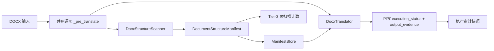

# PLAN-030e：DOCX 纵向闭环与前序缺口收拢

## 一、为什么把缺口和 DOCX 放在一起

030d 把 PDF 打通时暴露了三类问题，它们都不是 PDF 独有的，而是在只做过一个格式时无法察觉的：契约字段没人填、测试依赖仓外文件、生产环境缺二进制。现在要接第二个格式，正是把这些一次性夯实的时机——等到 030g 再补，同样的改动要在三个格式上各做一遍。

已确认的决策：范围取「030e 直接依赖 + 跨格式契约债」；仓外样本改为环境变量可配置且缺失时显式 BLOCKED；视觉校验走结构断言；DOCX 表格做到单元格级。

## 二、收拢的缺口清单

### 环境缺失
- 生产机无 LibreOffice/soffice。`[qyunslation/converter/office.py](qyunslation/converter/office.py)` 第 97-102 行 fail-closed 抛 `OFFICE_CONVERTER_UNAVAILABLE`（HTTP 503），行为诚实但功能不可用。影响 `.doc` 规范化（030e 前置）与 PPTX 渲染模式（030g 前置）。`test_office_normalization.py` 用 FakeRunner 模拟，所以测试全绿掩盖了生产不可用。
- 需 sudo 安装，这一步须由你执行或授权。

### 测试可信度
- 6 个测试硬编码 `/home/dev/pdf2zh/pdf2zh_files/...` 下的真实业务文档（QX027N 临床问答、FDA PIND 回复），涉及 `[tests/structure/test_prescan_manifest.py](tests/structure/test_prescan_manifest.py)`、`test_column_layout.py`、`test_figure_regions.py`、`test_unnumbered_objects.py`、`test_table_page_guard.py`、`test_scanned_pdf_parity.py`。
- 本机文件在，测试不跳过；换机或 CI 上会静默 skip 约 15 项 030d 验收，产生「全绿但没测」的假阳性。

### 契约字段空置
- `translatable_blocks` 恒为 `[]`：从无 `TranslatableBlock` 构造点，图内与段落级可译单元完全没建模。
- `output_evidence` 恒为 `None`：执行侧 `[scripts/pdf_image_translate.py](scripts/pdf_image_translate.py)` 只回写 `execution_status`，没有产物 hash 或校验证据，审计链断在最后一米。
- `TableObject.row_count/column_count` 恒为 `None`：PDF 侧因三线表无竖线拿不到，DOCX 侧的 `w:tbl/w:tr/w:tc` 是显式结构，可以真正填上。
- `fast_fingerprint`、对象级 `source_geometry`/`confidence`、`SourceRef.occurrence_index` 空置：属契约预留，本计划仅登记不实现。

### 文档同步
- `[PLAN-030d](docs/plans/PLAN-030-semantic-layout-translation/PLAN-030d-manifest-ssot-execution-parity.md)` 中 Tasks 1-5 与 Checkpoint A/B 共 39 条验收仍是 `- [ ]`，与实际已完成、WT-030d 已记录证据的状态不符。

### 明确不纳入（已有归属，不提前）
- 表格单元格级重建（PDF 侧）：另立项，需 camelot/tabula/pymupdf4llm 选型。
- `QY030-PPT-001`、PPTX 嵌图：030g。图片与 Poster：030f。跨格式对账：030g 之后。
- 3 个 archive 既有失败：非 030 范围，各门继续要求精确保持不变。

## 三、头号技术冲突：流式布局没有 bbox

`[qyunslation/structure/models.py](qyunslation/structure/models.py)` 第 313 行：

```python
class SemanticObjectBase(ContractModel):
    bbox: BoundingBox          # 必填，且 BoundingBox 校验要求 x1 > x0, y1 > y0
```

PDF 每个对象都有页面坐标，所以这条约束一直成立。DOCX 是流式布局，段落和表格在未渲染前不存在页面坐标。

推荐方案：把 `bbox` 放宽为 `BoundingBox | None`，并加 `model_validator` 做条件校验——归属 `PAGE`/`IMAGE`/`SLIDE` 画布的对象仍必填 bbox，归属 `SECTION` 画布（流式）的对象允许为空。这样 PDF 侧的强制性一分不减，DOCX 侧不必伪造几何。定位为 schema minor 变更（读向后兼容），`CURRENT_SCHEMA_VERSION` 相应递增 minor。

否决的替代方案：为 DOCX 造「逻辑序位坐标」（把元素序号当 y、缩进当 x）。这会产出看起来是几何、实际不是几何的数据，下游一旦当真实坐标用就会出错，与 030a 契约的诚实原则冲突。阅读顺序用 `BodyObject.reading_order` 表达即可，不需要伪装成坐标。

## 四、DOCX 闭环的关键复用

`[qyunslation/translator/ai_translator/docx_translator.py](qyunslation/translator/ai_translator/docx_translator.py)` 的 `_pre_translate()` 已经产出有序的可译片段序列：

```python
def _pre_translate(self, document) -> Tuple[DocumentObject, List[Dict], List[str]]:
    self._traverse_container(doc, elements, texts)              # 正文 + 表格单元格 + 文本框
    for section in doc.sections:
        self._traverse_container(section.header, ...)           # 六种页眉页脚变体
        ...
    # 脚注、尾注 part
    return doc, elements, texts
```

`elements` 每项含 `type`/`runs`/`paragraph`/`top_level_paragraph`，天然带阅读顺序，并已处理域指令、TOC、纯格式 run 的排除。

据此，scan_docx 与执行侧共用同一次遍历产出 manifest 与翻译单元，而不是各扫一遍再对账。这从结构上消除了 PDF 侧 030c/030d 花了大力气才修好的预扫描与执行分歧（幻灯 0 vs 12 那类）。



## 五、任务分组

按风险递增分三组，每组结束设检查点。组 A 全部是低风险修复，先做完再动契约。

### 组 A：缺口与环境（低风险）
- Task 1 安装 LibreOffice，验证 `RuntimeFeature.OFFICE_CONVERTER` 与 `SLIDE_RENDERER` 探针转绿，补一个真实 `.doc` 端到端转换测试（不再只有 FakeRunner）。
- Task 2 仓外样本改 `QYUNSLATION_SAMPLE_ROOT` 环境变量寻址，缺失时测试仍 skip，但 `verify-plan-030d.sh`/`030e.sh` 汇总为 BLOCKED 并列出缺失项与被跳过的验收数，使覆盖缺失可见。
- Task 3 同步 030d 的 39 条验收勾选，并在 WT-030d 附契约字段空置登记表。

### 组 B：契约债贯通（中风险，动 schema）
- Task 4 `bbox` 条件校验 + schema minor 递增 + `ManifestStore` 跨版本读取回归。
- Task 5 `translatable_blocks` 贯通：DOCX 从 `elements` 直接构造；PDF 侧为 FIGURE/IMAGE 的 OCR 文本块补建，保持既有计数不变。
- Task 6 `output_evidence` 贯通：执行后记录产物 asset id 与校验项（图片字节是否变更、译文是否写回、失败原因），PDF 与 DOCX 共用同一写入路径。

### 组 C：DOCX 闭环（主交付）
- Task 7 新建 `qyunslation/structure/scan_docx.py`，对标 `[scan_pdf.py](qyunslation/structure/scan_pdf.py)`，产出 BODY/TABLE/TEXT_BOX/FIGURE/CAPTION/IMAGE，`SourceRef` 用 `DOCX_PART`/`DOCX_RELATIONSHIP`，注册进 `StructureScanner` 协议。
- Task 8 表格单元格级建模：填 `row_count`/`column_count`，每单元格一个 `TranslatableBlock`，数字与单位型单元格逐 token 校验不变。
- Task 9 `DocxWorkflow`/`DocxTranslator` 消费 manifest 并回写状态，执行后无 `PENDING` 残留；`manifest=None` 时行为与现状完全一致（回归保护）。
- Task 10 扩展 `review.docx` 夹具：补页眉页脚、独立文本框、多分节；现有双栏/表格/重复图片 occurrence 保留。
- Task 11 结构校验门：译后 DOCX 可被 python-docx 重新解析，节数/栏数/表格行列数/页眉页脚数/文本框数/图片 occurrence 数与原文逐项相等，图片字节不变；产出 `verify-plan-030e.sh` 与 WT-030e。

## 六、质量红线

- 028/029/030c/030d 四个门必须继续 PASS，`QY030-PPT-001` 保持唯一 xfail，archive 3 个失败精确不变。
- 组 B 动 schema 后，旧缓存 manifest 必须仍可读或干净失效，不得让用户看到半截数据。
- DOCX 执行路径在 manifest 不可用时回落现有行为，且回落必须留痕（issue 或日志），不得静默。
- 不伪造几何、不伪造编号：无 bbox 就是无 bbox，无题注就走 IMAGE 而非假 Figure N。

## 七、回滚

组 A 各任务相互独立，可单独回退。组 B 的 schema 变更是唯一需要整体回滚的单元，与组 C 分开提交。组 C 的 DOCX 扫描器默认可通过开关关闭，关闭后走 030d 之前的 DOCX 路径。