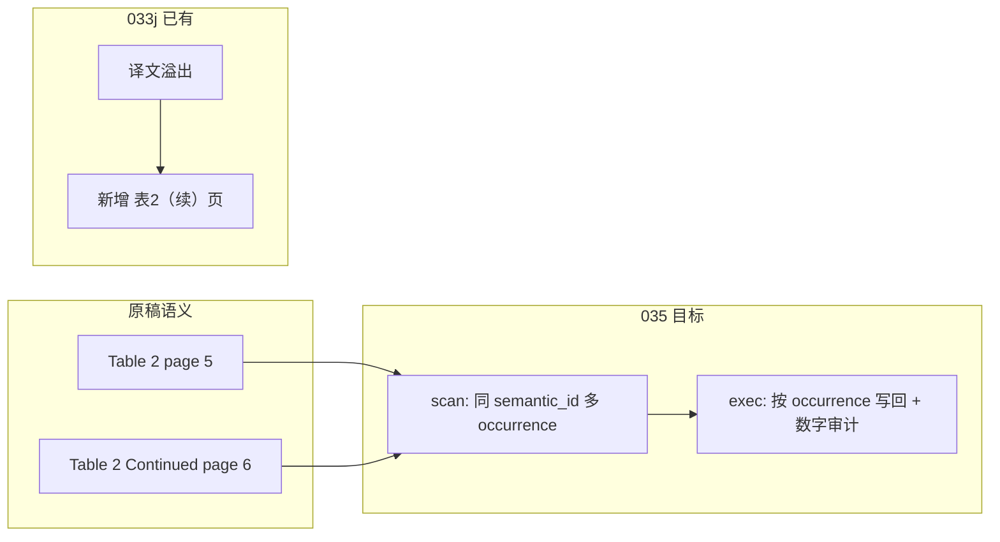

# PLAN-035：表格执行侧数字保护与跨页续表

## 背景与定位

[PLAN-030-table](docs/plans/PLAN-030-semantic-layout-translation/PLAN-030-table-pdf-cell-reconstruction.md) 已收口几何提取（`row_count`/`column_count` + cell blocks），但明确 **Out of Scope**：

- Task 4：执行侧数字 token 保护断言 + `output_evidence.checks.digits_preserved`
- 跨页续表合并（父纲领 §6.1、[WT-030-table](docs/walkthroughs/WT-030-table-closure.md) 遗留）

[PLAN-033j](docs/plans/PLAN-033-pdf-fidelity/PLAN-033j-table-translate-continuation.md) 已在 [`table_translate.py`](qyunslation/structure/table_translate.py) 对**全部**单元格做 `protect_tokens`/`restore_tokens`，并有**译文装不下**时的续页（`plan_mono_continuations` / `append_mono_continuation`）。这与本纲领要解决的 **原稿跨页续表** 是不同问题：



**编号**：`PLAN-035`（`PLAN-034` 仍暂停；不扩 033 父纲领范围）。目录纪律：`bash scripts/ensure-plan-dir.sh 035 table-execution-fidelity`。

**依赖**：030-table（几何）、033g（块级 `translation_policy`）、033j（翻译/写回主链）。

---

## 现状缺口（代码证据）

| 能力 | 现状 | 缺口 |
| --- | --- | --- |
| 纯数值单元格 | [`md_tables._is_preserve_cell`](scripts/md_tables.py)、[`scan_docx._numeric_preserve`](qyunslation/structure/scan_docx.py)、[`is_numeric_or_unit`](qyunslation/extensions/doc_image_policy.py) 三处重复 | PDF 表格 scan 一律 `TranslationPolicy.TRANSLATE`（[`StructuredTableCell.as_block`](qyunslation/structure/table_structure.py) L70） |
| LLM 前保护 | 033j 全量 `protect_tokens` | 无按 policy 分流；纯数值仍进 LLM |
| 译后断言 | 无 | `digits_preserved` 仅在 030-table 草案出现，未实现 |
| manifest 回写 | [`pdf_table_translate.py`](scripts/pdf_table_translate.py) 写 `blocks`/`continuation_rows` | 无 `digits_preserved` |
| 跨页续表 scan | [`scan_pdf.py`](qyunslation/structure/scan_pdf.py) L552-554：`table_seen` 跳过同号第二次出现 | 续页题注被 [`is_continued_caption`](qyunslation/structure/captions.py) 排除在 `caption_anchors` 外 |
| 契约 | [`semantic_occurrence_index`](docs/contracts/document-structure-manifest-v1.md) + 测试已就绪 | scan/执行未接线 |

---

## 目标（完成定义）

1. **数字 token 保护（执行侧）**
   - Scan：单元格按 SSOT 规则标注 `translation_policy`（`PRESERVE` / `PROTECT_TOKENS` / `TRANSLATE`）。
   - Exec：纯数值 **不送 LLM**；混合文本走占位保护；译后 **硬断言** 数字 token  multiset 不变。
   - Manifest：`output_evidence.checks.digits_preserved=true`（表级）；块级可选 `checks.blocks[id].digits_preserved`。
   - 失败：`FAILED_HARD` + `reason_code=digits_not_preserved`（或块级 `TABLE_DIGIT_DRIFT`）。

2. **跨页续表（扫描 + 执行）**
   - Scan：识别 `Table N Continued` / `(continues)` 续页题注，生成 **第二个** `TableObject`：`semantic_id=table:N`，`semantic_occurrence_index=2+`，独立 `object_id`/`canvas_id`/`bbox`。
   - 摘要：`summary.table_count` 仍按 semantic_id 去重为 1（契约已有）。
   - Cell blocks：续页行索引全局连续（复用 `structure_table` 的 `row_offset` 思路，扩展为跨 occurrence 偏移）。
   - Exec：[`pdf_table_translate.py`](scripts/pdf_table_translate.py) 按 `(semantic_id, occurrence_index)` 排序处理；各 occurrence 在原页 writeback；溢出续页逻辑（033j）仍保留。
   - Issue：低置信度链接记 `TABLE_CONTINUATION_UNLINKED`（WARN，不 silent 丢页）。

3. **验收门**：`bash scripts/verify-plan-035.sh` → `SUMMARY: PASS fail=0`；030-table / 033j verify 回归不退化。

---

## 子计划矩阵

| 编号 | 文件 | 内容 | 关键路径 |
| --- | --- | --- | --- |
| **035a** | `PLAN-035a-digit-token-policy.md` | 数字/单位 SSOT + scan 标注 policy | 新模块建议 [`qyunslation/structure/table_cell_policy.py`](qyunslation/structure/table_cell_policy.py)；改 [`table_structure.py`](qyunslation/structure/table_structure.py) |
| **035b** | `PLAN-035b-digit-execution-audit.md` | 执行分流、译后断言、manifest 回写 | [`table_translate.py`](qyunslation/structure/table_translate.py)、[`pdf_table_translate.py`](scripts/pdf_table_translate.py) |
| **035c** | `PLAN-035c-cross-page-scan.md` | 续表题注检测、occurrence 链接、cell row 全局化 | [`captions.py`](qyunslation/structure/captions.py)、[`scan_pdf.py`](qyunslation/structure/scan_pdf.py) |
| **035d** | `PLAN-035d-cross-page-exec-verify.md` | 多 occurrence 执行、金样/合成夹具、verify + WT | [`table_writeback.py`](qyunslation/structure/table_writeback.py)、`tests/structure/test_plan035_*.py`、`scripts/verify-plan-035.sh` |

**建议实施顺序**：035a → 035b → 035c → 035d（数字保护可独立上线；跨页依赖 scan 后再动 exec）。

---

## 技术方案要点

### A. 数字 policy SSOT（035a）

- 抽取/统一规则：以 [`md_tables.NUM_RE`](scripts/md_tables.py) + [`protect.py`](qyunslation/structure/protect.py) 的 NUM/PCT 为基准，DOCX/图片侧后续可对齐引用同一模块（本计划 **只强制 PDF 表格路径**）。
- 分类：
  - `PRESERVE`：整格匹配纯数值/占位（如 `42.3%`、`N/A`、`(n=120)`）。
  - `PROTECT_TOKENS`：含文字但也含数字/DOI/URL/引用（现有 protect 覆盖）。
  - `TRANSLATE`：无受保护 token。
- `StructuredTableCell.as_block()` 写入 `translation_policy`；扫描器版本 bump（如 `PDF_STRUCTURE_SCANNER_VERSION` 1.6.0 → 1.7.0，随子计划文档锁定）。

### B. 执行断言（035b）

扩展 `translate_table_blocks()`：

```python
# 伪代码 — 对齐现有风格
for block in blocks:
    if block.translation_policy == PRESERVE:
        out[block.block_id] = block.source_text
        continue
    protected, mapping = protect_tokens(block.source_text)
    # ... LLM ...
    restored = restore_tokens(raw[id], mapping)
    assert_digit_tokens_preserved(block.source_text, restored)  # 新增
```

- `assert_digit_tokens_preserved`：提取源/译数字 token（含 `%`、科学记数、括号内 n=）， multiset 相等；不等则 `TableTranslateError("TABLE_DIGIT_DRIFT:...")`。
- `write_output_evidence(..., checks={"digits_preserved": True, ...})`。

### C. 跨页 scan（035c）

- 新增 `continued_table_anchors(page) -> [(num, y0, bbox)]`，复用 [`is_continued_caption`](qyunslation/structure/captions.py) + 从续页题注解析 `table_caption_num`。
- 调整 `scan_pdf` 主循环：
  - 首见 `table:N`：`semantic_occurrence_index=1`（默认）。
  - 见续页题注 + 区域：追加 `TableObject`，`semantic_occurrence_index=k`，`caption_ids` 指向续页 CAPTION（可选 `kind=continued` 写入 `detector_evidence`）。
  - **`table_seen` 仅用于主表题注去重**，不再阻止续页 occurrence。
- Row 索引：第二 occurrence 的 `row_index` = `prior_max_row + 1 + local_row`（扫描期或 merge helper 计算）。

### D. 跨页 exec（035d）

- `pdf_table_translate`：tables 按 `semantic_id, semantic_occurrence_index` 分组；每组可共享一次 LLM batch（块 ID 已全局唯一）。
- 写回：每个 occurrence 仍 `paint_fitted_blocks` 在其 `canvas_id` 页；不在 occurrence 之间物理合并 PDF 页（保持版式 fidelity）。
- **Task 0（035c 前置）**：若仓内无真实续表 PDF，新增 `tests/fixtures/plan035-continued-table.pdf`（合成：Table 2 + Table 2 Continued 两页）并写入 manifest 金样断言。

---

## 验证清单

| # | 步骤 | 预期 |
| --- | --- | --- |
| V1 | `pytest tests/structure/test_plan035_digit*.py` | 纯数值 PRESERVE、混合 PROTECT、译后 drift 硬失败 |
| V2 | `pytest tests/structure/test_plan035_continuation*.py` | 2 occurrence 同 semantic_id、summary.table_count=1、block row 连续 |
| V3 | `pytest tests/structure/test_plan033j_table_translate.py` | 033j 回归全绿 |
| V4 | `bash scripts/verify-plan-030-table.sh` | PASS |
| V5 | `bash scripts/verify-plan-035.sh` | `SUMMARY: PASS fail=0` |
| V6 | ljae439 预扫 | 无续表样本时 V6 降级为 INFO；不 fake skip |

---

## 非目标

- 重启 Camelot/tabula 选型或改 030-table 几何 ADR
- 033j **译文溢出续页**语义重写（仅确保与多 occurrence 共存）
- 纯图片表 / 无边框表跨页（仍 WARN + 区域保护）
- DOCX/PPTX 跨页表（可后续引用 035a policy SSOT，本纲领不交付）
- PLAN-034、Markdown 抽表管道（029a）行为变更
- 提交 `glossaries/auto-proper-nouns.csv`

---

## 风险与缓解

| 风险 | 缓解 |
| --- | --- |
| 三处 numeric 规则不一致 | 035a 单模块 + 表格单测矩阵 |
| 续页无题注或题注格式非常规 | 邻域表体 + 列数/表头相似度评分；低置信 WARN |
| 跨 occurrence LLM batch 块 ID 冲突 | 强制 `table:{n}:r{row}c{col}` 全局 row |
| 033j 全量 protect 与 PRESERVE 重复 | PRESERVE 路径跳过 LLM；PROTECT 仍走占位 |

---

## 交付物（纲领阶段）

1. `docs/plans/PLAN-035-table-execution-fidelity/PLAN-035-table-execution-fidelity.md`（主纲领）
2. 子计划 035a–035d + `README.md`
3. （编码阶段）`scripts/verify-plan-035.sh`、`docs/walkthroughs/WT-035-table-execution-fidelity.md`
4. 可选 ADR：`docs/decisions/ADR-035-table-digit-and-continuation.md`（若 scan 链接策略需长期 SSOT）

---

## 与父纲领关系

- 回填 [PLAN-030-table](docs/plans/PLAN-030-semantic-layout-translation/PLAN-030-table-pdf-cell-reconstruction.md) §五 Task 4–5 的后续承接说明（文档链接，不改已收口状态）。
- 满足 [PLAN-030](docs/plans/PLAN-030-semantic-layout-translation/PLAN-030-semantic-layout-translation.md) §6.1 样本矩阵中「续表」项的执行闭环。
