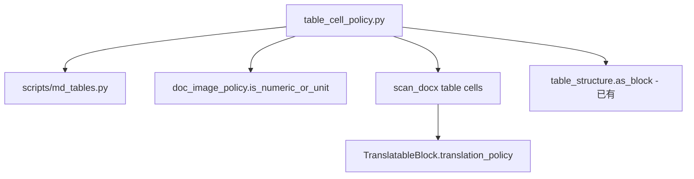

# PLAN-036 实现计划（已批准）

## 批准记录

- 用户于 2026-09-10 批准 [PLAN-036-table-policy-unification.md](docs/plans/PLAN-036-table-policy-unification/PLAN-036-table-policy-unification.md)
- 036c 金样：**Cai 2025 Pharmacoepidemiology PDF**（Wiley `TABLE 1 | (Continued)` 格式）

预扫证据（当前 035 扫描器）：

```
summary.table_count = 1
TableObject: table:1 occ 1..5（page 4–8）
```

源路径（复制前只读）：  
`/home/dev/pdf2zh/pdf2zh_files/ce918e54-.../Pharmacoepidemiology and Drug - 2025 - Cai - ...Atopic.pdf`  
SHA256: `b5ec069391306f5a1dd3155ae60ba5c25e3205d8b74ac4a617d3214158ebb0a8`

---

## 架构（036a/b）



---

## 036a — Policy SSOT refactor

**改：**

| 文件 | 动作 |
| --- | --- |
| [qyunslation/structure/table_cell_policy.py](qyunslation/structure/table_cell_policy.py) | 可选：新增 `is_numeric_or_unit(text) -> bool` 作为 `is_preserve_cell` 的 documented 别名（供图内块） |
| [scripts/md_tables.py](scripts/md_tables.py) | 删除 `_PRESERVE_CELL` / `_is_preserve_cell`；改为 `from qyunslation.structure.table_cell_policy import is_preserve_cell` |
| [qyunslation/structure/doc_image_policy.py](qyunslation/structure/doc_image_policy.py) | `is_numeric_or_unit` delegate 至 SSOT；删除 `_NUM_ONLY_RE` / `_UNIT_RE` 重复逻辑（保留行为 parity） |
| [qyunslation/structure/scan_docx.py](qyunslation/structure/scan_docx.py) | 删除 `_NUMERIC_CELL` / `_numeric_preserve` 本地定义（policy 写入在 036b） |

**测：** 新增 [tests/structure/test_plan036_policy_parity.py](tests/structure/test_plan036_policy_parity.py)

- 矩阵：`42`、`42.3%`、`N/A`、`n=120`、`Response 42%`、`Endpoint`、`100mg`
- 断言 `is_preserve_cell` / `classify_cell_policy` / `is_numeric_or_unit` 预期一致或 documented 差异（图内块空串仍为 True）

---

## 036b — DOCX manifest translation_policy

**改：** [qyunslation/structure/scan_docx.py](qyunslation/structure/scan_docx.py) `_append_table` cell loop（约 L480–488）

当前问题：numeric 分支重建**无** `role` / `translation_policy` 的块：

```python
if _numeric_preserve(segment.text):
    block = TranslatableBlock(block_id=..., source_text=..., source_language=None)
```

目标：

```python
block = self._block(segment)
block.block_id = f"cell:{tbl_idx}:{row_idx}:{col_idx}"
block.translation_policy = classify_cell_policy(segment.text)
block.role = BlockRole.TABLE_CELL  # 若 _block 未设
```

**测：** [tests/structure/test_plan036_docx_table_policy.py](tests/structure/test_plan036_docx_table_policy.py)

- 使用 [tests/fixtures/structure/review.docx](tests/fixtures/structure)（GENERATED）或 parity.docx
- 断言 numeric cell `PRESERVE`，文本 cell `TRANSLATE`/`PROTECT_TOKENS`

---

## 036c — Wiley 续表 reference 金样

**Task 0：** 复制 PDF → `tests/fixtures/structure/reference/cai-2025-table1-continued.pdf`（短名）

**登记：**

- [tests/fixtures/structure/catalog.v1.json](tests/fixtures/structure/catalog.v1.json) 新增 `origin: REFERENCE` 条目，或 sibling `cai-2025-table1-continued.truth.json`（与 ljae439.truth.json 同模式）
- `future_owner: PLAN-036`

**测：** [tests/structure/test_plan036_continued_table_gold.py](tests/structure/test_plan036_continued_table_gold.py)

| 断言 | 预期 |
| --- | --- |
| `summary.table_count` | 1 |
| `table:1` occurrence 数 | >= 2（当前预扫为 5） |
| `semantic_occurrence_index` | 1..N 递增 |
| 首 occurrence 有 blocks | `len(translatable_blocks) > 0`（几何弱页允许 blocks=0，记 INFO 不断言 row） |

**不做的 036c 范围：** Tailoring `Table N continued` 窄空格解析（用户未选 wiley_plus_parser）；留后续纲领。

---

## 036d — verify + 文档收口

1. **新增** [scripts/verify-plan-036.sh](scripts/verify-plan-036.sh)
   - compile 036 触及模块
   - `pytest tests/structure/test_plan036_*.py`
   - `verify-plan-035.sh` 回归
2. **更新** [scripts/verify-release.sh](scripts/verify-release.sh)：在 035 之后加 036 门（required）
3. **新增** [docs/walkthroughs/WT-036-table-policy-unification.md](docs/walkthroughs/WT-036-table-policy-unification.md)
4. **补丁** [docs/walkthroughs/WT-030-table-closure.md](docs/walkthroughs/WT-030-table-closure.md)：跨页续表 → 035/036 已完成
5. **更新** PLAN-036 主纲领状态 → **已完成**（编码后）

---

## 交付链（plan-implement-deploy）

1. 分支：`feat/PLAN-036-table-policy-unification`
2. 实现 036a → 036b → 036c → 036d
3. `verify-plan-036.sh` + `verify-release.sh` PASS
4. merge `main` → push → `systemctl --user restart pdf2zh.service qyunslation-office.service`
5. WT-036 记录 merge SHA 与 verify 结果

---

## 非目标（重申）

- PDF 035 scan/exec 重写、DOCX 跨页续表、PPT OCR、PLAN-034、UI digit 展示、glossary 提交

---

## 风险

| 风险 | 缓解 |
| --- | --- |
| reference PDF ~6.9MB 增大仓体积 | 仅 1 份；truth JSON 锁 SHA256 |
| Cai PDF 续页 `row_count=None` | 金样断言 occurrence/summary，不强求 cell grid |
| md_tables 依赖 Hermes path | 只改 preserve 入口，不动 lit_tables 提取 |
