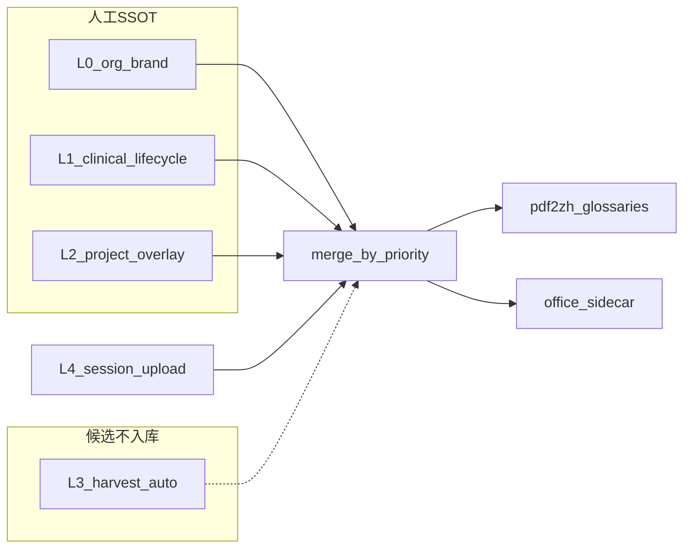

# PLAN-039：临床与专名术语治理

> 状态：待批准纲领（实施前先落盘 `docs/plans/PLAN-039-glossary-governance/`）
> 前置：PLAN-010d 专名表、PLAN-038g 仅接通默认 `--glossaries`，**未**做治理
> 验收门（实施后）：`bash scripts/verify-plan-039.sh` + [WT-039](docs/walkthroughs/)

## 要解决的问题

当前不是「没有词表」，而是**多层互不治理**：

| 层 | 现状 | 问题 |
| --- | --- | --- |
| 仓内 [`glossaries/proper-nouns.csv`](glossaries/proper-nouns.csv) | 010d 人工专名 | 混入页码/日期/题号；几乎只有 EN→ZH |
| 运行时 [`/home/dev/pdf2zh/glossaries/`](file:///home/dev/pdf2zh/glossaries) | `proper-nouns` + `auto` + `qx027n` | 与仓内可能漂移；`qx027n` 项目词与日期混杂 |
| harvest [`scripts/proper_nouns.py`](scripts/proper_nouns.py) | CamelCase/公司后缀 → identity | 只保形，不产出「景行→GenScend」；`auto-*.csv` 不入库（G-WONT-006） |
| sidecar [`static_csv.py`](qyunslation/glossary/static_csv.py) | 默认只读 `qx027n.csv` | 与 GUI 三表不一致 |
| [`glossary_db.py`](qyunslation/extensions/glossary_db.py) | 约 25 条 AD 预置 + JSON | 未进 pdf2zh；可被 merge 覆盖 |
| BabelDOC 自动抽词 | `no_auto_extract_glossary=true` | 保持关闭（吞吐/幻觉） |

用户示例必须一等公民：**江苏景行生物医药有限公司 / 景行生物 → GenScend**（以及已有 `Jiangsu GenScend Biopharma Co., Ltd.` → 中文全称）。方向是**双向**，不是只做英译中。

## 一、目标

1. **一层架构**：词条有 `layer / domain / lang / status`；冲突按优先级，**人工永不被 harvest/自动抽词覆盖**。
2. **专属名词（L0）**：机构、品牌、产品代号、人名；景行/荃信/IQVIA/FDA 等可双向钉死。
3. **生命周期词库（L1）**：按医药开发域分层（发现、CMC、非临床、临床药理、临床运营/终点、安全、注册、统计、IP、HEOR），保证「专业译法稳定」而非百科全收。
4. **可丰富**：从历史译文、立项/方案、任务产物 glossary 挖候选 → **staging 待审** → 晋升 L0/L1/L2。
5. **一处消费**：pdf2zh `--glossaries` 与 sidecar `load_static_glossary` 读同一合并结果。

## 二、词条契约（SSOT schema）

统一 CSV 头（向后兼容现有 `source,target,tgt_lng`）：

- `source,target,src_lng,tgt_lng,layer,domain,sponsor,status,notes`
- `layer`：`org` | `clinical` | `project` | `harvest`
- `domain`：`org` / `discovery` / `cmc` / `nonclinical` / `clinpharm` / `clinical` / `safety` / `regulatory` / `stats` / `ip` / `heor`
- `status`：`curated` | `staging` | `rejected`
- 同一概念可有多行（EN→ZH 与 ZH→EN 各一行）；禁止用一行冒充双向
- 合并键：`(src_lng, source_normalized)`；优先级 **org > clinical > project > session > harvest**

**禁止进 curated**：纯日期、页码、`Question N`、整句背景段、一次性格数字。

## 三、子计划矩阵

| 编号 | 交付 | 顺序 |
| --- | --- | --- |
| **039a** | 架构：schema、merge、冲突、目录约定；`verify-plan-039.sh` 骨架 | 1 |
| **039b** | L0 专名清洗+种子：景行↔GenScend、荃信、监管机构；从 `proper-nouns.csv` 剔除垃圾行 | 2 |
| **039c** | L1 生命周期种子（先自免/抗体常见 80–150 条，按 domain 标注）；迁出 `PRESET_GLOSSARY` | 3 |
| **039d** | 丰富：候选抽取（office_out / 任务 glossary / Vault 立项与方案标题实体）→ staging CSV；CLI 晋升 | 4 |
| **039e** | 运行时并表：生成/同步 `/home/dev/pdf2zh/glossaries/merged.csv`；sidecar 改读 merged；保持 `no_auto_extract` | 5 |
| **039f** | 文档收口：WT-039、回写 010d/038g「已接通但未治理」 | 6 |

## 四、管理与丰富（日常怎么用）

**管理**

- curated 表入库（git）；`auto-proper-nouns.csv` / staging **仍不提交**
- 改 L0/L1 用精确编辑 + 单测（景行、primary endpoint、CRSwNP 等金句）
- 项目词（QX027N 剂量、内部代号）进 L2，不污染全站 L1

**丰富**

- harvest 继续只做 identity 保护（防「GenScend→金斯瑞」）
- 新增 **候选挖词**：从已译对照抽「专名/稳定术语句」→ staging，**人工 `promote`** 才进 L0/L1
- 不重新打开 BabelDOC 全文自动术语抽取

## 五、非目标

- 不引入完整 MedDRA/WHO-DD 许可库
- 不做独立术语后台 Web（沿用 CSV + 现有 Glossary Modal / CLI）
- 不提交 `glossaries/auto-proper-nouns.csv`
- 不把 `auth.csv` / 密码写入词表或 git

## 六、完成定义（纲领级）

- 目录 `docs/plans/PLAN-039-glossary-governance/` 纲领+子计划齐
- 合并优先级有单测；景行→GenScend、GenScend 不被译成金斯瑞
- pdf2zh 与 sidecar 对同一 `source` 得到同一 `target`
- `verify-plan-039.sh` 进 `verify-release.sh`（039e 后）

## 关键已有代码（复用，不另起炉灶）

- 专名 harvest：[`scripts/proper_nouns.py`](scripts/proper_nouns.py)
- GUI 默认三表：[`docs/walkthroughs/WT-038g-product-polish.md`](docs/walkthroughs/WT-038g-product-polish.md)
- sidecar 单文件加载：[`qyunslation/glossary/static_csv.py`](qyunslation/glossary/static_csv.py)
- 预置医学词：[`qyunslation/extensions/glossary_db.py`](qyunslation/extensions/glossary_db.py)（039c 迁出后删除分叉）
