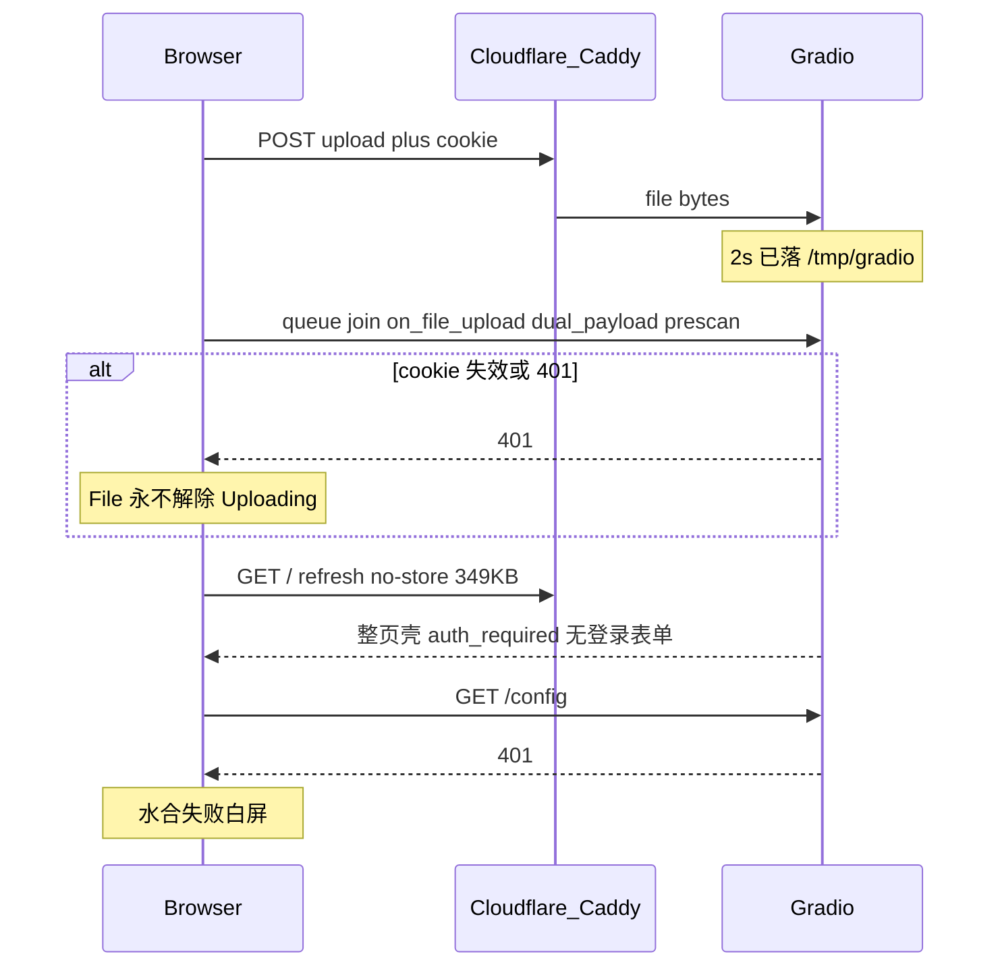

# PLAN-040：上传完成态与鉴权白屏

> 状态：待批准纲领（实施前落盘 `docs/plans/PLAN-040-upload-auth-ux/`）
> 前置：PLAN-020 预览瘦身/stale-guard；PLAN-038g 登录墙（`auth_file`）
> 现场：`611-3期.pdf` 22:10:23 已落盘（413KB / ~2s），UI 仍停在 Uploading；刷新多次白屏
> 验收：`bash scripts/verify-plan-040.sh` + WT-040

## 根因（已坐实，不再侦察）

1. **假上传**：Gradio File 的 Uploading 绑在 `_qy_upload_evt` 整条链（[`apply-pdf2zh-prescan.py`](scripts/apply-pdf2zh-prescan.py) 上 `dual_payload` + tier1/2/3）。字节已到，queue 回执丢了就不收转圈。
2. **白屏**：未登录 `GET /` 仍 200 吐 349KB 应用壳（无登录表单）；`/config` `/gradio_api/upload` `/queue/join` 全 401。JS 水合失败。
3. **重启丢登录**：[`gradio/routes.py`](file:///home/dev/.local/share/uv/tools/pdf2zh-next/lib/python3.12/site-packages/gradio/routes.py) `cookie_id = secrets.token_urlsafe(32)` 每次进程换 cookie **名**。038g/039 多次 restart 后旧 cookie 全废。[`apply-pdf2zh-stale-guard.py`](scripts/apply-pdf2zh-stale-guard.py) 只认 `app_id`，不处理 401。
4. **`no-store` 放大**：每次刷新重拉 349KB（公网曾测 ~3.5s），白屏窗口变长。不撤 no-store（PLAN-020 防陈旧组件树），但未登录不应先吐整棵树。

## 目标

1. 未登录只出登录页（或明确遮罩），禁止先吐可点的整页壳再 401。
2. `cookie_id` 稳定（环境变量 / 落盘密钥），重启不改 cookie 名；失效时横幅「请重新登录」而不是白屏。
3. File 的 Uploading 在 `POST /gradio_api/upload` 成功即结束；预览/prescan 只更新独立状态条。
4. `/config` 401 时 stale-guard 出登录入口，不空转。

## 子计划

| 编号 | 交付 |
| --- | --- |
| **040a** | 鉴权壳：补丁固定 `cookie_id`；未登录 `/` 短页或强制登录 UI；stale-guard 认 401 |
| **040b** | 上传完成态：拆开 `_qy_upload_evt.then(prescan…)` 与 File 加载态；prescan 只写 `qy_prescan_status` |
| **040c** | verify + WT-040；回写 PLAN-020/038g「登录墙副作用」 |

落地形态与现有一致：`scripts/apply-pdf2zh-040a-auth-shell.py`、`apply-pdf2zh-040b-upload-settle.py`，写入 [`scripts/pdf2zh.service`](scripts/pdf2zh.service) 与 [`docs/contracts/pdf2zh-patch-order.md`](docs/contracts/pdf2zh-patch-order.md)（stale-guard / prescan 之后）。不 fork Gradio。

## 非目标

- 不关 Cloudflare、不改上传带宽（G-WONT-005）
- 不撤 `auth_file`、不关 `no-store`
- 不重做预览 base64 瘦身（020 已做）
- 不在本计划做 Office 翻译进度 18.5% 假停（可另开，不挤进 040）

## 完成定义

- 未带 cookie：`GET /` 可见登录，不依赖先水合整棵树
- 重启 pdf2zh 后同一账号 cookie 仍能 `/config` 200（同 `cookie_id`）
- 413KB PDF：File 在数秒内结束 Uploading；prescan 文案在状态条，不挡文件框
- `/config` 401 出「请重新登录」，不白屏
- `verify-plan-040.sh` PASS
