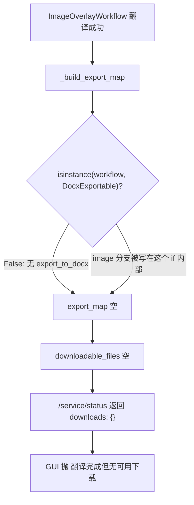

# PLAN-019 高级选项吸底 + 图片翻译下载与中译英

## 三个独立根因（均已实测确认）

### A. 高级选项/翻译按钮「点击就消失」

空态下手风琴行为正常（实测：`flex-wrap: nowrap`、手风琴在按钮下方展开、按钮位置不动）。问题只在**上传文件后**出现：左栏多出「上传框内文件卡片 + 已上传文件列表 + 进度/Error 框」约 200px，把 `action-row` 与手风琴推到左栏 907px 可视区之外，只能靠左栏内部滚动条才能看到。

实测数据（空态、1080p）：左栏 `clientHeight=907`，展开后 `scrollHeight=1153`，手风琴 `bottom=1261` 已超出视口 1080。上传文件后 header 本身就会掉到 1024 以下。

### B. 图片翻译报「翻译完成但无可用下载」

sidecar 侧其实成功：`嵌字完成（2 块）` / `翻译完成，用时 22.72 秒`，但**没有** `成功生成 image 文件` 日志，说明 `export_map` 为空。



`ImageOverlayWorkflow` 只有 `export_overlay`，没有 `export_to_docx` / `save_as_docx`，`runtime_checkable` 的 `DocxExportable` 判定为 False，于是嵌套在里面的 `elif isinstance(workflow, ImageOverlayWorkflow)` 永远进不去。

### C. 中英互译在三种格式上的现状

要求是 PDF、DOCX、图片都能中英双向。逐条查下来障碍各不相同：

- **PDF（数字版，BabelDOC 链路）**：已具备双向能力，只需实测确认。翻译 prompt 用的是动态目标语言（`base_translator.py` 第 186 行 `translate it into {self.lang_out}`）；[scripts/apply-pdf2zh-throughput.py](scripts/apply-pdf2zh-throughput.py) 的跳过启发式已显式写了 `elif lang_in.startswith("zh") and lang_out.startswith("en")` 分支。
- **PDF（扫描件，HPD + ocr-base 链路）**：[scripts/apply-pdf2zh-ocr-base.py](scripts/apply-pdf2zh-ocr-base.py) 只做「整页白底 + 重绘译文」，与语言方向无关；[scripts/doc_profile.py](scripts/doc_profile.py) 与 `doc_profiles.toml` 只管字号字族，没有语言假设。同样只需实测。
- **DOCX（sidecar 链路）**：唯一障碍就是 GUI 补丁写死。sidecar 侧不锁目标语言——[qyunslation/core/schemas.py](qyunslation/core/schemas.py) 第 248 行起的 `ENV_FORCE_OVERRIDE` 分支注释明确写着「目标语言、并发、分块、重试等必须保留用户在前端选择的值」，`forced_fields` 只有 `api_key/base_url/model_id/provider`（office lock 再加 temperature/concurrent/custom_prompt/thinking/glossary）。所以 `office.env` 里的 `DOCUTRANSLATE_TO_LANG=简体中文` 只是缺省值，改 GUI 补丁一处即可放开。
- **图片（ImageOverlayWorkflow 链路）**：三处写死，需要完整打通。
  - [scripts/apply-pdf2zh-office-route.py](scripts/apply-pdf2zh-office-route.py) 第 35 行 `payload = {"workflow_type": workflow_type, "to_lang": "简体中文"}`
  - [qyunslation/extensions/image_translate.py](qyunslation/extensions/image_translate.py) 第 163 行 prompt 固定 `Translate each numbered line to Simplified Chinese`、第 194 行 `del to_lang  # reserved`
  - `ImageOverlayWorkflowConfig` 完全没有 `to_lang` 字段，[qyunslation/server/core.py](qyunslation/server/core.py) 第 1068 行构造时也没传

字体 `/home/dev/.fonts/NotoSansSC.ttf`（Noto Sans SC 含完整拉丁字形），英文嵌字可渲染，但需实测确认字号与换行。

## 改动

### A. 左栏吸底工具条

新增 [scripts/apply-pdf2zh-left-dock.py](scripts/apply-pdf2zh-left-dock.py)（接在 `apply-pdf2zh-adv-options.py` 之后）。**不改 gui.py 的 DOM 结构**，避免破坏 PLAN-015b/017/017b 里大量 `.qy-col-left > xxx` 直接子选择器。

- CSS：`action-row` 与 `.qy-adv-acc` 都设 `position: sticky` + 不透明背景 + 上边框分隔；手风琴 `bottom: 0`，按钮行 `bottom: var(--qy-dock-h, 58px)`
- 手风琴内容 `max-height: min(38vh, 340px); overflow-y: auto`
- JS：复用已注入的 `Blocks(js=...)` tick，每次量 `.qy-adv-acc` 实际高度写入 `--qy-dock-h`，保证展开/折叠时按钮行位置精确
- CSS 兜底：`.qy-col-left:has(.qy-adv-acc .label-wrap.open) .action-row { bottom: calc(58px + min(38vh, 340px)); }`

### B. 图片导出修复

[qyunslation/server/core.py](qyunslation/server/core.py) `_build_export_map`：把 `ImageOverlayWorkflow` 分支从 `if isinstance(workflow, DocxExportable):` 内部提到顶层独立判断。

```python
if isinstance(workflow, ImageOverlayWorkflow):
    suffix = (workflow.document_translated.suffix if workflow.document_translated else ".png") or ".png"
    export_map["image"] = (workflow.export_overlay, f"{filename_stem}.zh{suffix}", False)
```

GUI 侧 `_qy_run_office_sidecar_task` 的 `for key in ("docx", "image", "file")` 已能识别 `image`，无需改。

### C. 目标语言跟随界面（DOCX + 图片）

**C1. sidecar 入口去硬编码**（同时打通 DOCX 与图片）

[scripts/apply-pdf2zh-office-route.py](scripts/apply-pdf2zh-office-route.py)：`_qy_run_office_sidecar_task` 增 `to_lang` 形参，`payload` 改用该值；调用处（`translate_files` 内，`ui_inputs` 在作用域中）传 `ui_inputs.get("lang_to")`，经映射表转成 sidecar 语言名。

```python
_QY_LANG_TO_SIDECAR = {
    "Simplified Chinese": "简体中文",
    "Traditional Chinese": "繁体中文",
    "English": "English",
    "Japanese": "日本語",
    "Korean": "한국어",
}
```

未命中的语言直接透传原标签（sidecar 的 `to_lang` 只进 prompt，自由文本可用）。

**C2. 图片链路透传 to_lang**

1. [qyunslation/extensions/image_translate.py](qyunslation/extensions/image_translate.py)：`translate_texts(texts, to_lang=...)` 按目标语言拼 prompt；`translate_image(..., to_lang)` 不再 `del`；`translate_image_bytes(..., to_lang)` 透传
2. [qyunslation/workflow/image_overlay_workflow.py](qyunslation/workflow/image_overlay_workflow.py)：`ImageOverlayWorkflowConfig` 增 `to_lang: str = "简体中文"`，`translate()` 传下去
3. [qyunslation/server/core.py](qyunslation/server/core.py) 第 1068 行：`ImageOverlayWorkflowConfig(..., to_lang=payload.to_lang)`

**C3. PDF 链路**

无代码改动，只做双向实测。若 `_pdf2zh_skip_already_target_lang` 在 zh→en 时误跳过段落（`skip = han < 0.8` 对中英混排段落偏激进），再针对性调阈值。

### D. 补丁累积（卫生问题，同批处理）

`gui.py` 里 `_qy_run_office_sidecar_task` 重复定义 **64 次**，文件已从约 6600 行涨到 12683 行。Python 取最后一份定义，功能不受影响，但每次重启继续增长。

- 先在 `/tmp` 拿一份 pristine `gui.py`，按 service 的 ExecStartPre 顺序逐个跑补丁并统计 `_qy_office_sidecar` 出现次数，定位重复注入的脚本
- 在 [scripts/apply-pdf2zh-office-route.py](scripts/apply-pdf2zh-office-route.py) 增加去重 pass：只保留最后一份 helper 定义
- 修好后 `gui.py` 应回落到单份定义

## 验收

新增 [scripts/verify-plan-019.sh](scripts/verify-plan-019.sh)：

- `_build_export_map` 中 `ImageOverlayWorkflow` 分支不在 `DocxExportable` 块内
- `image_translate.py` 无 `del to_lang`，prompt 含目标语言变量
- `ImageOverlayWorkflowConfig` 含 `to_lang` 字段且 `core.py` 构造时传入
- office-route 补丁不再出现 `"to_lang": "简体中文"` 硬编码，且含 `_QY_LANG_TO_SIDECAR` 映射
- `gui.py` 中 `_qy_office_sidecar` 出现次数 == 1
- 左栏 dock CSS 存在且排在 adv-options CSS 之后
- 全链补丁跑两遍幂等 + `gui.py` AST 语法通过
- 回归 `verify-plan-017.sh` / `017b` / `018`

浏览器实测（布局）：

1. 上传一个 JPG，确认 `action-row` 与「高级选项」始终吸底可见，展开后按钮不被遮挡、手风琴内部出滚动条

中英互译实测矩阵（六组，每组都要能下载且译文语言正确）：

- 数字版 PDF：英译中、中译英
- 扫描件 PDF：英译中、中译英
- DOCX：英译中、中译英
- 图片 JPG：英译中、中译英（`downloads` 须含 `image` 键，右栏可预览可下载）

其中英译中是回归项（当前行为不能变），中译英是本次新增能力。扫描件 PDF 若中译英排版异常，按 `scanned-doc-layout-fidelity` skill 的口径单独记录，不阻塞本 PLAN 合并。

## 交付

feat 分支 → 精确 commit → `--no-ff` merge main → 推远程 → 重启 `pdf2zh.service` 与 `qyunslation-office.service` → 写 `docs/walkthroughs/WT-019-adv-dock-image.md` 回填哈希。