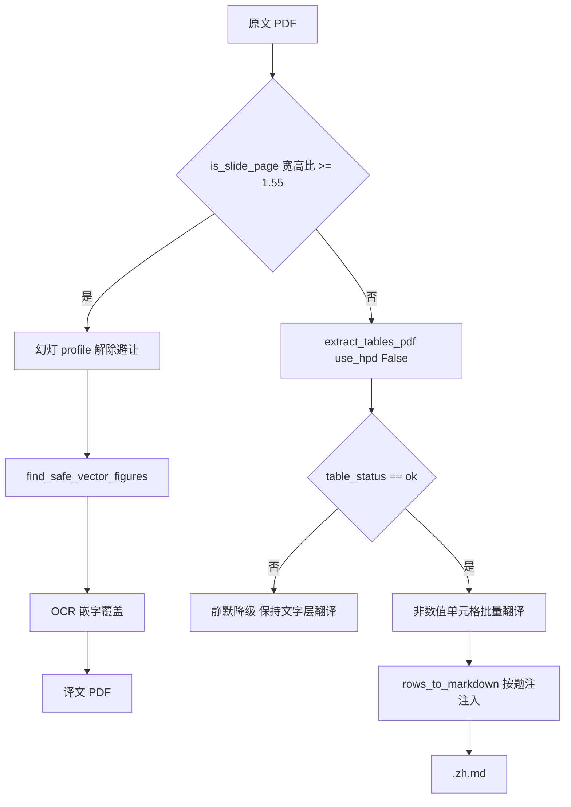

« # PLAN-029 表格译文结构化：期刊 Markdown 管道 + 幻灯 OCR 嵌字

## 背景

PLAN-028 把表格定为「文字层翻译，插图避让」。但 Hermes 文献入库对表格有结构化要求，且两类文档口径相反：

- 期刊类：`find_tables` 抽行列 → `rows_to_markdown` → 按题注注入管道表
- 幻灯片类：[`lit_tables.py:910`](/home/dev/Hermes/scripts/lit_tables.py) `is_slide_page()` 判宽高比 ≥ 1.55 后，`_clip_png` 走 `render_page_png` 整页截图；`find_tables` 在幻灯上会把条形图当表并切掉标题和轴，行列不可信

本计划仅覆盖这两类，其余（FDA 审评、Poster、扫描件、OUP/BJD 矢量刊）能力驱动静默降级。

## 实测基线

跨仓 import 可行性已验证：[`lit_tables.py`](/home/dev/Hermes/scripts/lit_tables.py) 顶层只依赖 stdlib，`fitz`/`hpd_client`/`PIL` 全是函数内 import，在 pdf2zh venv 里 import 成功。

期刊样本 `41467_2024_Article_53384.pdf`（Nature Communications，Springer 系）：

- `extract_tables_pdf(use_hpd=False)` 耗时 15.4s，抽出 3 张表
- T1 p4 `pending`（28 行塌陷成 2 列），T2 p5 `unstructured`（find_tables 空），T3 p9 `ok`
- 可注入率 1/3

幻灯样本 `QX027N QnA-2026.08.19-临床.pdf`（16:9，17 页）：

- `is_slide_page` 判定 17/17，无误判
- 逐关卡淘汰统计：`text_overlap` 25、`table` 13、`area` 10、`min_drawings` 7 页、`too_small` 2，`PASS` 10
- 仅解除表格避让（`tables=[]`）：矢量区域 8 → 9，增益不足

结论：幻灯页真正的瓶颈是 `TEXT_OVERLAP_MAX=0.1` 的正文防触碰，需整套 slide profile。

## 数据流



## 029a 期刊类 Markdown 表管道

新增 `scripts/md_tables.py`，对外只暴露 `inject_translated_tables(md_text, src_pdf, *, timeout_s=60) -> tuple[str, dict]`。

跨仓引用 Hermes（不复制代码，避免口径漂移）：

```python
sys.path.insert(0, "/home/dev/Hermes/scripts")
from lit_tables import (
    extract_tables_pdf, rows_to_markdown, trim_glued_rows,
    find_body_caption, caption_span, is_slide_page,
)
```

处理步骤：

1. 幻灯片 PDF 直接返回原文，本路径不接管（首页 `is_slide_page` 为真即跳过）
2. `extract_tables_pdf(src, use_hpd=False)`，**只保留 `table_status == "ok"`**；`pending`/`unstructured` 静默跳过，不写 `mark_unstructured` 提示块（按已确认的 skip_silent 口径）
3. `trim_glued_rows(rows)` 截断粘连表
4. 单元格翻译：**纯数值单元格原样保留**，用 `lit_tables.NUM_RE` 全匹配判定（含 `%`、`±`、`(SD)` 数字组合）。剩余文本 cell 去重后经 `letter_translate_prompt.translate_blocks` 批量翻译，再按索引回填
5. `rows_to_markdown(zh_rows)` 生成管道表
6. `find_body_caption` + `caption_span` 在译文 md 中定位题注行，表体插到题注之后
7. 返回统计 `{ok, skipped_pending, skipped_unstructured, injected, elapsed}`

挂载点在 [`export_md_docx.py`](/home/dev/qyunslation/scripts/export_md_docx.py) 的 `export_formats`，两条路径（debug json 与 ConverterHpd）在 md 写盘前统一调用一次，失败则原样落盘不阻断导出。

不做整表 LLM 输入：只送单元格文本，杜绝模型改写数值。

## 029b 幻灯片 OCR 嵌字破例

[`pdf_figure_crop.py`](/home/dev/qyunslation/scripts/pdf_figure_crop.py) 新增幻灯 profile。PLAN-028 已加的 `tables=` 关键字参数直接作为避让开关，内核签名不变：

- 表格避让：传 `tables=[]`，第 142 行 `any()` 对空列表恒 False
- 正文防触碰与面积上限改为可传入，幻灯页放宽（`TEXT_OVERLAP_MAX` 0.1 → 待标定，`MAX_AREA_FRAC` 0.8 → 待标定）

[`pdf_image_translate.py`](/home/dev/qyunslation/scripts/pdf_image_translate.py) 第 334 行策略 B 处按页判型：

```python
slide = is_slide_page(page)
figures = find_safe_vector_figures(
    page, exclude_rects=exclude,
    tables=[] if slide else None,
    text_overlap_max=SLIDE_TEXT_OVERLAP if slide else None,
)
```

阈值标定作为独立任务：用 17 页幻灯样本扫参，目标是覆盖当前被 `text_overlap`/`table` 挡掉的 38 个区域中的大部分，同时不触发整页覆盖（`area_frac` 硬上限保留）。保留既有 QC 关卡不放宽：`policy.evaluate_image_candidate` 与 `_translate_via_local` 返回 `n <= 0` 时跳过。

期刊类 PDF 的矢量图行为零变化，避免 PLAN-028 回归。

## 029c 验收与文档

`scripts/verify-plan-029.sh` 断言：

- 跨仓符号存在：`extract_tables_pdf`/`rows_to_markdown`/`trim_glued_rows`/`is_slide_page` 可 import（Hermes 改动的早期告警）
- 期刊样本：`ok` 表注入后 md 含 `| --- |` 分隔行，且原数值字符串逐一出现在译文表中（数值零改写）
- 期刊样本：`pending`/`unstructured` 表不产生任何注入痕迹
- 幻灯样本：`is_slide_page` 17/17；破例后矢量区域数落在标定区间内
- 期刊样本矢量区域数与 PLAN-028 基线一致（12）
- `apply-*.py` 幂等

文档 `docs/plans/PLAN-029-table-structuring/` 纲领与三份子计划，`docs/walkthroughs/WT-029-table-structuring.md`。

## 质量红线

- 数值绝不进 LLM 改写路径，纯数值单元格原样透传
- `table_status != "ok"` 一律不注入，宁可少做不可做错
- 幻灯 profile 严格按页门控，非幻灯页行为零变化
- `md_tables` 任何异常都降级为原文落盘，不阻断 md/docx 导出

## 不做

- FDA 审评、Poster、扫描件、OUP/BJD 矢量刊的表格结构化
- HPD 视觉解析降级（`use_hpd=True`）
- 译文 PDF 内嵌 Markdown 表（PDF 仍走文字层翻译）
- 跨页续表合并 »