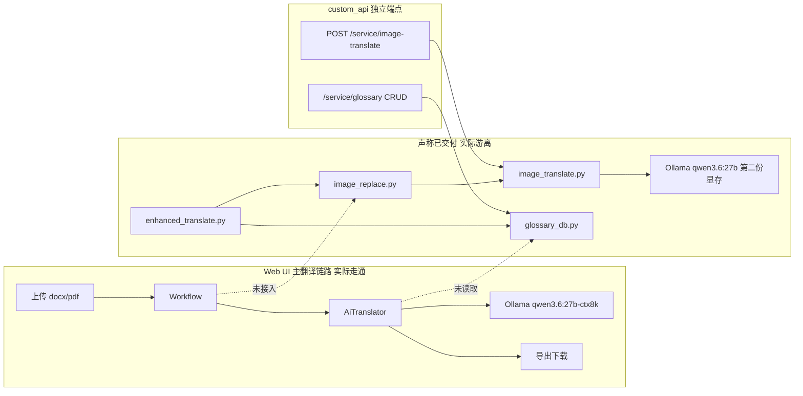

## 1 全面技术审核与 GPU 利用优化(PLAN-001)

### 目标

一句话:把「提交说明声称已交付、实际未接入主链路」的功能补齐,并让翻译并发口径与泰州 Ollama 的真实 GPU 调度能力对齐。

### Out of Scope

- 不改 DocuTranslate 上游的 workflow/translator 架构,只加接入点
- 不在泰州新部署推理服务(HPD 与 Ollama 均已就绪,本 PLAN 只做**客户端接入**)
- 不做多租户/鉴权改造
- 不改 Ollama / HPD 服务端配置本身(仅出具建议值,由运维在 100.67.66.123 落地)
- 不引入 manga-image-translator 整包依赖(GPL-3.0,与本项目 MPL-2.0 有传染风险;只借鉴其管线分段思路)

### 前置条件与已核实事实

- 本机(Vultr)无 GPU,`nvidia-smi` 不存在;算力全在泰州 `100.67.66.123`
- **泰州 = 2×RTX 5090 共 64GB**,按 `Hermes/docs/plans/PLAN-029-hpd-deploy/PLAN-029.md` 的设计 Ollama 与 HPD 分卡(该文档写 Ollama→GPU0/HPD→GPU1,但 `translation-project-eval.md` 写 Ollama 在 GPU1,**当前实际分配需在 001a 实测确认**)
- **Ollama** 0.30.7 `:11434` 可达;`qwen3.6:27b-ctx8k` Q4_K_M 约 16.6GB;实测 `/api/ps` 为空即当前无驻留
- **HPD-Parsing 已部署并健康**:`http://100.67.66.123:8120`,`POST /parse` body `{"image_b64":…}`,`GET /health` 返回 `{"status":"ok"}`(本次实测)
- **本机→泰州上行实测 84.8 KB/s**(400KB payload 4.6s),显著优于 `hpd-benchmark.md` 记录的 10–25KB/s;199KB 真实样本图端到端 **wall 3.8s = 上传 3.4s + HPD 推理 0.4s**(本次实测)
- 现状基线:75 个测试全绿(`.venv/bin/python -m pytest tests/`),但 8 个改动文件未提交

---

## 2 缺口登记表(已查实,本次审核产出)

### 2.0 P 类 — 与原始立项计划的偏离(最高优先,依据最硬)

本项目的**权威预期**不是 git 提交说明,而是 `Hermes/tasks/translation-project-plan.md`(2026-08-13 用户拍板)+ `translation-project-eval.md`(选型评估)+ `translation-project-poc.md`(阶段 0 PoC 报告)。逐条比对后,实际交付在四处偏离了拍板方案:

- **P1 严重** — **OCR 引擎整条选错**。原计划 §1 明确「OCR:**HPD(泰州,1s/页)为主** + PaddleOCR 兜底」,PoC §5 阶段 1 前置准备第 2 条重申「OCR 切 HPD 为主、PaddleOCR 兜底」。实际交付用的是**本机 CPU 版 `rapidocr_onnxruntime`**(`image_translate.py:21`),HPD 一行代码都没调。而 HPD 的 `hpd-benchmark.md` 实测 **0.54s/页、41/41 项数值文字全对、比 qwen3.6:27b OCR 快 26–44 倍**,且**输出带精确坐标**——本次实测样本返回 `<BLOCK>title [73, 57, 548, 83]<CHILD>Admission Medical Record`,正是嵌字所需的 `[x1,y1,x2,y2]` 格式,还额外带 `title`/`text` 语义类型。**这是本次审核发现的最大单点损失**:一个已部署、更快、更准、带坐标的专用文档解析模型被完全闲置,GPU1 空转,同时让本机 CPU 扛 OCR。
- **P2 高** — 嵌字管线未按拍板方案复用。原计划 §1 与 PoC §5 均指定「复用 manga-image-translator 四段管线:Detector(CTD) → OCR → Translator → **Inpainter(lama)** → Renderer」。实际是自写三段:RapidOCR → Ollama → **`cv2.INPAINT_TELEA`** + PIL。`cv2.inpaint` 是传统扩散算法,原计划风险表已预判「inpainting 复杂背景(流程图箭头/框线)」需 lama 模型应对,实际用了最弱的方案。注:manga-it 是 GPL-3.0,整包引入与本项目 MPL-2.0 冲突(eval §5 风险表已点明),所以**结论不是照搬 manga-it,而是补齐 inpaint 质量**(lama 可独立以 ONNX 形式引入)。
- **P3 高** — **翻译记忆 TM 完全缺失**。原计划阶段 3「专业知识库」含两件事:术语表 + **翻译记忆 TM(翻译对存档 + 相似句检索复用,向量或 BM25)**,验收标准是「二次翻译同类文档,术语一致性显著提升 + **TM 命中复用**」。实际只做了 `glossary_db.json` 平文件术语表,**TM 一行没有**。这同时也是 GPU 浪费源:没有 TM 就没有跨文档复用,相同段落每次都重新烧 GPU(与 G7 同源)。
- **P4 中** — PDF 解析通道实际是关闭的。PoC §3 已记录「docling 在 Vultr CPU 跑布局检测 295s/文档」,优化方向是「docling GPU 化(泰州)或换 mineru」。当前 `.env` 取 `DOCUTRANSLATE_CONVERT_ENGINE=identity` —— 等于**绕过**了 PDF 解析,PDF 场景实际不可用,而原计划的需求矩阵里 PDF(文字版/扫描件/混合)是三分之二的目标输入类型。优化方向从未落地。
- **P5 中** — PoC 遗留小项未闭环登记。PoC §6 列了三项:术语表自动生成 JSON 输出调优(`force_json`)、**漏翻检测(中英混杂检测标记 review)**、docling 加速选型。其中第二项正是当前**未提交 WIP** 在做的事(`docx_translator.py` 的 `_validate_translations`、`segments_agent.py` 拒绝原文兜底),但没有任何文档把它标记为「PoC 遗留项已闭环」,导致进度不可见(与 D1 同源)。

### 2.1 交付断层 D 类 — 声称做了但主链路走不通

- **D1 严重** — 质量门禁成果未入库。`docutranslate/agents/segments_agent.py`、[docutranslate/server/core.py](docutranslate/server/core.py)、[docutranslate/translator/ai_translator/docx_translator.py](docutranslate/translator/ai_translator/docx_translator.py) 等 8 文件为未提交改动,而 `tests/test_docx_integrity_red.py`、`tests/test_failure_gate_red.py`、`tests/test_log_history_red.py` 已因这些改动**全部转绿**。即成果已完成却随时可丢,且 `git log` 上看不到。
- **D2 严重** — 文档内嵌图嵌字未接入导出链路。[image_replace.py](image_replace.py) 的 `translate_docx_images` / `translate_markdown_images` 在 `docutranslate/` 包内**零引用**;用户走「上传 docx → 翻译 → 下载」时图内文字**保持原文**。
- **D3 严重** — 术语表双轨割裂。前端 `ExtensionsModal.vue` 增删的术语写入 [glossary_db.py](glossary_db.py) 的 `glossary_db.json`,而主翻译请求读的是 `payload.glossary_dict`(来自 CSV 上传)。UI 里维护的术语**不进翻译 prompt**。
- **D4 严重** — 「一条龙」只是外挂 CLI。[enhanced_translate.py](enhanced_translate.py) 硬编码 `http://127.0.0.1:8010`,反向调用自己的 HTTP API,全仓库无任何 `import enhanced_translate`;Web UI 主流程完全不经过。
- **D5 严重** — 打包后扩展功能必然消失。`pyproject.toml` 的 `include = ["docutranslate*"]` 不含根目录 4 个脚本;`full.spec` 也未收录。`docutranslate/custom_api.py` 靠 `sys.path.insert` 引根目录文件,pip/PyInstaller 安装后必 ImportError,被 [docutranslate/app.py](docutranslate/app.py) 的 `try/except` **静默吞掉**,主服务照常启动、扩展 API 无声失效。
- **D6 高** — 依赖声明方向反了。`image_translate.py` 顶层 `import cv2`,但 `opencv-python` 只在 `dependency-groups.dev` 和 `optional-dependencies.docling` 里,**不在主 dependencies**;而 `rapidocr-onnxruntime`(约百 MB ONNX)却进了主 dependencies。生产安装 = 有 OCR 无 cv2 = 扩展 API 直接挂。
- **D7 中** — `glossary_dict` 键规范化不一致。`docutranslate/glossary/glossary.py` 的 `__init__` 保留原始大小写,`update` 却用 `src.strip().lower()` 查重,同一术语可产生重复项;`segments_agent.py:360` 的 `update_glossary_dict` 用裸 `|` 合并,再次绕过规范化。这正是提交说明里「glossary_dict 参数有 bug」的实体。
- **D8 中** — 构建产物脏。`docutranslate/static/assets/` 下 8 个 `index-*.js` 并存(4 个 untracked),且历史提交 2758d60 引用的 `index-BUegbM3c.js` / `index-OiX_Rs2A.css` 已从仓库消失 —— 该 commit 单独 checkout 前端加载不出来。

### 2.2 GPU 利用 G 类 — 并发口径与真实调度能力错配

- **G1 严重** — `concurrent` 默认 **30**(`docutranslate/config.py:108`)与 Ollama 的 `OLLAMA_NUM_PARALLEL`(通常 1–4)严重错配。超出部分并不并行,只是压进 Ollama 内部队列,持续占 KV cache 并放大 1200s 超时风险,**不提速反增故障**。
- **G2 严重** — 模型无驻留。实测 `/api/ps` 返回 `{"models":[]}`,即 `qwen3.6:27b-ctx8k`(Q4_K_M,16.6GB)已被卸载;每轮翻译都要冷加载 16.6GB。
- **G3 严重** — 图片翻译加载第二份 27B。`image_translate.py:26` 硬编码 `MODEL = "qwen3.6:27b"`,而 `.env` 用 `qwen3.6:27b-ctx8k`。Ollama 按 model name 起 runner,两个名字 = **两份约 16.6GB 显存**。
- **G4 高** — 并发乘法叠加且后端无门禁。前端 `queue_concurrent`(默认 3)× 后端 `concurrent`(30)≈ 90 路并发打向 Ollama;`docutranslate/server/core.py` 直接 `loop.create_task`,**无全局任务/LLM 并发上限**;`QueueSettingsModal.vue` 还明示手动逐个点开始不受队列限制。
- **G5 严重** — 整张 GPU1 闲置(即 P1 的资源侧表述)。HPD 专用文档解析模型已驻留在泰州另一张 5090 上,`/health` 正常,平均 0.54s/页;而图片 OCR 却压在本机 Vultr 的 CPU 上。同时 `qwen3.6:27b` 自带视觉塔(`model_info` 含 `qwen35.vision.block_count: 27`),服务器还有 `qwen3-vl:8b` —— 但这两条**都不该用来做嵌字 OCR**:`literature-knowledge-base` skill 的实测记录显示 `qwen3-vl:8b` 中文扫描件效果差(12s/页)、`hyocr` 输出乱码已弃用、`qwen3.6:27b` 虽最准但 23.7s/页。**HPD 在速度和精度上同时碾压这三者**,且只有它输出可用坐标。
- **G6 中** — `extra_body` 调 Ollama 参数是死路。`docutranslate/agents/agent.py:473` 用 `data.update(extra)` 把 extra_body 顶层合并进 `/v1/chat/completions`,而 Ollama 的 OpenAI 兼容层**不识别** `options` / `keep_alive`。正确路径是 Modelfile 变体(`-ctx8k` 已实测生效,`num_ctx 8192`)+ 服务端 `OLLAMA_KEEP_ALIVE`,需写进文档避免后人再踩。
- **G7 中** — 无翻译结果缓存。`docutranslate/cacher/` 只缓存 PDF→MD 转换,相同分块重复烧 GPU。
- **G8 中** — 术语表生成与翻译两阶段串行(`txt_translator.py:280-294`),开启 `glossary_generate_enable` 时 GPU 调用量约翻倍。
- **G9 中** — 图片逐张串行 + 独立 `urllib.request`(`image_translate.py:56`),不复用 httpx 连接池、不受 `concurrent` / RPM 限流管辖,是第二条失控 GPU 链路。

### 2.3 断层示意



---

## 3 子计划拆分与落地步骤

计划体系落在 `docs/plans/PLAN-001-delivery-gpu-audit/`(项目此前无 `docs/`,本 PLAN 一并建立),WT 落 `docs/walkthroughs/`,verify 脚本落 `scripts/`。执行顺序 **b → a → c → d → e**:001b 先把已完成成果锁进 git(否则后续任何操作都有丢失风险),001a 的实测需要一个干净基线。

---

### PLAN-001b 质量门禁成果入库 + 构建产物治理

修 D1、D8。**最紧急,且零新增代码**——8 个改动文件已让 3 个 `_red` 测试转绿,只是没 commit。

已核对的 diff 内容(可直接写进 commit message):

- `segments_agent.py`(+133/-…):删除 `_result_handler` 里 `for key in missing_keys: final_chunk[key] = str(original_chunk[key])` 的原文回填;`_error_result_handler` 从「返回原文兜底」改为 `raise AgentResultError`;新增 `_assemble_translated_segments()` 统一同步/异步两条装配路径并对缺失 ID 硬失败
- `core/schemas.py`(+8/-…):`ENV_FORCE_OVERRIDE` 的覆盖范围从「所有 env_values」收窄为 `forced_fields = {"api_key","base_url","model_id","provider"}`,不再改写用户的 `to_lang`/`concurrent`/`chunk_size`/`retry`
- `core/factory.py`(+1):`MarkdownBasedWorkflow` 补 `md2docx_exporter_config=None` 显式传参
- `server/core.py`(+116/-…):日志 seq 单调游标、`get_task_logs_since()`、导出前 `_translation_failure_message()` 失败门禁
- `app.py`(+10)、`useTasks.js`(+15):`/service/logs/{id}?since=` 增量日志前后端配套
- `docx_translator.py`(+34/-…):段落不再按 run 样式切碎、导出前 `_validate_translations()`

落地步骤:

1. `git checkout -b feat/PLAN-001b-quality-gate-commit`
2. 建 `docs/plans/PLAN-001-delivery-gpu-audit/` 目录,写入本纲领 + `PLAN-001b-*.md`
3. 复核 `git diff` 无调试残留(`print`、`breakpoint`、注释掉的代码)
4. 构建产物治理:确认 [docutranslate/static/index.html](docutranslate/static/index.html) 第 8/9/16/17 行引用的 `index-fPyb8_SG.js`、`index-SRVCmluz.css`、`polyfills-legacy-Cw9ri4tN.js`、`index-legacy-wZi83_OM.js` 为当前唯一生效构建;`git rm` 掉 tracked 但已不被引用的 `index-CmfOhxGQ.js`、`index-ThuhZZ16.js`、`index-legacy-6qrZALDV.js`、`index-legacy-DOQvkQNo.js`;直接删除 untracked 且不被引用的 `index-7n_U8eKm.js`、`index-legacy-BIsObzxA.js`
5. `.gitignore` 增 `.coverage`、`htmlcov/`;`git rm --cached` 若已被跟踪
6. `.venv/bin/python -m pytest tests/` 必须仍 75 通过
7. 精确暂存(禁止 `git add .`):

```bash
git add docs/plans/PLAN-001-delivery-gpu-audit/ .gitignore \
        docutranslate/agents/segments_agent.py docutranslate/app.py \
        docutranslate/core/factory.py docutranslate/core/schemas.py \
        docutranslate/server/core.py docutranslate/static/index.html \
        docutranslate/static/assets/index-fPyb8_SG.js \
        docutranslate/static/assets/index-legacy-wZi83_OM.js \
        docutranslate/translator/ai_translator/docx_translator.py \
        frontend/src/composables/useTasks.js \
        tests/test_docx_integrity_red.py tests/test_failure_gate_red.py \
        tests/test_log_history_red.py tests/test_config_preserves_user_options.py
```

8. commit 后 `git merge --no-ff` 进 main;`git log main..feat/PLAN-001b-*` 须为空

风险提示:这批改动会让「模型未返回全部分段」由静默导出原文变成**任务报错**。合入后用户会看到更多失败任务——这是正确行为,但需在 WT 里写明,并配合 001d 降并发以降低失败率。

---

### PLAN-001a 审计报告与 GPU 基线实测

诊断性,不改业务代码。产出 `docs/plans/PLAN-001-delivery-gpu-audit/AUDIT-001-baseline.md` 与 `docs/perf/baseline-001a.json`。

必做实测项(每项都要落数据,不许写「大概」):

SSH 入口:`genscend@100.67.66.123`(见 skill `weixin-remote-servers`,**不是** ubuntuser)。

1. **卡分配确认**(已知 2×RTX 5090 / 64GB,驱动 NVML mismatch 用户已确认修复,HPD 跑出 0.54s/页即为佐证;待确认的只是谁占哪张):`nvidia-smi --query-compute-apps=pid,used_memory,gpu_uuid --format=csv` + `nvidia-smi --query-gpu=index,name,memory.total,memory.used,utilization.gpu --format=csv`。`PLAN-029` 设计为 Ollama→GPU0 / HPD→GPU1,但 `translation-project-eval.md` 写 Ollama 在 GPU1,存在文档冲突需实测定论——这决定 001d3 的图片链路会不会与翻译抢同一张卡
2. **服务端调度参数**:取该机 Ollama 的 `OLLAMA_NUM_PARALLEL`、`OLLAMA_MAX_LOADED_MODELS`、`OLLAMA_KEEP_ALIVE`、`OLLAMA_SCHED_SPREAD`、以及是否 pin 了 `CUDA_VISIBLE_DEVICES` 实际生效值(`systemctl show ollama -p Environment` 或 `/proc/<pid>/environ`);0.30.x 未设时 `num_parallel` 由显存自动推导为 1 或 4,必须实测确认
3. **驻留观测**:翻译前 / 中 / 后各打一次 `curl -s http://100.67.66.123:11434/api/ps`,记录 `size_vram`、`expires_at`;量化「16.6GB 冷加载耗时」
4. **并发曲线**:固定一份约 20 页 docx,`DOCUTRANSLATE_CONCURRENT` 取 1/2/4/8/30 各跑 1 次,记录端到端墙钟、`unresolved_errors`、超时次数、平均 tok/s
5. **extra_body 对照实验**:发两次 `POST /v1/chat/completions`,一次带 `{"options":{"num_ctx":2048}}` 一次不带,对比响应 —— 验证 G6 的结论「Ollama OpenAI 兼容层忽略 `options`/`keep_alive`」。若确认忽略,则把「调 num_ctx 只能靠 Modelfile 变体」写进 `.env.example` 注释
6. **Modelfile 参数复核**:实测 `qwen3.6:27b-ctx8k` 的 `parameters` 含 `presence_penalty 1.5`、`temperature 1`、`num_ctx 8192`。`presence_penalty 1.5` 对翻译任务偏高(会惩罚必要的术语重复,可能造成同一术语前后译法不一致),需做 A/B:`presence_penalty` 1.5 vs 0 各翻同一段含重复术语的文本,人工比对术语一致性
7. **双 runner 验证**:先跑一次主翻译(用 `-ctx8k`),再跑一次 `/service/image-translate`(用 `qwen3.6:27b`),期间 `api/ps` 观察是否出现两个条目及显存总占用 —— 为 G3 定量

---

### PLAN-001c 扩展能力接入主链路

修 D2–D7。这是本 PLAN 代码量最大的一块,建议再拆 c1/c2/c3 分别 commit。

**c1 模块收敛与打包修复**(修 D5、D6)

- 新建 `docutranslate/extensions/__init__.py`,把 [image_translate.py](image_translate.py)、[image_replace.py](image_replace.py)、[glossary_db.py](glossary_db.py) 移入(git mv 保留历史),使其被 `pyproject.toml` 的 `include = ["docutranslate*"]` 覆盖
- 删除 `docutranslate/custom_api.py` 中的 `sys.path.insert(0, str(Path(__file__).resolve().parent.parent))`,改为 `from docutranslate.extensions.glossary_db import ...`
- `pyproject.toml`:`opencv-python>=4.12.0.88` 从 `dependency-groups.dev` 提到 `[project].dependencies`;评估把 `rapidocr-onnxruntime` 降为 `optional-dependencies.ocr`(若 001d 决定改用 VLM 则直接移除)
- 硬编码清理:`image_translate.py:24-26` 的 `OLLAMA`、`FONT`、`MODEL` 三个常量改为读 `docutranslate/config.py`(新增 `IMAGE_TRANSLATE_MODEL`、`IMAGE_FONT_PATH`,默认回落到 `MODEL_ID`/`BASE_URL`),字体路径 `/home/dev/.fonts/NotoSansSC.ttf` 需内置或走 env
- [docutranslate/app.py](docutranslate/app.py):1180-1184 行的 `try/except` 保留(不阻断主服务)但把 warning 升级为「记录失败原因到模块级变量 `EXTENSIONS_ERROR`」;新增 `GET /service/health`(放在 `service_router` 的 `/meta` 端点旁,约 880 行)返回 `{"version":…, "extensions": {"available": bool, "error": str|None}}`,让打包后失效可被发现

**c2 图片嵌字接入导出链路**(修 D2)

关键决策:**挂在服务层导出循环,而不是各 workflow**。[docutranslate/server/core.py](docutranslate/server/core.py) 的 `_build_export_map` 之后有统一循环(约 594-604 行):

```python
for file_type, (export_func, filename, is_string_output) in export_map.items():
    content = await asyncio.to_thread(export_func)
    content_bytes = content.encode("utf-8") if is_string_output else content
    # ← 在此按 file_type 分支插入图片嵌字
```

这样一处改动覆盖全部 workflow(docx/markdown/html/pdf),不用改 `docx_workflow.py`、`md_based_workflow.py` 各一份(基类 `workflow/base.py` 确认无 `pre_export` 钩子可复用)。

- `file_type == "docx"`:`translate_docx_images(input_docx, output_docx)` 只接**路径**,需 `tempfile.NamedTemporaryFile` 写入 `content_bytes` → 调用 → 读回;参考 `enhanced_translate.py:70-78` 已有的落盘写法
- `file_type == "markdown"`:`translate_markdown_images(md_text) -> (new_md, count)` 接字符串、返回字符串,可纯内存处理
- 用 `asyncio.to_thread` 包裹(OCR 与 cv2 是阻塞的),并接 `progress_tracker` 报进度
- 加开关 `DOCUTRANSLATE_TRANSLATE_IMAGES`(默认 **false**,避免所有用户被动付上 OCR 耗时),前端在 ExtensionsModal 或主设置区暴露勾选
- 嵌字失败必须**降级不阻断**:图片处理异常只记 warning 并保留原图,不能让整个导出失败

**c3 术语表桥接与键规范化**(修 D3、D7)

- 桥接点选 `custom_prompt` 而非 `glossary_dict`:后者经 `segments_agent.py:102-106` 的 `_pre_send_handler` 只注入「当前 chunk 里出现过」的术语且提示很弱;`glossary_db.build_glossary_prompt()` 产出的是全表中文硬指令,效果更强(这也是上一轮定制绕过 bug 的原因)
- 注入位置:`docutranslate/server/core.py` 的 `start_translation`(约 410 行前)或 payload 归一化处,把 `load_glossary()` 的结果经 `build_glossary_prompt()` 追加到 `payload.custom_prompt` **之后**(保留用户自填内容,用 `\n` 拼接)。注意 `/service/translate/file` 端点(app.py:376-395)直接收 `Json[TranslatePayload]`,不走 `/flat-translate` 的 `payload_dict` 构建,所以桥接必须放在 service 层而非 app 层,才能同时覆盖两个入口
- 加开关 `DOCUTRANSLATE_GLOSSARY_DB_ENABLE`(默认 true),并在任务日志里打一行「已注入 N 条术语库术语」,让 V6 可验证
- 键规范化统一:`docutranslate/glossary/glossary.py` 的 `__init__` 与 `update` 统一走同一个 `_normalize_key()`(`strip().lower()`),`segments_agent.py:360-364` 的 `update_glossary_dict` 裸 `|` 合并改为调 `Glossary.update`
- 补测试:`tests/test_glossary/test_glossary.py` 增「大小写混合初始化 + update 不产生重复项」用例;新增 `tests/test_glossary_bridge.py` 断言 `custom_prompt` 内含术语库内容

**关于 `enhanced_translate.py`**:c2+c3 完成后,它的三步编排(术语注入→翻译→嵌字)已全部内聚进服务层。此时应**删除**该文件(或降级为 `examples/` 下的 SDK 用法示例),消除硬编码 `http://127.0.0.1:8010` 的自调用反模式。`tests/test_enhanced_translate.py` 相应改写为对服务层新链路的测试。

---

### PLAN-001d GPU 资源利用优化

修 G1–G9,全部调参必须引用 001a 的实测数据。

**d1 并发口径对齐**(修 G1、G4)

- 依 001a 第 2、4 项把 `.env` 的 `DOCUTRANSLATE_CONCURRENT` 设为与实际 `OLLAMA_NUM_PARALLEL` 匹配的值(单模型单实例通常 2–4);同步改 `docutranslate/config.py:108` 的默认值 30 —— 30 这个默认值是给云端 API 设计的,对本地 Ollama 有害
- 后端全局门禁:`TranslationService.__init__`(core.py:249-262)增 `self._global_translation_semaphore = asyncio.Semaphore(N)`,在 `_perform_translation` 入口(约 530 行 `try:` 之后)用 `async with` 包裹翻译体。**不要**在 `create_task` 前同步 acquire,那会阻塞 HTTP 响应;在后台协程内 acquire 才能保持「立即返回 task_id + 排队」的语义
- 排队可见性:acquire 前给任务打日志「排队中,前方 N 个任务」,并把状态写进 `tasks_state`,前端轮询能看到
- 前端 `queue_concurrent` 默认 3 → 1,并在 `QueueSettingsModal.vue` 的说明里点明「后端已有全局门禁,此处仅控制本浏览器提交节奏」

**d2 消除第二份 27B runner**(修 G3)

- `image_translate.py:26` 的 `MODEL = "qwen3.6:27b"` 改为读 `.env` 的 `DOCUTRANSLATE_MODEL_ID`(即 `qwen3.6:27b-ctx8k`),让图片链路与主链路**共用同一个 runner**,直接省下约 16.6GB 显存
- 若确定要为图片用不同模型(如 `qwen3-vl:8b`),必须在 001a 确认显存能同时容纳,并设 `OLLAMA_MAX_LOADED_MODELS` ≥ 2

**d3 OCR 切换到 HPD**(修 P1、G5;本 PLAN 收益最高的一项)

不再做「VLM 能不能替代 OCR」的开放式评估——HPD 已部署、已 benchmark、且是原计划拍板的方案,直接接入。

- 新增 `docutranslate/extensions/hpd_client.py`,移植 `Hermes/mcp/hpd-mcp/server.py` 的两个函数:`parse_via_http(image_b64)` 调 `POST http://100.67.66.123:8120/parse`,以及 `hpd_to_text(raw)` 解析 `<BLOCK>` 流。端点走 `config.py` 新增的 `HPD_BASE_URL`,不硬编码
- **必须自己写 BLOCK 解析器**,不能复用 `hpd_to_text` —— 它只取 `<CHILD>` 后的文字、**把坐标丢掉了**,而坐标正是嵌字要的。需要解析成 `[(x1,y1,x2,y2,text,block_type)]`,与现有 `ocr_image()` 的返回结构对齐,这样 `translate_image()` 的下游(取色、inpaint、嵌字)一行不用改
- 关键技术差异要处理:**HPD 的 block 粒度比 RapidOCR 粗**。实测 `<BLOCK>text [72, 241, 864, 283]<CHILD>History: The patient reports repeated eczema-like rash…` 是一个高 42px 的双行块,而 RapidOCR 给的是单行框。嵌字时需在 block 内按框宽做**中文折行**(原计划风险表已预判「中文更紧凑 → 字号自适应 + 多行折行」),不能像现在这样单行 `d.text()` 直接画
- HPD 额外给的 `title`/`text` 语义类型要用起来:`title` 用更大字号,比现在 `size = max(12, min(int((y2-y1)*0.9), 40))` 的纯几何推断更稳
- 降级链:HPD 不可达或 `/parse` 报错 → 回落本机 RapidOCR → 再失败则保留原图并 warning。`rapidocr-onnxruntime` 因此**保留**但降为 `optional-dependencies.ocr`(呼应 c1)
- 带宽策略:本次实测上行 84.8 KB/s,199KB 图端到端 3.8s(上传占 3.4s,是瓶颈但可接受)。所以**不做**原计划设想的 tar 批量打包(复杂度不划算),改为:上传前 `cv2.imencode` 重压为 JPEG q85(设计图/流程图通常可无损感知地压到 1/3)+ 多图 `asyncio.gather` 并发上传做流水线(上传第 N+1 张时 GPU 在算第 N 张),受 d1 全局门禁管辖
- 单线程服务约束:`hpd-benchmark.md` 附注 HPD 是**单线程 HTTPServer**,并发需客户端自己排队。图片并发上限单独设 `HPD_CONCURRENT`(建议 2,靠上传与推理重叠取收益,不靠并行推理)

**d4 补翻译记忆 TM**(修 P3)

原计划阶段 3 的验收标准是「二次翻译同类文档 TM 命中复用」,当前完全缺失。与 G7 的分块缓存合并实现:先落**精确匹配层**(哈希命中即复用,即 d5 的 `TranslationChunkCacher`),TM 的相似句检索层(向量/BM25)作为 001f 的独立子计划,不塞进本轮——泰州已有 `bge-m3` 可直接复用做向量化,但需要先定 TM 存储形态(SQLite + 向量索引),属独立设计决策。

**d5 减少无谓 GPU 调用**(修 G7、G8、G9)

- 翻译分块缓存:参考 `docutranslate/cacher/md_based_convert_cacher.py` 的 LRU 写法,新增 `TranslationChunkCacher`,key = hash(model_id + to_lang + custom_prompt + chunk 文本),命中直接返回。这同时是 P3 的 TM 精确匹配层,需持久化(不能像现有 cacher 那样只存内存),否则重启即失效、跨文档复用为零
- `glossary_generate_enable` 保持默认 false(`.env` 已如此),并在 UI 上标注「开启后 GPU 调用量约翻倍」——`txt_translator.py:280-294` 的两阶段是串行的
- 图片链路复用 httpx:`image_translate.py:56` 的 `urllib.request` 改为共享的 `httpx.Client`(HPD 与 Ollama 两个端点各一个),批量图片走 `asyncio.gather` + Semaphore,而不是 `image_replace.py:31-43` 的 for 循环串行

**d6 采样参数与运维建议**(修 G6 + 001a 第 6 项)

- 若 001a 的 A/B 证实 `presence_penalty 1.5` 损害术语一致性,则新建 Modelfile 变体(如 `qwen3.6:27b-tr`,`presence_penalty 0`、`num_ctx 8192`、`temperature 0.3`)供翻译专用;这是唯一能可靠设 `num_ctx` 的路径(G6 已证 extra_body 走不通)
- 产出 `docs/ops/ollama-tuning-001d.md`,给出 `OLLAMA_KEEP_ALIVE`(建议 `-1` 或 `2h`,消除 16.6GB 反复冷加载)、`OLLAMA_NUM_PARALLEL`、`OLLAMA_MAX_LOADED_MODELS`、多卡下 `OLLAMA_SCHED_SPREAD` 的建议值与理由,交运维在 100.67.66.123 落地
- `.env.example` 增注释说明「Ollama 的 num_ctx/keep_alive 无法通过 extra_body 传递,须用 Modelfile 变体 + 服务端环境变量」

---

### PLAN-001f PDF 解析通道用 HPD 打通(修 P4)

用户已确认本轮 001f **只做这一项**(P2 的 lama inpaint 与 P3 的 TM 向量层延后,见 §3.1 延后项)。

这是本次审核发现的**第二个高杠杆点**。PoC 记录 docling 在 Vultr CPU 需 295s/文档,当前 `.env` 直接设 `CONVERT_ENGINE=identity` 绕过,等于 PDF 场景整体不可用。而 HPD 的本职就是「扫描件/图片文档 → 结构化 Markdown」(`PLAN-029` §背景),T5.3 本就规划了「lit-ingest 扫描件链路调用 HPD」。

落地步骤:

1. 新增转换引擎 `docutranslate/converter/converter_hpd.py`,与既有 `converter_mineru.py` / `converter_docling.py` 同接口注册,使 `DOCUTRANSLATE_CONVERT_ENGINE=hpd` 可选
2. 逐页 `pymupdf` 渲染:`page.get_pixmap(dpi=150)`(dpi 取值参考 `literature-knowledge-base` skill 里 lit-figures 的实测选择),JPEG q85 编码后调 001d3 的 `hpd_client`
3. `<BLOCK>` 流 → 标准 Markdown 的转换器。泰州本机已有 `hpd-model/eval/hpd_to_markdown.py` 可参考,但**建议自写**以便复用 001d3 的解析器并保留 block 类型(`title` → `#` 层级、`text` → 段落)
4. 必须处理 BLOCK 重叠去重:`hpd-benchmark.md` §4.3 第 1 条记录了「总胆红素:8.6」因 y=514 与 y=532 两块重叠而输出两次,生产必须去重(按坐标 IoU + 文本相同判定)
5. 页间拼接沿用 `cm512_ocr.py` 已验证的 `<!-- ===== 第 N 页 ===== -->` 分隔注释形态
6. 并发受 001d3 的 `HPD_CONCURRENT` 管辖(HPD 单线程,不可并行推理),多页靠上传与推理重叠取收益
7. 复用既有 `MDBasedCovertCacher`(`DOCUTRANSLATE_CACHE_NUM=10`),同一 PDF 重译不重复解析

预期:20 页 PDF 约 11s 推理 + 上传开销,对比 docling 295s 是**两个量级**改善。`identity` 与 `docling` 保留作为回退。

### 3.1 延后项(登记但本轮不做)

- **P2 lama inpaint**(用户确认延后):`cv2.INPAINT_TELEA` 在「文字紧贴框线箭头」的流程图上会把线条一起抹花,原计划风险表已预判并指定 lama。将来落法是引入 lama ONNX 权重(约 200MB,CPU 可跑),而**不是**整包引入 GPL-3.0 的 manga-image-translator。归并 → 001g。
- **P3 TM 相似句检索层**(用户确认延后):001d4 只做精确匹配层。相似句复用需先定存储形态(SQLite 翻译对 + 向量索引),向量化可复用泰州已在跑的 `bge-m3`(1024 维,`/api/embed`,Hermes RAG 已验证)。归并 → 001g。

---

### PLAN-001e verify 脚本与 WT 收尾

- `scripts/verify-plan-001.sh`:不用 `set -e`,PASS/FAIL 计数,末尾 `echo "verify-plan-001: $pass/$((pass+fail))"`。断言项:`pytest tests/` 退出码为 0;`index.html` 引用的每个 asset 文件存在;`static/assets/` 下 `index-*.js` 数量 ≤ 3;`grep -c "sys.path.insert" docutranslate/custom_api.py` 为 0;`GET /service/health` 的 `extensions.available` 为 true;`grep DOCUTRANSLATE_CONCURRENT .env` 的值 ≤ 8
- `docs/walkthroughs/WT-001-delivery-gpu-audit.md`:逐条回填 V1–V10,未手测项标 `[ ]`,禁止写「已验收」;「遗留问题与下阶段输入」每条带归并子计划编号
- 纲领 §2 缺口登记表回填每条的关闭状态(已修 / 归并 001x / 关闭不修)

---

## 4 验证清单

- **V1**(001b) `pytest tests/` 保持 75 通过,且 3 个 `_red` 测试在 commit 后仍绿
- **V2**(001b) `git status --short` clean;`git log -1 --stat` 含 8 个改动文件 + 4 个测试
- **V3**(001b) `docutranslate/static/index.html` 引用的 4 个 asset 均存在,且 `static/assets/index-*.js` 只剩生效的一组
- **V4**(001c) 全新 venv 里 `pip install .` 后 `GET /service/health` 的 `extensions.available` 为 true(打包路径不再 ImportError);`grep -c sys.path.insert docutranslate/custom_api.py` 为 0
- **V5**(001c) 开启 `DOCUTRANSLATE_TRANSLATE_IMAGES` 后上传含图 docx 走主流程,导出文件内图片文字为中文;关闭时图片保持原样且耗时不增(D2 闭环)
- **V6**(001c) ExtensionsModal 新增一条术语后,主翻译任务日志出现「已注入 N 条术语库术语」且译文遵守该译法(D3 闭环)
- **V7**(001c) `Glossary` 用大小写混合 dict 初始化后再 `update` 同一术语,不产生重复项(D7 闭环)
- **V8**(001d) 翻译 + 图片嵌字同时进行期间,`curl /api/ps` 只出现一个 27B 条目(G3 闭环,省约 16.6GB)
- **V8b**(001d3) 同一张含英文的设计图,HPD 路径与 RapidOCR 路径各跑一次:HPD 的文字块召回数 ≥ RapidOCR,单张端到端 ≤ 5s,且嵌字后无残留英文、非文字区域与原图差异 < 3%(沿用 `image_translate.py` 文档头记录的 97.5% 一致性口径)
- **V8c**(001d3) 断开 HPD(改错端口)后任务仍能完成,日志出现「HPD 不可达,回落 RapidOCR」,导出文件仍有中文嵌字(降级链闭环)
- **V9**(001d) 001a 耗时曲线证明调低后的 `concurrent` 端到端不劣于 30,且 `unresolved_errors` 与超时次数下降(G1 闭环)
- **V10**(001d) 提交 N+2 个任务时,第 N+1 个进入排队状态而非同时打向 Ollama;前端可见排队提示(G4 闭环)
- **V11**(001d) 同一文档连续翻译两次,第二次命中分块缓存,GPU 请求数显著下降(G7 闭环)
- **V12**(001a) `docs/perf/baseline-001a.json` 含多卡型号/显存、`OLLAMA_NUM_PARALLEL` 实际值、冷加载耗时、并发曲线、extra_body 对照结论、`presence_penalty` A/B 结论六项数据

---

## 5 红线

- 不 `git add .`,逐路径精确暂存
- PLAN / verify 脚本 / 业务代码同批入库
- 未经用户明确要求不 push、不改 Ollama 服务端配置
- 001d 的并发调参必须先有 001a 实测数据支撑,禁止凭直觉设值