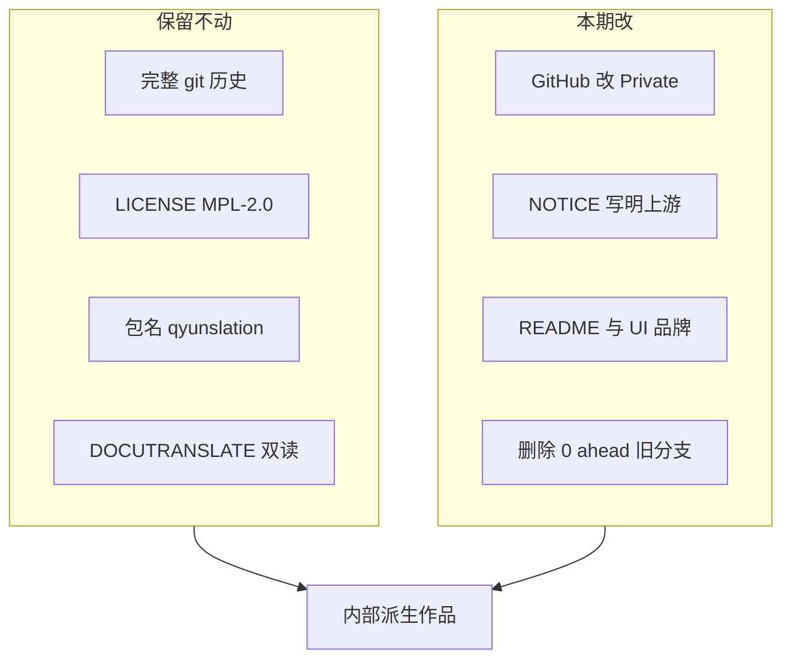

# PLAN-031 仓库专业治理（派生作品收口）

## 最佳建议（先定原则）

这不是「别人进了你的仓库」，而是：**你把开源项目 [xunbu/docutranslate](https://github.com/xunbu/docutranslate) 连同 git 历史搬过来后，包名已在 PLAN-006a 改成 `qyunslation`，但 GitHub 门面和用户可见文案仍是上游白皮。**

专业做法三件事一起做，缺一就会继续别扭：

1. **访问控制**：仓库改 **Private**（你已确认）。public 不会让路人 push，但会把未声明的白牌摊在网上。
2. **法律与出处**：保留 **完整 git 历史** 和 **MPL-2.0**，补一份 `NOTICE.md`。Contributor 头像会一直在，这是历史作者，不是 Collaborator。
3. **产品门面**：README / 页面标题 / 贡献弹窗 / CLI 欢迎语改成 Qyunslation，并写明「派生自 DocuTranslate」。

**明确不要做：**

- 不要 `filter-branch` / 新仓库重推来「只剩你一个 contributor」。破坏 MPL 出处，也毁掉 1000+ 提交审计链。
- 不要再改 Python 包名（[`pyproject.toml`](pyproject.toml) 已是 `name = "qyunslation"`，CLI 已是 `qyunslation`）。
- 不要去掉 `DOCUTRANSLATE_*` 环境变量双读（PLAN-006 不变量，线上 `.env` 可能还在用旧前缀）。
- 不要借这次去同步上游增量，也不要重做 UI。
- 不要和仍在进行的 PLAN-030e（DOCX 纵向闭环）抢同一分支。

## 现状（已核实）

- 仓库：[Charlie780405/Qyunslation](https://github.com/Charlie780405/Qyunslation)，`fork=false`，但历史作者与上游几乎重合：`xunbu` 919 次，你 146 次，其余为上游社区零星提交 + Cursor `cursoragent`。
- **本地 remote 仍反了**：`origin` → `https://github.com/xunbu/docutranslate.git`（上游）；本仓在 `qyunslation` → `git@github.com:Charlie780405/Qyunslation.git`；另有 `mirror` → `/home/dev/git-mirrors/qyunslation.git`。误 `git push origin` 会推向上游或被拒，应先改名。
- 包/运行时已白牌：`qyunslation`、`https://translate.qyunsgen.com`（Caddy → `7860` pdf2zh + 内路由 `8010` sidecar）、`qyunslation-office.service`。改品牌不改域名/端口。
- **前端 Vue shell 已白牌**（`frontend/index.html` 标题「荃信翻译 · Qyunslation」、`quanxin-logo.svg`、`SettingsPanel` 版权行）。滞后的是 i18n JSON、贡献弹窗、README、根目录图标。
- 门面未白牌：四份 README 仍是上游营销页（`pip install docutranslate` 已与 `pyproject.toml` 不一致）；根目录 `DocuTranslate.png/.ico/.icns`；[`qyunslation/static/i18n/zh.json`](qyunslation/static/i18n/zh.json) 的 `pageTitle`；[`qyunslation/cli.py`](qyunslation/cli.py) 欢迎语；[`frontend/src/components/modals/ContributorsContent.vue`](frontend/src/components/modals/ContributorsContent.vue) 仍指向上游 QQ 群和 PR/Issue；另有 [`Dockerfile`](Dockerfile) `LABEL authors="xunbu"`、[`.env.example`](.env.example) 文件头、[`full.spec`](full.spec)/[`lite.spec`](lite.spec) 可执行名、[`tests/README.md`](tests/README.md)、[`frontend/index.html.bak`](frontend/index.html.bak)。
- 无 `.github/`、无 `NOTICE`、无仓库级 `AGENTS.md` / `ensure-plan-dir.sh`（本仓按目录惯例手写 PLAN）。
- 远程约 15 个分支：`feat/plan-*` 大多 **0 ahead / 52–129 behind**，可删；`codex/recovery-030e-030f-*` 若仍 ahead 则保留。

## 编号与落盘

下一号为 **PLAN-031**（PLAN-030 未结束，不占用 030e/f）。确认本计划后，按本仓惯例写入：

- [`docs/plans/PLAN-031-repo-governance/PLAN-031-repo-governance.md`](docs/plans/PLAN-031-repo-governance/PLAN-031-repo-governance.md)
- 子计划 `031a` / `031b` / `031c`
- [`docs/walkthroughs/WT-031-repo-governance.md`](docs/walkthroughs/WT-031-repo-governance.md)
- [`scripts/verify-plan-031.sh`](scripts/verify-plan-031.sh)

改 Private、删远程分支必须在 **已登录 Charlie780405** 的环境用 `gh` 或网页操作；Vultr 工作区若无该 token，只准备命令清单，由你在本机执行。

## 子计划

### 031a — GitHub 治理（无代码或极少代码）

- `gh repo edit Charlie780405/Qyunslation --visibility private`
- Description 写成：`荃信内部文档翻译。派生自 xunbu/docutranslate（MPL-2.0）。`
- 关掉未用 Wiki / Projects。
- **校正 remote**：`origin` 改为本仓 `Charlie780405/Qyunslation`；原 `origin` 改名为 `upstream`（只 fetch、默认不 push）。保留 `mirror`。在 README/NOTICE 写清三条 remote 用途。
- 分支清理规则：**仅删除相对本仓 main 为 0 ahead 的过期 `feat/plan-*`**；任何 ahead 或当前 worktree 使用的分支（含 `codex/recovery-030e-030f-*`）保留。
- 不改写历史，不加 Collaborator。

### 031b — 出处与许可

- 保留根目录 [`LICENSE`](LICENSE)（MPL-2.0）。
- 新增 [`NOTICE.md`](NOTICE.md)：上游仓库 URL、原作者 xunbu、本仓是内部派生、GitHub Contributors 来自导入历史而非外邀开发。
- README 用一小节链到 NOTICE，满足「改了名字仍承认来源」。
- 不删除 SPDX / `SPDX-FileCopyrightText: 2025 QinHan` 等上游版权行。

### 031c — 用户可见品牌收口

只改**人看得到的字符串和仓库门面**，不改 import / 包路径：

- 重写 [`README.md`](README.md) / [`README_ZH.md`](README_ZH.md) 为 Qyunslation 内部说明（安装命令用 `qyunslation`，部署指向 `translate.qyunsgen.com`）。日/越文 README 可改成短跳转，避免四份继续抄上游。
- 根目录图标：优先复用已有荃信标（`apply-pdf2zh-brand.py` 已用 [`/home/dev/qyunsgen/public/brands/quanxin-biopharma.svg`](/home/dev/qyunsgen/public/brands/quanxin-biopharma.svg)）；旧 `DocuTranslate.*` 移入 `archive/legacy/` 或改名，避免 GitHub 根目录第一眼仍是上游名。
- i18n：`qyunslation/static/i18n/{zh,en,vi}.json` 与 `frontend/public/i18n/*` 的 `pageTitle`、教程/贡献文案。
- [`ContributorsContent.vue`](frontend/src/components/modals/ContributorsContent.vue)：去掉「来上游提 PR / 加 QQ 群」；改为内部工具说明 + 链到 NOTICE。
- 薄改：[`qyunslation/cli.py`](qyunslation/cli.py) 描述与欢迎语、[`qyunslation/app.py`](qyunslation/app.py) 启动 print、[`qyunslation/template/markdown.html`](qyunslation/template/markdown.html) 页脚、[`frontend/package.json`](frontend/package.json) 的 `docutranslate-frontend`、[`qyunslation/mcp/README.md`](qyunslation/mcp/README.md) 标题与安装命令、[`Dockerfile`](Dockerfile) `LABEL`/注释、[`.env.example`](.env.example) **文件头说明**（键名仍双读，不删 `DOCUTRANSLATE_*`）、[`tests/README.md`](tests/README.md)、PyInstaller `full.spec`/`lite.spec`/`lite_mac.spec` 产出名与 icon 路径。
- 删除或移走 [`frontend/index.html.bak`](frontend/index.html.bak)（仍含旧 title）。
- MCP 客户端配置示例改为 `qyunslation`；若需兼容可同时保留旧键名作别名，不强制已部署客户端改配置。
- 页脚/标题统一为 `Qyunslation`，需要出处时写 `based on DocuTranslate`。

**不改：** `DOCUTRANSLATE_*` 变量名与 pytest `env`、`archive/legacy/` 历史代码、PLAN/WT 里作为史实出现的「上游 DocuTranslate」字样、Caddy/7860/8010 路由、`apply-pdf2zh-brand.py` 的 Gradio 补丁逻辑（已是荃信白牌）。

## 验证与风险

- `scripts/verify-plan-031.sh`：grep 门禁——用户可见路径（README、i18n、cli 欢迎语、pageTitle、markdown 页脚、Dockerfile LABEL、spec 产出名）不得再以 DocuTranslate 作为产品名；`NOTICE.md` 与 `LICENSE` 必须存在；`pyproject.toml` 的 `name` 仍为 `qyunslation`；`git remote get-url origin` 指向 `Charlie780405/Qyunslation`。
- 烟囱：`qyunslation -h` 文案正确；本地 Web 标题为 Qyunslation；`import qyunslation.app` 仍成功。
- 线上风险低：不改包路径、端口、环境变量语义。改 Private 不影响 `translate.qyunsgen.com` → 7860/8010。
- 回滚：可见性可再改回 public；品牌提交可 revert；已删的 0-ahead 分支若需恢复只能从 reflog/本地找，删除前先列出清单确认。

## 验收标准

- GitHub 仓库为 Private，About 有派生说明。
- 打开仓库根目录不再第一眼看到 DocuTranslate 产品名。
- `NOTICE.md` 写清上游；Contributors 仍显示历史作者（预期，不作为缺陷）。
- 0-ahead 旧 PLAN 分支已删；PLAN-030 相关 ahead 分支仍在。
- `verify-plan-031.sh` 全绿；未改 PLAN-030 业务代码。
