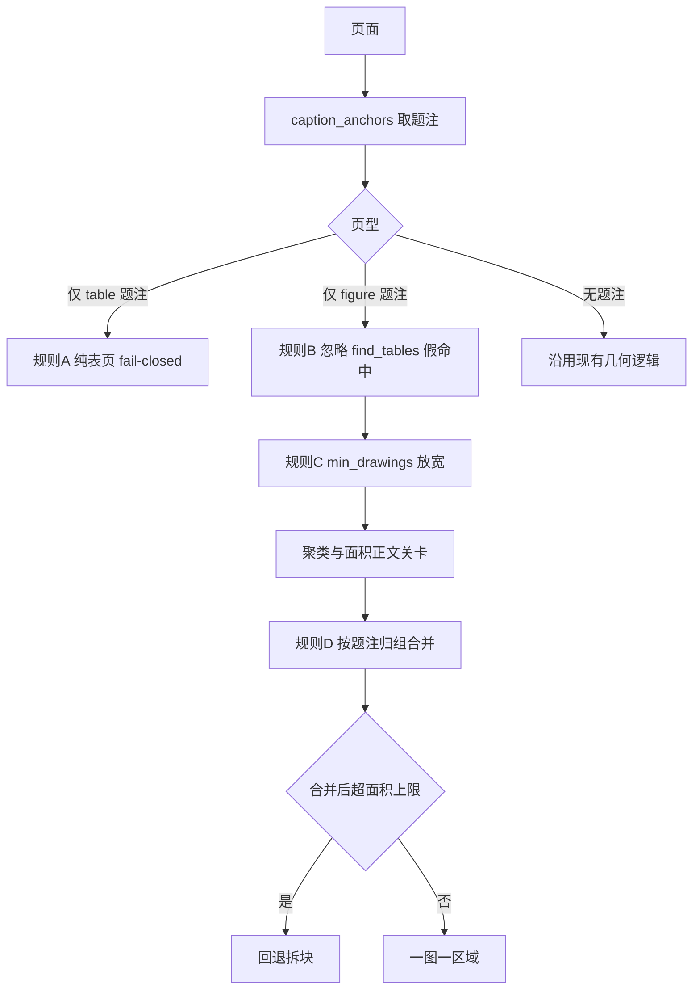

# 合并 PLAN-030b 分支并编写 PLAN-030c

## 阶段一：合并分支

`main`（`2897393`）是 `codex/plan-030b-input-normalization`（`1e36eed`）的严格祖先，`merge-base` 就是 main 的 HEAD，反向差集为空，因此是**快进合并，零冲突**。`qyunslation/main` 与 `mirror/main` 同在 `2897393`，本轮按你的选择**只合本地、不推远端**。

### 1. 先补提交 Codex worktree 的三个文档

`/home/dev/.codex/worktrees/3483/qyunslation` 有 3 处未提交内容，都是 030b 的收口证据，必须随分支一起进 main：

- 修改：[docs/plans/PLAN-030-semantic-layout-translation/PLAN-030-semantic-layout-translation.md](/home/dev/.codex/worktrees/3483/qyunslation/docs/plans/PLAN-030-semantic-layout-translation/PLAN-030-semantic-layout-translation.md)（阶段门更新为「030a、030b 已完成」）
- 修改：[docs/plans/PLAN-030-semantic-layout-translation/PLAN-030b-input-adapters-normalized-canvases.md](/home/dev/.codex/worktrees/3483/qyunslation/docs/plans/PLAN-030-semantic-layout-translation/PLAN-030b-input-adapters-normalized-canvases.md)（状态改为已完成）
- 新增未跟踪：[docs/walkthroughs/WT-030b-input-adapters-normalized-canvases.md](/home/dev/.codex/worktrees/3483/qyunslation/docs/walkthroughs/WT-030b-input-adapters-normalized-canvases.md)

在 worktree 内按精确路径 `git add` 这三个文件（禁止 `git add .`），提交为 `docs: complete PLAN-030b walkthrough`。

### 2. 快进合并

在 `/home/dev/qyunslation` 上执行 `git merge --ff-only codex/plan-030b-input-normalization`。若 `--ff-only` 失败即说明前提被破坏，立即停下报告，不要改用普通 merge。

合并后 main 新增约 9435 行：`qyunslation/structure/` 六个模块、`docs/contracts/` manifest v1 与 schema、`ADR-001`、`tests/structure/` 十三个测试文件、`tests/fixtures/structure/reference/ljae439.pdf`（1.8 MB，SHA-256 `8e9893b2…f10c`），以及 `qyunslation/server/core.py`、`uploads.py`、`app.py`、`custom_api.py` 的上传入口接线。

### 3. 合并后验证

- `bash scripts/verify-plan-030a.sh` 与 `bash scripts/verify-plan-030b.sh`
- `.venv/bin/python -m pytest -q tests/structure --no-cov -rxX`，预期 `129 passed, 2 xfailed`
- `bash scripts/verify-plan-028.sh` 与 `bash scripts/verify-plan-029.sh`，确认 030b 的预扫描改动没有打破 028/029
- 已知既有失败：`tests/test_pdf2zh_archive.py` 的 3 个 archive 命名用例，实施前就红，保持不变

`codex/plan-030a-contract` 是 030b 的祖先，合并后可留可删，不影响。Codex worktree 保留，不动。

## 阶段二：编写 PLAN-030c

按父纲领的批准门，本轮**只写子计划文档，不实现**，待你批准后再编码。

### 定位

030c 是「统一语义扫描与画像路由」，要关掉 030a 留下的红灯 `QY030-SEM-001`：物理位图/矢量区域仍被直接相加当作用户可见插图数。

昨天 Cursor 会话已经在 Nature 样本上做过只读原型，四类缺陷和修复规则都有实测证据，这批证据直接并入 030c，不另开编号：

- p5：Table 2 完整安全性数据表被判为矢量插图，占页 43%，裁剪文字为 `Any TEAE 8 (80.0) 0 10 (62.5) 13 (76.5)…`，会被 OCR 整表重绘，属临床数值失真风险
- p10：Figure 5 被 7 个假表 bbox 避让掉，`vec=0`，整图不翻译
- p6/p7：Figure 2/3 的可用 drawing rect 仅 7 个和 2 个，低于 `MIN_DRAWINGS=8`，整页被 `find_safe_vector_figures` 直接跳过
- p3/p12：Figure 1 拆成 4 块、Figure 7 拆成 3 块分别 OCR，跨面板上下文断裂

原型验证结果：真实 7 图 3 表，新可译区 7 个，Figure 1–7 全覆盖，合并后最大区域 1957×2335 px、`area_frac` 0.56，均在 `VECTOR_MAX_PX=4000` 与 `MAX_AREA_FRAC=0.80` 内。

### 四条题注驱动规则

规则 C 的放宽**只对有 figure 题注的页生效**。实测全局把 `min_drawings` 降到 2 会让幻灯样本区域从 12 涨到 19，破坏 PLAN-029b 标定；幻灯页题注数为 0，天然走 legacy 分支。

### 你已确认的执行侧防护

规则 A 不止用于计数，同时作为 [scripts/pdf_image_translate.py](/home/dev/qyunslation/scripts/pdf_image_translate.py) 策略 B 的硬门：判定为纯表页时该页禁止 OCR 嵌字，宁可漏译插图也不覆盖表格。这是 030c 相对父纲领「030c 只做扫描」的一处有意扩权，目的是先止住线上活跃的数据风险。

### 改动清单

- 新增 [qyunslation/structure/captions.py](/home/dev/qyunslation/qyunslation/structure/captions.py)：把 Hermes `lit_tables` 的 `caption_anchors`、`table_caption_num`、`figure_caption_num`、`is_toc_line`、`is_continued_caption`、`CAPTION_LINE`、`FIGURE_LINE`、`squeeze_caps` 内联进本仓。父纲领的风险表明确要求「将结构契约与核心检测迁回本仓」，消除 `/home/dev/Hermes/scripts` 绝对路径导致的换机静默降级。PLAN-029a 的 `md_tables.py` 仍走 Hermes 抽表，不在本期迁移。
- 新增 `qyunslation/structure/scan_pdf.py`：实现 [interfaces.py](/home/dev/qyunslation/qyunslation/structure/interfaces.py) 的 `StructureScanner` 协议，消费 030b 的画布与 `document_hash`，产出含 `FigureObject`/`TableObject`/`CaptionObject` 的 `DocumentStructureManifest`，语义主计数按 `semantic_id` 去重。
- [scripts/pdf_figure_crop.py](/home/dev/qyunslation/scripts/pdf_figure_crop.py)：新增 `page_caption_profile(page)` 与 `find_figure_regions(page, exclude_rects=None)` 实现规则 A–D；`find_safe_vector_figures` 签名与行为保持不变，供幻灯路径与无题注文档继续使用。
- [scripts/doc_image_prescan.py](/home/dev/qyunslation/scripts/doc_image_prescan.py)：`scan_pdf_tier3` 改用题注去重计数，表格数不再用 `table_rects` 几何数；`format_tier3_summary` 分开报「共 N 张插图，其中 M 张将 OCR 嵌字翻译；另有 K 处表格，按文字层翻译」。
- [scripts/pdf_image_translate.py](/home/dev/qyunslation/scripts/pdf_image_translate.py)：非幻灯页改调 `find_figure_regions` 并应用规则 A 硬门；幻灯页维持 PLAN-029b 分支不变。
- 新增 `scripts/verify-plan-030c.sh`；同步修正 [verify-plan-028.sh](/home/dev/qyunslation/scripts/verify-plan-028.sh) 的 `vector_count == 12`、`table_count >= 19` 与 [verify-plan-029.sh](/home/dev/qyunslation/scripts/verify-plan-029.sh) 的 `journal vector still 12` 三处旧断言，并注明口径变更来源。

### 硬验收

- `ljae439.pdf`：语义清单严格为 Figure 1–5、Table 1–3，逐项带题注与 bbox 证据；`tests/fixtures/structure/ljae439.truth.json` 已固定该真值。`caption_anchors` 的 docstring 正是针对 OUP/BJD 的 `Table 1\u2002Title` 对开空格题注，与本样本同源。
- Nature 样本：Figure 1–7、Table 1–3，7/7 覆盖；p4/p5/p9 三个表页返回空区域（Table 2 零覆盖回归）
- 幻灯样本仍为 12 个区域，PLAN-029b 零回归
- 同一输入重复扫描得到稳定 manifest，预扫与执行共用同一 `schema_version + document_hash`
- Hermes 不可用时降级不抛错（内联后仅 `md_tables.py` 仍依赖）
- 红灯收敛：`QY030-SEM-001` 转绿，只剩 `QY030-PPT-001`（归属 030g）

## 两处需要你在批准时确认的偏离

1. **跨格式对账推迟。** 父纲领 Checkpoint B 要求「同内容经 PDF/DOCX/图片/PPTX 承载时语义对象可对账」。030c 只交付 PDF scanner 加通用 manifest 装配层，DOCX/PPTX 的语义对象由 030e/030g 填充，该条对账门相应移到 030g 之后。
2. **DocLayout 暂不接入。** 父纲领的检测融合顺序含 DocLayout 层，但原型仅靠题注锚点已达成 7/7 与 5/3。030c 先只用题注锚点，把 DocLayout 留作后备证据源，仅在某个基线样本题注检测失败时再引入。

另需在计划中确定：Nature 样本 `41467_2024_Article_53384.pdf` 目前只在 `/home/dev/pdf2zh/pdf2zh_files/` 下，若要作为第二硬基线，需按 030a 的夹具政策物化进 `tests/fixtures/structure/reference/` 并记录完整 SHA-256（该刊为 CC BY 开放获取，可合法入仓）。