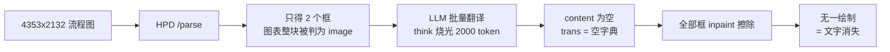

# 图片翻译丢字修复与预览查看器

## 一、丢字的三个根因（均已实测确认）

用你那张 `方案设计图-20260728.jpg`（4353×2132）实跑得到的硬数据：

**根因 1：HPD 把整张流程图当成一张「图片」，根本没读里面的字**

HPD 返回的原始结果只有 4 行，整个图表区域被归为一个无文字的 `image` 块：

```
<BLOCK>image [0, 0, 999, 939]                     ← 占全图 94%，无 <CHILD>，零文字
<BLOCK>image_footnote [44, 924, 147, 948]<CHILD>• IGA 3 vs. IGA 4
<BLOCK>image_footnote [44, 952, 303, 984]<CHILD>- 既往是否接受过AD生物制剂治疗：是 vs. 否
```

HPD 是**文档版面分析器**，专长是扫描页的段落和表格；遇到流程图它只会标一个「这里是插图」，不做内部 OCR。所以 60 个标签里只有图表下方那两行脚注被识别，其余全部原样留着——这正是你截图里译文和原文几乎一模一样的原因。

venv 里**已经装了 RapidOCR 3.6.0 + onnxruntime**，同一张图 **2.0 秒检出 60 个框**，像素坐标、置信度普遍 0.95 以上，中英混排都认得（`筛选期`、`QX027N: W0, W2, 1200mg,`、`≥ EASI-50` 全中）。不需要装任何新依赖。

**根因 2：`/no_think` 前缀对这个模型无效，模型把 token 预算全烧在思考上**

`translate_texts` 里发的是 `num_predict=2000`，60 行时返回：

```
eval_count=2000, done_reason=length, content 长度 = 0
```

一个字都没吐出来。对照实验（10 行短文本）说明原因：

- `/no_think` 前缀（现实现）：thinking 2284 字符，共 747 token —— 前缀被当普通文本，思考照跑
- `think: false` API 参数：thinking 字段消失，仅 **66 token**，输出完全正确
- 什么都不加：thinking 3827 字符，1196 token

也就是说框一多，思考就撑爆 2000 的预算，`content` 为空，`translate_texts` 返回空字典。

**根因 3：先擦后画，缺译等于净删字**

`image_translate.py` 先把**所有** OCR 框 inpaint 抹掉，再只画出编号匹配成功的：

```232:246:/home/dev/qyunslation/qyunslation/extensions/image_translate.py
    for b in boxes:
        ...
        img_cv = cv2.inpaint(img_cv, mask, 3, cv2.INPAINT_TELEA)
    ...
        zh = trans.get(i + 1, "")
        if not zh:
            continue
```

根因 2 让 `trans` 是空字典，于是所有框被擦、一个字不画。这是「文字凭空消失」的唯一机制，中译英和英译中都会中招。

附带两个渲染缺陷：字号只按框高算不看框宽，且 `d.text()` 单行不换行——实测第 1 个框宽 448px，英文译文需要约 680px，必然溢出压到相邻元素上；`translate_image` 还把 `len(boxes)` 当返回值，日志里的「嵌字完成 N 块」是 OCR 检出数，不是实际渲染数，一直在虚报。



## 二、修复方案

### A. OCR 改用 RapidOCR

改 [qyunslation/extensions/image_translate.py](qyunslation/extensions/image_translate.py)，新增 `ocr_image_rapid()` 作为图片链路主引擎，HPD 降为回退：

- 输出统一成现有的 `(x1, y1, x2, y2, text, score)` 六元组，下游不用改
- 引擎实例进程内单例复用，避免每张图重新加载 ONNX 模型（初始化 0.4s）
- 置信度低于 0.5 的框丢弃（实测最低 0.83，阈值不会误伤）
- RapidOCR 返回 0 框时回退 HPD，保住扫描件那条老路

坐标缩放那段 `max(max_x, max_y) <= 1000 and (w > 1200 or h > 1200)` 只对 HPD 的归一化坐标有意义，RapidOCR 直接给像素坐标，走独立分支不做缩放。

### B. 翻译改用 `think: false` 并分批

- 请求体加 `"think": False`，删掉无效的 `/no_think` 前缀
- `num_predict` 从 2000 提到 4096
- 按每批 25 条切分，批内重新从 1 编号，批间独立请求，一批失败不影响其余
- 解析失败的条目**逐条重试一次**（单条请求，不带编号），仍失败才判定缺译
- 记录 `请求 N 条 / 解析 M 条 / 重试补回 K 条`

### C. 缺译回退原文，不再净擦除

把「先全擦、后条件画」改成「只擦要画的框」：

- 先算出每个框最终要写什么：有译文用译文，无译文**回退原文**
- 只对确定要重绘的框做 inpaint
- 最坏情况退化为「保持原样」，绝不出现空白

### D. 渲染自适应

- 用 `ImageFont.getbbox()` 实测文本宽度，按框宽二分收敛字号，下限 10px
- 单行放不下且框高足够时按词/字换行
- 仍放不下则允许横向溢出到相邻空白，但记 warning
- `translate_image` 返回真实绘制数，进度消息不再虚报

### E. 补齐 `to_lang` 遗漏入口

[qyunslation/translator/ai_translator/docx_translator.py](qyunslation/translator/ai_translator/docx_translator.py) 第 673 行和 [qyunslation/custom_api.py](qyunslation/custom_api.py) 调 `translate_image_bytes` 时都没传 `to_lang`，永远按简体中文翻。补上参数透传，保证「图片、DOCX、PDF 都能中英互译」。

## 三、预览查看器

新增补丁脚本 `scripts/apply-pdf2zh-viewer.py`，挂在补丁链尾部（`apply-pdf2zh-css-has-fix.py` 之后）。纯原生 JS + CSS，不引入前端依赖。

参照 qyunsgen 的 [ScreeningDocumentViewer.tsx](/home/dev/qyunsgen/src/components/screening/ScreeningDocumentViewer.tsx)，取其交互模型（外层管缩放平移、内层只管 90° 旋转、`minScale=0.5` / `maxScale=4`、换页重置），但剥掉 React / Next / 权限 / 租户那一层。

**内嵌工具条**：悬浮在 `.qy-preview-src` / `.qy-preview-dst` 右上角，鼠标移入面板才显形。按钮为放大、缩小、逆时针 90°、顺时针 90°、重置、全屏。

**全屏查看器**：点击预览内容或工具条全屏键打开 `fixed inset-0` 遮罩，顶栏放文件名与同一组工具，ESC 或点遮罩关闭。

**交互**：滚轮缩放（以光标为锚点）、按住拖拽平移、双击放大、旋转 90° 步进、重置回适应窗口。缩放范围 0.5–4。

**三类内容统一处理**：给 ``、HTML 预览容器、PDF 的 `<canvas>` 套同一个 transform 包裹层。PDF 保留 Gradio 组件自带的翻页和文本层，不改成 `pdftoppm` 转 PNG——你这条链路实测上传带宽只有 11–13 KB/s，转图分页会让多页 PDF 的传输量涨几倍。

移动端沿用同一套：`touchstart/move` 实现单指拖拽、双指捏合，工具条按钮保持 44px 触控高度。

## 四、验收

新增 `scripts/verify-plan-021.sh`，并用同一张流程图做端到端实测：

- OCR 检出 ≥ 55 个框（当前 2）
- 译文命中率 ≥ 95%（当前 0%）
- 无净擦除：缺译框保留原文，像素级比对确认无空白区
- 中译英、英译中各跑一遍，DOCX 内嵌图与 PDF 各回归一次
- 补丁链幂等 + `gui.py` 语法可编译 + 回归 017/017b/018/019/020
- 浏览器实测缩放旋转全屏在图片、DOCX、PDF 三类预览上均可用

产出 PLAN-021 与 WT-021，精确 commit → `--no-ff` 合入 main → 推远程 → 重启 `pdf2zh.service` 与 `qyunslation-office.service` 验收。