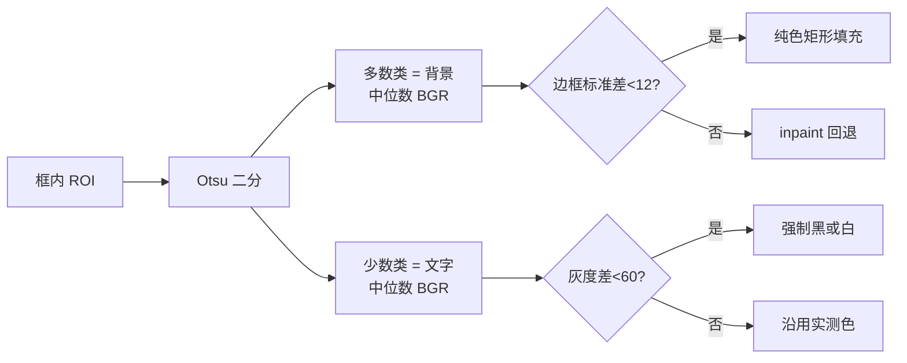

# 嵌字配色对齐修复与 Skill 沉淀

## 一、彩色矩形内译文不可见（最严重）

### 实测数据

对 `方案设计图-20260728.jpg` 逐框量取色：

- QX027N 蓝框：背景 BGR `(144,80,32)` 灰度 84，原文是**白字** BGR `(249,245,234)` 灰度 243，当前实现取色灰度 83，**对比度 1**
- 安慰剂灰框：背景灰度 129，白字 246，取色 117，**对比度 12**
- 1:1:1:1 绿框：背景灰度 176，白字 247，取色 17，对比度 159 但颜色错（应为白）
- 筛选期白底：背景 248，黑字 12，取色 10，对比度 238 正常

### 根因

取色逻辑只统计暗像素：

```227:229:/home/dev/qyunslation/qyunslation/extensions/image_translate.py
        vals = gray.flatten()
        vals = vals[vals < 120]
        color_val = int(vals.mean()) if len(vals) > 0 else 17
```

彩色框背景灰度本身就低于 120，白色文字高于 120 被整体排除，于是「文字色」取到的是背景色自己。白底框恰好成立，所以只有白底的字看得见——正是截图的表现。

第二个缺陷是擦除方式：`cv2.inpaint(..., INPAINT_TELEA)` 在纯色矩形上会把边缘像素向内涂抹，留下截图里蓝框中那些花纹。纯色块根本不需要 inpaint。

### 改法

在 [qyunslation/extensions/image_translate.py](qyunslation/extensions/image_translate.py) 新增 `_analyze_box_style(roi)`，用 Otsu 把 ROI 分成两类，像素数少的那类是文字：

- 背景色 = 背景类像素**中位数 BGR**（中位数比均值抗噪）
- 文字色 = 文字类像素中位数 BGR
- 对比度兜底：两者灰度差 `< 60` 时，按背景明暗强制取纯白或纯黑
- 纯色判定：边框像素 BGR 标准差 `< 12` 视为纯色块，用 `cv2.rectangle(..., -1)` 纯色填充；否则（照片、渐变）才回退 `cv2.inpaint`

擦除与绘制都改用这套结果，替换现有的 `colors` 计算与无条件 inpaint。



## 二、字体加粗与对齐

粗体字面已在机器上：`/home/dev/.fonts/NotoSansSC-Bold.otf`。当前 `QYUNSLATION_FONT` 指向 `NotoSansSC.ttf`，fc-list 显示它默认解析为 Thin/Regular。

按「根据原始图片的文字设计来决定」，把三项都从原图测量，而不是写死：

- **粗细**：文字类像素占框内面积比 + 平均笔画宽度（文字像素数 / 连通域骨架长度近似）。高于阈值用 `NotoSansSC-Bold.otf`，否则 Regular。新增 `QYUNSLATION_FONT_BOLD` 环境变量，缺省时回退到现有字体
- **水平对齐**：文字像素质心相对框中心的偏移量，判定左 / 中 / 右，绘制时按判定结果定 x 起点。现在是无条件 `d.text((x1, y), ...)` 左对齐，而流程图标签几乎都居中
- **垂直**：现有居中逻辑保留，但基线按 `getbbox()` 的 top 偏移校正，消除目前偏上的问题

`_fit_font_and_lines` 增加 `bold` 参数，二分字号时用对应字面测宽。

## 三、全屏预览重复两份

[scripts/apply-pdf2zh-viewer.py](scripts/apply-pdf2zh-viewer.py) 第 220 行的选择器会命中嵌套元素：

```220:233:/home/dev/qyunslation/scripts/apply-pdf2zh-viewer.py
      var kids = cloneRoot.querySelectorAll('img, canvas, iframe, embed, .prose, .markdown');
      if (kids.length === 0) {
        inner.innerHTML = cloneRoot.innerHTML;
      } else {
        kids.forEach(function (el) {
          var c = el.cloneNode(true);
```

HTML 预览的结构是 `.prose > img`，两者都匹配，于是 `.prose`（内含图）克隆一份、`img` 再克隆一份，叠成上下两张。

改成直接整体克隆容器，再单独把 canvas 位图重绘一遍（canvas 的 `cloneNode` 不带像素）：

```javascript
var clone = cloneRoot.cloneNode(true);
var srcCanvases = cloneRoot.querySelectorAll('canvas');
clone.querySelectorAll('canvas').forEach(function (c, i) {
  try { c.getContext('2d').drawImage(srcCanvases[i], 0, 0); } catch (e) {}
});
inner.appendChild(clone);
```

天然不会重复，也少一个分支。

## 四、Skill 沉淀（按本仓编号规范）

本仓有独立的 Skill 治理设施，不套用 qyunsgen 那套编号：

- 登记表 [.cursor/skills/skill-registry/registry.md](/home/dev/qyunslation/.cursor/skills/skill-registry/registry.md) 首行写明「SK-ID 前缀 `SK-Q`（避免与 qyunsgen `SK-A/B/C/D/E/F/G` 冲突）」，当前只登记到 SK-Q001，故新 Skill 取 **SK-Q002**
- 校验脚本 [scripts/verify-skill-registry.sh](/home/dev/qyunslation/scripts/verify-skill-registry.sh) 会硬断言：registry 表行数 == skill 目录数、每个 slug 目录与 `SKILL.md` 存在、`description` 非空、**`SKILL.md` ≤ 200 行**、SK-ID 唯一
- 同步脚本 [scripts/sync-cursor-skills.sh](/home/dev/qyunslation/scripts/sync-cursor-skills.sh) 软链到 `~/.cursor/skills/<slug>`，禁止写 `~/.cursor/skills-cursor/`
- 本仓没有 `.cursor/rules/context-router.mdc`，治理总纲里那一步不适用，跳过

### 产出结构

沿用 SK-Q001 的渐进披露三件套：

```
.cursor/skills/image-overlay-translation/
├── SKILL.md        # 铁律，≤200 行（脚本硬断言）
├── pitfalls.md     # 逐条踩坑 SSOT，带 PLAN/WT 来源引用
└── reference.md    # 实测数据表、诊断脚本片段
```

`SKILL.md` frontmatter 与 SK-Q001 同体例，`description` 用第三人称含中文触发词：图片翻译、嵌字、流程图翻译、译文丢字、OCR 没检出、文字看不见、遮盖、图层、image_translate、RapidOCR、ImageOverlayWorkflow。

### 铁律（全部带实测数字，正文进 SKILL.md，展开进 pitfalls.md）

1. HPD 不读图内文字——流程图整块被标 `<BLOCK>image [0,0,999,939]`，60 个标签只出 2 个脚注；图片链路必须走 RapidOCR，HPD 只作扫描件回退
2. `/no_think` 前缀对 qwen3.6 无效——必须用 API 参数 `think: false`；对照 747 token 对 66 token；`num_predict` 耗尽时 `content` 是空字符串而非报错，静默返回空字典
3. 禁止先全擦后条件绘制——缺译必须回退原文、不擦不画
4. 取色禁止用单侧灰度阈值——必须 Otsu 分层取中位数，反例是本次蓝框对比度 1
5. 纯色块用纯色填充，不用 inpaint——TELEA 会涂抹出花纹
6. 字体粗细与对齐从原图测量，不写死
7. 批量 LLM 翻译必须分批 + 逐条重试，编号解析失败不得静默丢弃
8. 诊断口令：三行代码量出 OCR 框数、命中率、每框对比度

### 登记动作

- `registry.md` 表格追加 `| SK-Q002 | image-overlay-translation | active | 本仓 | pitfalls.md |`
- 审计表追加一行 `| 2026-09-06 | 登记 SK-Q002（PLAN-022） |`
- 跑 `bash scripts/verify-skill-registry.sh` 与 `bash scripts/sync-cursor-skills.sh`

## 五、验收

扩充 [scripts/verify-plan-021.sh](/home/dev/qyunslation/scripts/verify-plan-021.sh)，另建 `scripts/verify-plan-022.sh` 承接本轮：

- 新增断言：`_analyze_box_style` 存在、无 `vals < 120` 单侧阈值残留、引用了 `FONT_BOLD`
- 端到端**对比度断言**：重跑流程图，对每个重绘框算译文色与背景色灰度差，最小值须 `≥ 60`（当前最差是 1）
- viewer 补丁不再出现 `querySelectorAll('img, canvas`
- `bash scripts/verify-skill-registry.sh` 全 PASS（含 SKILL.md ≤200 行、registry 行数对齐）
- 保留 OCR ≥ 55 框、命中率 ≥ 95%、回归 017–021

浏览器实测：重传流程图，确认蓝框内出现白色加粗英文且居中、框内无涂抹花纹、全屏只有一张图。

产出 `docs/plans/PLAN-022-overlay-style/PLAN-022-overlay-style.md` 与 `docs/walkthroughs/WT-022-overlay-style.md`（沿用本仓 `PLAN-XXX-<slug>/` 目录规范），精确 commit → `--no-ff` 合入 main → 推远程 → 重启两个服务。