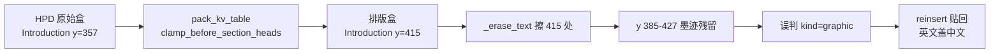

> 说明：本计划涉及**生产** `pdf2zh.service`（Vultr）。所有改动先在 feat 分支验证、端到端重跑通过后再 merge 部署。

# 扫描书信流水线：修叠字、锁字号、并行提速、实时进度

## 一、三个症状的根因（已定位）

**1. 英文汉语叠加（第 2 页）** —— 不是清理不干净，是**把英文正文当插图贴回去了**。

产物 `FDA responses on PIND.hpd-ocr.pdf.graphics/p2-r2.png` 是一张 416×42pt 的裁图，内容就是英文正文第 2–4 行（"additional comments in preparation for..."）。它被判为 `kind="graphic"`（`suppress_text=False`），译后由 `graphic_reinsert` 原位贴回，盖在中文上。输出 PDF 第 2 页 `imgs=3`（2 个 logo + 这张文字带）。

根因在 [scripts/hpd_ocr.py](scripts/hpd_ocr.py) 第 540–556 行：喂给检测器的是**排版变换之后**的盒子。

```540:556:/home/dev/qyunslation/scripts/hpd_ocr.py
            cleaned = pack_kv_table(cleaned, pw, ph)
            cleaned = clamp_before_section_heads(cleaned)
            roles = tag_blocks(cleaned, pw, ph)
            cleaned, roles = fold_short_titles(cleaned, roles)
            # 2b) 图形区检测 + 丢弃 logo/印章区内的行
            if enable_graphics:
                regs = _gr_detect(page, [b[:4] for b in cleaned])
```

`pack_kv_table` / `clamp_before_section_heads` 是为**输出版面**重写 y 坐标的。第 2 页 `Introduction:` 在扫描原图上约 y=357，被 clamp 改写成 y=415（相差 ~58pt）；于是 `graphic_regions._erase_text` 擦错位置，y 385–427 的真实英文墨迹没被擦掉，连通域检测就把它当图形捡走了。



**2. 第 12 页字偏大** —— 输出实测 `body=13.0pt`。稀疏页升字号那一档（`_flow_plan` 里的 `_BODY_AIRY=13.0` / `_SEC_AIRY=15.0`）在该页触发。

**3. 看不到实时进度** —— `letter_pipeline` 那段已经是 executor + 进度泵，但 HPD OCR 的 109 秒仍在 `async def _run_translation_task` 里**同步**调用（`gui.py` 第 1122 行 `ocr_pdf_with_hpd(...)`），事件循环被占死，`①识别 n/20` 推不出去。实测单次：识别 109s + 翻译 72s + 重绘 12s ≈ 193s。

---

## 二、改动

### A. 修中英叠字（三道防线）

1. **喂原始盒**：[scripts/hpd_ocr.py](scripts/hpd_ocr.py) 在 `pack_kv_table` 之前留一份 `raw_boxes`，`_gr_detect` 传 `raw_boxes + cleaned` 的并集；`_erase_text` 的 `pad_pt` 由 `2.0` 提到 `3.5`。
2. **文本带判据**：[scripts/graphic_regions.py](scripts/graphic_regions.py) 的 `detect()` 增加过滤——`aspect > 5.0 且 h_pt < 60` 判为残留文字行带直接丢弃（真实插图极少是这种细长条）。
3. **letter 只回插 logo/印章**：[scripts/graphic_reinsert.py](scripts/graphic_reinsert.py) 的 `reinsert()` 增 `kinds: set[str] | None` 参数；[scripts/letter_pipeline.py](scripts/letter_pipeline.py) 调用时传 `kinds={"logo", "stamp"}`。这与 Skill 原本的意图一致（信头 logo / 印章回插）。真有图表的书信可用 `QYUNSLATION_LETTER_GRAPHICS=1` 放开。

预期：第 2 页 `imgs=2`（只剩两个 logo），无英文残留。

### B. 正文锁 12pt（按你的选择）

[scripts/kv_reinsert.py](scripts/kv_reinsert.py)：

- 删掉 `_BODY_AIRY` / `_SEC_AIRY` 升号档，`_flow_plan` 恒返回 `(12.0, 14.0, lead, gap)`。
- `_LEAD_MAX` `1.88 → 1.90`，`_GAP_MAX` `24 → 26`，稀疏页只靠行距和段距填版心。
- 填不满就留底部空白，不再升字号。短页（≤8 行）仍 lead 1.56 / gap 14，字号同样 12/14。

预期：第 12 页 `body=12.0`，版心占比约 76–82%。

### C. 提速（HPD 与 Ollama 不同显卡 → 可各自并行）

1. **探测定并发**（只读）：同 6 页分别按 workers 1 / 3 / 5 打 HPD `/parse`，比 wall time，定 `QYUNSLATION_HPD_WORKERS` 默认值。不改泰州 HPD 服务本身。
2. **并行 OCR**：`hpd_ocr.py` 拆出一个**预取阶段**——`ThreadPoolExecutor` 并行做 `get_pixmap` + `_parse`，raw 结果按页序存 list；原有后处理循环原样顺序消费 `raws[i]`。后处理顺序与单页逻辑零改动，风险最小。
3. **并行翻译**：`letter_pipeline` 的跨页上下文 `_ending` / `_start` 取的是**英文** `it["text"]`，不依赖任何页的译文，所以按页并行是安全的。改成 `ThreadPoolExecutor` over pages（默认 4，`QYUNSLATION_LETTER_WORKERS` 可调）。
4. **全局去重 + 持久缓存**：并行前先按英文原文全局去重（页眉页脚等重复块只译一次）；缓存落 `~/.cache/qyunslation/letter-zh.json`，key = `sha1(英文原文)`，重复跑同一文件翻译段近乎瞬时。当前 `cache` 只是进程内 dict，跑 5 遍就重译 5 遍。

预期：193s → 约 70s 首跑，约 25s 重跑。OCR 与翻译的重叠流水线收益有限、复杂度高，本轮不做。

### D. 实时进度

[scripts/apply-pdf2zh-docprofile.py](scripts/apply-pdf2zh-docprofile.py)：把 `ocr_pdf_with_hpd` 也搬进 `run_in_executor`，复用已经写好的 `_qy_st` 进度泵模式（`while not task.done(): progress(...); await sleep(0.4)`）。

进度分段：`①识别` 0–40%（按完成页数，并行下用线程安全计数器）、`②翻译 n/20` 40–92%、`③排版重绘` 92–100%。

### E. 完整性门不再杀单

`letter_pipeline.translate_scanned_letter` 里 `missing_zh` 命中时目前 `raise RuntimeError`，一段没译上就把整个 3 分钟的任务毁掉——这一轮已经因此失败两次（`['引言:']`、`['FDAResponsetoQuestion1(a)...']`）。改为 `logger.error` 记录并继续出稿，把告警清单写进日志与 `.warnings.json`。

### F. 完善 Skill（防同类问题）

[.cursor/skills/scanned-doc-layout-fidelity/SKILL.md](.cursor/skills/scanned-doc-layout-fidelity/SKILL.md) 新增铁律，[pitfalls.md](.cursor/skills/scanned-doc-layout-fidelity/pitfalls.md) 补对应踩坑：

- 15 译后回插**只限 `logo` / `stamp`**；`graphic` 在纯文字书信上基本都是漏擦的文字带，默认不回插。
- 16 图形区检测的 `text_boxes` 必须用**原始 OCR 盒**，不能用 `pack_kv_table` / `clamp_*` 之后的排版盒——两者 y 可差 ~58pt。
- 17 正文锁 12pt / 章节 14pt，稀疏页只靠行距（≤1.90）和段距（≤26pt）填版心，**不靠升字号**；填不满就留白。
- 18 完整性检查只告警不中断，禁止因单段未译 raise 掉整单。
- 19 生产 GUI 钩子必须返回 `Path`（不是 `str`），且要有契约测试——本轮踩过 `AttributeError: 'str' object has no attribute 'exists'`。
- 20 长任务（OCR / 翻译）必须走 `run_in_executor` + 进度泵，禁止在 async handler 里同步跑。
- 21 译文缓存按英文原文 `sha1` 持久化，跨进程复用。

### G. 验证

- [scripts/test_letter_pipeline.py](scripts/test_letter_pipeline.py) 补：`graphic` 区不回插、`missing_zh` 命中不 raise、并行翻译结果与串行一致、缓存命中路径。
- 新增 `scripts/test_graphic_regions.py`：细长文字带被丢弃、logo 仍保留、`kinds` 过滤生效。
- 新增 `scripts/verify-plan-012.sh`：跑上述单测 + `ast.parse` 补丁后的 `gui.py` + 断言 Skill 铁律条目存在。
- 端到端重跑 `FDA responses on PIND`，逐项核对：第 2 页 `imgs=2` 且 `get_text()` 无英文句子、第 12 页 `body=12.0`、全 20 页无丢段、总耗时、GUI 进度条可见走字。

### H. 递交与部署

`docs/plans/PLAN-012-letter-overlay-speed/`、feat 分支、`docs/walkthroughs/WT-012-letter-overlay-speed.md`，merge main 后 `systemctl --user restart pdf2zh.service` 并复跑一单确认。
