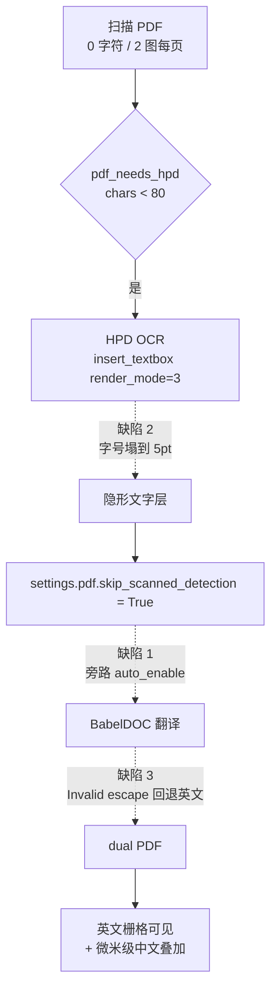
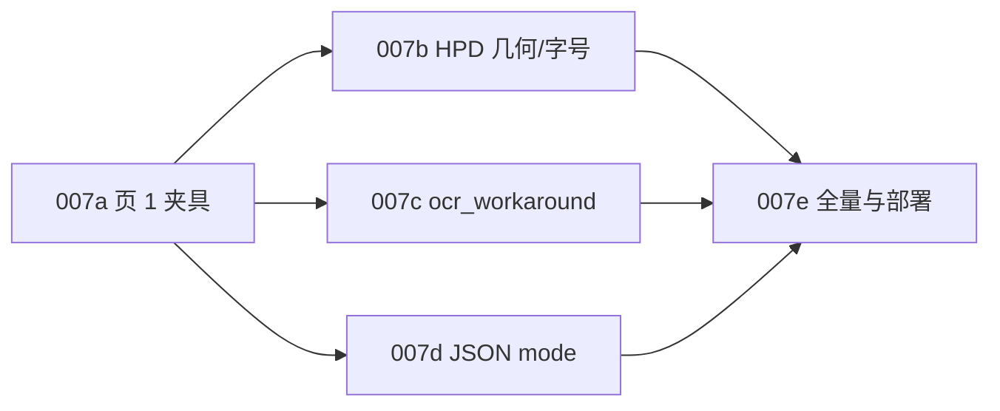

# 扫描件一对一译文渲染整治（PLAN-007）

## 诊断结论

源文件 `FDA responses on PIND.pdf` 是**纯扫描件**：20 页、`page.get_text()` 返回 0 字符、每页 2 张栅格图。英文是「画」在图片里的，BabelDOC 结构上无法删除它。当前产出之所以是「英文原样 + 微米级中文叠加」，是三个缺陷叠加：

- **缺陷 1 — `ocr_workaround` 从未启用。** [scripts/apply-pdf2zh-hpd.py](scripts/apply-pdf2zh-hpd.py) 的 HPD 分支只设了 `settings.pdf.skip_scanned_detection = True`。而 `translation_config.py:343` 在 `auto_enable_ocr_workaround=True` 时会把 `ocr_workaround`/`skip_scanned_detection` 双双置 `False` 等待检测，检测阶段一旦被 skip 就永不运行 → 自动开启逻辑彻底成为死代码。结果没有白底遮罩（`paragraph_finder.add_text_fill_background`）、译文不强制黑色，中文直接叠在英文栅格上。
- **缺陷 2 — HPD 隐形文字层字号失真。** 实测第 1 页 OCR 层字号只有 5.0–6.9pt，三个长段落（209/202/149 字符）全部精确落在 5.0pt 地板上，对应 box 仅 `456×7.2pt`。BabelDOC 的 typesetting 按**原字号 × scale**（`typesetting.py:968`，`min_scale=0.1`）渲染译文，原字号 5pt → 中文必然不可读。根因在 [scripts/hpd_ocr.py](scripts/hpd_ocr.py) 第 170 行：

```python
fs = min(12.0, box_h * 0.45, box_w / max(len(text), 1) * 1.8)
```

  多行 block 时第三项塌缩（456/209×1.8 = 3.9），被 `max(5.0, fs)` 兜到地板；`box_h * 0.45` 对单行也偏小；`12.0` 硬上限还压死标题。
- **缺陷 3 — 译文 JSON 解析失败回退。** 日志有 `Error Invalid \escape: line 4 column 197 ... try fallback`。`il_translator_llm_only.py:905` 的 except 分支会先把整批段落**恢复成原始英文**再逐段 fallback，这就是左页大部分仍是英文的原因。`pdf2zh_next/translator/translator_impl/ollama.py` 完全没有 JSON mode 支持（只有 `num_predict`），而 `[openaicompatible_detail]` 有 `openai_compatible_enable_json_mode`。

上游官方的扫描件配方与诊断一致，也解释了你在上游项目看到「效果可以」：

```bash
babeldoc --files scanned.pdf --lang-in en --lang-out zh \
  --ocr-workaround --skip-scanned-detection \
  --primary-font-family serif --disable-rich-text-translate
```

## 当前链路与断点



## 子计划总览

落盘位置 `docs/plans/PLAN-007-scanned-fidelity/`，沿用 PLAN-005/006 的目录与命名约定：

- `PLAN-007-scanned-fidelity.md`（纲领）
- `PLAN-007a-page1-harness.md`
- `PLAN-007b-hpd-geometry.md`
- `PLAN-007c-ocr-workaround.md`
- `PLAN-007d-json-mode.md`
- `PLAN-007e-fullrun-deploy.md`

依赖顺序：007a 必须先行（没有夹具无法量化任何后续改动）；007b 与 007c 相互独立、可并行改码但必须一起验收（只修一个都看不到一对一效果）；007d 独立；007e 收口。



---

## PLAN-007a 第 1 页快速夹具

新增 `scripts/bench-scanned-page1.sh`，工作目录 `/home/dev/pdf2zh/bench/007/`（不入 git，`.gitignore` 已覆盖 `bench` 类运行产物则复用，否则补一条）。

### Task A1 — 抽页与 OCR 缓存

- 用 pymupdf `insert_pdf(..., from_page=0, to_page=0)` 抽出第 1 页为 `page1.pdf`（源 65MB/20 页 → 约 3MB，HPD 从约 60s 降到约 3s）
- 源文件路径参数化，默认 `/home/dev/pdf2zh/pdf2zh_files/5fa54bcf-4843-4e97-8cd0-85c797fa9b5d/FDA responses on PIND.pdf`
- 调 `ocr_pdf_with_hpd` 产出 `page1.hpd-ocr.pdf`；**缓存复用**（文件存在且比 `hpd_ocr.py` 新则跳过），避免每次变体都打 HPD
- 007b 改动 `hpd_ocr.py` 后 mtime 变新 → 自动重跑 OCR，无需手工清缓存

### Task A2 — 变体矩阵 runner

变体（每个变体独立 `--output` 目录，便于并列比对）：

- **V0** 基线：仅 `--skip-scanned-detection`，复现当前 bug
- **V1** + `--ocr-workaround --disable-rich-text-translate`
- **V2** V1 + `--primary-font-family serif`
- **V3** V2 + 007b 的 HPD 字号/几何修复（重跑 OCR）
- **V4** V3 + `--enable-json-mode-if-requested`

CLI 骨架（Ollama 走 OpenAI 兼容端点，绕开 `ollama.py` 无 JSON mode 的限制）：

```bash
babeldoc --files "$WORK/page1.hpd-ocr.pdf" \
  --lang-in en --lang-out zh --output "$WORK/out-$V" \
  --openai --openai-model qwen3.6:35b-a3b \
  --openai-base-url http://100.67.66.123:11434/v1 --openai-api-key ollama \
  --glossary-files /home/dev/pdf2zh/glossaries/qx027n.csv \
  --no-auto-extract-glossary --ignore-cache --qps 4 --pool-max-workers 4 \
  $VARIANT_FLAGS 2>&1 | tee "$WORK/out-$V/babeldoc.log"
```

`--ignore-cache` 必须带，否则变体之间会命中译文缓存导致对比失真。

### Task A3 — 度量与 baseline

每个变体自动采集，写 `docs/perf/baseline-007a.json`：

- **OCR 层字号**：`page1.hpd-ocr.pdf` 的 span 字号中位数 / 最小值（当前基线：中位数约 5.7，最小 5.0）
- **译文页渲染字号**：mono 首页 span 字号中位数
- **中文覆盖率**：mono 首页 `get_text()` 中 CJK 字符占比，以及仍为纯英文的段落数
- **回退次数**：`babeldoc.log` 里 `try fallback` 计数（当前基线 ≥ 3）
- **墙钟**：单页端到端秒数
- **目视**：mono/dual 首页 `get_pixmap(dpi=110)` 渲成 `page1.$V.mono.png` / `.dual.png`

### 验收

- `bash scripts/bench-scanned-page1.sh V0` 能复现「英文可见 + 微米级中文」，字号中位数约 5–6pt、`try fallback` > 0
- 单变体端到端 < 3 分钟（否则迭代太慢，需下调 `--pages` 或换更小样张）
- `baseline-007a.json` 六项指标齐全

### 回滚

删 `scripts/bench-scanned-page1.sh` 与 `/home/dev/pdf2zh/bench/007/`；纯新增，无生产影响。

---

## PLAN-007b HPD 隐形层几何与字号修复

改 [scripts/hpd_ocr.py](scripts/hpd_ocr.py)。这是 SSOT，`/home/dev/pdf2zh/hpd_ocr.py` 是薄 re-export，无需同步改。

### Task B1 — 调试转储先取证

加 `QYUNSLATION_HPD_DEBUG=1`，把每块的 HPD 原始坐标、缩放后 PDF box、字符数、计算字号写 `<dest>.hpd-debug.json`。

必须先拿这份数据再定参数——`456 × 7.2pt` 装 209 字符（约 2.5 个真实行）明显不自洽，两种可能必须区分：

- **假设 1**：HPD 返回的就是单行块，但把 2–3 个视觉行的文字合并进了一个块的 `<CHILD>`
- **假设 2**：第 162 行的归一化启发式失真——`sx, sy = pw / 1000.0, ph / 1000.0` 对 x/y 共用 `1000` 除数，A4 宽高比 1:1.414，若 HPD 实际是等比 letterbox 归一化则 y 被系统性压缩

转储里同时记录「该页所有块的 y 跨度并集 / 页高」：接近 1.0 说明 y 映射没问题（假设 1 成立），明显小于 1.0 说明 y 被压缩（假设 2 成立）。

### Task B2 — 坐标映射修正

按 B1 结论二选一：

- 假设 1 成立 → 保留映射，改为按 `<CHILD>` 内的换行/句读把合并块拆成多行子块，各自分配 box 的等分行高
- 假设 2 成立 → 归一化按轴独立判定，并加断言：缩放后 box 若超出页面矩形或并集覆盖率异常则 warning + 退回像素映射

```python
sx = pw / (1000.0 if max_x <= 1000 and pix.width > 1200 else max(pix.width, 1))
sy = ph / (1000.0 if max_y <= 1000 and pix.height > 1200 else max(pix.height, 1))
```

### Task B3 — 换行感知字号求解

替换第 170 行的塌缩公式。核心：按 box 宽度换行后总高度必须容得下，二分求最大可容纳字号。

```python
_LINE_FACTOR = 1.25
_FS_FLOOR, _FS_CEIL = 7.0, 28.0

def _fit_fontsize(font, text, box_w, box_h, lo=_FS_FLOOR, hi=_FS_CEIL) -> float:
    usable_w = max(box_w - 2.0, 4.0)
    best = lo
    for _ in range(14):
        mid = (lo + hi) / 2.0
        lines = max(1, math.ceil(font.text_length(text, fontsize=mid) / usable_w))
        if lines * mid * _LINE_FACTOR <= box_h:
            best, lo = mid, mid
        else:
            hi = mid
    return best
```

关键取舍：**盒高不足时优先向下扩展 box，而不是把字号压到地板**。隐形层的 box 只是喂给 BabelDOC 的段落几何，适度增高在视觉上无代价；但扩展量必须受同列下一块的 `y1` 限制，避免块重叠把 BabelDOC 的 layout 搞乱。

- 去掉 `12.0` 硬上限（压死标题），上限抬到 28.0
- 下限从 5.0 抬到 7.0；若求解结果仍触地板则记 warning 并计数

### Task B4 — 回归护栏

- `insert_textbox` 返回负值（文本放不下被裁剪）时记 warning，不再被 `except Exception: continue` 静默吞掉；同时区分「真异常」与「放不下」
- 扩展 `scripts/test_hpd_ocr_smoke.py`：构造一个 A4 空页 + 一个宽扁 block 塞长文本，断言产出的 span 字号**中位数 ≥ 8pt**，防止公式再次塌缩
- 保留现有 5 个测试全绿（CJK 不乱码、表格切分、`pdf_needs_hpd`、无文字抛错）

### 验收

- `python3 scripts/test_hpd_ocr_smoke.py` 全绿，含新增字号护栏
- 第 1 页 OCR 层字号中位数从约 5.7 抬到 **≥ 9pt**，最小值 ≥ 7pt
- `hpd-debug.json` 里触地板块数为 0（或有明确记录的例外）
- V3 变体的译文渲染字号中位数 ≥ 9pt

### 回滚

`git revert` 该提交即可；`hpd_ocr.py` 是纯函数模块，无状态、无迁移。

---

## PLAN-007c 启用上游扫描件配方

### Task C1 — 显式反转 PLAN-005a 的禁令

[PLAN-005a-scanned-pdf-hpd.md](docs/plans/PLAN-005-office-image/PLAN-005a-scanned-pdf-hpd.md) 的 Task A2 明确写着「HPD 失败须 `gr.Error`，**禁止 `ocr_workaround`**」。本子计划有意反转它，必须在 PLAN-007c 与 WT-007 里写清理由，否则后人会把它当回归：

- 005a 的设计目标是「dual 可选中」（见 PLAN-005 纲领 SLO），不是视觉一对一替换；当时禁用 `ocr_workaround` 是为了保住扫描底图原貌
- 实测证明：不遮盖原文时，栅格英文 + 译文叠加在扫描件上完全不可读，「可选中」这个目标本身没有交付价值
- 因此把扫描件的目标从「可选中」升级为「一对一可读」，并接受 `ocr_workaround` 的既有取舍

### Task C2 — 补丁实现

改 [scripts/apply-pdf2zh-hpd.py](scripts/apply-pdf2zh-hpd.py)，两处 HPD 分支都要改：`PRE_HPD`（文字层过少的预检测分支）与 `SCANNED_RETRY_NEW`（`Scanned PDF` 异常重试分支）。把

```python
settings.pdf.skip_scanned_detection = True
```

改为

```python
settings.pdf.ocr_workaround = True
settings.pdf.skip_scanned_detection = True
settings.pdf.disable_rich_text_translate = True
```

要点：

- `TranslationConfig.__init__`（`translation_config.py:276`）在 `ocr_workaround=True` 时本就会强制后两项，这里显式写出是为了让 pdf2zh 侧的 settings 快照自洽、便于日志排查
- `config.toml` 里 `auto_enable_ocr_workaround = false`，所以不会被 `pdf2zh_next/config/model.py:421` 的互斥校验清掉（该校验只在 `auto_enable` 为真时清 `ocr_workaround`/`skip_scanned_detection`）
- 沿用现有 marker 幂等机制（`MARKER = "_hpd_retried"`），并把 marker 判定升级为同时检查 `ocr_workaround`，否则老补丁已在位时新改动不会被应用
- 顺手清理 `apply-pdf2zh-hpd.py` 里遗留的死代码：`apply()` 已被 `apply_fixed()` 取代但仍留在文件里，且第 109 行有个可疑的三元表达式优先级写法

### Task C3 — 正常文字 PDF 不回归

绝不能把 `ocr_workaround` 写进 `config.toml` 全局——那会让所有正常文字 PDF 都被强制黑字 + 白底矩形而劣化。

- 拿一份有文字层的 PDF（如 `docs/` 里任意 PDF 或既往 `QX027N QnA` 样张）跑一遍，确认 `pdf_needs_hpd` 返回 False、日志无「文字层过少」、产出与改动前一致
- `verify-plan-007.sh` 固化这条：`config.toml` 中 `ocr_workaround` 必须仍为 `false`

### 验收

- `python3 scripts/apply-pdf2zh-hpd.py` 两次连续执行，第二次输出 `already patched`
- `gui.py` 两处分支均含 `ocr_workaround = True`
- V1 变体目视：栅格英文被白底遮盖，无双层叠字
- 文字 PDF 回归通过，`config.toml` 的 `ocr_workaround` 仍为 `false`

### 回滚

`git revert` 后重跑 `apply-pdf2zh-hpd.py`；若 gui.py 已被写脏，`systemctl --user restart pdf2zh.service` 会由 `ExecStartPre` 重新打成目标状态。最坏情况重装 `pdf2zh-next` 再重放四个 `apply-*` 补丁。

---

## PLAN-007d JSON mode 消除译文回退

### Task D1 — 服务从 Ollama 切到 OpenAICompatible

`pdf2zh_next/translator/translator_impl/ollama.py` 只有 `num_predict`，完全没有 JSON mode / `format` 支持；`[openaicompatible_detail]` 有 `openai_compatible_enable_json_mode`。所以必须换服务而不是改参数。

`/home/dev/pdf2zh/config.toml`：

- `ollama = true` → `false`，`openaicompatible = false` → `true`
- `openai_compatible_base_url = "http://100.67.66.123:11434/v1"`
- `openai_compatible_model = "qwen3.6:35b-a3b"`
- `openai_compatible_enable_json_mode = true`
- `openai_compatible_temperature = "0.0"`、`openai_compatible_send_temperature = true`
- `openai_compatible_api_key = "ollama"`（Ollama 不校验，但字段不能为 `"null"`）
- `[gui_settings] enabled_services = "OpenAICompatible"`

同步改 [scripts/pdf2zh.service](scripts/pdf2zh.service) 第 14 行的 `--enabled-services Ollama` → `OpenAICompatible`。两处不一致会导致 GUI 里选不到引擎。

### Task D2 — 批量与 token 核对

`Invalid \escape` 也可能是输出被截断所致，需一并核对：

- `apply-pdf2zh-throughput.py` 已把批量阈值参数化为 `_PDF2ZH_LLM_BATCH_TOKENS`（默认 200）与 `_PDF2ZH_LLM_BATCH_PARAS`（默认 5），可用环境变量调
- 若开 JSON mode 后仍有 `try fallback`，在 `pdf2zh.service` 加 `Environment=PDF2ZH_LLM_BATCH_PARAS=3` 缩小批量再测
- `[ollama_detail] num_predict = 2000` 在切换后对活跃路径失效；确认 OpenAICompatible 路径的 max_tokens/timeout 默认值够用（`openai_compatible_timeout` 目前是 `"null"`，长段落可能需要显式给 300）

### Task D3 — 与 throughput 补丁的交互

`apply-pdf2zh-throughput.py` 同时 patch 了三个文件，切服务后有效性变化必须记录清楚：

- `ollama.py` 的 num_predict 解除 1024 上限 → **对活跃路径失效**（仍保留，便于回退到 Ollama 服务）
- `il_translator_llm_only.py` 的批量阈值参数化 → 仍有效
- `gui.py` 的 unload 取消任务、跳过已是目标语种 → 仍有效

`verify-plan-007.sh` 要断言这三处补丁在切换后依然在位。

### 验收

- V4 变体 `babeldoc.log` 中 `try fallback` 计数 = **0**
- 第 1 页中文覆盖率 ≥ 90%，无成段英文残留
- 文字 PDF 跑通，译文质量不低于切换前（术语表仍生效）
- `curl http://100.67.66.123:11434/v1/models` 可达，模型名匹配

### 回滚

`config.toml` 与 `pdf2zh.service` 各改回一行（`ollama = true` / `--enabled-services Ollama`）后 `systemctl --user restart pdf2zh.service`。注意切换会变更译文缓存 key，回滚后首轮同样全部重译。

---

## PLAN-007e 全量验收与部署

### Task E1 — 20 页全量与底图存活确认

- 第 1 页选定最优变体后跑完整 20 页，与页 1 指标对齐
- 重点确认 `ocr_workaround` 下扫描底图的存活情况：`pdf_creater.update_page_content_stream` 会用全新 content stream **整体替换**整页（`base_operations` 在上游被注释掉），FDA 信头、签名页、印章是否随旧 stream 一起消失必须实测，不能靠读码推断
- 若底图确认丢失且不可接受 → 触发决策门升级到自建栅格渲染器（见下）

### Task E2 — mono 空包定位

`all_mono_translations.zip` 只有 22 字节（空 zip），而 `config.toml` 里 `no_mono = false`。按 `gui.py:1554` 的 `"mono": str(mono_path) if mono_path and mono_path.exists() else None` 排查是 `result.mono_pdf_path` 为 None、还是落盘失败/路径不匹配。这是独立于渲染的次要缺陷，顺手修掉。

### Task E3 — verify 脚本

`scripts/verify-plan-007.sh`，沿用 `verify-plan-005.sh` 的阶段参数风格 `[baseline|after-a|after-b|after-c|after-d]`：

- baseline：五个子计划文档、`bench-scanned-page1.sh`、`baseline-007a.json` 在位
- after-b：`hpd_ocr.py` 无 `12.0` 硬上限、含 `_fit_fontsize`；smoke 测试全绿
- after-c：`gui.py` 两处分支含 `ocr_workaround = True`；`config.toml` 的 `ocr_workaround` 仍为 `false`
- after-d：`config.toml` 为 OpenAICompatible + json mode；`pdf2zh.service` 的 `--enabled-services` 一致；三处 throughput 补丁仍在位
- 全阶段：`pdf2zh.service` active、`:7860` 可达、HPD `:8120` health ok

### Task E4 — 文档与部署

- 写 `docs/plans/PLAN-007-scanned-fidelity/` 五个文件与 `docs/walkthroughs/WT-007-scanned-fidelity.md`
- WT 里必须写明对 PLAN-005a「禁止 ocr_workaround」的反转及理由
- `systemctl --user restart pdf2zh.service`（`ExecStartPre` 自动重放 gui.py 补丁）
- 精确 commit（不用 `git add .`），merge 到 `main` 后推 `qyunslation/main`

### 验收

- `bash scripts/verify-plan-007.sh after-d` 全绿
- 20 页产出目视一对一，`https://translate.qyunsgen.com` 上传该文件复现通过
- 文字 PDF 与 Word/图片 sidecar 路径均无回归（`bash scripts/verify-plan-005.sh after-d` 仍 30/30）

### 回滚

按子计划逆序 revert；`config.toml`、`pdf2zh.service`、gui.py 补丁三处各自可独立回滚，互不依赖。

---

## 决策门

页 1 验收若不达标，按你选的分阶段策略升级，不要在 `ocr_workaround` 上继续堆参数：

- 达标线：中文覆盖率 ≥ 90%、渲染字号中位数 ≥ 9pt、`try fallback` = 0、目视无英文叠字、信头/签名可辨
- 不达标 → 自建栅格渲染器：复用 [qyunslation/extensions/image_translate.py](qyunslation/extensions/image_translate.py) 已有的 cv2 inpaint + PIL 嵌字（005c 已在图片路径验证过），扩展到 PDF 页逐页处理。代价：译文不可选中、文件体积增大、需要自己做换行与段落合并

## 风险

- `ocr_workaround` 上游文档明确「原文与格式不保留」，Task E1 的底图存活确认是本计划最大不确定项
- 切 `OpenAICompatible` 会变更译文缓存 key，首轮全部重译，20 页耗时会明显高于缓存命中时
- gui.py 是对第三方包打补丁，`pdf2zh-next` 升级后需重放；已有 `ExecStartPre` 兜底，但升级后锚点字符串可能失配，补丁脚本需保持「锚点找不到就报错而不是静默跳过」
- HPD 是外部服务（泰州 `:8120`），页 1 夹具依赖它可用；OCR 结果缓存可缓解但首次必须联通