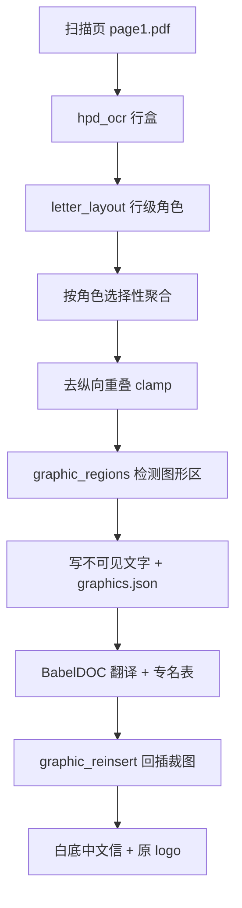

# PLAN-010：扫描件版式保真通用化

PLAN-009 只解决了字号层级。本 PLAN 处理**这一类扫描件都会犯**的四个问题，并沉淀为 Skill。不改泰州 HPD。

## 根因（已实测确认，不是猜测）


| 现象                                   | 根因                                                                                                                                                                                                                                                      |
| ------------------------------------ | ------------------------------------------------------------------------------------------------------------------------------------------------------------------------------------------------------------------------------------------------------- |
| 中间「药。您的预 / 任何回复 / 议问 / 题是」2.4–6pt 碎字 | HPD 行盒高约 29pt（12pt 文字），`_merge_lines_into_paragraphs` 取并集后段落框纵向互相重叠（实测 `We also refer` y1=444.7 压住 `You should provide` y0=421.0，全页 6 处）。BabelDOC 在重叠区切出微段落，`_find_optimal_scale_and_layout` 一路降到 scale 0.2 → 12×0.2=2.4pt。观测到的所有异常字号都精确等于 `12 × scale` |
| 落款挤成两行、机构名乱套                         | 聚合把落款 6 行并成 1 段（一次翻译一整块）；且中文公函落款应逐行断、块内左齐，PLAN-009 的「块内右齐」判断有误                                                                                                                                                                                          |
| logo 丢失                              | `apply-pdf2zh-ocr-base.py` 有意不恢复 `base_operations` 且铺整页白底，`skip_form_render=True`。**任何塞进 OCR PDF 的图都会被 BabelDOC 丢掉**，只能译后回插                                                                                                                             |
| GenScend → 「金斯瑞」                     | 无专名表，LLM 把 GenScend 幻觉成 GenScript 的中文名。`Vabysmo` 直接丢字                                                                                                                                                                                                   |





## 施工顺序

`010a → 010b → 010d → 010c → 010e → 010f`。010a/010b 共同重写 `hpd_ocr` 的 letter 分支，必须连做；010d 要在跑 V8 之前落地（否则重跑一次翻译）；010c 是译后独立环节，可最后接。每步跑 `bash scripts/verify-plan-010.sh after-<id>`。

`hpd_ocr` letter 分支的最终顺序（**顺序本身是本 PLAN 的核心产出**）：

```
行级 blocks
 → clean_text 逐行清洗（丢 ^{th} / 碎片）
 → tag_blocks 行级角色
 → 图形区检测 + 丢弃 logo 区内的行（010c）
 → 仅对 MERGE_ROLES 的连续行聚合（010b）
 → _deoverlap_boxes 去纵向重叠（010a）
 → _expand_boxes 求字号
 → insert_textbox
```

`_deoverlap_boxes` 必须排在「丢块」之后：先删了 logo 区的行，剩下的盒才是真正的下界约束；反序会让已删除的块继续压低上一块。

---

## 010a 盒去重叠（根治 2.4–6pt 碎字）

### 目标

OCR 层任意两盒不再纵向重叠，BabelDOC 不再有可切碎的重叠区。

### 改动 [scripts/hpd_ocr.py](scripts/hpd_ocr.py)

新增函数：

```python
def _deoverlap_boxes(
    boxes: list[tuple[float, float, float, float, str]],
    *,
    gap: float = _EXPAND_GAP,
    min_h: float = 10.0,
) -> tuple[list[tuple[float, float, float, float, str]], list[bool]]:
    """把每个盒的 y1 压到「所有横向重叠后继盒」的最小 y0 之上。返回 (boxes, clamped)。"""
```

判据（与 `_expand_boxes` 现有口径一致，避免两套阈值）：

- 横向重叠 `min(x1_i, x1_j) - max(x0_i, x0_j) > 0.3 * (x1_i - x0_i)`
- `limit = min(y0_j for 所有满足上式且 y0_j > y0_i 的 j)`
- `y1_i = max(min(y1_i, limit - gap), y0_i + min_h)`；被 `min_h` 兜住时记 warning（说明原始行盒严重重叠，需要人看）

`_expand_boxes` 同步修：现在只看 `ordered[idx + 1]`，改为扫所有后继盒取最小 `y0`（同一 30% 判据），否则跳过一个盒仍会撞上第二个。

debug JSON 每项新增 `clamped: bool`、`y1_before: float`，便于对照哪几处被压。

### 兜底 [scripts/doc_profile.py](scripts/doc_profile.py)

`patch_letter_typesetting._render_paragraph` 开头加微段落抑制（防 BabelDOC 版式模型自己切碎）：

```python
area = (box.x2 - box.x) * (box.y2 - box.y) if box else 0.0
if area < 400.0 and len(text.strip()) < 12:
    logger.warning("跳过微段落碎片 area=%.0f text=%r", area, text[:20])
    return
```

阈值依据：页 1 实测碎片框都 `< 300 pt²` 且 `≤ 6` 字；正文最小段 `> 3000 pt²`。

### 单测 `scripts/test_hpd_deoverlap.py`

用页 1 实测的重叠对做夹具（`We also refer` y=341.0–444.7 vs `You should provide` y=421.0–504.8 等 6 处）：

- `test_no_vertical_overlap_after_deoverlap`：跑完无任何「横向重叠 >30% 且纵向重叠 >1pt」的对
- `test_min_height_floor`：极端重叠时高度不低于 10pt 且记 warning
- `test_disjoint_columns_untouched`：左右两列（横向重叠 0）互不影响

### 验收断言

OCR debug JSON 里重叠盒对数 = 0；译文页正文区无 `< 9pt` 字符。

### 风险与降级

压盒会让个别长段字号变小。若 `_fit_fontsize` 触地板（`fs_floor`）次数比 V7 增加 >2，则改为「压盒 + 允许该段字号降到 10pt」而不是继续压高度；已有 `floor_hits` 计数可直接对比。

---

## 010b 角色感知聚合 + 落款中文行款

### 目标

落款/地址逐行独立翻译、逐行独立成行；块整体保持原 x（偏右），块内逐行左齐——这是中文公函落款的习惯，PLAN-009 的「块内右齐」判断有误。

### 改动 [scripts/letter_layout.py](scripts/letter_layout.py)

```python
MERGE_ROLES = frozenset({"body", "header", "footer"})

def group_for_merge(
    boxes: list[tuple[float, float, float, float, str]],
    roles: list[Role],
) -> list[tuple[list[tuple[float, float, float, float, str]], Role, bool]]:
    """按连续同角色切段，返回 (子列表, 角色, 是否允许聚合)。"""
```

`tag_blocks` 判据本身对行级成立，只补两处（行级下地址每行更短）：

- `_ADDRESS_HINT_RE` 新增 `Attention|c/o|Blvd|Suite|NC \d{5}|Durham`
- `signature` 分支的 `len(t) < 80` 保留（行级下落款每行天然短）

### 改动 [scripts/hpd_ocr.py](scripts/hpd_ocr.py)

letter 分支按「施工顺序」段的流程改写；聚合改为：

```python
out, out_roles = [], []
for sub, role, mergeable in group_for_merge(scaled, roles):
    if mergeable and len(sub) > 1:
        sub = _merge_lines_into_paragraphs(sub, aggressive=aggressive)
    out.extend(sub)
    out_roles.extend([role] * len(sub))
```

角色不重算——分组时已知，避免合并后 box 变化导致的判定漂移。

### 改动 [scripts/doc_profiles.toml](scripts/doc_profiles.toml)

```toml
# 落款：块整体保持原 x（偏右），块内逐行左齐（中文公函习惯）
signature_align = "left"
signature_line_skip = 1.25
```

`doc_profile.role_line_skip` 里 1.25 的硬编码改为读 `signature_line_skip`，无键回落 1.25。`patch_letter_typesetting` 的右齐平移代码保留但因 `signature_align != "right"` 自然不触发（BabelDOC 升级失效时也不影响主路径）。

### 落款目标形态（页 1）

```
Crystal Bland，MSHA
监管事务项目经理
专科药物监管运营处 眼科
监管运营办公室
新药办公室
药品评价与研究中心
```

机构名与职务译法由 010d 的专名表钉死，不靠 LLM 自由发挥。

### 单测 `scripts/test_letter_layout.py` 追加

- `test_merge_roles_keep_signature_lines`：6 行落款进 → 出仍 6 块（不聚合）
- `test_merge_roles_merge_body_lines`：3 行正文进 → 出 1 块
- `test_address_hint_line_level`：`Attention: ...` / `4820 Emperor Blvd` / `Durham, NC 27703` 三行都判 `address`

### 验收断言

落款 ≥ 4 行、逐行独立、行内 `x0` 方差 `< 3pt`、块 `x0 > 0.32 × 页宽`。

---

## 010c 图形区域检测与译后回插

### 目标

原文 logo / 印章 / 图形按原位原样出现在译文页；logo 区不叠中文。

### 为什么必须译后回插

[scripts/apply-pdf2zh-ocr-base.py](scripts/apply-pdf2zh-ocr-base.py) 在 `ocr_workaround` 下**有意**不恢复 `base_operations`、铺整页白底、并置 `skip_form_render=True`。因此塞进 OCR PDF 的图一定被丢弃，只能在 BabelDOC 出片之后回插。

### 新增 [scripts/graphic_regions.py](scripts/graphic_regions.py)

依赖已在 pdf2zh venv 内实测可用：`numpy 2.5.2 / cv2 5.0.0 / PIL 11.3.0`。

```python
@dataclass(frozen=True)
class Region:
    box: tuple[float, float, float, float]   # PDF pt
    kind: str                                 # logo | stamp | graphic
    suppress_text: bool
    png: str                                  # 文件名

def detect(page, text_boxes, *, dpi=150, page_frac_max=0.35) -> list[Region]
def crop(page, region, *, dpi=300) -> bytes
def passes_filter(png: bytes, w: int, h: int) -> bool
def write_manifest(dest: Path, src: Path, pages: dict[int, list[Region]]) -> Path
```

`detect` 步骤：

1. `pix = page.get_pixmap(dpi=dpi, colorspace=pymupdf.csGRAY)` → numpy `(h, w)`
2. `ink = gray < 200`
3. 擦文字：每个 `text_box` 按 `dpi/72` 换算成像素、外扩 2pt 后置 `False`
4. `cv2.morphologyEx(ink, cv2.MORPH_CLOSE, np.ones((k, k)))`，`k = round(6 * dpi / 72)`
5. `cv2.connectedComponentsWithStats` → 每个连通域的 stats 换回 pt
6. 过滤：`w ≥ 18pt`、`h ≥ 18pt`、`w*h ≥ 400 pt²`、`w*h ≤ 页面积 × 0.35`、`域内墨迹率 ≥ 0.02`
7. `kind`：`y2 < 0.25 × page_h` → `logo`（`suppress_text=True`）；宽高比 0.8–1.25 且墨迹率 > 0.35 → `stamp`（`suppress_text=True`）；其余 `graphic`（`suppress_text=False`，图内文字仍要翻译）

`crop` / `passes_filter` 与 Hermes [lit-figures.py](/home/dev/Hermes/scripts/lit-figures.py) 同款：`page.get_pixmap(clip=Rect, dpi=...)` → `tobytes("png")` → 空白率/尺寸过滤（空白率 > 0.985 或边长 < 18pt 丢弃）。

manifest `<dest>.graphics.json`：

```json
{"source": "/home/dev/pdf2zh/bench/007/page1.pdf", "dpi": 300,
 "pages": [{"page": 1, "size": [595.32, 841.92],
   "regions": [{"box": [70.6, 70.6, 255.6, 150.5], "kind": "logo",
                "suppress_text": true, "png": "p1-r0.png"}]}]}
```

PNG 落 `<dest>.graphics/p{page}-r{i}.png`。页 1 实测 logo 墨迹区 ≈ `x 70.6–255.6pt, y 70.6–150.5pt`（100dpi 扫描 `x 98–355px, y 98–209px`）。

### 改动 [scripts/hpd_ocr.py](scripts/hpd_ocr.py)

新增参数 `graphics: bool | None = None`（`None` → `profile == "letter"` 时开）。在写文字之前：

- `regions = graphic_regions.detect(page, [b[:4] for b in scaled])`
- 丢弃 `scaled` 中 ≥ 60% 面积落入 `suppress_text` 区的行（logo 区不叠中文）
- `crop` + 落盘，汇总写 manifest

### 新增 [scripts/graphic_reinsert.py](scripts/graphic_reinsert.py)

```python
def reinsert(pdf: Path, manifest: Path, *, dual_left: bool = True) -> int
def main() -> int   # CLI: graphic_reinsert.py <pdf> [manifest]
```

- mono（页宽 ≈ manifest `size[0]`）：`page.insert_image(Rect(box), stream=png, overlay=True, keep_proportion=True)`
- dual（页宽 ≈ 2 × `size[0]`，译文在左半页）：同 rect 插入；宽度既不匹配 mono 也不匹配 dual 则 skip + warning
- 幂等：插入前用 `page.get_image_info()` 查同位置同尺寸图，已有则跳过（GUI 重试不会叠图）

### 接线

- bench：`run_variant` 的 V8 分支在 babeldoc 之后、`measure_pdf_fonts` 之前对 mono 与 dual 各跑一次
- GUI：[scripts/apply-pdf2zh-docprofile.py](scripts/apply-pdf2zh-docprofile.py) 在 gui.py 的 `_qy_mono_fallback_dual` 行（约 2059 行）之后插入，manifest 缺失即 no-op：

```python
            # _qy_graphic_reinsert
            try:
                import sys as _g_sys
                from pathlib import Path as _g_P
                _g_sys.path.insert(0, "/home/dev/qyunslation/scripts")
                from graphic_reinsert import reinsert as _qy_reinsert
                _mf = _g_P(str(file_path) + ".graphics.json")
                if _mf.is_file():
                    for _p in (_mono, _dual):
                        if _p:
                            _qy_reinsert(_g_P(_p), _mf)
            except Exception as _exc:
                logger.warning("graphic reinsert 跳过: %s", _exc)
```

GUI 里 `file_path` 此时已被替换为 OCR PDF 路径，manifest 命名与之天然对齐。

### 单测 `scripts/test_graphic_regions.py`

- `test_detect_logo_on_page1`：页 1 检出 ≥ 1 个 `kind=logo`，box 落在 `x < 0.5 页宽、y < 0.25 页高`
- `test_text_area_not_detected`：纯文字区（擦掉后）不产生 region
- `test_reinsert_idempotent`：同一 PDF 连插两次，图数不变

### 风险与降级

误检把正文当图形 → `suppress_text` 只对 `logo/stamp` 开，`graphic` 不删文字，最坏情况是多插一张图而不是丢内容。检测整体失败则 manifest 不写，全链 no-op 回到 V7 行为。

---

## 010d 专名保护表

### 目标

企业 / 品牌 / 人名不被 LLM 幻觉（`GenScend → 金斯瑞` 是 GenScript 的中文名，属硬错）；FDA 机构与职务译名钉死。

### 策略

- 已登记 → 用官方译名：`Jiangsu GenScend Biopharma Co., Ltd. → 江苏景行生物医药有限公司`
- 未登记的企业 / 品牌 / 人名 → **保持英文原样**（identity 行）

### 新增 `glossaries/proper-nouns.csv`（入 git，本仓为 SSOT）

格式与 [qx027n.csv](/home/dev/pdf2zh/glossaries/qx027n.csv) 一致（`source,target,tgt_lng`，第三列留空表示全语言生效）：

```csv
source,target,tgt_lng
"Jiangsu GenScend Biopharma Co., Ltd.",江苏景行生物医药有限公司,
GenScend,GenScend,
IQVIA,IQVIA,
Vabysmo,Vabysmo,
US-Vabysmo,US-Vabysmo,
Crystal Bland,Crystal Bland,
Mei-Fei Yueh,Mei-Fei Yueh,
MSHA,MSHA,
Regulatory Health Project Manager,监管事务项目经理,
Regulatory Affairs Lead,监管事务负责人,
Division of Regulatory Operations for Specialty Medicine,专科药物监管运营处,
Office of Regulatory Operations,监管运营办公室,
Office of New Drugs,新药办公室,
Center for Drug Evaluation and Research,药品评价与研究中心,
Ophthalmology,眼科,
```

部署：本仓 `glossaries/` 为 SSOT，`deploy` 时软链到 `/home/dev/pdf2zh/glossaries/`（与 `hpd_ocr.py` 薄包装同套路）。

### 新增 [scripts/proper_nouns.py](scripts/proper_nouns.py)

```python
MANUAL = ROOT / "glossaries/proper-nouns.csv"
AUTO   = ROOT / "glossaries/auto-proper-nouns.csv"

PATTERNS = (
    r"\b[A-Z][a-z]+(?:[A-Z][a-z]+)+\b",                              # GenScend / MedImmune
    r"\b[\w.&'\- ]{2,40}?(?:Co\.,? ?Ltd\.|Inc\.|LLC|GmbH|PLC)\b",
    r"\b[A-Z]{3,6}\b",                                                # IQVIA / MSHA
    r"\b\w+(?:®|™)",
)
STOPWORDS = {"FDA", "PIND", "CFR", "IND", "NDA", "BLA", "USA", "PDF", "OCR",
             "EASI", "IGA", "DLQI", "CDER", "ENCLOSURE", "MEETING"}

def harvest(pdf: Path) -> int      # 写 AUTO（identity 行），跳过 MANUAL 已有 + STOPWORDS
def glossary_args(extra: list[Path] | None = None) -> str   # 逗号串给 --glossary-files
```

`AUTO` 每次覆盖重写，只放 identity 行，不与人工表冲突（harvest 时先读 MANUAL 的 source 集合做排除）。

### 接线

- bench：`run_hpd` 之后调 `harvest`，babeldoc 参数改 `--glossary-files "$($PY -c 'import proper_nouns;print(proper_nouns.glossary_args())')"`（顺序：manual → auto → qx027n）
- GUI：施工时先 `rg 'glossary_files|glossaries' pdf2zh_next/config/model.py` 确认 settings 字段名，在应用模板处 `harvest(file_path)` 并写入该字段；字段名对不上就只走 bench，GUI 侧记 TODO 不硬塞

### 单测 `scripts/test_proper_nouns.py`

- `test_camelcase_harvested`：`GenScend` 被抓
- `test_stopword_skipped`：`FDA` / `PIND` 不被抓
- `test_manual_wins`：MANUAL 已有的 source 不写进 AUTO

### 验收断言

译文无「金斯瑞」；`Vabysmo` 保留；出现 `GenScend` 或「江苏景行生物医药有限公司」。

---

## 010e V8 验收

bench 变体 `V8`（letter + 010a–010d），产出 `deliverables/plan-010-fidelity/`（`letter.mono.pdf` / `letter.mono.png`）。

[scripts/verify-plan-010.sh](scripts/verify-plan-010.sh)，用法 `after-a|after-b|after-c|after-d|after-e`，逐阶段可跑：

| # | 断言 | 数据来源 |
| --- | --- | --- |
| 1 | OCR 层「横向重叠 >30% 且纵向重叠 >1pt」的盒对数 = 0 | `page1.hpd-ocr.pdf.hpd-debug.json` |
| 2 | 译文页无 `< 9pt` 字符 | mono PDF spans |
| 3 | 落款 ≥ 4 行、行内 `x0` 方差 `< 3pt`、块 `x0 > 0.32 × 页宽` | mono PDF spans |
| 4 | 回插图片 ≥ 1 张，且 logo 区无中文 span | `page.get_image_info()` + manifest box |
| 5 | 无「金斯瑞」、`Vabysmo` 保留、`GenScend` 或官方中文名出现 | mono PDF text |
| 6 | 沿用 009：正文中位 ≥ 11pt、meta ≤ 正文 − 1.5pt、无 `^{th}`、内容流无 `/Image` 叠字 | mono PDF |
| 7 | `floor_hits` 不比 V7 多 2 以上（压盒未把字号打到地板） | debug JSON |

文档：`docs/plans/PLAN-010-scanned-fidelity-generic/`（纲领 + 010a–010f 六个子计划）、`docs/walkthroughs/WT-010-scanned-fidelity-generic.md`。

---

## 010f Skill 沉淀（qyunslation 自治）

本仓此前无 `.cursor/skills/`，本 PLAN 一并建最小治理件（与 qyunsgen / Hermes 同构但不依赖它们的脚本）。

### 目录

```
.cursor/skills/
  scanned-doc-layout-fidelity/
    SKILL.md         # ≤200 行，L1 路由
    pitfalls.md      # L3 踩坑
  skill-registry/
    registry.md      # SK-ID 表 + 审计记录
scripts/
  verify-skill-registry.sh
  sync-cursor-skills.sh
```

### `SKILL.md` 骨架

- `description`（第三人称、含中文强触发词）：扫描件、OCR 版式、中英叠字、碎片段落、微段落、落款行款、信头 logo、截图回插、专名不翻译、公司名保持英文、`hpd_ocr`、`doc_profile`、`graphic_regions`
- **五条铁律**（每条都必须有 verify 断言，否则不写进 Skill）：
  1. OCR 盒不得纵向重叠——重叠区会被版式模型切成微段落，字号塌到 `目标 × 0.2`
  2. 角色决定是否聚合——落款 / 地址逐行，正文才聚合
  3. BabelDOC 在 `ocr_workaround` 下丢栅格 + 铺白底，图只能**译后**回插
  4. 企业 / 品牌 / 人名先进专名表；未登记保持英文，禁止让 LLM 猜中文名
  5. 判据要落成 `verify-plan-*.sh` 断言，不写进 Skill 正文的口径不算生效
- 排障入口表：现象 → 看哪个文件 / 哪个 debug 字段
- 与 Hermes [literature-knowledge-base](/home/dev/.cursor/skills/literature-knowledge-base/SKILL.md) 的关系：裁图/过滤沿用 `lit-figures.py` 同款，但**入库**是 Vault 语义，本 Skill 只做译文回插，不共用管线

### `pitfalls.md` 首批四条

来源标注 WT 编号，单一 SSOT，不与 PLAN 正文重复：

1. 异常字号恰好等于 `目标字号 × scale`（0.2/0.3/0.4/0.5/0.8）→ 一定是重叠区微段落，不是字体问题（WT-009 → WT-010）
2. 恢复 `base_operations` 留 logo 会导致中英叠字（PLAN-007 → PLAN-008 教训），正解是译后回插
3. `U+3000` 全角空格在思源字体下被映射成 `Ѵ`，段首缩进要用 BabelDOC `first_line_indent`（WT-009）
4. BabelDOC `Box.y` 是底边、`y2` 是顶边，判「页顶/页底」必须换算 `(page_h - y2) / page_h`（WT-009）

### `registry.md`

SK-ID 用 `SK-Q00x` 前缀（qyunslation，避免与 qyunsgen `SK-A/B/C/D/E/F/G` 冲突）：

| SK-ID | slug | 状态 | canonical | pitfalls SSOT |
| --- | --- | --- | --- | --- |
| SK-Q001 | scanned-doc-layout-fidelity | active | 本仓 | pitfalls.md |

### 两个治理脚本

- `scripts/sync-cursor-skills.sh`：`ln -sfn /home/dev/qyunslation/.cursor/skills/<slug> ~/.cursor/skills/<slug>`；跳过已存在且指向别仓的同名链接并告警；**禁止**写 `~/.cursor/skills-cursor/`（Cursor 内置技能保留区）
- `scripts/verify-skill-registry.sh`：registry 行数 == skill 目录数、每个 slug 有 `SKILL.md` 且含非空 `description`、SK-ID 唯一、`SKILL.md` ≤ 200 行、未写入 `skills-cursor`

### 验收

`bash scripts/verify-skill-registry.sh` 全 PASS；`verify-plan-010.sh after-f` 追加检查 Skill 与 registry 存在。

## 不做

- 不改泰州 HPD `/parse`
- 不整页重排、不自定义字体文件
- 不做文献/IND 模板的角色层级
- 不重跑 20 页；不接 OCR 之外的版式模型

