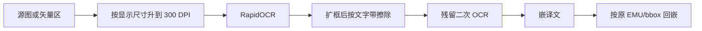

# PLAN-027g：插图 300 DPI 回嵌与原文擦除残留

## 诊断（对照你这张流程图）

两件事独立，需要一起修。

**清晰度**：PDF 矢量栅格化默认是 [scripts/pdf_figure_crop.py](scripts/pdf_figure_crop.py) 的 `QYUNSLATION_VECTOR_CROP_DPI=200`，且长边被 `VECTOR_MAX_PX=2400` 立刻压回去。DOCX / PDF 位图则**按源像素原样嵌字**，不看 DrawingML `<wp:extent>` / 页面 bbox 的显示尺寸。源图有效 DPI 低于显示尺寸时，Word/PDF 一拉伸就糊。你这张图（约 302×116 pt）若源 PNG 只有一千出头像素，显示时大约 190–220 DPI。

**叠字：是的，原文没擦干净。** 截图里的 `OLor4周安全随访`、`W28 responsec`、阶段标题重影、蓝框白晕，都是「旧墨迹残留 + 新字叠上去」。现有擦除在 [image_translate.py](qyunslation/extensions/image_translate.py) 约 1862–1917 行：

- 纯色框只填 `_fill_band`（墨迹行包络 ±2px），然后**把带外整段回贴原图**——OCR 框里但落在带外的残画（如 `c`、`OL`）会被原样贴回。
- 非纯色走邻域取色 + TELEA inpaint，框偏紧时抗锯齿环擦不掉，叠上译文就发糊。
- 漏检的碎片（RapidOCR 没框到的半个词）永远不会被擦。

不能整框 `rectangle` 填充（PLAN-026 / C10：会抹掉括号线和色带）。正确做法是**略扩擦除范围 + 擦完再扫残留**。



## 一、300 DPI 目标分辨率

新增共享函数（建议放 [doc_image_policy.py](qyunslation/extensions/doc_image_policy.py)，stdlib+PIL，PDF 脚本也能加载）：

```python
def ensure_display_dpi(img_bytes, width_pt, height_pt, *, target_dpi=300) -> bytes:
    # 有效 DPI = px * 72 / pt；仅当低于 target 时 LANCZOS 上采样
    # 已高于 target 不缩小（避免把高清源压糊）
```

默认 `QYUNSLATION_IMAGE_TARGET_DPI=300`。

接线：

- **DOCX**： [docx_image_overlay.py](qyunslation/extensions/docx_image_overlay.py) 在 `translate_image_bytes` 前按 `occ.width_pt/height_pt` 升采样；回嵌仍用原 `<wp:extent>`，只换更高像素的 blob。
- **PDF 位图**： [pdf_image_translate.py](scripts/pdf_image_translate.py) 用页面 bbox pt 同样升采样后再译；多引用 / 尺寸变化继续走 `insert_image` overlay，禁止为了「对齐源像素」而把升采样结果 `replace_image` 压回去。
- **PDF 矢量**：`VECTOR_CROP_DPI` 默认 200→300；`VECTOR_MAX_PX` 2400→4000，避免 A4 宽图（~8.5″×300≈2550px）被立刻降 DPI。

`/service/image-translate` 保持「收到什么像素就处理什么」；升采样由文档侧调用方做，sidecar 不猜显示尺寸。

## 二、擦除残留（叠字）

改 [image_translate.py](qyunslation/extensions/image_translate.py)，不推翻 C10：

1. **擦除前扩框**：每个待绘 OCR 框向外扩 `QYUNSLATION_ERASE_PAD_PX`（默认 3），夹在图边界与邻框之间，盖住抗锯齿环。
2. **文字带加厚**：`FILL_BAND_PAD` 默认 2→4；`_text_mask_u8` 膨胀从 2×2 / 1 次改为 3×3 / 2 次，专打描边残留。
3. **带外回贴收紧**：回贴原图时排除文字 mask 的膨胀区，禁止把 `c` / `OL` 这类残字贴回来。
4. **残留二次扫描**（关键）：擦除完成后、嵌字前，对每个已擦框再跑一次 RapidOCR；若仍检出与原文同类的字，按同背景再擦一遍。次数上限 1，避免死循环。漏检碎片（`responsec` 的 `c`）主要靠这一步。

C10（文字带外图元损伤）仍跑；扩框导致 C10 上升时只扩文字 mask，不整框填色。

## 三、验收

[scripts/verify-plan-027.sh](scripts/verify-plan-027.sh) 追加：

- `VECTOR_CROP_DPI` 默认 300、`VECTOR_MAX_PX >= 4000`
- `ensure_display_dpi`：100×50 px 配 72×36 pt（≈100 DPI）必须升到约 300×150；已经 300 DPI 的图不缩小
- 合成「蓝底白字 + 故意偏紧 OCR 框」：擦除后二次扫描该区 `detected_blocks==0`，再嵌译文
- 026 回归必须继续绿（C10 / 括号线）

## 四、文档与交付

- 新增 [PLAN-027g-dpi-and-erase.md](docs/plans/PLAN-027-doc-image-translation/PLAN-027g-dpi-and-erase.md)，纲领索引补一行
- SK-Q002：回嵌目标 300 DPI；擦除后必须二次确认无原文残留
- WT-027 补段；`feat/plan-027g-*` → verify → no-ff 合 main → 推送 → 重启两服务

## 明确不做

- 不整框涂白（会毁箭头/色带）
- 不接 Vision OCR
- 不改 Word 里的显示 EMU（只加像素，版式不变）
