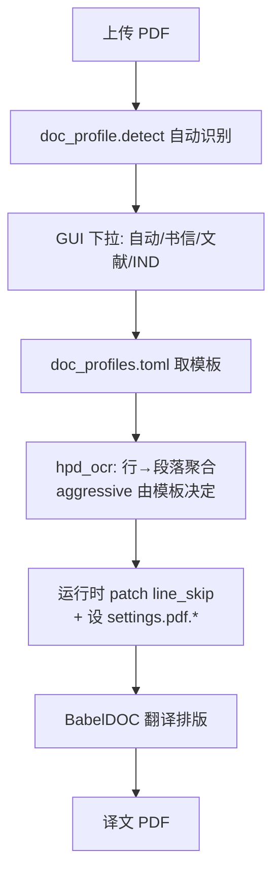

# 文档类型排版模板与段落级 OCR 保真（PLAN-008）

## 诊断结论

### 问题 2：内容没丢，但句子被腰斩

原文隐形层是**行级** box（`hpd_ocr.py` 逐行 `insert_textbox`），BabelDOC 的段落聚合按几何行工作，跨行句子在半句处就被送去翻译。

原文隐形层实测（`page1.hpd-ocr.pdf`）：

- 块 11（y=401-418）：`as a biosimilar to US-Vabysmo. Our preliminary responses to your meeting questions are`
- 块 12（y=420-438）：`enclosed. You should provide, to the Regulatory Project Manager, ...`

`are` 与 `enclosed` 分属两块，各自独立翻译，于是译文出现：

- 块 10（y=403-420，**x=176-342**）：`我们对您会议问题的初步回复是` — 半句，且 x 起点漂到页面中部，视觉上像居中标题
- 块 11（y=423-456）：`附后。您应向监管项目经理提供...`

同源缺陷还产生两个孤立碎片：y=401 处单独一个 `‑`，y=477 处单独一个 `FDA‑`（`FDA-generated minutes` 的前缀）。

### 问题 1：排版可控边界

由 [BabelDOC 排版钩子调研](6df72fa7-5d39-447d-8157-62a2338669a4) 确认：

- 现成参数可控：`primary_font_family`（serif/sans-serif/script）、`split_short_lines`、`short_line_split_factor`、`disable_rich_text_translate`、`merge_alternating_line_numbers`
- 需运行时 monkey patch：行距（`typesetting.py:968` 硬编码 `line_skip = 1.50 if self.is_cjk else 1.3`）
- 按已定决策**不引入自定义字体文件**，只用内置思源黑体/思源宋体切换

## 数据流

## 实施

### 008a 完整性度量夹具

改 [scripts/bench-scanned-page1.sh](scripts/bench-scanned-page1.sh) 的 `measure_pdf_fonts`，新增两个指标写进 [docs/perf/baseline-007a.json](docs/perf/baseline-007a.json) 的同级 `baseline-008a.json`：

- `truncated_blocks`：块尾不以 `.!?:;。！？：；」）` 结尾，且下一块首字符为小写字母或中文（非标题态）→ 计为疑似腰斩
- `orphan_fragments`：`len(text) <= 4` 且不匹配页码/编号模式（`^\d+$`、`^[A-Za-z]\.$`）

先跑一次当前 V5 拿基线（预期 `truncated_blocks >= 1`、`orphan_fragments == 2`），作为 008b 的回归对照。

### 008b HPD 行→段落聚合（核心修复）

在 [scripts/hpd_ocr.py](scripts/hpd_ocr.py) 的 `_blocks()` 之后、`_expand_boxes()` 之前插入 `_merge_lines_into_paragraphs(blocks, aggressive: bool)`：

1. **列聚类**：按 `x0` 做 1D 聚类（容差 8pt），识别独立列。页 1 实测有三列起点：正文 x≈67、签名块 x≈234-239、页脚 x≈8
2. **同列纵向连续**：行间距 `next_y0 - cur_y1 <= 0.6 * line_height` 视为同段候选
3. **语义续行判定**：
   - 前行不以句末标点结尾 → 强制续段（修复 `are` / `enclosed` 断裂）
   - 前行以句末标点结尾且宽度 < 列宽 × 0.8（短行）→ 断段
   - `aggressive=False` 时，凡以句末标点结尾即断段（表格/清单多的 IND 资料用）
4. **保护独立块**：单行且上下 gap > 1.5 × 行高 → 不合并（信头、标题、`PIND 182646`）
5. 合并结果 box 取各行并集，text 用单空格连接

`_expand_boxes` 中的向下扩展逻辑需同步收紧：合并后块高度已足够，把 `need` 系数从 `1.2` 降到 `1.05`，避免再出现块 14 压过块 15 那种 20.8pt 重叠。

扩展 [scripts/test_hpd_ocr_smoke.py](scripts/test_hpd_ocr_smoke.py)，用页 1 的真实 OCR 行数据做夹具，断言：聚合后块数 < 行数、无半句块、`Our preliminary responses ... are enclosed.` 落在同一块内。

### 008c 模板体系

新增 `scripts/doc_profiles.toml`（这就是你要的样例模板集，四个预设）：

- `letter`（正式书信）：`primary_font_family="sans-serif"`、`line_skip=1.45`、`split_short_lines=false`、`merge_aggressive=true`、`min_font_size=9.0`
- `literature`（学术文献）：`primary_font_family="serif"`、`line_skip=1.5`、`split_short_lines=true`、`short_line_split_factor=0.8`、`disable_rich_text_translate=false`（保留 bold/italic）、`merge_aggressive=true`、`min_font_size=8.0`
- `regulatory`（IND 递交资料）：`primary_font_family="sans-serif"`、`line_skip=1.5`、`split_short_lines=false`、`merge_alternating_line_numbers=false`、`merge_aggressive=false`（表格清单多，保守聚合）、`min_font_size=9.0`
- `generic`（通用）：现状等价，作为兜底

新增 `scripts/doc_profile.py`：

- `load() -> dict`：读 toml
- `detect(pdf_path) -> str`：启发式识别。信头/`Dear`/`Sincerely`/`ENCLOSURE` → letter；`Abstract`/`DOI`/`References`/双栏布局 → literature；`21 CFR`/`IND`/`Module`/表格密度高 → regulatory；否则 generic
- `apply(name, settings)`：写 `settings.pdf.*` 的模板字段
- `patch_line_skip(value)`：运行时 monkey patch `Typesetting._find_optimal_scale_and_layout`，不改 babeldoc 源文件（与现有 `apply-pdf2zh-*.py` 改源文件的做法区分开，行距是每次任务级的，必须运行时注入）
- `merge_aggressive` 透传给 `hpd_ocr.ocr_pdf_with_hpd(..., aggressive=)`

`hpd_ocr.py` 的 `_FS_FLOOR` 由固定 7.0 改为接受模板 `min_font_size`。

### 008d GUI 下拉 + 自动推荐

新增 `scripts/apply-pdf2zh-docprofile.py`，沿用 [scripts/apply-pdf2zh-hpd.py](scripts/apply-pdf2zh-hpd.py) 的幂等锚点补丁写法：

- 在 GUI 翻译选项区插入 `gr.Dropdown`，choices 为 `["自动"] + 模板 label`，默认「自动」
- 文件上传回调里跑 `doc_profile.detect()`，把下拉 label 更新为 `自动（识别为：正式书信）`
- `_run_translation_task` 里在现有 HPD 分支之前解析模板，调用 `doc_profile.apply()` 与 `patch_line_skip()`，并把 `aggressive` 传给 `ocr_pdf_with_hpd`

现有 HPD 分支硬编码的 `settings.pdf.disable_rich_text_translate = True` 改为由模板决定（扫描件走 `ocr_workaround` 时 BabelDOC 会强制置 True，模板值只在非扫描件生效）。

### 008e 页 1 验收与样例产出

- 用 `letter` 模板重跑页 1（bench 加 `V6` 变体），验收门槛：`truncated_blocks == 0`、`orphan_fragments == 0`、字号中位数 ≥ 10、中文覆盖率 ≥ 0.78 不回退
- 三个模板各跑页 1 一次，导出 PNG 存 `deliverables/plan-008-profiles/` 作为样例模板效果对照
- 新增 `scripts/verify-plan-008.sh`（沿用 007 的 pass/fail 计数风格）
- 文档：`docs/plans/PLAN-008-doc-profiles/`（纲领 + 008a-008e）、`docs/walkthroughs/WT-008-doc-profiles.md`

按你的要求，本计划只验到页 1；全量 20 页与文献/IND 真实样本另开 PLAN-009。

## 风险

- 聚合过度会把表格单元格并成一段。用 `merge_aggressive=false` 给 regulatory 兜底，并在 008b 的 smoke test 里加表格夹具断言
- `patch_line_skip` 依赖 babeldoc 内部函数名，升级可能失效。patch 里做函数存在性检查，失败降级为不改行距并 warning
- GUI 补丁锚点随 pdf2zh_next 升级漂移，沿用现有 `apply-*` 脚本的锚点缺失即报错策略