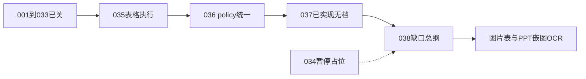

# PLAN-038 缺口总纲：登记、关联、随子计划关闭

## 现在执行到哪一步

能力主线已经走完 **001→033（跳过 034）→035→036**，发布总门 [`scripts/verify-release.sh`](scripts/verify-release.sh) 必过项为 **030i → 035 → 036 → 037 → 030-table**。



- **已关且可当完成**：002–032（除 001 实质搁置）、030 全家、033（033n 绑 HEAD `76c75cf`）、035、036。
- **已实现、缺独立 PLAN/WT**：037 P1-A/B（[`table_execution_observability.py`](qyunslation/structure/table_execution_observability.py)、[`pptx_table_exec.py`](qyunslation/structure/pptx_table_exec.py)、[`scripts/verify-plan-037-table-observability.sh`](scripts/verify-plan-037-table-observability.sh)），仅写在 [WT-036](docs/walkthroughs/WT-036-table-policy-unification.md) 一节。
- **明确暂停的下一能力**：纯图片表 cell 网格、PPT picture OCR（030g 只做到嵌图 `PENDING` 三态，未 OCR 嵌字）。历史编号 **PLAN-034 不空开**，并入 038 的能力子计划。
- **文档债**：035a–d 仍写「实施中」、036a–d 仍写「待批准」、033g–l / 030d / 003 / 031 文件头滞后；[WT-033n](docs/walkthroughs/WT-033n-head-evidence-rebind.md) 仍写「030 未关 → 030j」。
- **运维债**：`docutranslate.service` 待 sudo disable；归档 10 条脏文件名未 `--apply`（[WT-032](docs/walkthroughs/WT-032-archive-hygiene.md)）；视觉金样三项「待批准」（[visual-gold-030.md](docs/contracts/visual-gold-030.md)）。

## 机制（本纲领的核心，不是再堆一份清单）

只建 **一份** 纲领，作为缺口 SSOT：

- 纲领：[docs/plans/PLAN-038-gap-closure/PLAN-038-gap-closure.md](docs/plans/PLAN-038-gap-closure/PLAN-038-gap-closure.md)
- 登记表：[docs/plans/PLAN-038-gap-closure/registry.md](docs/plans/PLAN-038-gap-closure/registry.md)
- 门禁：`scripts/verify-plan-038.sh`（后纳入 `verify-release.sh`）

每条缺口一行，字段固定：

- `G-ID`（如 `G-DOC-001`）
- 来源路径 + 锚点（WT/PLAN 的「遗留 / 下一步 / 已知限制」小节）
- 严重度：`P0` / `P1` / `P2` / `INFO` / `WONTFIX`
- 归属子计划：`038a` …
- 状态：`open` / `closed` / `wontfix`
- 关闭证据：WT-038x + verify 命令

**关闭协议（子计划收口时必须同批做完，缺口才算关）：**

1. 子计划 verify PASS + 写 WT-038x
2. `registry.md` 把该子计划名下全部 `G-ID` 标 `closed`（或显式 `wontfix`）
3. 回写每一条来源文档：遗留项改为「已由 PLAN-038x 关闭」并链到 WT
4. `verify-plan-038.sh` 断言：registry 里 `closed` 的 ID，来源文件不再以未勾选/未关闭口吻出现；`open` 的 ID 必须仍能在来源或总纲中找到

这样 **038x 关闭 = 关联缺口自动关闭**，不必再在各 WT 里手工对账。

**编号纪律：** 不复活空的 PLAN-034 目录；034 在总纲里标「并入 038d/038e」。037 只补档、不重做功能。

## 子计划与缺口归属

下列是登记表初稿（编码前写入 `registry.md`）。`WONTFIX` 也要登记，避免「没写进计划」被当成遗漏。

### 038a 文档状态对齐（只改 docs，先做）

归属缺口：

- `G-DOC-001`～`007`：035/036/033/030d/003/031 文件头；WT-033n 过时「下一步」
- `G-DOC-010`：036e 无独立文件 → 在 036 父纲领补一节，不另开 036e
- `G-DOC-011`～`013`：001 正式标「被 002 取代并关闭」；004/013 补关闭字段
- `G-DOC-014`：WT-017 空 hash（能补则补，不能则标 INFO）

验收：`rg` 不再出现「035 实施中 / 036 待批准」与父纲领「已完成」打架；038 verify 文档一致性段 PASS。

### 038b 补档 PLAN-037（已实现，不改行为）

归属：`G-DOC-008`

补 [`docs/plans/PLAN-037-table-observability/`](docs/plans/PLAN-037-table-observability/) 纲领 + [WT-037](docs/walkthroughs/WT-037-table-observability.md)，指向现有代码与 `verify-plan-037-table-observability.sh`。036 WT 该节改为「详见 WT-037」。

### 038c 运维卫生（需你确认 / 部分需 sudo）

归属：

- `G-OPS-001`：`sudo systemctl disable --now docutranslate.service`（[WT-002](docs/walkthroughs/WT-002-babeldoc-replace-translate.md) / [WT-003](docs/walkthroughs/WT-003-translate-throughput.md)）
- `G-OPS-002`：`scripts/fix-archive-filenames.py --apply`（先备份 `index.db`，10 条）
- `G-OPS-003`：样本机 `QYUNSLATION_RELEASE_STRICT_SAMPLE=1`（可选，本机无 033 样本时保持 BLOCKED）
- `G-OPS-004`：scanner 1.7.0 需重新预扫（WT 说明，非代码）

无 sudo 时条目保持 `open`，不得假装关闭。

### 038d 纯图片表（原 034 一半）

归属：`G-CAP-001`（[WT-030-table](docs/walkthroughs/WT-030-table-closure.md)、[WT-036](docs/walkthroughs/WT-036-table-policy-unification.md)、[ADR-030](docs/decisions/ADR-030-table-cell-extraction.md)）

垂直切片：扫描期识别「无文字层的表区域」→ OCR 出 cell 网格 → 走现有 [`table_cell_policy`](qyunslation/structure/table_cell_policy.py)（PRESERVE / PROTECT_TOKENS / TRANSLATE）→ occurrence 写回 → QC。复用 SK-Q002 嵌字与 035/036 policy，禁止第三套数字规则。

**详细设计在 038d 子计划获批后再写**，本总纲只锁边界：不引入 Camelot/tabula；失败 fail-closed 留原图。

### 038e PPT 嵌图 OCR（原 034 另一半）

归属：`G-CAP-002`

030g 已有 picture shape → `IMAGE` + `PENDING`。本子计划把 PENDING 接到与 PDF/DOCX 相同的 RapidOCR 嵌字链（SK-Q002），产物保持可编辑 PPTX 或明确 `RASTERIZED`。Out of scope：SmartArt / Chart / OLE（登记为 `G-CAP-011` = WONTFIX）。

### 038f 版式弱项（033 诚实降级项）

归属：

- `G-CAP-003`：`cap_body_gap` 进 BabelDOC（[WT-033n](docs/walkthroughs/WT-033n-head-evidence-rebind.md)）
- `G-CAP-004`：Figure 像素残影探针

续页金样已被 036c（Wiley `cai-2025-table1-continued.pdf`）覆盖，**不再单列**。做不进 BabelDOC 则标 `wontfix` 并写原因，不得再挂在 033 遗留下。

### 038g 产品抛光（历史多次推迟，默认后置）

归属（默认 P2，可整组 `wontfix` 若你明确不要）：

- `G-CAP-005` Gradio 全面白牌（031c 只做了 sidecar/`apply-pdf2zh-brand.py`）
- `G-CAP-006` `--auth-file` 登录墙
- `G-CAP-007` 手动术语表进 pdf2zh `--glossaries`
- `G-CAP-008` 多租户 unload 互取消
- `G-CAP-009` DOCX/PPTX **跨页**续表（035 明确非目标）

### 人工 INFO（不阻塞编码）

- `G-DOC-009`：视觉金样三项待你批准后写入 WT-030i
- `G-OPS-006`：旧恢复分支是否删除（[WT-031](docs/walkthroughs/WT-031-repo-governance.md)）

### 登记为 WONTFIX（写进表，避免再被当成缺口）

- PLAN-001 GPU/旧入口质量门（已被 002 替换）
- 004c 批推理（已回滚）、004d 同权 vLLM
- 027 EMF/WMF、Word 原生 DrawingML 矢量图
- Cloudflare 上传 11–13 KB/s（[PLAN-020](docs/plans/PLAN-020-stuck-spinner/PLAN-020-stuck-spinner.md)）
- 不提交 `glossaries/auto-proper-nouns.csv`
- CONDITIONAL 格式进 GUI 选择器（030i OOS）
- BabelDOC IL 层参考文献禁译（033 已用 manifest skip）

## 建议实施顺序

```text
038 纲领+registry+verify 骨架
  → 038a 文档对齐
  → 038b 037 补档
  → 038c 运维（可与 a/b 并行，等你确认）
  → 038d 纯图片表
  → 038e PPT 嵌图 OCR
  → 038f 版式弱项
  → 038g 仅在你点名后开
```

038a/b 不改业务代码。038d/e 是下一波真正能力，须各自再批详细子计划后才编码。038d 完成后回写 WT-030-table / WT-036「纯图片表」遗留；038e 完成后回写 030g/036「PPT OCR」遗留。

## 验收（总纲本身）

- 存在 `registry.md`，覆盖上文全部 `G-*`（含 WONTFIX）
- 每个 `open` 缺口有且只有一个归属子计划
- `verify-plan-038.sh`：open/closed 与来源文档口径一致
- 任一 038x WT 收口后，其名下 `G-ID` 全部非 `open`
- Skill：038d/e 若改嵌字行为，同步 [SK-Q002](.cursor/skills/image-overlay-translation/SKILL.md)

## 批准后先写什么（仍不改业务代码，直到 038d/e 再批）

1. 建 `docs/plans/PLAN-038-gap-closure/` 纲领 + `registry.md` 全表
2. 写 `scripts/verify-plan-038.sh` 骨架（先查文件存在与 ID 完整性）
3. 开 038a → 038b 文档 PR
4. 038c 列出将执行的 sudo/`--apply` 命令等你点头
5. 再单独呈交 038d、038e 详细子计划
