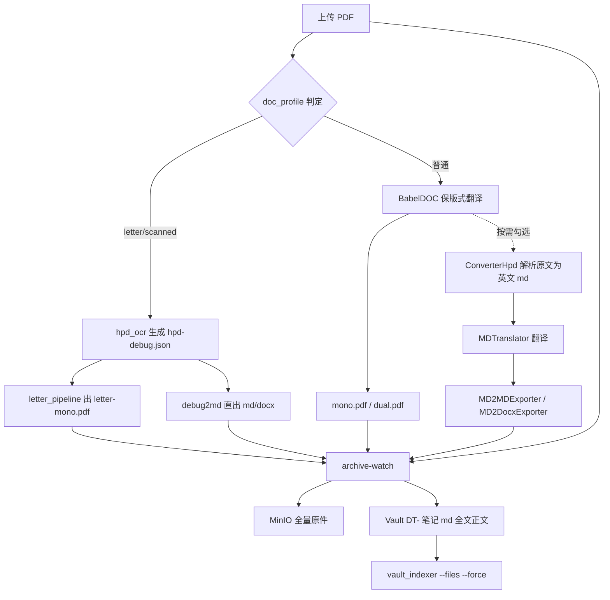

# PLAN-013 翻译产物落库与导出增强

## 背景与现状诊断

三件事互相关联，合并为一个 PLAN 分四个子计划。

**落库链路已停摆（此前未被发现）**

`pdf2zh-archive-watch` 服务进程仍在运行，但日志自 8 月 23 日起持续报 `sqlite3.OperationalError: unable to open database file`。根因是 `GroupStateDB` 的四个方法都用 `with sqlite3.connect(...)`，而 Python 的 sqlite3 连接上下文管理器**只提交/回滚事务，不关闭连接**。轮询周期 5 秒，fd 只增不减，现已达 1023/1024（`Max open files` 上限 1024），全部指向 `watch-state.db`。

```91:120:/home/dev/qyunslation/scripts/pdf2zh-archive-watch.py
class GroupStateDB:
    def __init__(self, path: Path):
        ...
        with sqlite3.connect(self.path) as conn:   # 连接从不 close
```

后果：Vault `10-Source-Documents/Translations/` 最新一条停在 `DT-2026-0007`（8 月 23 日），此后所有翻译均未入库。

**分组正则漏掉扫描件产物与原文**

```14:20:/home/dev/qyunslation/qyunslation/archive/pdf2zh_ingest.py
_OUTPUT_SUFFIX_RE = re.compile(r"\.(mono|dual|glossary)\.(pdf|csv)$", re.I)
```

扫描件链路产出的是 `xxx.hpd-ocr.letter-mono.pdf`（连字符，见 `scripts/apply-pdf2zh-docprofile.py:279`），匹配不上；上传的原文 PDF 也从未被归档。

**截图 UI 不在本仓库**

那是 pdf2zh-next 的 Gradio GUI，源码在 `~/.local/share/uv/tools/pdf2zh-next/lib/python3.12/site-packages/pdf2zh_next/gui.py`，本仓库通过 `scripts/apply-pdf2zh-*.py` 幂等打补丁。下载区在 gui.py L4018–4053，六个 `gr.File` 平铺。

**Markdown/DOCX 的两条数据源**

扫描件链路已有 `*.hpd-debug.json`，每个文本块带 `role`（header/section/address/body）、`text`、`text_zh`、`box`、`fontsize`，可零额外成本直出高保真 md。普通 PDF 无此结构化数据，按你的选择走「原文解析成 markdown 再翻译」，正好复用本仓库现成的 `MarkdownBasedWorkflow`（`qyunslation/workflow/md_based_workflow.py`）与 `MD2MDExporter` / `MD2DocxExporter`。

## 数据流



## PLAN-013a 修复落库链路

改 `scripts/pdf2zh-archive-watch.py`：`GroupStateDB` 改为持有单个长连接（`self._conn = sqlite3.connect(path, check_same_thread=False)`），或每个方法用 `contextlib.closing` 包裹。同步检查 `scripts/office-archive-watch.py` 与 `qyunslation/archive/index_db.py` 是否有同类泄漏。

改 `qyunslation/archive/pdf2zh_ingest.py`：

- `_OUTPUT_SUFFIX_RE` 扩展识别 `.letter-mono.pdf`、`.hpd-ocr.pdf`，以及后续新增的 `.md` / `.docx`
- `output_group_key` 需要先剥掉 `.hpd-ocr` / `.no_watermark` 中缀再取 stem，保证同一份文档的原文、mono、dual、md、docx 落到同一个 group
- 新增 `classify_output_file` 分支：`source_pdf`、`translated_md`、`translated_docx`

新增原文归档：watcher 扫 session 目录时，把与 group stem 同名的原始 `.pdf` 一并纳入。**原文只上 MinIO，不复制进 Vault assets**（样本里原文 64MB，避免撑爆 vault git 仓库），Vault 笔记中以 MinIO key 形式引用。

修完后需要一次性补跑历史：`python3 scripts/pdf2zh-archive-watch.py --once` 把 8 月 23 日以来积压的 session 全部入库。

在 `pdf2zh-archive-watch.service` 加 `LimitNOFILE=4096` 作为兜底。

## PLAN-013b Markdown / DOCX 导出双通道

**通道一（扫描件，零额外 LLM 成本）**：新增 `scripts/debug2md.py`，读 `*.hpd-debug.json`，按 `role` 映射标题层级（`section` → `##`，`header`/`address` 前言块，`body` → 段落），按 `box` 的 y 坐标排序保证阅读顺序，输出 `xxx.zh.md`。DOCX 复用 `qyunslation/exporter/md/md2docx_exporter.py`（容器已装 pandoc）。落款行款、专名不乱译等约束沿用 `.cursor/skills/scanned-doc-layout-fidelity/SKILL.md`。

**通道二（普通 PDF，按你的选择走原文解析再翻译）**：新增 `qyunslation/converter/x2md/converter_hpd.py`，对原文 PDF 调本地 `scripts/hpd_ocr.py` 出英文 markdown，与 Hermes 文献入库同一套 HPD 后端；降级顺序 HPD → mineru → pypdf 纯文本。注册进工厂：

```44:50:/home/dev/qyunslation/qyunslation/workflow/md_based_workflow.py
    _converter_factory: dict[...] = {
        "mineru": (ConverterMineru, ConverterMineruConfig),
        "identity": (ConverterIdentity, None),
        "mineru_deploy": (ConverterMineruDeploy, ConverterMineruDeployConfig)
    }
```

然后走 `MarkdownBasedWorkflow.translate_async()` → `export_to_markdown()` / `export_to_docx()`。翻译后端复用 `/home/dev/pdf2zh/config.toml` 已配的 Ollama `qwen3.6:35b-a3b`，术语表复用 `glossaries/`。

这条通道会多跑一轮 LLM，耗时与成本约翻倍，因此**只在用户在 UI 勾选 Markdown 或 DOCX 时触发**，不勾选时完全不跑。GUI 侧以后台线程执行并在下载区显示独立进度。

产物统一写进 session 目录，命名 `{stem}.zh.md` / `{stem}.zh.docx`，自动被 013a 的 watcher 捕获入库。

## PLAN-013c 下载区精简

新增 `scripts/apply-pdf2zh-downloads.py`（幂等补丁，与现有 `apply-pdf2zh-brand.py` 同风格，uv 升级后重跑）。改造 gui.py L4018–4053：

- 内容单选（`gr.Radio`）：`仅译稿` / `原文 + 译稿（双语对照）`，默认仅译稿
- 格式多选（`gr.CheckboxGroup`）：`PDF`（默认勾选）/ `Markdown` / `DOCX`
- 下载区只渲染当前选择对应的 `gr.File`，其余隐藏
- 三个 ZIP 收进 `gr.Accordion("批量下载", open=False)`，且仅在本次任务文件数大于 1 时可见
- 勾选 Markdown 或 DOCX 时给出「需额外解析翻译，耗时较长」的提示文案
- 中文文案补进 `pdf2zh_next/gui_translation.yaml` 的 zh 段（现有 `Download All (ZIP)` 系列没有中文条目，所以截图里是英文）

同步更新 `scripts/deploy-pdf2zh-cutover.sh`，把新补丁纳入部署序列，改完 `systemctl --user restart pdf2zh`。

## PLAN-013d Vault 笔记增强与验收

改 `qyunslation/archive/pdf2zh_vault.py`：

- 正文优先用译文 markdown 全文（`translated_md`），没有才回退现在的 `extract_pdf_text(mono)` 摘录，检索质量会明显提升
- frontmatter 增加 `original_storage_key`、`formats`（实际产出的格式列表）、`doc_profile`
- 归档文件清单区分「Vault 内附件」（mono/dual/md/docx）与「MinIO 原文链接」
- 保持 DT- 编号体系与 `vault_indexer.py --files <rel> --force` 定向索引不变（`10-Source-Documents` 在 `SKIP_DIRS` 内，必须定向索引）

新增 `scripts/verify-plan-013.sh`，按现有 verify 脚本风格断言：watcher fd 数稳定不增长、`--once` 能处理积压 group、扫描件与普通 PDF 各产出 md/docx、Vault 出现新 DT 条目且正文为 md 全文、`vault_indexer` 返回 0、`knowledge.qyunsgen.com` 能检索到新条目。

新增 `docs/walkthroughs/WT-013-vault-export.md` 记录人工验收步骤。

## 交付流程

按工作区规则：`docs/plans/PLAN-013-vault-export/` 目录放纲领与 013a–013d 四个子计划，feat 分支实现，`scripts/verify-plan-013.sh` 通过后精确 commit、no-ff 合并 main，最后重启 `pdf2zh` 与 `pdf2zh-archive-watch` 两个 user 服务并做 WT 验收。

## 建议实施顺序

013a 先做且可独立上线（纯 bug 修复，立刻恢复落库并补齐一周多的积压），013c 次之（纯 UI，风险低），013b 最重（新增解析与翻译通道），013d 收口。