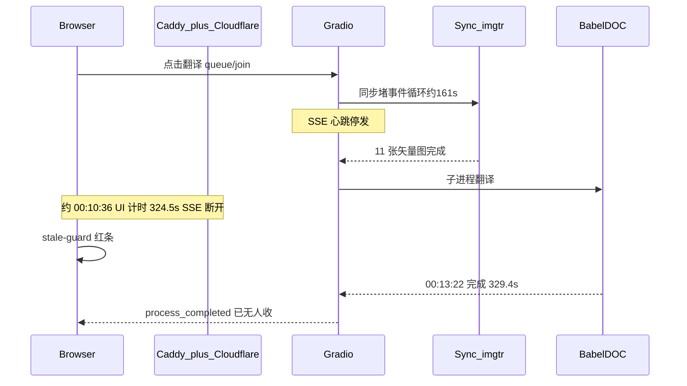

# 连接中断原因：SSE 回执丢失，服务端已成功

## 结论

**翻译本身成功了。** 红条「与服务器的连接中断，本次操作的结果没有送达。」只说明浏览器没收到 Gradio 的 `process_completed`，不代表 BabelDOC/Ollama 失败。

不必重跑。直接取结果：

- Vault：[`10-Source-Documents/Translations/DT-2026-0027-41467_2024_Article_53384.imgtr.md`](/home/dev/Targets/vault/10-Source-Documents/Translations/DT-2026-0027-41467_2024_Article_53384.imgtr.md)
- 单语 / 对照 PDF：`Translations/assets/DT-2026-0027/`
- 作业目录：`/home/dev/pdf2zh/pdf2zh_files/5ca5522d-04e8-4770-a7b9-eaaba53d9545/`

## 这条红条是什么

文案来自 [`scripts/apply-pdf2zh-stale-guard.py`](scripts/apply-pdf2zh-stale-guard.py)，不是 Gradio 原文。触发条件：`/queue/join` 还在 pending，`/queue/data` SSE 已经结束，且 5 秒内没有重开流、也没有读到 `"msg":"process_completed"`。侧栏那个无文案 **Error** 是同一类「回执没落地、加载态不解除」（PLAN-020 已记录过）。

## 时间线（UTC，北京时间 +8）

| 时间 | 事件 |
|------|------|
| 00:04:58 | PDF 上传到 `/tmp/gradio/...` |
| 00:05:12 | `Processing file ...41467_2024_Article_53384.pdf`，模板「学术文献」 |
| 00:05:12–00:07:53 | 插图前置（11 个矢量 overlay，第 5 页单图 112 个 OCR 块） |
| 00:07:53 | BabelDOC 开始 |
| ~00:10:36 | UI 计时 324.5s，SSE 断，红条出现（推算：点击 + 324.5s） |
| 00:13:22 | 服务端完成，`cost: 329.4s`，峰值内存 4.87 GB |
| 00:13:42 | archive watcher 写入 vault `DT-2026-0027` |

journalctl 无 traceback、无 OOM、无 Caddy 502/504。`pdf2zh.service` 当天未重启。

## 已排除

- 服务端翻译失败、进程崩溃、磁盘满
- Caddy `read_timeout`/`write_timeout`：配置是 **600s**（[`Caddyfile-production-public`](/home/dev/qyunsgen/config/Caddyfile-production-public) 第 93–97 行），不是 300s
- 插图阶段本身失败：[`41467_2024_Article_53384.pdf.imgtr.json`](/home/dev/pdf2zh/pdf2zh_files/5ca5522d-04e8-4770-a7b9-eaaba53d9545/41467_2024_Article_53384.pdf.imgtr.json) 已写出（`vector_translated: 11`）

## 根因链

1. **直接原因（UI）**：公网 Gradio SSE（`/queue/data`）在任务结束前断了，stale-guard 按设计弹出红条。
2. **为什么这条长连接容易断**：
   - 插图翻译在 async 的 `_run_translation_task` 里**同步调用** `translate_pdf_images`（[`gui.py` 约 1188–1227 行](/home/dev/.local/share/uv/tools/pdf2zh-next/lib/python3.12/site-packages/pdf2zh_next/gui.py)）。HPD / 信函路径用了 `run_in_executor` + `sleep(0.4)` 保心跳；插图路径没有。事件循环堵约 161 秒，15s 一次的 SSE heartbeat 发不出去。
   - `https://translate.qyunsgen.com` 开了 `encode gzip`，**没有** `flush_interval -1`（同文件里 Hermes `/api/messages/sse` 有）。小心跳容易被 gzip 攒着，Cloudflare 边缘更像「空闲」。
   - 入口是 Cloudflare Proxied（PLAN-002 / PLAN-020）。PLAN-020 测过这条链路上传只有 11–13 KB/s。Caddy 源站 600s 挡不住边缘切流。
3. **加剧因素**：学术 PDF 先跑插图再跑正文，端到端墙钟约 8 分钟；BabelDOC 自己 329s。SSE 在约 5.4 分钟断开后，工人进程继续跑完并归档。

324.5s 不是某个 300s 配置被打中，而是「点击后的 Gradio 计时」撞上 SSE 被切。服务端 `cost: 329.4s` 只统计 BabelDOC 段。

## 建议修复（确认后才改代码）

按最小改动排序：

1. **插图翻译改走线程**（对齐 HPD）：`translate_pdf_images` 放到 `run_in_executor`，主循环继续 `progress()` + `await sleep`，心跳不断。改 [`scripts/apply-pdf2zh-docimg.py`](scripts/apply-pdf2zh-docimg.py)。
2. **Caddy 对 Gradio SSE 禁用 gzip 并立刻 flush**：`translate.qyunsgen.com` 上 `/gradio_api/queue/data`、`/queue/data` 设 `flush_interval -1`，并从 `encode gzip` 排除。改 [`/home/dev/qyunsgen/config/Caddyfile-production-public`](/home/dev/qyunsgen/config/Caddyfile-production-public)，然后 `docker restart qyunsgen-caddy`。
3. **刷新可找回已完成任务**（可选）：stale-guard 或下载区探测作业目录 / archive，避免「其实已完成但页面只能刷新重来」。

不建议为这一次再点一次「翻译」——会再占 GPU/Ollama，结果已经在 vault 里。
