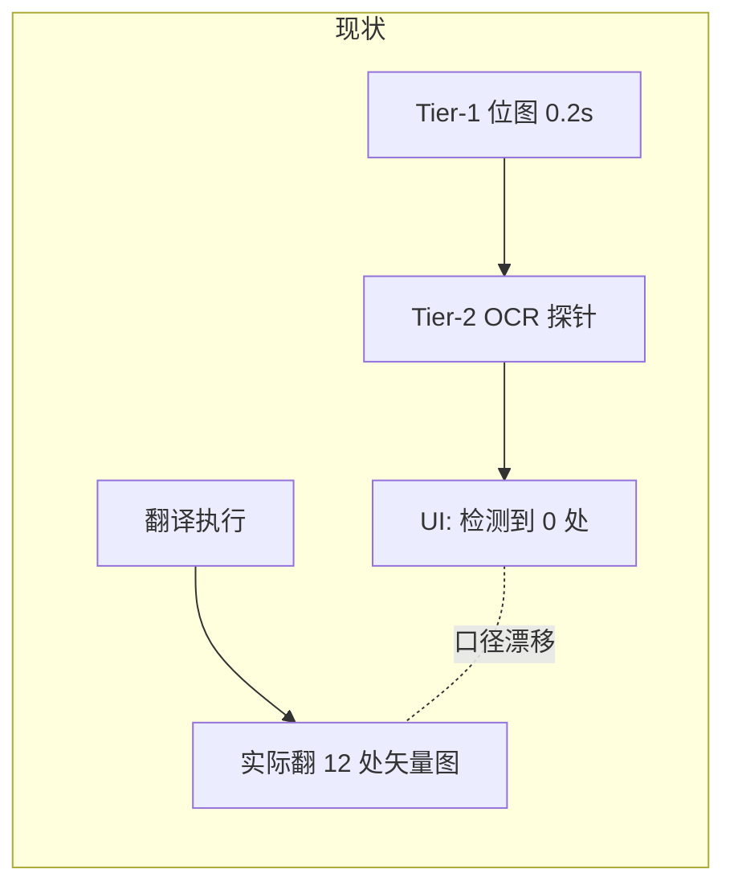

# PLAN-028 预扫描口径对齐：矢量插图纳入与表格独立计数

## 一、问题定性

`41467_2024_Article_53384.pdf`（19 页）实测：

- 嵌入位图 2 张，均为首页 logo（132x11 pt、11x10 pt），被几何门槛正确刷掉
- 矢量插图 12 处，**翻译时确实会被 OCR 嵌字**（走 `pdf_image_translate.py` 的 crop 分支）
- `find_tables()` 表格 26 处，矢量聚类主动避让，**从不当插图翻**，文字走 pdf2zh 文字层

预扫描 [`doc_image_prescan.py`](/home/dev/qyunslation/scripts/doc_image_prescan.py) 的 `scan_pdf_tier1` 只遍历 `page.get_image_info(xrefs=True)`，因此报「检测到 0 处候选插图」。这直接违反 PLAN-027 纲领的质量不变量 4「预扫描与执行结论幂等对齐」。



## 二、性能基线（pdf2zh venv, PyMuPDF 1.25.2, 19 页）

- `get_image_info` 全文档：0.21s
- `find_tables` 全文档：12.62s
- `find_safe_vector_figures` 全文档：8.63s（内部**已经**重算了一遍 `_table_rects`）
- 朴素串行合计 21.25s；**共享表格结果后约 8.6s**

结论：矢量与表格检测不可进 Tier-1（300ms 预算），另开 Tier-3；且必须共享 `find_tables` 结果，否则白白多花 12s。

## 三、子计划划分

### 028a 结构扫描内核与表格结果共享

**[`scripts/pdf_figure_crop.py`](/home/dev/qyunslation/scripts/pdf_figure_crop.py)**

`find_safe_vector_figures` 第 115 行现在无条件重算表格：

```python
    long_texts = _long_text_rects(page)
    tables = _table_rects(page)
```

改为接受外部传入，避免 Tier-3 重复计算：

- `_table_rects` 提升为公开 `table_rects`，保留 `_table_rects = table_rects` 别名（现有调用方零改动）
- `find_safe_vector_figures(page, exclude_rects=None, tables=None)`，`tables is None` 时才内部计算

现有两个调用方（[`pdf_image_translate.py:334`](/home/dev/qyunslation/scripts/pdf_image_translate.py)、`verify-plan-027.sh:151`）行为不变。

**[`scripts/doc_image_prescan.py`](/home/dev/qyunslation/scripts/doc_image_prescan.py)**

新增 `Tier3Result` 与 `scan_pdf_tier3(path, *, max_pages=40, deadline_s=25, should_abort=None)`：

- 每页只调一次 `table_rects(page)`，把结果同时用于表格计数与传给 `find_safe_vector_figures`
- 逐页回调 `should_abort()`，供代际守卫在 9s 期间提前退出
- 页数超 `max_pages` 或累计超 `deadline_s` 则停扫并置 `truncated=True`
- 仅 PDF 生效；DOCX/图片返回空 Tier3Result（DOCX 的 EMF 计数已在 Tier-1）
- 环境变量 `QYUNSLATION_PRESCAN_TIER3_MAX_PAGES` / `_DEADLINE`

新增 `format_tier3_summary(entry, *, vector_count, table_count, truncated=False)`：

- 位图可译 2 + 矢量 12 + 表 26：`检测到 14 处插图（2 处位图、12 处矢量图），将随文档一并翻译；另有 26 处表格，按文字层翻译。`
- 位图 0 + 矢量 12 + 表 26：`检测到 12 处矢量插图，将随文档一并翻译；另有 26 处表格，按文字层翻译。`
- 全 0：`未检测到需要嵌字的插图。`
- `truncated` 时追加 `（仅扫描前 N 页）`

表格文案固定为「按文字层翻译」，不引导用户以为会 OCR 嵌字。

### 028b UI 三段渐进与代际守卫

**[`scripts/apply-pdf2zh-prescan.py`](/home/dev/qyunslation/scripts/apply-pdf2zh-prescan.py)**

新增 `_qy_prescan_tier3(files, state)`，链在现有 tier2 之后：

```python
        ).then(
            _qy_prescan_tier3,
            inputs=[file_input, state],
            outputs=[qy_prescan_status, state],
        )
```

要点：

- 保持普通 `def`（不是 `async def`），Gradio 用 `anyio.to_thread` 执行，不阻塞事件循环，避免重演 heartbeat 断连
- 入口与逐页 `should_abort` 均比对 `_prescan_generation`，过期直接 `return gr.update(), st`
- 结果写入 `entry["vector_count"] / ["table_count"] / ["tier3_done"]`，沿用现有 per-file hash 仓库
- 非 PDF 直接返回 `gr.update()`，不改 Tier-2 已渲染的文案
- 异常吞掉并保留 Tier-2 文案，不覆写为报错（矢量检测失败不影响翻译）

`verify()` 增补断言：`def _qy_prescan_tier3(`、`_qy_prescan_tier3,` 已挂链、`vector_count`。

### 028c 验证与交付

- 新增 [`scripts/verify-plan-028.sh`](/home/dev/qyunslation/scripts/verify-plan-028.sh)：
  - `pdf_figure_crop.table_rects` 存在且 `find_safe_vector_figures` 接受 `tables=` 参数
  - `scan_pdf_tier3` / `format_tier3_summary` 存在
  - 用该论文断言 `vector_count == 12`、`table_count >= 19`、Tier-3 耗时 < 15s
  - 传入 `tables=` 与不传结果一致（共享不改变判定）
  - `apply-pdf2zh-prescan.py` 连跑两次幂等（`already patched`）
  - gui.py `compile()` 通过
- 新增 `docs/walkthroughs/WT-028-prescan-parity.md`
- 重跑补丁后 `systemctl --user restart pdf2zh`

## 四、明确不做

- 表格不纳入插图 OCR 嵌字（会与文字层重复翻译）；矢量聚类的表格避让门禁保持不变
- 不做 Tier-3 结果向翻译阶段的缓存透传（翻译在独立进程重扫，本期只对齐上报口径）
- 不改 DOCX 侧 EMF/WMF 现有统计口径
- 不动 `MIN_LONG_EDGE_PT` 等位图几何门槛（首页 logo 本就应被刷掉）
